# CAB System — DDD Bounded Context → Microservice Design

> Phiên bản: 2026-09-23  
> Phạm vi: **40 Use Case trong scope hiện tại**.
> Nguồn nghiệp vụ: `srs.md` của repository `vthaix/23674231_TranVanThai_Cabsystem`.

---

## 1. Mục tiêu tài liệu

Tài liệu này chuyển mô hình yêu cầu hiện tại của CAB System thành kiến trúc **Domain-Driven Design (DDD)** theo hướng **Bounded Context → Microservice**.

Mỗi Bounded Context phải trả lời rõ 7 câu hỏi:

1. **Context này làm gì?** — business responsibility.
2. **Liên quan FR nào?** — traceability từ Functional Requirement.
3. **Phục vụ workflow/BPM nào?** — vị trí của context trong Business Process Model.
4. **Ngôn ngữ thống nhất là gì?** — Ubiquitous Language riêng của context.
5. **Domain model nằm ở đâu?** — Aggregate, Entity, Value Object, Domain Service, invariant.
6. **Microservice cung cấp API nào?** — Public API và Internal API.
7. **Dữ liệu được sở hữu như thế nào?** — database riêng và ERD riêng.

Nguyên tắc lớn nhất:

> **Một Bounded Context = một mô hình nghiệp vụ nhất quán trong một ngữ cảnh; một Microservice sở hữu mô hình đó và database của chính nó.**

Không dùng shared domain entity xuyên microservice.

## Quy ước Database — chỉ 3 loại

Trong toàn bộ thiết kế, chỉ chốt **3 loại database**:

| Database | Khi dùng | Đặc trưng kỹ thuật |
|---|---|---|
| **PostgreSQL** | Dữ liệu nghiệp vụ cốt lõi, quan hệ chặt chẽ | Transaction ACID, khóa ngoại, UNIQUE/CHECK, index, truy vấn quan hệ và aggregation |
| **MongoDB** | Dữ liệu document, schema linh hoạt, read/write theo document, read-heavy | Flexible schema, document model, dễ denormalize và tối ưu theo access pattern |
| **Redis** | Dữ liệu tạm thời hoặc cần latency rất thấp | In-memory, TTL, cache, session, distributed lock, rate-limit, trạng thái realtime ngắn hạn |

### Phân bổ database cho 11 Bounded Context

| BC | Microservice | Database chính | Redis bổ trợ |
|---|---|---|---|
| BC01 Identity & Access | `identity-service` | PostgreSQL | Session/token cache, rate-limit |
| BC02 Customer Profile | `customer-profile-service` | PostgreSQL | Có thể cache profile đọc nhiều |
| BC03 Driver & Fleet | `driver-fleet-service` | PostgreSQL | Location/availability nóng |
| BC04 Booking | `booking-service` | PostgreSQL | Cache/TTL cho trạng thái hoặc idempotency khi cần |
| BC05 Dispatch & Assignment | `dispatch-service` | PostgreSQL | Distributed lock, candidate cache, temporary dispatch state |
| BC06 Trip Operations | `trip-service` | PostgreSQL | Tracking/location nóng, trạng thái realtime |
| BC07 Billing & Payment | `billing-payment-service` | PostgreSQL | Idempotency key, checkout/session TTL |
| BC08 Feedback | `feedback-service` | PostgreSQL | Không bắt buộc; chỉ cache khi cần |
| BC09 Notification | `notification-service` | MongoDB | Queue/retry state, rate-limit, unread counter nếu cần |
| BC10 Operations | `operations-service` | MongoDB | Có thể cache dashboard/query nóng |
| BC11 Reporting & Audit | `reporting-audit-service` | PostgreSQL | Có thể cache report/query phổ biến |

**Nguyên tắc:** PostgreSQL là **source of truth** cho transaction nghiệp vụ; MongoDB dùng cho document/read model nơi quan hệ không cần ràng buộc chặt; Redis chỉ dùng cho dữ liệu **tạm thời, cache hoặc trạng thái nóng**, không dùng Redis làm nguồn dữ liệu nghiệp vụ lâu dài.

---

# 2. Phạm vi nghiệp vụ hiện tại

SRS mô tả chuỗi nghiệp vụ cốt lõi:

```text
Register / Login
      ↓
Manage Profile
      ↓
Create Booking
      ↓
Driver Matching
      ↓
Assignment
      ↓
Trip Execution
      ↓
Trip Completed / Cancelled
      ↓
Fare Calculation
      ↓
Payment
      ↓
Rating
      ↓
Notification / History / Operations / Reporting
```

SRS hiện có các nhóm FR về Account, Profile, Vehicle, Booking, Driver Matching, Assignment, Trip, Tracking, Fare, Payment, Notification, Rating, Operations, Authorization, Audit và Reporting. citeturn197436view0turn731067view1turn731067view2

---

# 3. Danh sách Bounded Context và Microservice

| BC | Bounded Context | Microservice | Database riêng | Vai trò chính | UC |
|---|---|---|---|---|---|
| BC01 | Identity & Access | `identity-service` | `cab_identity_db` | Account, Authentication, Role, Permission | UC01–03, UC06, UC34–36 |
| BC02 | Customer Profile | `customer-profile-service` | `cab_customer_profile_db` | Hồ sơ Customer | UC04–05 phía Customer |
| BC03 | Driver & Fleet | `driver-fleet-service` | `cab_driver_fleet_db` | Driver, Vehicle, Availability, Current Location | UC04–05 phía Driver, UC07–10, UC19 |
| BC04 | Booking | `booking-service` | `cab_booking_db` | Vòng đời Booking | UC11–13 |
| BC05 | Dispatch & Assignment | `dispatch-service` | `cab_dispatch_db` | Matching, Assignment, Retry | UC14–16 |
| BC06 | Trip Operations | `trip-service` | `cab_trip_db` | Vòng đời Trip | UC17–18, UC20–21 |
| BC07 | Billing & Payment | `billing-payment-service` | `cab_billing_payment_db` | Fare và Payment | UC22–24 |
| BC08 | Feedback | `feedback-service` | `cab_feedback_db` | Rating | UC25–26 |
| BC09 | Notification | `notification-service` | `cab_notification_db` | Notification và delivery | UC27–28 |
| BC10 | Operations | `operations-service` | `cab_operations_db` | Operational read model + thao tác vận hành | UC30–33 |
| BC11 | Reporting & Audit | `reporting-audit-service` | `cab_reporting_audit_db` | Dashboard, report, audit trail | UC37–41 |

**Chỉ các UC/FR đang thuộc scope hiện tại mới được thiết kế thành BC/Microservice.**

---

# 4. Business Process Model (BPM) dùng để trace Bounded Context

Để trace từ BC sang workflow, quy ước các Business Process Model như sau.

| BPM | Business Process Model | Luồng chính |
|---|---|---|
| BPM01 | Account Lifecycle | Register → Validate → Create Account → Assign Role → Login → Authorization |
| BPM02 | Customer Profile | Open Profile → Read/Update Profile |
| BPM03 | Driver & Vehicle Readiness | Manage Driver → Manage Vehicle → Set Available → Update Location |
| BPM04 | Booking Request | Enter Pickup → Destination → Vehicle Type → Validate → Create Booking → SEARCHING |
| BPM05 | Matching & Assignment | Find Driver → Filter Vehicle → Distance → Rank → Send Assignment → Accept/Reject/Timeout → Retry |
| BPM06 | Trip Execution & Tracking | Assignment Accepted → Create Trip → Arrived → Picked Up → In Progress → Completed/Cancelled |
| BPM07 | Fare & Payment | Trip Completed → Calculate Fare → Select Method → Cash/Online → Payment Result |
| BPM08 | Feedback | Trip Completed → Customer Rating → Validate → Save Rating |
| BPM09 | Notification Delivery | Domain Event → Create Notification → Deliver → Read |
| BPM10 | Operations Monitoring | Search Customer/Driver/Vehicle → Monitor Trip → Inspect Payment |
| BPM11 | Administration & Audit | Admin Command → Authorization → Execute → Audit Event → Audit Log |
| BPM12 | Reporting | Event/Data Projection → Filter Time Range → Aggregate → Dashboard/Report → Drill-through |

## 4.1 End-to-end BPM

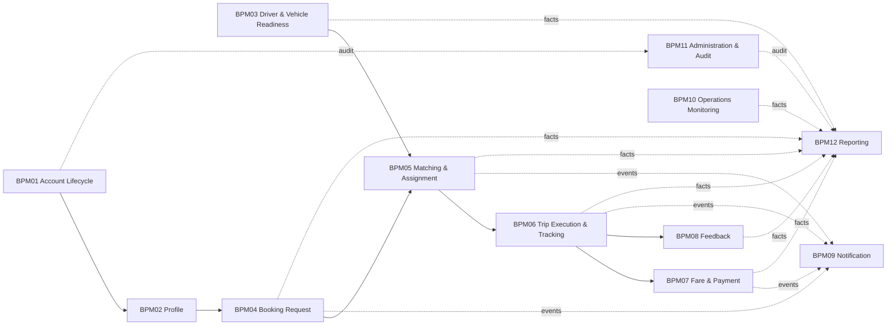

---

# 5. Context Map tổng thể

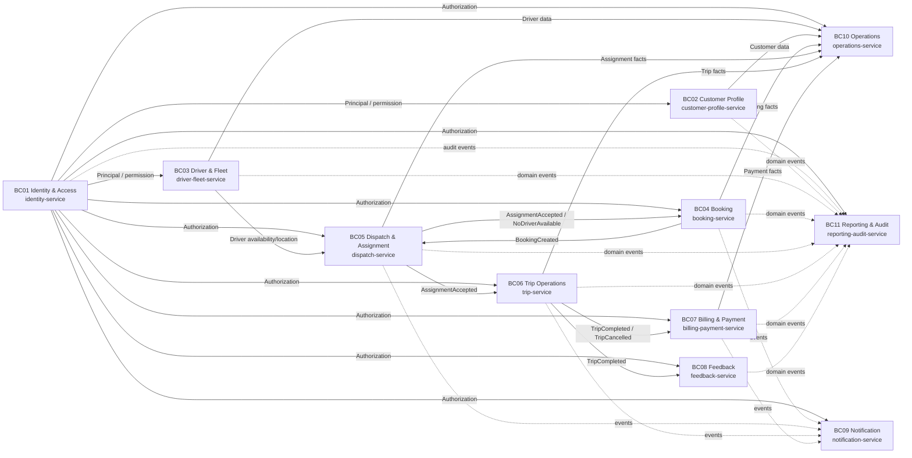

### 5.1 Quy tắc tích hợp

- **Không dùng foreign key xuyên database.**
- `booking-service` chỉ lưu `customerId`; nó không lưu `Customer` object.
- `dispatch-service` chỉ lưu `bookingId`, `driverId`, `vehicleId` dạng reference.
- `trip-service` chỉ lưu snapshot/reference cần cho Trip; không join trực tiếp database Driver.
- `operations-service` và `reporting-audit-service` dùng read model/projection.
- Event là integration contract; payload phải version hóa.
- Command xuyên context dùng HTTP/gRPC nội bộ hoặc message command tùy tính chất nghiệp vụ.
- Các workflow quan trọng được thiết kế theo **eventual consistency**, ngoại trừ transaction nội bộ của từng aggregate.

---

# 6. Quy ước thiết kế Microservice

Đề xuất công nghệ cho tất cả service:

```text
Node.js
Express / REST API
PostgreSQL
Redis (chỉ khi service cần cache/lock/session/queue support)
Message Broker (RabbitMQ/Kafka/NATS tùy hạ tầng)
```

Đây là **đề xuất kiến trúc microservice**, không phải tuyên bố repo hiện tại đã dùng đúng toàn bộ stack trên.

Cấu trúc chuẩn mỗi service:

```text
<service>
├── src/
│   ├── domain/
│   │   ├── entities/
│   │   ├── value-objects/
│   │   ├── aggregates/
│   │   ├── services/
│   │   ├── events/
│   │   └── repositories/
│   ├── application/
│   │   ├── commands/
│   │   ├── queries/
│   │   └── handlers/
│   ├── infrastructure/
│   │   ├── persistence/
│   │   ├── messaging/
│   │   └── external/
│   └── interfaces/
│       ├── http/
│       └── consumers/
├── migrations/
└── tests/
```

---

# 7. BC01 — Identity & Access Context

## 7.1 BC này làm gì?

BC01 quản lý **identity và access control**: ai đang truy cập hệ thống, account có hoạt động hay không, đăng nhập/đăng xuất, role nào được gán và permission nào được phép thực thi.

BC01 **không sở hữu** Booking, Trip, Vehicle, Payment hoặc Rating.

## 7.2 FR liên quan

| FR | Nội dung | Ownership |
|---|---|---|
| FR01 | Đăng ký tài khoản | Direct |
| FR02 | Đăng nhập | Direct |
| FR03 | Đăng xuất | Direct |
| FR04 | Kiểm tra trạng thái Account | Direct |
| FR05 | Hash password | Direct |
| FR06 | Cấp authentication session/token | Direct |
| FR07 | Từ chối nếu account bị khóa | Direct |
| FR10 | Đổi mật khẩu | Direct |
| FR96 | Quản lý Role | Direct |
| FR97 | Quản lý Permission | Direct |
| FR98 | Gán Role | Direct |
| FR99 | Kiểm tra Permission | Direct |
| FR100 | Chặn truy cập trái quyền | Direct |

Các FR01–FR07, FR10 và FR96–FR100 thuộc nhóm Account/Authorization trong SRS. citeturn731067view0turn731067view2

## 7.3 UC liên quan

```text
UC01 Đăng ký
UC02 Đăng nhập
UC03 Đăng xuất
UC06 Đổi mật khẩu
UC34 Quản lý Account
UC35 Quản lý Role
UC36 Quản lý Permission
```

## 7.4 Workflow/BPM

```text
BPM01 Account Lifecycle
BPM11 Administration & Audit
```

## 7.5 Ubiquitous Language

| Thuật ngữ | Nghĩa trong BC01 | Không nên hiểu thành |
|---|---|---|
| Account | Identity credential được dùng để truy cập hệ thống | Customer Profile |
| Principal | Chủ thể đã được xác thực | Customer entity |
| Credential | Thông tin dùng để authenticate | Profile information |
| Session | Phiên truy cập hợp lệ | Trip session |
| Role | Nhóm permission | User type |
| Permission | Quyền thực hiện action | UI button |
| Authorization | Quyết định request có được phép hay không | Business ownership |
| Locked | Account tạm thời bị chặn | Customer inactive |
| Disabled | Account bị vô hiệu hóa | Driver offline |

## 7.6 Domain model

```text
Account (Aggregate Root)
 ├── AccountId
 ├── LoginIdentifier
 ├── PasswordHash
 ├── AccountStatus
 └── Roles

Role
 ├── RoleId
 ├── Name
 └── PermissionIds

Permission
 ├── PermissionId
 └── Code

Session
 ├── SessionId
 ├── AccountId
 └── ExpiresAt
```

### Invariants

- `email`/`phone` dùng cho login phải unique theo policy.
- Account `LOCKED` hoặc `DISABLED` không authenticate thành công.
- Password không được lưu plaintext.
- Permission phải được kiểm tra tại backend.
- Admin action nhạy cảm phải phát sinh audit event.

## 7.7 API — identity-service

### Public API

| Method | Endpoint | Ý nghĩa |
|---|---|---|
| POST | `/api/v1/auth/register` | Tạo Account |
| POST | `/api/v1/auth/login` | Authenticate và cấp token/session |
| POST | `/api/v1/auth/logout` | Invalidate session |
| PUT | `/api/v1/auth/password` | Đổi password |
| GET | `/api/v1/me` | Lấy principal hiện tại |
| GET | `/api/v1/accounts` | Admin xem/search account |
| GET | `/api/v1/accounts/:id` | Xem account |
| PATCH | `/api/v1/accounts/:id/status` | Lock/Unlock/Enable/Disable |
| GET | `/api/v1/roles` | Xem role |
| POST | `/api/v1/roles` | Tạo role |
| PUT | `/api/v1/roles/:id` | Cập nhật role |
| GET | `/api/v1/permissions` | Xem permission |
| POST | `/api/v1/permissions` | Tạo permission |
| PUT | `/api/v1/permissions/:id` | Cập nhật permission |
| POST | `/api/v1/roles/:id/permissions` | Gán permission |
| POST | `/api/v1/accounts/:id/roles` | Gán role |

### Internal API

```text
GET  /internal/accounts/{accountId}/status
GET  /internal/accounts/{accountId}/principal
POST /internal/authorization/check
```

## 7.8 Database — `cab_identity_db`

```text
account
- account_id PK
- email UNIQUE NULL
- phone UNIQUE NULL
- password_hash
- status
- created_at
- updated_at

role
- role_id PK
- name UNIQUE
- description

permission
- permission_id PK
- code UNIQUE
- name
- description

account_role
- account_id PK/FK -> account.account_id
- role_id PK/FK -> role.role_id

role_permission
- role_id PK/FK -> role.role_id
- permission_id PK/FK -> permission.permission_id

session
- session_id PK
- account_id FK -> account.account_id
- issued_at
- expires_at
- revoked_at
```

## 7.9 ERD

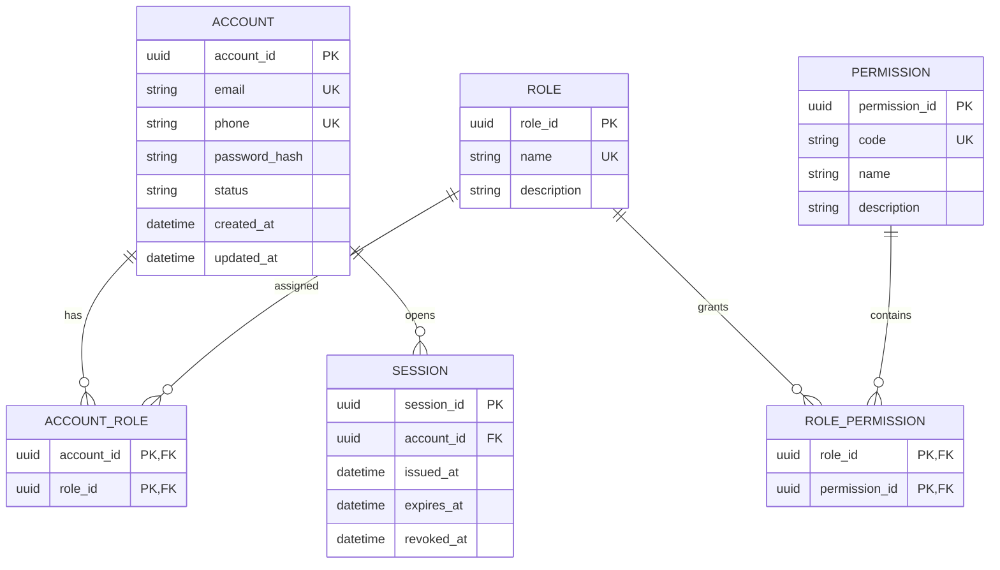


## 7.10 Database Type

**Loại DB chính: PostgreSQL**  
**Có thể dùng thêm Redis:** session/token cache và rate-limit ngắn hạn.

### Lý do kỹ thuật

BC Identity chứa các dữ liệu có **quan hệ chặt chẽ và yêu cầu tính toàn vẹn cao**: `account`, `role`, `permission`, `account_role`, `role_permission`, `session`. Các ràng buộc `UNIQUE`, khóa ngoại nội bộ và transaction khi tạo account/gán role phù hợp với **PostgreSQL**.

Các truy vấn thường gặp như tìm account theo `email/phone`, kiểm tra role-permission và kiểm tra session cần **index + lookup nhanh**, nhưng vẫn phải bảo đảm consistency. Redis chỉ nên giữ bản sao/session ngắn hạn để giảm tải, không phải nơi lưu nguồn sự thật của account/role.

**Không chọn MongoDB làm primary DB** vì mô hình authorization có nhiều quan hệ nhiều-nhiều và cần constraint rõ ràng.
## 7.11 Events

```text
AccountRegistered
AccountLoggedIn
AccountLoggedOut
PasswordChanged
AccountLocked
AccountUnlocked
AccountEnabled
AccountDisabled
RoleAssigned
RoleUpdated
PermissionAssigned
```

---

# 8. BC02 — Customer Profile Context

## 8.1 BC này làm gì?

BC02 quản lý **business profile của Customer**: tên, thông tin liên hệ và dữ liệu profile mà Customer dùng trong dịch vụ.

Identity thuộc BC01; `CustomerProfile` không chứa password.

## 8.2 FR liên quan

| FR | Nội dung | Ownership |
|---|---|---|
| FR08 | Xem hồ sơ | Direct — Customer side |
| FR09 | Cập nhật hồ sơ | Direct — Customer side |
| FR11 | Validate thông tin hồ sơ | Direct |

FR08–FR11 được SRS đặt trong nhóm Profile. `FR10 Đổi mật khẩu` được thực hiện bởi BC01 vì password thuộc Identity. citeturn731067view0

## 8.3 UC liên quan

```text
UC04 Xem hồ sơ — Customer
UC05 Cập nhật hồ sơ — Customer
```

## 8.4 Workflow/BPM

```text
BPM02 Customer Profile
```

## 8.5 Ubiquitous Language

| Thuật ngữ | Nghĩa trong BC02 |
|---|---|
| Customer | Business identity của người sử dụng dịch vụ với tư cách người đặt xe |
| Customer Profile | Hồ sơ nghiệp vụ của Customer |
| Contact Information | Phone/email phục vụ liên hệ |
| Profile Update | Một thay đổi thông tin hồ sơ |
| Profile Status | Trạng thái profile nghiệp vụ |
| CustomerId | Identity reference tới người dùng Customer |

Trong BC02, `Customer` **không đồng nghĩa với Account**.

## 8.6 Domain model

```text
CustomerProfile (Aggregate Root)
 ├── CustomerId
 ├── FullName
 ├── Phone
 ├── Email
 ├── ProfileStatus
 └── timestamps
```

### Invariants

- chỉ chủ profile hoặc actor có permission mới được sửa.
- field bắt buộc phải hợp lệ.
- `CustomerId` tham chiếu external identity, không tạo FK sang BC01 database.

## 8.7 API — customer-profile-service

| Method | Endpoint | Ý nghĩa |
|---|---|---|
| GET | `/api/v1/me/profile` | Xem profile hiện tại |
| PUT | `/api/v1/me/profile` | Cập nhật profile |
| GET | `/api/v1/customers/:customerId/profile` | Xem profile theo quyền |

### Internal API

```text
GET /internal/customers/{customerId}
GET /internal/customers/{customerId}/exists
```

## 8.8 Database — `cab_customer_profile_db`

```text
customer_profile
- customer_id PK
- full_name
- phone UNIQUE
- email UNIQUE
- status
- created_at
- updated_at
```

## 8.9 ERD

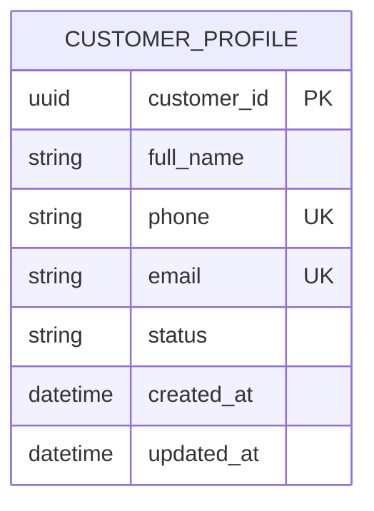


## 8.10 Database Type

**Loại DB chính: PostgreSQL**

### Lý do kỹ thuật

`customer_profile` có schema tương đối ổn định và cần đảm bảo **uniqueness** cho `phone`/`email`. Truy vấn chủ yếu là đọc/ cập nhật hồ sơ theo `customer_id`, `phone`, `email`, vì vậy PostgreSQL cho transaction và index đơn giản, hiệu quả.

BC này không cần document database chỉ để lưu linh hoạt; số lượng quan hệ và nghiệp vụ không đủ lớn để biện minh cho việc hy sinh constraint của relational DB.
## 8.11 Events

```text
CustomerProfileCreated
CustomerProfileUpdated
```

---

# 9. BC03 — Driver & Fleet Context

## 9.1 BC này làm gì?

BC03 sở hữu năng lực vận hành của Driver và Vehicle:

```text
Driver Profile
+ Vehicle
+ Availability
+ Current Location
```

Đây là **nguồn sự thật** cho trạng thái Driver/Vehicle phục vụ matching.

## 9.2 FR liên quan

| FR | Nội dung | Ownership |
|---|---|---|
| FR08 | Xem hồ sơ | Direct — Driver side |
| FR09 | Cập nhật hồ sơ | Direct — Driver side |
| FR11 | Validate profile | Direct |
| FR12 | Xem Vehicle | Direct |
| FR13 | Thêm Vehicle | Direct |
| FR14 | Cập nhật Vehicle | Direct |
| FR15 | Vô hiệu hóa Vehicle | Direct |
| FR16 | Kiểm tra Vehicle phù hợp loại xe | Direct |
| FR52 | Cập nhật latitude | Direct |
| FR53 | Cập nhật longitude | Direct |
| FR54 | Lưu thời gian location | Direct |
| FR55 | Customer xem vị trí Driver | Query exposed |
| FR56 | Operations xem vị trí Driver | Query exposed |

FR12–FR16 và FR52–FR56 được SRS xác định trong Vehicle/Tracking; MVP chỉ lưu **current location**, không lưu GPS history chi tiết. citeturn731067view0turn731067view1

## 9.3 UC liên quan

```text
UC04/UC05 — Driver Profile
UC07 Xem Vehicle
UC08 Thêm Vehicle
UC09 Cập nhật Vehicle
UC10 Vô hiệu hóa Vehicle
UC19 Cập nhật vị trí
```

## 9.4 Workflow/BPM

```text
BPM03 Driver & Vehicle Readiness
BPM05 Matching & Assignment — cung cấp candidate data
BPM06 Trip Execution & Tracking — cung cấp current location
BPM10 Operations Monitoring — cung cấp Driver/Vehicle/Location view
```

## 9.5 Ubiquitous Language

| Thuật ngữ | Nghĩa trong BC03 |
|---|---|
| Driver | Resource vận hành có thể nhận Trip |
| Available | Driver đủ điều kiện được matching |
| Busy | Driver đang có Trip active |
| Offline | Driver không tham gia điều phối |
| Vehicle | Phương tiện do Driver quản lý |
| Active Vehicle | Vehicle có thể dùng trong vận hành |
| Vehicle Type | Loại xe dùng để kiểm tra compatibility |
| Location | Vị trí hiện tại của Driver |
| Location Freshness | Độ mới của current location |

### Driver state

```text
OFFLINE → AVAILABLE → BUSY → AVAILABLE
```

### Vehicle state

```text
ACTIVE → INACTIVE
```

SRS quy định Driver chỉ `AVAILABLE` khi account active, không có Trip đang chạy và Vehicle hợp lệ; Vehicle đã từng dùng trong Trip không nên bị xóa vật lý. citeturn937669view1turn882365view3

## 9.6 Domain model

```text
Driver (Aggregate Root)
 ├── DriverId
 ├── FullName
 ├── Phone
 ├── Email
 ├── AvailabilityStatus
 └── CurrentLocation

Vehicle (Aggregate Root)
 ├── VehicleId
 ├── DriverId
 ├── VehicleType
 ├── LicensePlate
 ├── Model
 └── VehicleStatus
```

### Invariants

- chỉ Driver phù hợp điều kiện mới chuyển `AVAILABLE`.
- một Vehicle chỉ thuộc owner hợp lệ.
- license plate unique.
- location phải trong range latitude/longitude.
- MVP lưu một current location, không lưu toàn bộ GPS history.

## 9.7 API — driver-fleet-service

### Driver

| Method | Endpoint | Ý nghĩa |
|---|---|---|
| GET | `/api/v1/drivers/me` | Xem driver profile |
| PUT | `/api/v1/drivers/me` | Cập nhật profile |
| PATCH | `/api/v1/drivers/me/availability` | AVAILABLE/OFFLINE |
| GET | `/api/v1/drivers/me/location` | Current location |
| PATCH | `/api/v1/drivers/me/location` | Update location |

### Vehicle

| Method | Endpoint | Ý nghĩa |
|---|---|---|
| GET | `/api/v1/drivers/me/vehicles` | Danh sách Vehicle |
| POST | `/api/v1/drivers/me/vehicles` | Thêm Vehicle |
| PUT | `/api/v1/vehicles/:vehicleId` | Cập nhật Vehicle |
| PATCH | `/api/v1/vehicles/:vehicleId/status` | Activate/Deactivate |

### Internal API phục vụ Dispatch

```text
GET  /internal/drivers/candidates
GET  /internal/drivers/{driverId}
GET  /internal/drivers/{driverId}/availability
GET  /internal/drivers/{driverId}/vehicles
GET  /internal/drivers/{driverId}/location
POST /internal/drivers/{driverId}/reserve
POST /internal/drivers/{driverId}/release
POST /internal/drivers/{driverId}/mark-busy
```

## 9.8 Database — `cab_driver_fleet_db`

```text
driver
- driver_id PK
- full_name
- phone UNIQUE
- email UNIQUE
- status
- availability_status
- current_latitude
- current_longitude
- location_updated_at
- created_at
- updated_at

vehicle
- vehicle_id PK
- driver_id FK -> driver.driver_id
- vehicle_type
- license_plate UNIQUE
- model
- status
- created_at
- updated_at
```

## 9.9 ERD

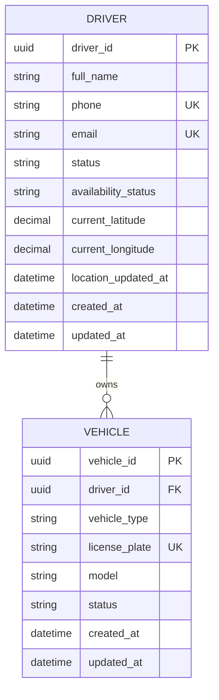


## 9.10 Database Type

**Loại DB chính: PostgreSQL**  
**Redis bổ trợ:** cache danh sách driver đang `AVAILABLE` và location nóng.

### Lý do kỹ thuật

`driver` và `vehicle` có **quan hệ 1-n** và các constraint nghiệp vụ rõ ràng như `license_plate UNIQUE`, trạng thái xe và driver. Phần này phù hợp với PostgreSQL.

Đặc biệt `current_latitude/current_longitude` phục vụ các truy vấn kiểu **tìm driver gần điểm đón**. Phần dữ liệu bền vững vẫn nằm trong PostgreSQL; còn location/availability mới nhất có thể đặt trong Redis để giảm latency cho các truy vấn realtime. Phần tính khoảng cách có thể thực hiện ở tầng ứng dụng và tối ưu bằng index phù hợp trong PostgreSQL.

MongoDB không cần thiết cho core driver/vehicle vì quan hệ và constraint quan trọng hơn tính linh hoạt của document.
## 9.11 Events

```text
DriverProfileUpdated
DriverBecameAvailable
DriverBecameOffline
DriverBecameBusy
DriverReleased
VehicleAdded
VehicleUpdated
VehicleDeactivated
DriverLocationUpdated
```

---

# 10. BC04 — Booking Context

## 10.1 BC này làm gì?

BC04 sở hữu **customer intent to request a ride** — yêu cầu đặt xe trước khi có Trip.

`Booking` không phải `Trip`.

```text
Booking = yêu cầu dịch vụ
Trip    = chuyến thực tế
```

## 10.2 FR liên quan

| FR | Nội dung |
|---|---|
| FR17 | Nhập pickup |
| FR18 | Nhập destination |
| FR19 | Chọn vehicle type |
| FR20 | Validate Booking |
| FR21 | Tạo Booking |
| FR22 | Xem Booking |
| FR23 | Hủy Booking |
| FR24 | Cập nhật trạng thái Booking |

FR17–FR24 thuộc BR04 Booking của SRS. citeturn731067view0

## 10.3 UC

```text
UC11 Tạo Booking
UC12 Xem Booking
UC13 Hủy Booking
```

## 10.4 Workflow/BPM

```text
BPM04 Booking Request
BPM05 Matching & Assignment — phát sinh BookingCreated / BookingSearching
BPM09 Notification — Booking event
BPM10 Operations Monitoring — booking facts
BPM12 Reporting — booking facts
```

## 10.5 Ubiquitous Language

| Thuật ngữ | Nghĩa trong BC04 |
|---|---|
| Booking | Yêu cầu đặt xe |
| Pickup | Điểm đón |
| Destination | Điểm đến |
| Requested Vehicle Type | Loại xe Customer yêu cầu |
| Searching | Đang chờ matching |
| Assigned | Đã có Driver được chấp nhận |
| No Driver Found | Không còn candidate hợp lệ |
| Cancelled | Booking đã bị hủy |
| Cancellation Policy | Quy tắc xác định có được hủy hay không |

## 10.6 Domain model

```text
Booking (Aggregate Root)
 ├── BookingId
 ├── CustomerId
 ├── PickupLocation
 ├── DestinationLocation
 ├── RequestedVehicleType
 ├── BookingStatus
 └── CancellationInfo
```

### State

```text
CREATED → SEARCHING → ASSIGNED
                      └→ NO_DRIVER_FOUND
CREATED/SEARCHING → CANCELLED
```

### Invariants

- phải có `customerId`, pickup, destination, vehicleType.
- chỉ customer authenticated/đủ quyền mới tạo.
- một Booking không có hơn một Trip active.
- một Booking chỉ có một Driver accept thành công.

Các rule BRULE01, BRULE02, BRULE11, BRULE12 của SRS liên quan trực tiếp. citeturn882365view2

## 10.7 API — booking-service

| Method | Endpoint | Ý nghĩa |
|---|---|---|
| POST | `/api/v1/bookings` | Tạo Booking |
| GET | `/api/v1/bookings` | List Booking của Customer |
| GET | `/api/v1/bookings/:bookingId` | Chi tiết Booking |
| POST | `/api/v1/bookings/:bookingId/cancel` | Hủy Booking |
| GET | `/api/v1/bookings/:bookingId/status` | Status |

### Internal API

```text
POST /internal/bookings/{bookingId}/start-search
POST /internal/bookings/{bookingId}/mark-assigned
POST /internal/bookings/{bookingId}/mark-no-driver-found
GET  /internal/bookings/{bookingId}/dispatch-view
```

## 10.8 Database — `cab_booking_db`

```text
booking
- booking_id PK
- customer_id
- pickup_latitude
- pickup_longitude
- destination_latitude
- destination_longitude
- vehicle_type
- status
- created_at
- updated_at
- cancelled_at
- cancellation_reason
```

Không tạo FK `customer_id` sang `cab_customer_profile_db`.

## 10.9 ERD

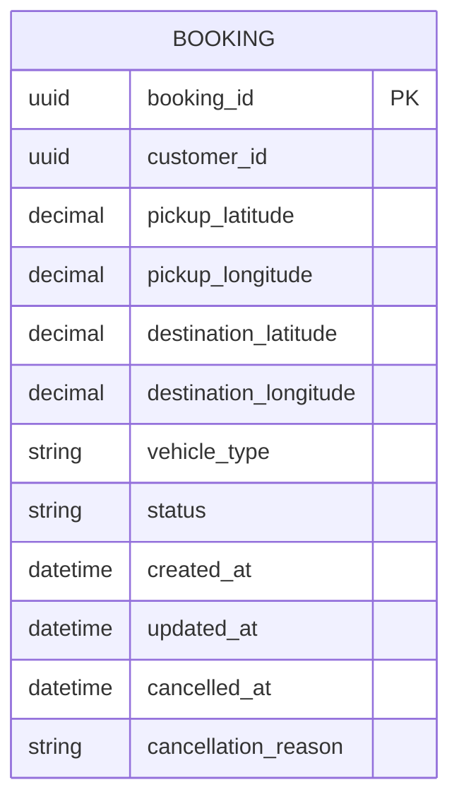


## 10.10 Database Type

**Loại DB chính: PostgreSQL**

### Lý do kỹ thuật

`booking` là **transactional aggregate**: trạng thái chuyển qua các bước (`SEARCHING`, `ACCEPTED`, `CANCELLED`, ...), cần update nhất quán và chống tạo/ghi đè booking sai trạng thái. PostgreSQL phù hợp với transaction, index và constraint.

Các truy vấn nóng gồm `booking_id`, `customer_id`, `status`, `created_at`; có thể tạo composite index cho lịch sử và các booking đang hoạt động.

MongoDB có thể lưu booking history dạng document, nhưng không mang lại lợi ích đủ lớn để thay thế relational DB ở đây vì state transition và consistency là quan trọng hơn.
## 10.11 Events

```text
BookingCreated
BookingEnteredSearching
BookingAssigned
BookingCancelled
NoDriverFound
```

---

# 11. BC05 — Dispatch & Assignment Context

## 11.1 BC này làm gì?

BC05 quyết định **Driver nào được đề nghị nhận Booking** và lưu lịch sử từng lần gửi request.

Đây là context của **matching**, không phải owner của Driver Profile.

## 11.2 FR liên quan

| FR | Nội dung |
|---|---|
| FR25 | Tìm Driver AVAILABLE |
| FR26 | Lọc Driver theo Vehicle |
| FR27 | Lọc Driver theo khoảng cách |
| FR28 | Ưu tiên Driver phù hợp |
| FR29 | Gửi request |
| FR30 | Chờ phản hồi |
| FR31 | ACCEPT |
| FR32 | REJECT |
| FR33 | TIMEOUT |
| FR34 | Retry Driver |
| FR35 | Không tìm được Driver |
| FR36 | Tạo BookingAssignment |
| FR37 | Cập nhật Assignment status |
| FR38 | Lưu sentAt |
| FR39 | Lưu respondedAt |
| FR40 | Lưu rejectReason |
| FR41 | Không gửi lại Driver đã bị loại |

FR25–FR41 được SRS đặt trong Driver Matching và Assignment. citeturn731067view0

## 11.3 UC

```text
UC14 Tìm và phân công Driver
UC15 Nhận chuyến
UC16 Từ chối chuyến
```

## 11.4 Workflow/BPM

```text
BPM05 Matching & Assignment
```

## 11.5 Ubiquitous Language

| Thuật ngữ | Nghĩa trong BC05 |
|---|---|
| Candidate | Driver được đưa vào vòng matching |
| Matching | Quá trình chọn candidate |
| Distance | Khoảng cách candidate → pickup |
| Ranking | Thứ tự candidate |
| Assignment | Một lời đề nghị chuyến gửi tới Driver |
| SENT | Request đã gửi |
| ACCEPTED | Driver chấp nhận |
| REJECTED | Driver từ chối |
| TIMEOUT | Không phản hồi trong hạn |
| Retry | Chọn candidate tiếp theo |
| Eliminated Driver | Driver đã bị loại trong Booking hiện tại |

## 11.6 Domain model

```text
DispatchProcess (Aggregate Root)
 ├── BookingId
 ├── SearchStatus
 ├── ExcludedDriverIds
 └── RetryCount

BookingAssignment (Aggregate Root)
 ├── AssignmentId
 ├── BookingId
 ├── DriverId
 ├── VehicleId
 ├── Status
 ├── SentAt
 ├── RespondedAt
 └── RejectReason
```

### Domain Services

```text
DriverMatcher
DistanceCalculator
CandidateRanker
AssignmentPolicy
RetryPolicy
```

### Invariants

- chỉ candidate `AVAILABLE` được xét.
- vehicle phải phù hợp requested type.
- Driver REJECT/TIMEOUT bị loại khỏi vòng hiện tại.
- một Booking có nhiều Assignment nhưng chỉ một Assignment thành công.
- concurrent accept phải được serialize/lock để chỉ một Driver thắng.

SRS yêu cầu concurrent accept chỉ cho một Driver thành công và request còn lại trả `409 Conflict / Booking unavailable`. citeturn937669view2turn869732view2

## 11.7 API — dispatch-service

| Method | Endpoint | Ý nghĩa |
|---|---|---|
| POST | `/api/v1/bookings/:bookingId/match` | Bắt đầu matching |
| GET | `/api/v1/bookings/:bookingId/assignments` | Lịch sử Assignment |
| GET | `/api/v1/assignments/:assignmentId` | Chi tiết Assignment |
| POST | `/api/v1/assignments/:assignmentId/accept` | Driver accept |
| POST | `/api/v1/assignments/:assignmentId/reject` | Driver reject |

### Internal API

```text
POST /internal/bookings/{bookingId}/dispatch
POST /internal/assignments/{assignmentId}/timeout
GET  /internal/bookings/{bookingId}/dispatch-state
```

### Calls to BC03

```text
GET /internal/drivers/candidates
GET /internal/drivers/{driverId}/availability
GET /internal/drivers/{driverId}/vehicles
GET /internal/drivers/{driverId}/location
POST /internal/drivers/{driverId}/reserve
```

## 11.8 Database — `cab_dispatch_db`

```text
dispatch_process
- booking_id PK
- status
- retry_count
- started_at
- completed_at

booking_assignment
- assignment_id PK
- booking_id
- driver_id
- vehicle_id
- status
- sent_at
- responded_at
- reject_reason

excluded_driver
- booking_id PK/FK -> dispatch_process.booking_id
- driver_id PK
- reason
```

## 11.9 ERD

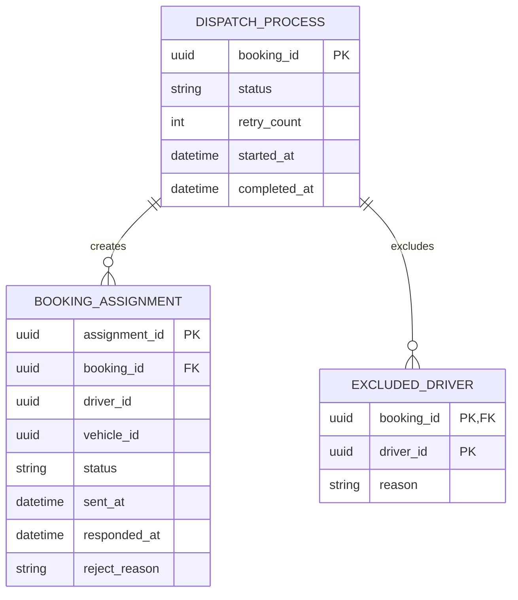


## 11.10 Database Type

**Loại DB chính: PostgreSQL**  
**Redis bổ trợ:** distributed lock, temporary dispatch state và cache driver candidate.

### Lý do kỹ thuật

Dispatch cần xử lý **concurrency cao**: nhiều request có thể đồng thời chọn cùng một driver. `dispatch_process`, `booking_assignment`, `excluded_driver` có quan hệ chặt và cần transaction/idempotency để tránh double assignment.

PostgreSQL đảm bảo consistency của assignment; Redis phù hợp cho dữ liệu tạm thời như lock `driver:{id}`, TTL candidate cache hoặc coordination ngắn hạn. Redis **không phải source of truth** của assignment.

Nếu dùng Redis để khóa, phải luôn có cơ chế timeout/idempotency để tránh lock treo.
## 11.11 Events

```text
MatchingStarted
AssignmentSent
AssignmentAccepted
AssignmentRejected
AssignmentTimedOut
MatchingRetried
NoDriverAvailable
```

---

# 12. BC06 — Trip Operations Context

## 12.1 BC này làm gì?

BC06 sở hữu **vòng đời của Trip** từ sau khi Assignment được ACCEPT cho tới COMPLETED/CANCELLED.

## 12.2 FR liên quan

| FR | Nội dung |
|---|---|
| FR42 | Tạo Trip |
| FR43 | Nhận Trip |
| FR44 | Từ chối Trip |
| FR45 | ARRIVED |
| FR46 | PICKED_UP |
| FR47 | IN_PROGRESS |
| FR48 | COMPLETED |
| FR49 | Hủy Trip |
| FR50 | Kiểm tra state transition |
| FR51 | Lưu thời gian trạng thái |

FR42–FR51 thuộc BR07 Trip. citeturn731067view0

## 12.3 UC

```text
UC17 Tạo Trip
UC18 Cập nhật trạng thái Trip
UC20 Hủy Trip
UC21 Hoàn thành Trip
```

`UC19` không nằm ở BC06; current location được sở hữu bởi BC03.

## 12.4 Workflow/BPM

```text
BPM06 Trip Execution & Tracking
BPM07 Fare & Payment — phát event khi COMPLETED
BPM08 Feedback — phát event khi COMPLETED
BPM09 Notification — phát Trip events
BPM10 Operations Monitoring
BPM12 Reporting
```

## 12.5 Ubiquitous Language

| Thuật ngữ | Nghĩa trong BC06 |
|---|---|
| Trip | Chuyến thực tế được tạo để thực hiện Booking |
| Assigned | Trip đã có Driver |
| Arrived | Driver đã tới pickup |
| Picked Up | Customer đã được đón |
| In Progress | Chuyến đang di chuyển |
| Completed | Chuyến hoàn tất |
| Cancelled | Chuyến kết thúc do hủy |
| State Transition | Chuyển state hợp lệ |
| Trip Snapshot | Dữ liệu đầu vào cần giữ cho Trip |

## 12.6 State machine

```text
ASSIGNED
   ↓
ARRIVED
   ↓
PICKED_UP
   ↓
IN_PROGRESS
   ↓
COMPLETED
```

Các state đang hoạt động có thể đi tới `CANCELLED` nếu policy cho phép.

SRS cấm các transition ngược như `COMPLETED → IN_PROGRESS`, `COMPLETED → ASSIGNED`, `CANCELLED → IN_PROGRESS`. citeturn937669view2turn882365view2

## 12.7 Domain model

```text
Trip (Aggregate Root)
 ├── TripId
 ├── BookingId
 ├── CustomerId
 ├── DriverId
 ├── VehicleId
 ├── PickupLocation
 ├── DestinationLocation
 ├── TripStatus
 ├── FareSnapshot
 ├── StatusTimestamps
 └── CancellationInfo
```

### Invariants

- Trip được tạo từ `AssignmentAccepted`.
- transition phải đi theo state machine.
- Trip `COMPLETED` không quay lại state trước.
- Trip `CANCELLED` không tiếp tục.
- chỉ một Trip active cho mỗi Booking.

## 12.8 API — trip-service

| Method | Endpoint | Ý nghĩa |
|---|---|---|
| POST | `/api/v1/trips` | Tạo Trip từ accepted assignment |
| GET | `/api/v1/trips` | History/list |
| GET | `/api/v1/trips/:tripId` | Chi tiết Trip |
| PATCH | `/api/v1/trips/:tripId/status` | Transition state |
| POST | `/api/v1/trips/:tripId/cancel` | Hủy Trip |
| POST | `/api/v1/trips/:tripId/complete` | Hoàn thành |
| GET | `/api/v1/trips/:tripId/driver` | Driver snapshot/reference |

### Internal API

```text
POST /internal/trips/from-assignment
GET  /internal/trips/{tripId}/state
GET  /internal/trips/{tripId}/completion-view
```

## 12.9 Database — `cab_trip_db`

```text
trip
- trip_id PK
- booking_id UNIQUE
- customer_id
- driver_id
- vehicle_id
- pickup_latitude
- pickup_longitude
- destination_latitude
- destination_longitude
- status
- fare_amount
- assigned_at
- arrived_at
- picked_up_at
- started_at
- completed_at
- cancelled_at
- cancellation_reason
- cancelled_by
- created_at
- updated_at
```

Không tạo FK sang booking/driver/vehicle DB khác.

## 12.10 ERD

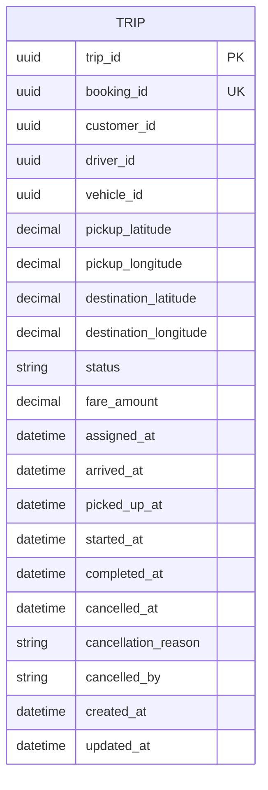


## 12.11 Database Type

**Loại DB chính: PostgreSQL**  
**Redis bổ trợ:** trạng thái Trip đang chạy và telemetry/location nóng nếu hệ thống tracking có tần suất cập nhật cao.

### Lý do kỹ thuật

`trip` là aggregate trung tâm của quá trình vận hành chuyến xe; các mốc thời gian và `status` phải **nhất quán và có lịch sử rõ ràng**. PostgreSQL phù hợp với transaction và index theo `trip_id`, `booking_id`, `driver_id`, `status`.

Dữ liệu location cập nhật liên tục có thể tạo workload ghi lớn; phần nóng có thể để Redis với TTL rồi ghi/publish event định kỳ về storage bền vững. Nhưng trạng thái nghiệp vụ cuối cùng của Trip vẫn phải nằm trong PostgreSQL.
## 12.12 Events

```text
TripCreated
DriverArrived
PassengerPickedUp
TripStarted
TripCompleted
TripCancelled
```

---

# 13. BC07 — Billing & Payment Context

## 13.1 BC này làm gì?

BC07 giải quyết hai domain behavior:

```text
Fare = Customer phải trả bao nhiêu?
Payment = Khoản tiền đã được thanh toán thế nào?
```

## 13.2 FR liên quan

| FR | Nội dung |
|---|---|
| FR57 | Tính cước |
| FR58 | Lưu fare |
| FR59 | Hiển thị fare |
| FR60 | Không tính Payment trước Trip hoàn thành |
| FR61 | Chọn phương thức Payment |
| FR62 | Thanh toán tiền mặt |
| FR63 | Khởi tạo online Payment |
| FR64 | Nhận kết quả Provider |
| FR65 | Ghi nhận Payment success |
| FR66 | Ghi nhận Payment failed |
| FR67 | Không tạo nhiều Payment success cho một Trip |
| FR68 | Lưu provider transaction ID |
| FR69 | Không lưu card data nhạy cảm |

FR57–FR69 được SRS xác định trong Fare/Payment. citeturn731067view1

## 13.3 UC

```text
UC22 Tính cước
UC23 Thanh toán
UC24 Tra cứu Payment
```

## 13.4 Workflow/BPM

```text
BPM07 Fare & Payment
BPM09 Notification
BPM10 Operations Monitoring
BPM12 Reporting
```

## 13.5 Ubiquitous Language

| Thuật ngữ | Nghĩa trong BC07 |
|---|---|
| Fare | Số tiền phải trả cho Trip |
| Fare Calculation | Logic tính Fare |
| Payment | Một giao dịch thanh toán |
| Payment Method | CASH hoặc ONLINE |
| Pending | Chưa có final result |
| Success | Thanh toán thành công |
| Failed | Thanh toán thất bại |
| Provider Transaction ID | Mã giao dịch phía payment provider |
| Payment Attempt | Một lần khởi tạo/đẩy thanh toán |

## 13.6 Domain model

```text
Fare (Aggregate)
 ├── FareId
 ├── TripId
 ├── VehicleType
 ├── Amount
 └── CalculationVersion

Payment (Aggregate Root)
 ├── PaymentId
 ├── TripId
 ├── Method
 ├── Amount
 ├── Status
 ├── ProviderTransactionId
 └── PaidAt
```

### Domain Services

```text
FareCalculator
PaymentPolicy
ProviderPaymentAdapter
```

### Invariants

- chỉ Trip `COMPLETED` mới được tính fare/payment.
- một Trip không được có hai Payment `SUCCESS`.
- không lưu card number/CVV/PIN.
- Provider failure không rollback Trip.

SRS xác định Payment chỉ dựa trên Trip COMPLETED và Provider lỗi không rollback Trip. citeturn882365view0turn882365view3

## 13.7 API — billing-payment-service

### Fare API

| Method | Endpoint | Ý nghĩa |
|---|---|---|
| POST | `/api/v1/trips/:tripId/fare` | Calculate fare |
| GET | `/api/v1/trips/:tripId/fare` | Xem fare |

### Payment API

| Method | Endpoint | Ý nghĩa |
|---|---|---|
| POST | `/api/v1/trips/:tripId/payment` | Tạo payment |
| GET | `/api/v1/payments/:paymentId` | Tra cứu payment |
| POST | `/api/v1/payments/:paymentId/retry` | Retry theo policy |
| POST | `/api/v1/payment-provider/callback` | Nhận provider callback |

### Internal API

```text
POST /internal/trips/{tripId}/calculate-fare
GET  /internal/trips/{tripId}/payment-status
```

## 13.8 Database — `cab_billing_payment_db`

```text
fare
- fare_id PK
- trip_id UNIQUE
- vehicle_type
- amount
- calculation_version
- created_at
- updated_at

payment
- payment_id PK
- trip_id
- method
- amount
- status
- provider_transaction_id NULL
- paid_at NULL
- created_at
- updated_at
```

Constraint nghiệp vụ:

```text
UNIQUE(trip_id) WHERE status = 'SUCCESS'
UNIQUE(trip_id) ON fare
```

## 13.9 ERD

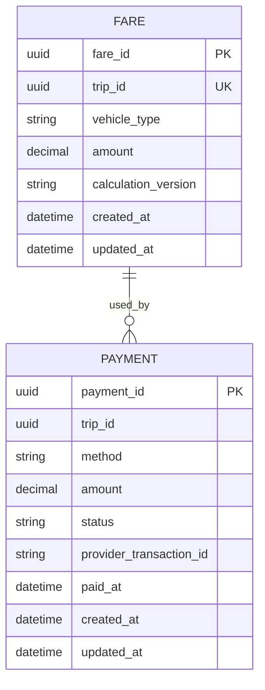

`FARE` và `PAYMENT` đều dùng `trip_id` như external reference; không có FK tới `cab_trip_db`.


## 13.10 Database Type

**Loại DB chính: PostgreSQL**  
**Redis tùy chọn:** idempotency key / payment session TTL ngắn hạn.

### Lý do kỹ thuật

Fare và Payment là dữ liệu **tài chính**, yêu cầu transaction, consistency, unique constraint và auditability rất cao. PostgreSQL phù hợp cho các constraint như một `SUCCESS` payment cho một Trip và uniqueness của Fare.

`provider_transaction_id`, `trip_id`, `status` cần index để tra cứu nhanh khi callback/retry từ payment provider. Redis chỉ lưu dữ liệu tạm như idempotency key hoặc checkout session; không lưu số tiền giao dịch làm nguồn sự thật.

Không chọn MongoDB cho primary payment store vì ưu tiên của context này là **data integrity và transactional consistency**, không phải schema flexibility.
## 13.11 Events

```text
FareCalculated
PaymentInitiated
PaymentSucceeded
PaymentFailed
```

---

# 14. BC08 — Feedback Context

## 14.1 BC này làm gì?

BC08 quản lý **Customer feedback về Driver sau khi Trip hoàn thành**.

## 14.2 FR liên quan

| FR | Nội dung |
|---|---|
| FR75 | Tạo Rating |
| FR76 | Validate score |
| FR77 | Lưu comment |
| FR78 | Không Rating khi Trip chưa hoàn thành |
| FR79 | Không tạo Rating trùng |
| FR80 | Xem Rating |

FR75–FR80 được SRS định nghĩa trong BR12 Rating. citeturn731067view1

## 14.3 UC

```text
UC25 Đánh giá Driver
UC26 Xem Rating
```

## 14.4 Workflow/BPM

```text
BPM08 Feedback
BPM12 Reporting
BPM10 Operations Monitoring
```

## 14.5 Ubiquitous Language

| Thuật ngữ | Nghĩa trong BC08 |
|---|---|
| Rating | Một đánh giá gắn với Trip |
| Score | Điểm số |
| Comment | Nhận xét của Customer |
| Rating Eligibility | Điều kiện được rating |
| Rated Trip | Trip đã có Rating |
| Driver Rating | Tổng/collection rating của Driver |

## 14.6 Domain model

```text
Rating (Aggregate Root)
 ├── RatingId
 ├── TripId
 ├── CustomerId
 ├── DriverId
 ├── Score
 └── Comment
```

### Invariants

- Trip phải COMPLETED.
- Trip phải thuộc Customer đang rating.
- một Trip tối đa một Rating.
- score phải thuộc miền cho phép.

## 14.7 API — feedback-service

| Method | Endpoint | Ý nghĩa |
|---|---|---|
| POST | `/api/v1/trips/:tripId/rating` | Tạo Rating |
| GET | `/api/v1/trips/:tripId/rating` | Rating của Trip |
| GET | `/api/v1/drivers/:driverId/ratings` | Rating của Driver |
| GET | `/api/v1/drivers/:driverId/rating-summary` | Average/count |

## 14.8 Database — `cab_feedback_db`

```text
rating
- rating_id PK
- trip_id UNIQUE
- customer_id
- driver_id
- score
- comment
- created_at
- updated_at
```

## 14.9 ERD

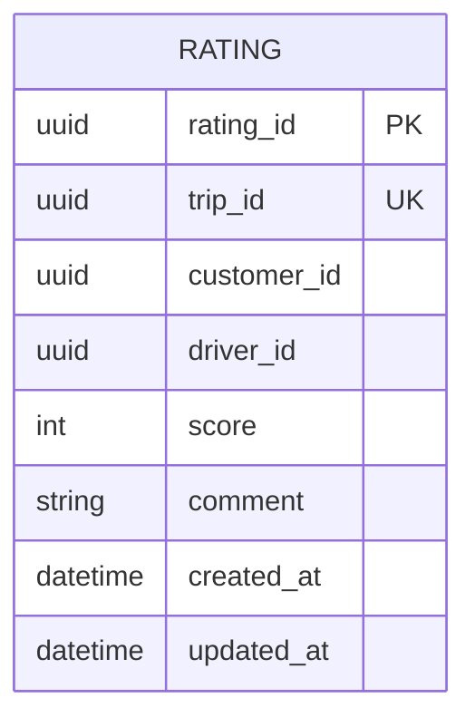


## 14.10 Database Type

**Loại DB chính: PostgreSQL**

### Lý do kỹ thuật

Mỗi Trip chỉ cần một Rating hợp lệ, thể hiện bằng `trip_id UNIQUE`; score, customer, driver và Trip reference có quan hệ nghiệp vụ rõ ràng. PostgreSQL giúp enforce constraint và transaction khi submit/update rating.

Workload đọc có thể được tối ưu bằng index `driver_id`, `created_at`, `trip_id`. MongoDB không đem lại lợi ích đáng kể vì document rating đơn giản và schema khá ổn định.
## 14.11 Events

```text
RatingSubmitted
```

---

# 15. BC09 — Notification Context

## 15.1 BC này làm gì?

BC09 chịu trách nhiệm **biến domain event thành thông tin được gửi và lưu cho người nhận**.

Notification không sở hữu business state của Booking/Trip/Payment.

## 15.2 FR liên quan

| FR | Nội dung |
|---|---|
| FR70 | Tạo Notification |
| FR71 | Gửi Notification |
| FR72 | Lưu Notification |
| FR73 | Xem Notification |

FR70–FR73 thuộc BR11 Notification. citeturn731067view1

## 15.3 UC

```text
UC27 Xem Notification
UC28 Đánh dấu Notification đã đọc
```

## 15.4 Workflow/BPM

```text
BPM09 Notification Delivery
```

## 15.5 Ubiquitous Language

| Thuật ngữ | Nghĩa trong BC09 |
|---|---|
| Notification | Tin nhắn hệ thống gửi tới recipient |
| Recipient | Người nhận |
| Notification Type | Loại thông báo |
| Delivery | Quá trình gửi |
| Read | Đã xem |
| Unread | Chưa xem |
| Channel | Kênh gửi |
| Delivery Failure | Không gửi được |

## 15.6 Domain model

```text
Notification (Aggregate Root)
 ├── NotificationId
 ├── RecipientType
 ├── RecipientId
 ├── Type
 ├── Title
 ├── Message
 ├── ReadStatus
 └── timestamps
```

## 15.7 API — notification-service

| Method | Endpoint | Ý nghĩa |
|---|---|---|
| GET | `/api/v1/notifications` | List notification của recipient |
| GET | `/api/v1/notifications/:notificationId` | Xem detail |
| PATCH | `/api/v1/notifications/:notificationId/read` | Mark read |
| PATCH | `/api/v1/notifications/read-all` | Mark all read |

### Internal API

```text
POST /internal/notifications
POST /internal/notifications/{id}/deliver
```

## 15.8 Database — `cab_notification_db`

```text
notification
- notification_id PK
- recipient_type
- recipient_id
- trip_id NULL
- type
- title
- message
- is_read
- created_at
- read_at

delivery
- delivery_id PK
- notification_id FK
- channel
- status
- provider_message_id
- attempted_at
```

## 15.9 ERD

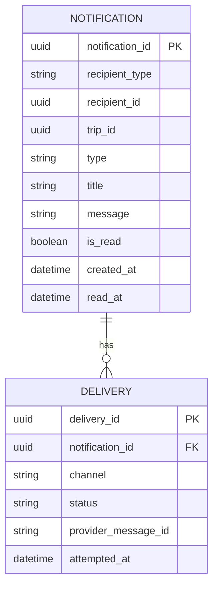


## 15.10 Database Type

**Loại DB chính: MongoDB**  
**Redis bổ trợ:** queue/retry state hoặc rate-limit ngắn hạn.

### Lý do kỹ thuật

Notification thường có payload linh hoạt theo loại sự kiện: `title`, `message`, template data, metadata, deep-link, channel-specific attributes. Schema có thể thay đổi theo từng notification type mà không cần migration quan hệ nặng.

Các truy vấn cần nhanh gồm `recipient_id + created_at`, `is_read`, `type`; MongoDB hỗ trợ document và index tốt cho mô hình này. Quan hệ `notification → delivery` có thể được lưu embedded hoặc reference tùy nhu cầu.

MongoDB phù hợp hơn relational DB ở đây vì context ưu tiên **write/read notification throughput + schema flexibility**, trong khi không có transaction liên service bắt buộc.

Redis không nên là primary DB vì notification cần lưu bền vững để người dùng xem lại lịch sử.
## 15.11 Events consumed

```text
BookingCreated
BookingAssigned
BookingCancelled
AssignmentRejected
DriverArrived
TripCompleted
PaymentSucceeded
PaymentFailed
```

## 15.12 Availability rule

Notification Provider lỗi **không được rollback business transaction nguồn**; Notification có thể retry/mark failed. SRS yêu cầu Trip vẫn được cập nhật khi Notification Provider lỗi. citeturn882365view3

---

# 16. BC10 — Operations Context

## 16.1 BC này làm gì?

BC10 là **operational view/context** dành cho Operations Staff.

BC10 không trở thành owner của Customer/Driver/Vehicle/Trip/Payment. Nó sở hữu **read models phục vụ vận hành** và phát command tới bounded context nghiệp vụ gốc khi thao tác được phép.

Nói cách khác:

```text
BC03 owns Vehicle
BC10 manages/view Vehicle operationally
```

Nhưng `operations-service` không được tự sửa bảng `vehicle` của BC03.

## 16.2 FR liên quan

| FR | Nội dung |
|---|---|
| FR88 | Xem Customer |
| FR89 | Xem Driver |
| FR90 | Quản lý Vehicle |
| FR91 | Xem danh sách Trip |
| FR92 | Xem chi tiết Trip |
| FR93 | Theo dõi Driver |
| FR94 | Tra cứu Payment |

FR88–FR94 thuộc BR14 Operations. citeturn731067view1

## 16.3 UC

```text
UC30 Quản lý Customer
UC31 Quản lý Driver
UC32 Quản lý Vehicle
UC33 Theo dõi Trip
```

SRS cho phép Operations Staff View/Search/Filter/Detail Customer, Driver, Vehicle; theo dõi Trip và Driver; tra cứu Payment. citeturn882365view0

## 16.4 Workflow/BPM

```text
BPM10 Operations Monitoring
```

## 16.5 Ubiquitous Language

| Thuật ngữ | Nghĩa trong BC10 |
|---|---|
| Operational View | Góc nhìn phục vụ vận hành |
| Customer View | Projection của Customer cho Staff |
| Driver View | Projection của Driver cho Staff |
| Vehicle View | Projection của Vehicle cho Staff |
| Trip Monitoring | Theo dõi Trip đang/chưa hoàn tất |
| Driver Monitoring | Theo dõi availability/location |
| Operational Filter | Bộ điều kiện search/filter |
| Operational Detail | Detail view tổng hợp |

BC10 không dùng `Customer Aggregate`, `Driver Aggregate` hay `Trip Aggregate` của context khác.

## 16.6 Read models

```text
CustomerOperationalView
DriverOperationalView
VehicleOperationalView
TripMonitoringView
PaymentOperationalView
```

## 16.7 API — operations-service

| Method | Endpoint | Ý nghĩa |
|---|---|---|
| GET | `/api/v1/operations/customers` | Search/filter Customer |
| GET | `/api/v1/operations/customers/:id` | Customer detail |
| GET | `/api/v1/operations/drivers` | Search/filter Driver |
| GET | `/api/v1/operations/drivers/:id` | Driver detail |
| GET | `/api/v1/operations/vehicles` | Search/filter Vehicle |
| GET | `/api/v1/operations/vehicles/:id` | Vehicle detail |
| PATCH | `/api/v1/operations/vehicles/:id/status` | Gửi command thay đổi status |
| GET | `/api/v1/operations/trips` | Trip list |
| GET | `/api/v1/operations/trips/:id` | Trip detail |
| GET | `/api/v1/operations/drivers/:id/location` | Theo dõi location |
| GET | `/api/v1/operations/payments/:id` | Tra cứu Payment |

### Internal command calls

```text
PATCH /internal/vehicles/{id}/status      -> BC03
POST  /internal/drivers/{id}/operations   -> BC03 (nếu có command)
```

## 16.8 Database — `cab_operations_db`

Database là **read-optimized projection DB**:

```text
customer_operational_view
- customer_id PK
- full_name
- phone
- email
- status
- updated_at

driver_operational_view
- driver_id PK
- full_name
- phone
- status
- availability_status
- current_latitude
- current_longitude
- location_updated_at

vehicle_operational_view
- vehicle_id PK
- driver_id
- vehicle_type
- license_plate
- model
- status

trip_monitoring_view
- trip_id PK
- booking_id
- customer_id
- driver_id
- vehicle_id
- pickup
- destination
- status
- fare
- created_at
- updated_at

payment_operational_view
- payment_id PK
- trip_id
- method
- amount
- status
- paid_at
```

## 16.9 ERD

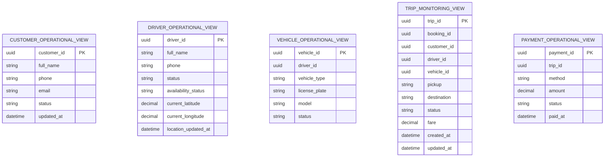

Các relation giữa read model chỉ là logical reference, không nhất thiết tạo SQL FK cross-source.


## 16.10 Database Type

**Loại DB chính: MongoDB**

### Lý do kỹ thuật

Operations là **read model/projection**, không phải source of truth. Dữ liệu được tổng hợp từ nhiều BC thành các operational views và có thể thay đổi cấu trúc theo nhu cầu màn hình vận hành.

Các truy vấn cần ưu tiên latency thấp như `find driver by status/location`, `search trip by status`, `search payment by trip/customer` phù hợp với document denormalization và index của MongoDB. Có thể lưu một document đã tổng hợp đủ trường để tránh nhiều join.

Không dùng Redis làm primary vì Operations cần dữ liệu bền vững để tra cứu lịch sử. PostgreSQL vẫn khả thi, nhưng MongoDB phù hợp hơn với **read-heavy denormalized projection** và schema thay đổi theo màn hình.

> Đây là bản sao phục vụ đọc; khi dữ liệu khác source, phải rebuild projection từ domain events/source systems.
## 16.11 Events consumed

```text
CustomerProfileUpdated
DriverProfileUpdated
DriverAvailabilityChanged
DriverLocationUpdated
VehicleAdded
VehicleUpdated
VehicleDeactivated
BookingCreated
BookingAssigned
AssignmentRejected
TripCreated
TripStatusChanged
TripCompleted
TripCancelled
PaymentSucceeded
PaymentFailed
```

---

# 17. BC11 — Reporting & Audit Context

## 17.1 BC này làm gì?

BC11 quản lý hai loại read capability:

```text
Audit = Ai đã làm gì với đối tượng nào và khi nào?
Report = Dữ liệu nghiệp vụ được tổng hợp để quản trị như thế nào?
```

BC11 không sở hữu lifecycle của Account/Booking/Trip/Payment/Rating/Driver.

## 17.2 FR liên quan

| FR | Nội dung |
|---|---|
| FR101 | Ghi nhận Login |
| FR102 | Ghi nhận thay đổi Role |
| FR103 | Ghi nhận thay đổi Permission |
| FR104 | Ghi nhận khóa/mở khóa Account |
| FR105 | Ghi nhận thao tác quản trị quan trọng |
| FR106 | Báo cáo số lượng Trip |
| FR107 | Báo cáo doanh thu |
| FR108 | Báo cáo tỷ lệ hoàn thành |
| FR109 | Báo cáo tỷ lệ hủy |
| FR110 | Báo cáo hiệu quả Driver |
| FR111 | Lọc theo thời gian |
| FR112 | Xem dữ liệu chi tiết |

FR101–FR105 thuộc Audit và FR106–FR112 thuộc Reporting. citeturn731067view2

## 17.3 UC

```text
UC37 Xem AuditLog
UC38 Xem Dashboard
UC39 Xem báo cáo Trip
UC40 Xem báo cáo doanh thu
UC41 Xem báo cáo Driver
```

## 17.4 Workflow/BPM

```text
BPM11 Administration & Audit
BPM12 Reporting
```

## 17.5 Ubiquitous Language

| Thuật ngữ | Nghĩa trong BC11 |
|---|---|
| Audit Record | Bản ghi chứng minh một action đã xảy ra |
| Actor | Chủ thể tạo action |
| Target | Đối tượng bị action tác động |
| Action | Hành động được ghi nhận |
| Report | Một projection/aggregation phục vụ quản trị |
| Time Range | Khoảng thời gian của report |
| Trip Fact | Fact dùng thống kê Trip |
| Revenue Fact | Fact dựa trên Payment SUCCESS |
| Driver Metric | Các KPI tổng hợp theo Driver |
| Drill-through | Đi từ KPI vào dữ liệu chi tiết tạo KPI |

## 17.6 Read/domain model

```text
AuditLog
 ├── LogId
 ├── ActorId
 ├── ActorType
 ├── Action
 ├── TargetType
 ├── TargetId
 ├── Timestamp
 └── Details

TripReportProjection
RevenueReportProjection
DriverReportProjection
DashboardProjection
```

### Business invariants

- AuditLog không cho sửa qua UI thông thường.
- Revenue chỉ tính Payment `SUCCESS`.
- Report phải có time range.
- Không đủ dữ liệu Driver metric → `N/A`/insufficient-data, không suy đoán.

SRS xác định AuditLog chỉ được xem và Revenue chỉ tính Payment SUCCESS; Driver report gồm Assigned, Accepted, Completed, Cancelled, Acceptance Rate và Average Rating. citeturn882365view1

## 17.7 API — reporting-audit-service

### Audit API

| Method | Endpoint | Ý nghĩa |
|---|---|---|
| GET | `/api/v1/audit-logs` | Search/filter audit |
| GET | `/api/v1/audit-logs/:logId` | Chi tiết audit |

### Reporting API

| Method | Endpoint | Ý nghĩa |
|---|---|---|
| GET | `/api/v1/reports/dashboard` | Dashboard |
| GET | `/api/v1/reports/trips` | Trip report |
| GET | `/api/v1/reports/revenue` | Revenue report |
| GET | `/api/v1/reports/drivers` | Driver report |
| GET | `/api/v1/reports/trips/:tripId/drill-through` | Chi tiết tạo ra KPI |
| GET | `/api/v1/reports/drivers/:driverId/drill-through` | Assignment/Trip/Rating details |

## 17.8 Database — `cab_reporting_audit_db`

Đây là **projection/analytics DB**, có thể tối ưu cho query aggregation.

```text
audit_log
- log_id PK
- actor_id
- actor_type
- action
- target_type
- target_id
- timestamp
- details JSONB

trip_fact
- trip_id PK
- booking_id
- customer_id
- driver_id
- vehicle_id
- trip_status
- trip_date
- fare_amount

payment_fact
- payment_id PK
- trip_id
- method
- status
- amount
- paid_at

assignment_fact
- assignment_id PK
- booking_id
- driver_id
- status
- sent_at
- responded_at

rating_fact
- rating_id PK
- trip_id
- driver_id
- score
- created_at

driver_metric_daily
- metric_date PK
- driver_id PK
- assigned_trips
- accepted_trips
- completed_trips
- cancelled_trips
- acceptance_rate
- average_rating
```

## 17.9 ERD

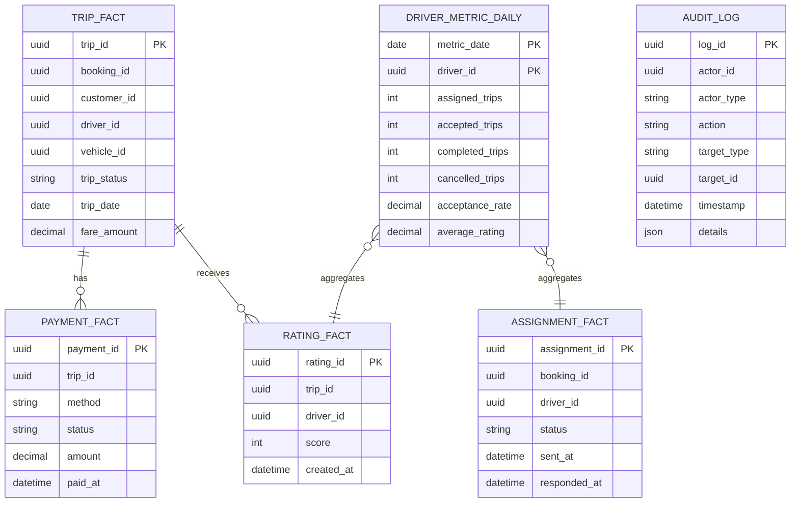

Trong reporting DB, các quan hệ trên có thể được triển khai như logical references/projection keys; không phải FK tới database domain service.


## 17.10 Database Type

**Loại DB chính: PostgreSQL**

### Lý do kỹ thuật

Reporting có `trip_fact`, `payment_fact`, `assignment_fact`, `rating_fact`, `driver_metric_daily` là các dữ liệu **quan hệ/fact** cần aggregation theo ngày, driver, trip, payment và nhiều dimension khác. PostgreSQL phù hợp cho SQL aggregation, GROUP BY, window function, materialized view và index.

`audit_log.details` có thể dùng **JSONB** để giữ payload audit linh hoạt trong khi phần actor/action/target/timestamp vẫn có schema quan hệ rõ ràng.

Redis không phù hợp vì report phải tái truy vấn và giữ dữ liệu lâu dài. MongoDB phù hợp cho log/event linh hoạt, nhưng với reporting nhiều phép tổng hợp liên bảng/fact thì relational analytics thuận lợi hơn.

Khi hệ thống lớn hơn nhiều, có thể tách analytics warehouse/OLAP riêng; thiết kế hiện tại dùng PostgreSQL để giữ kiến trúc đơn giản và nhất quán.
## 17.11 Events consumed

```text
AccountLoggedIn
RoleAssigned
RoleUpdated
PermissionAssigned
AccountLocked
AccountUnlocked
AccountDisabled
CustomerProfileUpdated
DriverProfileUpdated
DriverAvailabilityChanged
DriverLocationUpdated
VehicleAdded
VehicleUpdated
VehicleDeactivated
BookingCreated
BookingAssigned
AssignmentSent
AssignmentAccepted
AssignmentRejected
AssignmentTimedOut
TripCreated
TripCompleted
TripCancelled
PaymentSucceeded
PaymentFailed
RatingSubmitted
```

---

# 18. Mapping FR → Bounded Context

| FR | BC | Microservice |
|---|---|---|
| FR01–FR07 | BC01 | identity-service |
| FR08–FR09 | BC02 / BC03 | customer-profile-service / driver-fleet-service |
| FR10 | BC01 | identity-service |
| FR11 | BC02 / BC03 | profile validation trong từng context |
| FR12–FR16 | BC03 | driver-fleet-service |
| FR17–FR24 | BC04 | booking-service |
| FR25–FR41 | BC05 | dispatch-service |
| FR42–FR51 | BC06 | trip-service |
| FR52–FR56 | BC03 | driver-fleet-service |
| FR57–FR69 | BC07 | billing-payment-service |
| FR70–FR73 | BC09 | notification-service |
| FR75–FR80 | BC08 | feedback-service |
| FR88–FR94 | BC10 | operations-service |
| FR96–FR100 | BC01 | identity-service |
| FR101–FR105 | BC11 | reporting-audit-service |
| FR106–FR112 | BC11 | reporting-audit-service |

**FR74 và FR81–FR87 không được định nghĩa trong SRS hiện tại; không tự tạo requirement mới cho chúng.**

---

# 19. Mapping UC → BC → BPM → Microservice

| UC | Business Function | BC | BPM | Microservice |
|---|---|---|---|---|
| UC01 | Register | BC01 | BPM01 | identity-service |
| UC02 | Login | BC01 | BPM01 | identity-service |
| UC03 | Logout | BC01 | BPM01 | identity-service |
| UC04 | View Profile | BC02/BC03 | BPM02/BPM03 | customer-profile-service / driver-fleet-service |
| UC05 | Update Profile | BC02/BC03 | BPM02/BPM03 | customer-profile-service / driver-fleet-service |
| UC06 | Change Password | BC01 | BPM01 | identity-service |
| UC07 | View Vehicle | BC03 | BPM03 | driver-fleet-service |
| UC08 | Add Vehicle | BC03 | BPM03 | driver-fleet-service |
| UC09 | Update Vehicle | BC03 | BPM03 | driver-fleet-service |
| UC10 | Disable Vehicle | BC03 | BPM03 | driver-fleet-service |
| UC11 | Create Booking | BC04 | BPM04 | booking-service |
| UC12 | View Booking | BC04 | BPM04 | booking-service |
| UC13 | Cancel Booking | BC04 | BPM04 | booking-service |
| UC14 | Match Driver | BC05 | BPM05 | dispatch-service |
| UC15 | Accept Trip Request | BC05 | BPM05 | dispatch-service |
| UC16 | Reject Trip Request | BC05 | BPM05 | dispatch-service |
| UC17 | Create Trip | BC06 | BPM06 | trip-service |
| UC18 | Update Trip Status | BC06 | BPM06 | trip-service |
| UC19 | Update Location | BC03 | BPM03/BPM06 | driver-fleet-service |
| UC20 | Cancel Trip | BC06 | BPM06 | trip-service |
| UC21 | Complete Trip | BC06 | BPM06 | trip-service |
| UC22 | Calculate Fare | BC07 | BPM07 | billing-payment-service |
| UC23 | Payment | BC07 | BPM07 | billing-payment-service |
| UC24 | Lookup Payment | BC07 | BPM07/BPM10 | billing-payment-service |
| UC25 | Rate Driver | BC08 | BPM08 | feedback-service |
| UC26 | View Rating | BC08 | BPM08 | feedback-service |
| UC27 | View Notification | BC09 | BPM09 | notification-service |
| UC28 | Mark Notification Read | BC09 | BPM09 | notification-service |
| UC30 | Manage Customer | BC10 | BPM10 | operations-service |
| UC31 | Manage Driver | BC10 | BPM10 | operations-service |
| UC32 | Manage Vehicle | BC10 | BPM10 | operations-service |
| UC33 | Monitor Trip | BC10 | BPM10 | operations-service |
| UC34 | Manage Account | BC01 | BPM11 | identity-service |
| UC35 | Manage Role | BC01 | BPM11 | identity-service |
| UC36 | Manage Permission | BC01 | BPM11 | identity-service |
| UC37 | View AuditLog | BC11 | BPM11 | reporting-audit-service |
| UC38 | Dashboard | BC11 | BPM12 | reporting-audit-service |
| UC39 | Trip Report | BC11 | BPM12 | reporting-audit-service |
| UC40 | Revenue Report | BC11 | BPM12 | reporting-audit-service |
| UC41 | Driver Report | BC11 | BPM12 | reporting-audit-service |

UC01–UC41 là các mã Use Case của SRS; bảng kiến trúc chỉ mapping các UC thuộc scope hiện tại. citeturn937669view0turn937669view1

---

# 20. Cross-Context API/Event Contract

## 20.1 Booking → Dispatch

```json
{
  "eventType": "BookingCreated",
  "version": 1,
  "bookingId": "B001",
  "customerId": "C001",
  "pickup": { "lat": 10.76, "lng": 106.66 },
  "destination": { "lat": 10.78, "lng": 106.69 },
  "vehicleType": "CAR"
}
```

## 20.2 Dispatch → Trip

```json
{
  "eventType": "AssignmentAccepted",
  "version": 1,
  "assignmentId": "A001",
  "bookingId": "B001",
  "driverId": "D001",
  "vehicleId": "V001"
}
```

## 20.3 Trip → Billing

```json
{
  "eventType": "TripCompleted",
  "version": 1,
  "tripId": "T001",
  "bookingId": "B001",
  "vehicleType": "CAR",
  "pickup": { "lat": 10.76, "lng": 106.66 },
  "destination": { "lat": 10.78, "lng": 106.69 }
}
```

## 20.4 Trip → Feedback

```json
{
  "eventType": "TripCompleted",
  "version": 1,
  "tripId": "T001",
  "customerId": "C001",
  "driverId": "D001"
}
```

## 20.5 Any Domain Context → Notification

Notification nhận event và tự tạo notification; không sửa aggregate nguồn.

## 20.6 Any Domain Context → Reporting/Audit

Reporting/Audit subscribe event và build projection; không tham gia transaction của source service.

---

# 21. Transaction Boundary trong Microservice Architecture

Trong một monolith, SRS mô tả accept driver bằng transaction:

```text
Lock Booking
Lock Driver
Check Booking = SEARCHING
Check Driver = AVAILABLE
Assignment = ACCEPTED
Booking = ASSIGNED
Create Trip
Driver = BUSY
COMMIT
```

Trong microservice, không nên cố tạo một distributed database transaction xuyên BC01/BC04/BC05/BC06/BC03.

Thay vào đó:

```text
BC05 transaction
    ↓ AssignmentAccepted event
BC04 transaction
    ↓ BookingAssigned event
BC06 transaction
    ↓ TripCreated event
BC03 transaction
    ↓ DriverBecameBusy event
```

Để chống race condition:

- BC05 khóa trạng thái Assignment/dispatch process của chính nó.
- BC03 có atomic reservation/availability transition ở database của BC03.
- BC06 enforce `booking_id` unique cho active Trip.
- retry/idempotency key được dùng cho command/event có thể gửi lại.

SRS yêu cầu chỉ một Driver thành công khi hai Driver Accept đồng thời. citeturn937669view2

---

# 22. Database Ownership Rules

## Rule 01 — One service, one owned database

```text
identity-service         → cab_identity_db
customer-profile-service → cab_customer_profile_db
driver-fleet-service     → cab_driver_fleet_db
booking-service          → cab_booking_db
dispatch-service         → cab_dispatch_db
trip-service             → cab_trip_db
billing-payment-service  → cab_billing_payment_db
feedback-service         → cab_feedback_db
notification-service    → cab_notification_db
operations-service       → cab_operations_db
reporting-audit-service  → cab_reporting_audit_db
```

## Rule 02 — Không cross-database FK

Sai:

```text
booking_db.customer_id FK → customer_profile_db.customer_id
```

Đúng:

```text
booking_db.customer_id = external reference
```

## Rule 03 — Snapshot dữ liệu cần cho nghiệp vụ

Ví dụ Trip cần `driverId`, `vehicleId`, `vehicleType`, pickup/destination tại thời điểm Trip được tạo thì lưu snapshot cần thiết trong Trip context.

## Rule 04 — Read model được phép denormalize

Operations và Reporting được phép denormalize vì mục tiêu của hai context này là query/analytics.

---

# 23. Service Dependency Summary

| Service | Đồng bộ gọi trực tiếp | Event consume |
|---|---|---|
| identity-service | — | — |
| customer-profile-service | identity (authorization) | — |
| driver-fleet-service | identity | account status/authorization nếu cần |
| booking-service | identity, customer-profile | — |
| dispatch-service | booking, driver-fleet | BookingCreated |
| trip-service | dispatch | AssignmentAccepted |
| billing-payment-service | trip | TripCompleted |
| feedback-service | trip | TripCompleted |
| notification-service | identity | Booking/Assignment/Trip/Payment events |
| operations-service | identity | hầu hết domain events |
| reporting-audit-service | identity | domain + audit events |

---

# 24. Ubiquitous Language theo từng BC — Bảng tổng hợp

| BC | Từ trung tâm | Ngôn ngữ đặc trưng |
|---|---|---|
| BC01 | Account | Account, Principal, Credential, Session, Role, Permission, Authorization |
| BC02 | Customer Profile | Customer, Profile, Contact Information, Profile Update |
| BC03 | Driver Resource | Driver, Available, Busy, Vehicle, Vehicle Type, Location |
| BC04 | Booking | Booking, Pickup, Destination, Searching, Assigned, Cancelled |
| BC05 | Assignment | Candidate, Matching, Ranking, Assignment, Accept, Reject, Timeout, Retry |
| BC06 | Trip | Trip, Arrived, Picked Up, In Progress, Completed, Cancelled, Transition |
| BC07 | Money | Fare, Calculation, Payment, Method, Pending, Success, Failed, Provider Transaction |
| BC08 | Feedback | Rating, Score, Comment, Eligibility, Rated Trip |
| BC09 | Communication | Notification, Recipient, Delivery, Channel, Read/Unread |
| BC10 | Operations | Operational View, Monitoring, Search, Filter, Detail, Operational Status |
| BC11 | Analytics/Audit | Audit Record, Actor, Target, Report, Time Range, Fact, Metric, Drill-through |

---

# 25. Những từ không được dùng chung xuyên BC

| Tên | BC | Nghĩa | BC khác có thể dùng từ khác |
|---|---|---|---|
| Account | BC01 | Identity để truy cập | Customer Profile dùng CustomerId |
| Customer | BC02 | Người dùng dịch vụ ở góc nhìn profile | Operations dùng CustomerOperationalView |
| Driver | BC03 | Resource vận hành | Dispatch dùng Candidate Driver |
| Booking | BC04 | Yêu cầu dịch vụ | Reporting dùng Booking Fact/reference |
| Assignment | BC05 | Lời đề nghị nhận Booking | Trip context không gọi Assignment là Trip |
| Trip | BC06 | Chuyến thực tế | Reporting dùng Trip Fact |
| Payment | BC07 | Giao dịch tiền | Operations dùng PaymentOperationalView |
| Rating | BC08 | Đánh giá | Reporting dùng Rating Fact |
| Notification | BC09 | Thông tin delivery | Domain context khác chỉ phát event |

---

# 26. Mapping Microservice → Aggregate → Database → API

| Microservice | Aggregate chính | DB | API chính |
|---|---|---|---|
| `identity-service` | Account, Role | `cab_identity_db` | `/auth`, `/accounts`, `/roles`, `/permissions` |
| `customer-profile-service` | CustomerProfile | `cab_customer_profile_db` | `/me/profile`, `/customers/:id/profile` |
| `driver-fleet-service` | Driver, Vehicle | `cab_driver_fleet_db` | `/drivers`, `/vehicles`, `/location` |
| `booking-service` | Booking | `cab_booking_db` | `/bookings` |
| `dispatch-service` | DispatchProcess, BookingAssignment | `cab_dispatch_db` | `/match`, `/assignments` |
| `trip-service` | Trip | `cab_trip_db` | `/trips` |
| `billing-payment-service` | Fare, Payment | `cab_billing_payment_db` | `/fares`, `/payments` |
| `feedback-service` | Rating | `cab_feedback_db` | `/ratings` |
| `notification-service` | Notification | `cab_notification_db` | `/notifications` |
| `operations-service` | Operational Read Models | `cab_operations_db` | `/operations/*` |
| `reporting-audit-service` | AuditLog + Projections | `cab_reporting_audit_db` | `/audit-logs`, `/reports/*` |

---

# 27. Cấu trúc thư mục toàn hệ thống đề xuất

```text
cab-system/
├── services/
│   ├── identity-service/
│   ├── customer-profile-service/
│   ├── driver-fleet-service/
│   ├── booking-service/
│   ├── dispatch-service/
│   ├── trip-service/
│   ├── billing-payment-service/
│   ├── feedback-service/
│   ├── notification-service/
│   ├── operations-service/
│   └── reporting-audit-service/
│
├── contracts/
│   ├── events/
│   ├── commands/
│   └── schemas/
│
├── api-gateway/
└── infrastructure/
    ├── postgres/
    ├── broker/
    └── redis/
```

Một service mẫu:

```text
booking-service/
├── src/
│   ├── domain/
│   │   ├── booking.aggregate.ts
│   │   ├── booking-status.vo.ts
│   │   ├── location.vo.ts
│   │   ├── booking.repository.ts
│   │   └── events/
│   ├── application/
│   │   ├── commands/
│   │   │   ├── create-booking.handler.ts
│   │   │   └── cancel-booking.handler.ts
│   │   └── queries/
│   ├── infrastructure/
│   │   ├── postgres-booking.repository.ts
│   │   └── message-publisher.ts
│   └── interfaces/
│       └── http/
│           └── booking.controller.ts
└── migrations/
```

---

# 28. Kết luận kiến trúc

Kiến trúc cuối cùng được chốt theo nguyên tắc:

```text
                 CAB SYSTEM
                      │
       ┌──────────────┴──────────────┐
       │                             │
 Transactional BCs              Read/Control BCs
       │                             │
 BC01 Identity                  BC10 Operations
 BC02 Customer Profile          BC11 Reporting/Audit
 BC03 Driver & Fleet
 BC04 Booking
 BC05 Dispatch
 BC06 Trip
 BC07 Billing & Payment
 BC08 Feedback
 BC09 Notification
```

Mỗi BC có:

```text
Business Responsibility
        +
FR Traceability
        +
BPM/Worflow participation
        +
Ubiquitous Language riêng
        +
DDD Domain Model riêng
        +
Microservice riêng
        +
API riêng
        +
Database riêng
        +
ERD riêng
```

Đặc biệt:

```text
Booking ≠ Assignment ≠ Trip
Account ≠ Customer Profile ≠ Driver Profile
Driver Availability ≠ Trip Status
Fare ≠ Payment
Operations View ≠ Domain Entity
Report ≠ Transactional Record
```

Đây là ranh giới cốt lõi cần giữ khi triển khai microservices để tránh biến hệ thống thành một **distributed monolith** chỉ chia controller/service nhưng vẫn dùng chung entity và database.

---

# 29. Nguồn tham chiếu

- Repository: `https://github.com/vthaix/23674231_TranVanThai_Cabsystem`
- SRS: `srs.md` — Functional Requirements, Business Process, Domain Model, Use Cases, API-oriented requirements.
- Các FR/UC ngoài scope hiện tại không được tạo thành Bounded Context hoặc Microservice mới. citeturn731067view1turn937669view0
