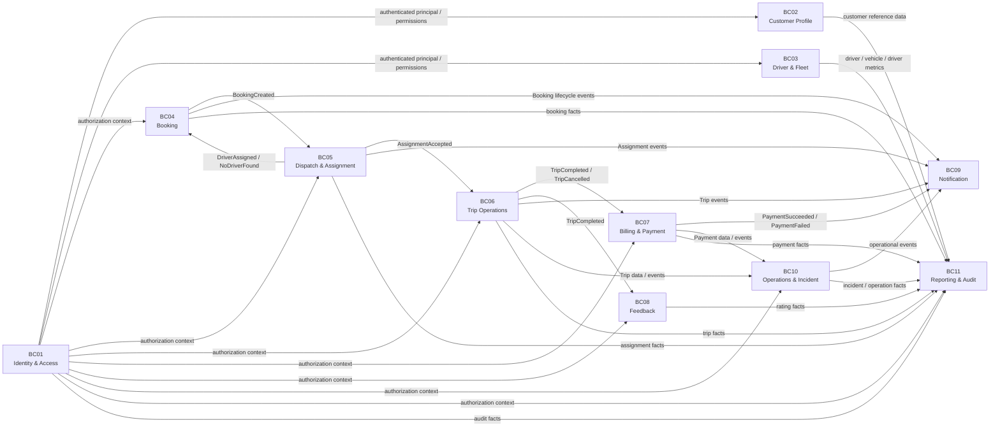

# CAB System — Bounded Context & Ubiquitous Language theo DDD

> Phiên bản thiết kế: 2026-09-23  
> Nguồn nghiệp vụ: `srs.md` của repository `vthaix/23674231_TranVanThai_Cabsystem`.

## 1. Mục tiêu

Tài liệu này phân rã CAB System thành các **Bounded Context** theo Domain-Driven Design (DDD).
Mỗi Bounded Context có:

- một **Business Responsibility** riêng;
- một **Ubiquitous Language** riêng;
- một mô hình domain riêng, không chia sẻ entity nghiệp vụ trực tiếp;
- các **Aggregate / Entity / Value Object / Domain Service** thuộc phạm vi của context;
- các hành vi nghiệp vụ (Command) và sự kiện (Domain Event) riêng;
- ranh giới rõ ràng với context khác;
- cách dịch thuật ngữ khi giao tiếp với context khác.

Mục tiêu quan trọng nhất là tránh việc những từ như `Driver`, `Booking`, `Trip`, `Account`, `Payment` mang một nghĩa duy nhất trên toàn hệ thống. Trong DDD, một thuật ngữ chỉ có ý nghĩa chính xác trong **Bounded Context** của nó.

---

## 2. Cơ sở phân rã từ SRS hiện tại

SRS hiện tại mô tả 41 Use Case, gồm Authentication, Profile, Vehicle, Booking, Driver Assignment, Trip, Payment, Rating, Notification, Incident, Operations, Administration và Reporting. citeturn510247view0

Các business requirement tương ứng đã được chia thành BR01–BR17, từ Account/Authentication, Profile, Vehicle, Booking, Driver Matching, Assignment, Trip, Fare, Payment, Notification, Rating, Incident, Operations, Authorization, Audit đến Reporting. citeturn745933view0

Mô hình quan hệ hiện tại đặt `Customer`, `Driver`, `Vehicle`, `Booking`, `BookingAssignment`, `Trip`, `Payment`, `Rating`, `Notification`, `Incident`, `Role`, `Permission`, `UserRole`, `AuditLog` trong cùng mô hình dữ liệu. Thiết kế Bounded Context bên dưới **không đồng nghĩa phải giữ nguyên cách chia bảng đó**; mỗi context được phép có domain model và persistence model riêng. citeturn745933view1

---

# 3. Danh sách Bounded Context

| BC | Tên | Trách nhiệm chính | UC |
|---|---|---|---|
| BC01 | Identity & Access | Đăng ký, đăng nhập, phiên, mật khẩu, quyền truy cập | UC01–UC03, UC34–UC36 |
| BC02 | Customer Profile | Hồ sơ Customer và thông tin người dùng phía khách | UC04–UC06 |
| BC03 | Driver & Fleet | Hồ sơ Driver vận hành, Vehicle, availability, location | UC04–UC10, UC19, một phần UC31–UC32 |
| BC04 | Booking | Vòng đời yêu cầu đặt xe của Customer | UC11–UC13 |
| BC05 | Dispatch & Assignment | Tìm Driver, matching, gửi và xử lý assignment | UC14–UC16 |
| BC06 | Trip Operations | Vòng đời Trip và trạng thái thực hiện chuyến | UC17–UC21, một phần UC33 |
| BC07 | Billing & Payment | Tính fare và ghi nhận/thực hiện payment | UC22–UC24 |
| BC08 | Feedback | Đánh giá Driver | UC25–UC26 |
| BC09 | Notification | Tạo, gửi, lưu, đọc Notification | UC27–UC28 |
| BC10 | Operations & Incident | Giám sát vận hành và xử lý sự cố | UC29–UC33 |
| BC11 | Reporting & Audit | Read model báo cáo và audit trail | UC37–UC41 |

> **Lưu ý:** UC04–UC06 trong SRS là chức năng Profile dùng chung cho User; khi triển khai DDD, profile có thể được tách thành Customer Profile và Driver Profile. BC01 chỉ quản lý **identity/access**, không trở thành chủ sở hữu toàn bộ thông tin nghiệp vụ của Customer/Driver.

---

# 4. Context Map tổng thể



## 4.1 Nguyên tắc Context Map

### Không dùng Shared Entity

Không truyền nguyên object `Booking`, `Trip`, `Driver`, `Payment` giữa các context.

Chỉ giao tiếp bằng:

- domain event;
- command DTO;
- query DTO/read model;
- identifier (`bookingId`, `tripId`, `driverId`, ...);
- primitive/value object đã thống nhất nếu thật sự là shared kernel.

### Shared Kernel tối thiểu

Chỉ nên có một shared kernel kỹ thuật rất nhỏ:

```text
SharedKernel
├── Id primitives
├── DateTime / Clock abstraction
├── CorrelationId
├── DomainEvent base contract
└── Result / Error primitives
```

Không đưa `BookingEntity`, `TripEntity`, `DriverEntity`, `PaymentEntity` vào shared kernel.

### Anti-Corruption Layer

Khi context A hiểu khác context B, context A phải có adapter/ACL để dịch ngôn ngữ.

Ví dụ:

```text
Dispatch Context:
    AVAILABLE Driver

Operations Context:
    Driver đang sẵn sàng nhận chuyến

Reporting Context:
    available_driver_count
```

Ba biểu diễn trên có cùng nguồn sự thật vận hành nhưng **không phải cùng một domain object**.

---

# 5. BC01 — Identity & Access Context

## 5.1 Trách nhiệm

BC này quản lý việc một người **là ai** và **được phép làm gì**.

Nó không quản lý:

- yêu cầu đặt xe;
- vòng đời Trip;
- phương tiện;
- fare;
- rating.

## 5.2 Ubiquitous Language riêng

| Thuật ngữ | Nghĩa trong BC01 |
|---|---|
| Account | Hồ sơ nhận diện để truy cập hệ thống |
| Credential | Thông tin dùng để xác thực |
| Password | Bí mật dùng để xác minh chủ tài khoản |
| Session | Phiên đăng nhập đang có hiệu lực |
| Access Token | Chứng từ xác thực gửi kèm request |
| Role | Nhóm quyền nghiệp vụ |
| Permission | Quyền thực hiện một action cụ thể |
| Principal | Chủ thể đã được xác thực |
| Locked | Account tạm thời không được đăng nhập |
| Disabled | Account bị vô hiệu hóa |
| Authentication | Kiểm tra danh tính |
| Authorization | Kiểm tra quyền truy cập |
| Audit Action | Thao tác cần ghi nhận để kiểm soát |

**Không gọi:** `Trip User`, `Booking User`, `Payment User` trong domain model BC01.

## 5.3 Aggregates

```text
Account
 ├── AccountId
 ├── LoginIdentifier
 ├── PasswordHash
 ├── AccountStatus
 └── assigned Roles

Role
 ├── RoleId
 └── PermissionIds
```

`Session` có thể là aggregate riêng hoặc persistence model do application layer quản lý.

## 5.4 Value Objects

```text
AccountId
Email
PhoneNumber
PasswordHash
RoleId
PermissionId
SessionId
AccessToken
```

## 5.5 Behavior / Commands

```text
RegisterAccount
AuthenticateAccount
EndSession
ChangePassword
LockAccount
UnlockAccount
EnableAccount
DisableAccount
CreateRole
UpdateRole
AssignRole
CreatePermission
UpdatePermission
AssignPermissionToRole
AuthorizeAction
RecordSensitiveAction
```

## 5.6 Domain Events

```text
AccountRegistered
AccountAuthenticated
SessionStarted
SessionEnded
PasswordChanged
AccountLocked
AccountUnlocked
AccountDisabled
RoleAssigned
PermissionAssigned
SensitiveActionAudited
```

## 5.7 Invariants

- email/phone dùng cho đăng nhập không được trùng theo chính sách;
- account bị khóa/disabled không được authenticate;
- password mới phải thỏa validation;
- authorization được kiểm tra ở backend;
- frontend không được tự quyết định permission;
- thao tác nhạy cảm của Administrator phải sinh audit event.

## 5.8 UC thuộc context

```text
UC01 Đăng ký
UC02 Đăng nhập
UC03 Đăng xuất
UC34 Quản lý Account
UC35 Quản lý Role
UC36 Quản lý Permission
```

`UC37 Xem AuditLog` được query từ BC11.

---

# 6. BC02 — Customer Profile Context

## 6.1 Trách nhiệm

Quản lý **thông tin nghiệp vụ của Customer** được phép chỉnh sửa và xem bởi Customer.

Identity của Customer đến từ BC01; BC02 không tự authenticate password.

## 6.2 Ubiquitous Language riêng

| Thuật ngữ | Nghĩa |
|---|---|
| Customer Profile | Hồ sơ nghiệp vụ của khách hàng |
| Customer | Người sử dụng dịch vụ để đặt xe |
| Contact Information | Thông tin liên hệ của Customer |
| Profile Status | Trạng thái hồ sơ nghiệp vụ |
| Profile Update | Thay đổi thông tin hồ sơ |

Trong BC02, `Customer` là **customer profile aggregate**, không phải `Account`.

## 6.3 Aggregates

```text
CustomerProfile
 ├── CustomerId
 ├── FullName
 ├── Phone
 ├── Email
 └── profile status / timestamps
```

## 6.4 Behavior / Commands

```text
ViewCustomerProfile
UpdateCustomerProfile
ValidateCustomerProfile
```

## 6.5 Domain Events

```text
CustomerProfileCreated
CustomerProfileUpdated
```

## 6.6 UC thuộc context

```text
UC04 Xem hồ sơ
UC05 Cập nhật hồ sơ
UC06 Đổi mật khẩu -> command thuộc BC01; BC02 chỉ phản ánh trạng thái hồ sơ nếu cần
```

---

# 7. BC03 — Driver & Fleet Context

## 7.1 Trách nhiệm

Đây là context của **năng lực vận hành Driver và Vehicle**.

Driver trong context này không đơn giản là một account. Driver được hiểu như một **resource có khả năng nhận và thực hiện chuyến**.

## 7.2 Ubiquitous Language riêng

| Thuật ngữ | Nghĩa trong BC03 |
|---|---|
| Driver | Tài nguyên vận hành có thể nhận Trip |
| Driver Availability | Khả năng sẵn sàng nhận yêu cầu |
| Available | Driver đủ điều kiện nhận request |
| Busy | Driver đang có Trip active |
| Offline | Driver không tham gia điều phối |
| Vehicle | Phương tiện Driver quản lý |
| Vehicle Type | Loại phương tiện phục vụ matching |
| License Plate | Định danh phương tiện |
| Active Vehicle | Vehicle đủ điều kiện đưa vào vận hành |
| Current Location | Vị trí mới nhất của Driver |

### State machine của Driver

```text
OFFLINE -> AVAILABLE -> BUSY -> AVAILABLE
```

SRS quy định Driver chỉ được `AVAILABLE` khi đã đăng nhập, account active, không có Trip đang thực hiện và Vehicle hợp lệ. citeturn956416view0

### State machine của Vehicle

```text
ACTIVE -> INACTIVE
```

Vehicle từng được sử dụng trong Trip không nên xóa vật lý theo nghiệp vụ hiện tại. citeturn956416view1

## 7.3 Aggregates

```text
Driver
 ├── DriverId
 ├── DriverProfile
 ├── AvailabilityStatus
 └── CurrentLocation

Vehicle
 ├── VehicleId
 ├── DriverId
 ├── VehicleType
 ├── LicensePlate
 ├── Model
 └── VehicleStatus
```

Có thể để `Driver` là aggregate root của quan hệ sở hữu Vehicle nếu nghiệp vụ yêu cầu transaction cùng boundary; nếu Vehicle cần lifecycle độc lập thì tách thành aggregate root `Vehicle` và dùng `DriverId` làm reference.

## 7.4 Value Objects

```text
DriverId
VehicleId
VehicleType
LicensePlate
GeoCoordinate
AvailabilityStatus
VehicleStatus
```

## 7.5 Behavior / Commands

```text
RegisterDriverProfile
UpdateDriverProfile
SetDriverAvailable
SetDriverOffline
MarkDriverBusy
ReleaseDriver
AddVehicle
UpdateVehicle
DeactivateVehicle
UpdateDriverLocation
CheckVehicleCompatibility
```

## 7.6 Domain Events

```text
DriverCreated
DriverAvailabilityChanged
DriverBecameAvailable
DriverBecameBusy
DriverReleased
VehicleAdded
VehicleUpdated
VehicleDeactivated
DriverLocationUpdated
```

## 7.7 UC thuộc context

```text
UC04 Xem hồ sơ (Driver side)
UC05 Cập nhật hồ sơ (Driver side)
UC07 Xem Vehicle
UC08 Thêm Vehicle
UC09 Cập nhật Vehicle
UC10 Vô hiệu hóa Vehicle
UC19 Cập nhật vị trí
```

Operations Staff không sửa domain model trực tiếp; các màn hình UC31/UC32 gọi application service/query của context này.

---

# 8. BC04 — Booking Context

## 8.1 Trách nhiệm

Booking Context quản lý **ý định đặt xe của Customer** từ lúc tạo cho đến khi được hủy hoặc chuyển sang trạng thái đã được điều phối.

Booking không phải Trip.

- `Booking` = yêu cầu dịch vụ.
- `Trip` = chuyến đang/đã được thực hiện.

## 8.2 Ubiquitous Language riêng

| Thuật ngữ | Nghĩa |
|---|---|
| Booking | Yêu cầu đặt một chuyến xe |
| Pickup | Điểm đón yêu cầu |
| Destination | Điểm đến yêu cầu |
| Requested Vehicle Type | Loại xe Customer yêu cầu |
| Searching | Booking đang chờ hệ thống tìm Driver |
| Assigned | Booking đã có Driver chấp nhận |
| No Driver Found | Hệ thống không còn ứng viên phù hợp |
| Cancelled | Yêu cầu đặt xe đã bị hủy |
| Cancellation Policy | Chính sách kiểm tra quyền hủy |

## 8.3 Aggregate

```text
Booking
 ├── BookingId
 ├── CustomerId
 ├── PickupLocation
 ├── Destination
 ├── RequestedVehicleType
 ├── BookingStatus
 └── CancellationInfo
```

## 8.4 Value Objects

```text
BookingId
CustomerId
Location
VehicleType
CancellationReason
BookingStatus
```

## 8.5 Behavior / Commands

```text
CreateBooking
ViewBooking
CancelBooking
MarkBookingSearching
MarkBookingAssigned
MarkNoDriverFound
```

## 8.6 Domain Events

```text
BookingCreated
BookingEnteredSearching
BookingAssigned
BookingCancelled
NoDriverFound
```

## 8.7 Invariants

- Customer phải authenticated và account active để tạo Booking;
- Booking phải có pickup, destination, vehicle type;
- chỉ được hủy khi status/policy cho phép;
- một Booking chỉ được tạo tối đa một Trip active;
- một Booking chỉ có một Driver ACCEPT thành công.

Các quy tắc trên tương ứng với các business rules hiện có trong SRS. citeturn956416view3

## 8.8 UC thuộc context

```text
UC11 Tạo Booking
UC12 Xem Booking
UC13 Hủy Booking
```

---

# 9. BC05 — Dispatch & Assignment Context

## 9.1 Trách nhiệm

Context này quyết định **Driver nào được đề nghị nhận Booking**, theo thứ tự/điều kiện matching.

Đây là context chứa domain logic điều phối, không phải nơi sở hữu toàn bộ Driver Profile.

## 9.2 Ubiquitous Language riêng

| Thuật ngữ | Nghĩa |
|---|---|
| Candidate Driver | Driver đủ điều kiện để được xem xét |
| Matching | Quá trình tìm ứng viên phù hợp |
| Distance | Khoảng cách từ Driver tới pickup |
| Ranking | Thứ tự ưu tiên ứng viên |
| Assignment | Một lần gửi Booking cho một Driver |
| SENT | Đã gửi yêu cầu |
| ACCEPTED | Driver chấp nhận Assignment |
| REJECTED | Driver từ chối |
| TIMEOUT | Driver không phản hồi đúng hạn |
| Retry | Chọn ứng viên tiếp theo |

`BookingAssignment` là lịch sử của **lời đề nghị chuyến**, không phải Trip. SRS xác định một Booking có thể có nhiều Assignment và dùng Assignment để lưu lịch sử reject/timeout/accept. citeturn956416view0

## 9.3 Aggregates

```text
DispatchProcess
 └── BookingId
     ├── MatchingStatus
     ├── Candidate Drivers
     └── Retry State

BookingAssignment
 ├── AssignmentId
 ├── BookingId
 ├── DriverId
 ├── AssignmentStatus
 ├── SentAt
 ├── RespondedAt
 └── RejectReason
```

`DriverId` và `BookingId` chỉ là external references, không kéo aggregate của context khác vào domain model.

## 9.4 Domain Services

```text
DriverMatcher
DistanceCalculator
CandidateRanker
AssignmentPolicy
RetryPolicy
```

## 9.5 Behavior / Commands

```text
StartMatching
SelectCandidateDrivers
SendAssignment
AcceptAssignment
RejectAssignment
TimeoutAssignment
RetryAssignment
StopMatching
```

## 9.6 Domain Events

```text
MatchingStarted
AssignmentSent
AssignmentAccepted
AssignmentRejected
AssignmentTimedOut
MatchingRetried
NoDriverAvailable
```

## 9.7 Invariants

- chỉ Driver `AVAILABLE` mới được matching;
- Driver phải có Vehicle phù hợp;
- Driver gần pickup được ưu tiên theo chính sách;
- Driver `BUSY` không nhận Booking mới;
- Driver reject/timeout trong Booking hiện tại không được gửi lại;
- một Booking có nhiều Assignment nhưng chỉ một Assignment thành công cuối cùng.

SRS mô tả đúng chuỗi tìm Driver → lọc Vehicle → location → distance → ranking → tạo Assignment → accept/reject/timeout → retry. citeturn956416view1

## 9.8 UC thuộc context

```text
UC14 Tìm và phân công Driver
UC15 Nhận chuyến
UC16 Từ chối chuyến
```

---

# 10. BC06 — Trip Operations Context

## 10.1 Trách nhiệm

Trip Context quản lý **vòng đời thực thi chuyến** sau khi Assignment đã được chấp nhận.

## 10.2 Ubiquitous Language riêng

| Thuật ngữ | Nghĩa |
|---|---|
| Trip | Chuyến xe đã được tạo để thực hiện dịch vụ |
| Assigned | Trip đã được tạo sau khi phân công thành công |
| Arrived | Driver đã đến pickup |
| Picked Up | Customer đã được đón |
| In Progress | Trip đang di chuyển tới destination |
| Completed | Trip đã hoàn tất |
| Cancelled | Trip bị hủy |
| Trip State Transition | Chuyển trạng thái hợp lệ |
| Fare Snapshot | Giá trị cước được giữ trên Trip |

## 10.3 Aggregate

```text
Trip
 ├── TripId
 ├── BookingId
 ├── CustomerId
 ├── DriverId
 ├── VehicleId
 ├── PickupLocation
 ├── Destination
 ├── TripStatus
 ├── Fare
 └── State Timestamps
```

## 10.4 State Machine

```text
ASSIGNED
   ↓
ARRIVED
   ↓
PICKED_UP
   ↓
IN_PROGRESS
   ↓
COMPLETED
```

Có thể chuyển sang `CANCELLED` nếu policy cho phép. SRS cấm các transition hồi ngược như `COMPLETED → IN_PROGRESS`, `COMPLETED → ASSIGNED`, `CANCELLED → IN_PROGRESS`. citeturn956416view0

## 10.5 Value Objects

```text
TripId
BookingId
DriverId
VehicleId
Location
FareAmount
CancellationReason
TripStatus
```

## 10.6 Behavior / Commands

```text
CreateTrip
AcceptTrip
RejectTrip
MarkArrived
MarkPickedUp
StartTrip
CompleteTrip
CancelTrip
ValidateTransition
```

## 10.7 Domain Events

```text
TripCreated
DriverArrived
PassengerPickedUp
TripStarted
TripCompleted
TripCancelled
```

## 10.8 Integration rules

Khi `AssignmentAccepted`:

```text
Dispatch -> Trip
        AssignmentAccepted
              ↓
          CreateTrip
```

Khi `TripCompleted`:

```text
Trip -> Billing
Trip -> Feedback
Trip -> Notification
Trip -> Reporting
```

SRS quy định Trip được tạo khi Assignment ACCEPTED, và sau COMPLETED sẽ kích hoạt Fare Calculation. citeturn956416view2

## 10.9 UC thuộc context

```text
UC17 Tạo Trip
UC18 Cập nhật trạng thái Trip
UC20 Hủy Trip
UC21 Hoàn thành Trip
```

`UC19 Cập nhật vị trí` sở hữu domain ở BC03 vì location là trạng thái của Driver; Trip chỉ **đọc location** khi cần.

---

# 11. BC07 — Billing & Payment Context

## 11.1 Trách nhiệm

Context này trả lời hai câu hỏi riêng:

1. **Customer phải trả bao nhiêu?** → Fare Calculation.
2. **Khoản tiền đó đã được thanh toán thế nào và ở trạng thái gì?** → Payment.

## 11.2 Ubiquitous Language riêng

| Thuật ngữ | Nghĩa |
|---|---|
| Fare | Số tiền dịch vụ phải trả |
| Fare Calculation | Logic tính giá từ Trip data |
| Payment | Giao dịch thanh toán cho Trip |
| Payment Method | CASH hoặc ONLINE |
| Pending | Payment đang chờ kết quả |
| Success | Payment hoàn tất thành công |
| Failed | Payment thất bại |
| Provider Transaction | Mã giao dịch do cổng thanh toán trả về |
| Settlement | Trạng thái tiền đã được ghi nhận theo nghiệp vụ |

## 11.3 Aggregates

```text
FareCalculation
 └── TripId
     ├── VehicleType
     ├── Route input
     └── CalculatedFare

Payment
 ├── PaymentId
 ├── TripId
 ├── PaymentMethod
 ├── Amount
 ├── PaymentStatus
 ├── ProviderTransactionId
 └── PaidAt
```

## 11.4 Domain Services

```text
FareCalculator
PaymentPolicy
PaymentStateResolver
```

## 11.5 Behavior / Commands

```text
CalculateFare
CreateCashPayment
CreateOnlinePayment
HandleProviderCallback
MarkPaymentSuccess
MarkPaymentFailed
LookupPayment
```

## 11.6 Domain Events

```text
FareCalculated
PaymentInitiated
PaymentSucceeded
PaymentFailed
```

## 11.7 Invariants

- chỉ Trip `COMPLETED` mới được tính cước;
- một Trip tối đa một Payment `SUCCESS`;
- không lưu card number/CVV;
- doanh thu chỉ tính Payment `SUCCESS`.

Các rule này được quy định trong SRS. citeturn956416view2 citeturn956416view3

## 11.8 UC thuộc context

```text
UC22 Tính cước
UC23 Thanh toán
UC24 Tra cứu Payment
```

---

# 12. BC08 — Feedback Context

## 12.1 Trách nhiệm

Quản lý phản hồi của Customer đối với Driver sau khi Trip đã hoàn thành.

## 12.2 Ubiquitous Language riêng

| Thuật ngữ | Nghĩa |
|---|---|
| Rating | Một đánh giá gắn với Trip |
| Score | Điểm đánh giá |
| Comment | Nhận xét văn bản |
| Rating Eligibility | Điều kiện được phép đánh giá |
| Rated Trip | Trip đã có Rating |

## 12.3 Aggregate

```text
Rating
 ├── RatingId
 ├── TripId
 ├── CustomerId
 ├── DriverId
 ├── Score
 └── Comment
```

## 12.4 Behavior / Commands

```text
CreateRating
ValidateRating
ViewDriverRatings
```

## 12.5 Domain Events

```text
RatingSubmitted
```

## 12.6 Invariants

- Trip phải `COMPLETED`;
- mỗi Trip tối đa một Rating;
- score phải nằm trong miền giá trị hợp lệ.

SRS quy định rõ `Trip.status = COMPLETED` và không cho tạo Rating trùng. citeturn745933view3

## 12.7 UC thuộc context

```text
UC25 Đánh giá Driver
UC26 Xem Rating
```

---

# 13. BC09 — Notification Context

## 13.1 Trách nhiệm

Notification Context chịu trách nhiệm **deliver information**, không quyết định business state.

Ví dụ:

- Booking được tạo → Notification biết phải gửi thông báo.
- Notification không có quyền tự biến Booking thành `ASSIGNED`.

## 13.2 Ubiquitous Language riêng

| Thuật ngữ | Nghĩa |
|---|---|
| Notification | Tin nhắn hệ thống gửi tới recipient |
| Recipient | Người nhận |
| Notification Type | Loại thông báo |
| Delivery | Quá trình gửi |
| Read | Người nhận đã xem |
| Unread | Chưa xem |
| Channel | Kênh gửi nếu hệ thống mở rộng |

## 13.3 Aggregate

```text
Notification
 ├── NotificationId
 ├── Recipient
 ├── Type
 ├── Title
 ├── Message
 ├── ReadStatus
 └── createdAt / readAt
```

## 13.4 Behavior / Commands

```text
CreateNotification
SendNotification
MarkAsRead
ViewNotifications
```

## 13.5 Domain Events

```text
NotificationCreated
NotificationSent
NotificationRead
NotificationDeliveryFailed
```

## 13.6 UC thuộc context

```text
UC27 Xem Notification
UC28 Đánh dấu Notification đã đọc
```

Nguồn sự kiện của Notification đến từ Booking, Dispatch, Trip và Payment; SRS liệt kê Booking Created, Driver Assigned, Driver Arrived, Trip Completed, Payment Success/Failed và Booking Cancelled là các trigger chính. citeturn956416view0

---

# 14. BC10 — Operations & Incident Context

## 14.1 Trách nhiệm

Operations Context trả lời câu hỏi:

> "Hệ thống đang vận hành như thế nào và nhân viên vận hành phải can thiệp ở đâu?"

Nó cung cấp read/query nghiệp vụ cho Operations Staff và sở hữu workflow Incident.

## 14.2 Ubiquitous Language riêng

| Thuật ngữ | Nghĩa |
|---|---|
| Operations View | Góc nhìn phục vụ giám sát vận hành |
| Operational Case | Một vấn đề cần nhân viên xử lý |
| Incident | Sự cố cần được theo dõi/xử lý |
| Reported By | Người tạo báo cáo sự cố |
| Handler | Nhân viên đang xử lý |
| Investigating | Đang xác minh |
| Resolving | Đang khắc phục |
| Resolved | Đã xử lý xong |
| Operational Status | Trạng thái dùng để giám sát |

## 14.3 Aggregate

```text
Incident
 ├── IncidentId
 ├── TripId? 
 ├── ReportedBy
 ├── IncidentType
 ├── Description
 ├── IncidentStatus
 ├── Resolution
 └── Handler
```

SRS cho phép Incident liên kết Trip nhưng không bắt buộc phải có Trip. citeturn956416view0

## 14.4 Behavior / Commands

```text
CreateIncident
AssignIncident
StartInvestigation
StartResolution
ResolveIncident
ViewCustomerOperationalData
ViewDriverOperationalData
ViewVehicleOperationalData
TrackTrip
LookupPayment
```

## 14.5 Domain Events

```text
IncidentCreated
IncidentAssigned
IncidentInvestigationStarted
IncidentResolutionStarted
IncidentResolved
```

## 14.6 UC thuộc context

```text
UC29 Xử lý Incident
UC30 Quản lý Customer
UC31 Quản lý Driver
UC32 Quản lý Vehicle
UC33 Theo dõi Trip
```

Các UC30–UC33 trong SRS chủ yếu là thao tác View/Search/Filter/Detail/Status cho Operations Staff, nên trong DDD chúng nên là **query/application layer** của Operations Context thay vì cho Operations Staff truy cập trực tiếp repository của domain context khác. citeturn745933view3

---

# 15. BC11 — Reporting & Audit Context

## 15.1 Trách nhiệm

Context này là **read/analytics context**.

Nó không sở hữu vòng đời Booking, Trip, Payment hay Driver. Nó xây dựng read model từ event/data của các context nguồn.

## 15.2 Ubiquitous Language riêng

| Thuật ngữ | Nghĩa |
|---|---|
| Dashboard | Tổng hợp KPI vận hành |
| Trip Report | Báo cáo theo các thuộc tính Trip |
| Revenue | Tổng Payment thành công trong time range |
| Driver Metrics | Bộ chỉ số tổng hợp theo Driver |
| Time Range | Khoảng thời gian báo cáo |
| Acceptance Rate | Tỷ lệ Assignment được ACCEPT |
| Audit Record | Dòng lịch sử thao tác cần truy vết |
| Actor | Chủ thể tạo audit |
| Target | Đối tượng bị tác động |
| Action | Thao tác đã thực hiện |

## 15.3 Read Models

```text
DashboardSummary
TripReportView
RevenueReportView
DriverPerformanceView
AuditLogView
```

## 15.4 Commands / Queries

```text
ViewDashboard
ViewTripReport
ViewRevenueReport
ViewDriverReport
ViewAuditLog
```

## 15.5 Domain Events / Data subscriptions

```text
Account events
Booking events
Assignment events
Trip events
Payment events
Rating events
Driver/Fleet events
Incident events
```

## 15.6 Invariants

- Report phải xác định `time range`;
- Revenue chỉ tính `Payment.status = SUCCESS`;
- thiếu dữ liệu Driver metric phải biểu diễn `N/A`/insufficient-data, không đoán giá trị.

SRS xác định UC40 chỉ tính Payment SUCCESS và UC41 gồm Assigned Trips, Accepted Trips, Completed Trips, Cancelled Trips, Acceptance Rate và Average Rating. citeturn956416view3

## 15.7 UC thuộc context

```text
UC37 Xem AuditLog
UC38 Xem Dashboard
UC39 Xem báo cáo Trip
UC40 Xem báo cáo doanh thu
UC41 Xem báo cáo Driver
```

---

# 16. Mapping toàn bộ 41 UC vào Bounded Context

| UC | Use Case | Context sở hữu nghiệp vụ |
|---|---|---|
| UC01 | Đăng ký | BC01 Identity & Access |
| UC02 | Đăng nhập | BC01 Identity & Access |
| UC03 | Đăng xuất | BC01 Identity & Access |
| UC04 | Xem hồ sơ Customer | BC02 Customer Profile |
| UC05 | Cập nhật hồ sơ Customer | BC02 Customer Profile |
| UC06 | Đổi mật khẩu | BC01 Identity & Access |
| UC07 | Xem Vehicle | BC03 Driver & Fleet |
| UC08 | Thêm Vehicle | BC03 Driver & Fleet |
| UC09 | Cập nhật Vehicle | BC03 Driver & Fleet |
| UC10 | Vô hiệu hóa Vehicle | BC03 Driver & Fleet |
| UC11 | Tạo Booking | BC04 Booking |
| UC12 | Xem Booking | BC04 Booking |
| UC13 | Hủy Booking | BC04 Booking |
| UC14 | Tìm và phân công Driver | BC05 Dispatch & Assignment |
| UC15 | Nhận chuyến | BC05 Dispatch & Assignment |
| UC16 | Từ chối chuyến | BC05 Dispatch & Assignment |
| UC17 | Tạo Trip | BC06 Trip Operations |
| UC18 | Cập nhật trạng thái Trip | BC06 Trip Operations |
| UC19 | Cập nhật vị trí | BC03 Driver & Fleet |
| UC20 | Hủy Trip | BC06 Trip Operations |
| UC21 | Hoàn thành Trip | BC06 Trip Operations |
| UC22 | Tính cước | BC07 Billing & Payment |
| UC23 | Thanh toán | BC07 Billing & Payment |
| UC24 | Tra cứu Payment | BC07 Billing & Payment |
| UC25 | Đánh giá Driver | BC08 Feedback |
| UC26 | Xem Rating | BC08 Feedback |
| UC27 | Xem Notification | BC09 Notification |
| UC28 | Đánh dấu Notification đã đọc | BC09 Notification |
| UC29 | Xử lý Incident | BC10 Operations & Incident |
| UC30 | Quản lý Customer | BC10 Operations & Incident |
| UC31 | Quản lý Driver | BC10 Operations & Incident |
| UC32 | Quản lý Vehicle | BC10 Operations & Incident |
| UC33 | Theo dõi Trip | BC10 Operations & Incident |
| UC34 | Quản lý Account | BC01 Identity & Access |
| UC35 | Quản lý Role | BC01 Identity & Access |
| UC36 | Quản lý Permission | BC01 Identity & Access |
| UC37 | Xem AuditLog | BC11 Reporting & Audit |
| UC38 | Xem Dashboard | BC11 Reporting & Audit |
| UC39 | Xem báo cáo Trip | BC11 Reporting & Audit |
| UC40 | Xem báo cáo doanh thu | BC11 Reporting & Audit |
| UC41 | Xem báo cáo Driver | BC11 Reporting & Audit |

Danh sách 41 UC và nhóm hiện tại đối chiếu trực tiếp với phần Use Case List trong SRS. citeturn510247view0

---

# 17. Ubiquitous Language Cross-Context Mapping

Điểm quan trọng của DDD là **cùng một tên không nhất thiết cùng một khái niệm**.

| Term | BC04 Booking | BC05 Dispatch | BC06 Trip | BC10 Operations | BC11 Reporting |
|---|---|---|---|---|---|
| Booking | Yêu cầu đặt xe | Input cần matching | Nguồn tạo Trip | Đối tượng giám sát | Fact để thống kê |
| Driver | Không sở hữu profile | Ứng viên matching | Người thực hiện Trip | Tài nguyên vận hành | Dimension/metric |
| Vehicle | Chỉ đọc Requested Type | Điều kiện matching | Vehicle được dùng cho Trip | Tài sản vận hành | Dimension |
| Trip | Không sở hữu | Kết quả sau Assignment | Aggregate trung tâm | Đối tượng theo dõi | Fact |
| Payment | Không biết chi tiết | Không biết | Trigger Billing sau Completed | Thông tin tra cứu | Fact doanh thu |
| Status | Booking lifecycle | Assignment lifecycle | Trip state machine | Operational status | Reporting dimension |

## 17.1 Ví dụ về nghĩa của `Status`

Không được tạo một enum toàn hệ thống kiểu:

```text
Status = { AVAILABLE, SEARCHING, ASSIGNED, ACCEPTED, COMPLETED, ... }
```

Thay vào đó:

```text
BC03 DriverStatus
    OFFLINE | AVAILABLE | BUSY

BC04 BookingStatus
    SEARCHING | ASSIGNED | NO_DRIVER_FOUND | CANCELLED

BC05 AssignmentStatus
    SENT | ACCEPTED | REJECTED | TIMEOUT | CANCELLED

BC06 TripStatus
    ASSIGNED | ARRIVED | PICKED_UP | IN_PROGRESS | COMPLETED | CANCELLED

BC07 PaymentStatus
    PENDING | SUCCESS | FAILED
```

Điều này phản ánh đúng việc SRS đã mô tả các state machine riêng cho Driver, Assignment/Booking, Trip và Payment. citeturn956416view0

---

# 18. DDD Tactical Structure cho từng Bounded Context

Mỗi Bounded Context nên có cấu trúc độc lập:

```text
<bounded-context>/
├── domain/
│   ├── entities/
│   ├── aggregates/
│   ├── value-objects/
│   ├── domain-services/
│   ├── domain-events/
│   ├── repositories/
│   └── rules/
│
├── application/
│   ├── commands/
│   ├── queries/
│   ├── command-handlers/
│   ├── query-handlers/
│   ├── dto/
│   └── services/
│
├── infrastructure/
│   ├── persistence/
│   ├── repositories/
│   ├── messaging/
│   ├── external-services/
│   └── configuration/
│
└── interfaces/
    ├── http/
    ├── consumers/
    └── presenters/
```

## 18.1 Domain layer

Chứa:

- Entity;
- Aggregate;
- Value Object;
- Domain Service;
- Domain Event;
- Business Rule;
- Repository interface.

Domain layer không được phụ thuộc trực tiếp vào Express, database driver, HTTP client hay framework.

## 18.2 Application layer

Điều phối use case:

```text
Command -> Load Aggregate -> Execute Behavior -> Persist -> Publish Event
```

Application Service không tự viết business rule mà gọi behavior của aggregate/domain service.

## 18.3 Infrastructure layer

Triển khai:

- repository;
- database;
- message broker;
- payment provider;
- notification provider;
- external integration.

## 18.4 Interface layer

Chịu trách nhiệm:

- HTTP controller;
- event consumer;
- request/response mapping;
- authorization adapter;
- presenter.

---

# 19. Đề xuất cấu trúc project Node.js theo Bounded Context

```text
cab_backend_nodejs/
├── src/
│   ├── contexts/
│   │   ├── identity-access/
│   │   │   ├── domain/
│   │   │   ├── application/
│   │   │   ├── infrastructure/
│   │   │   └── interfaces/
│   │   │
│   │   ├── customer-profile/
│   │   │   ├── domain/
│   │   │   ├── application/
│   │   │   ├── infrastructure/
│   │   │   └── interfaces/
│   │   │
│   │   ├── driver-fleet/
│   │   ├── booking/
│   │   ├── dispatch-assignment/
│   │   ├── trip-operations/
│   │   ├── billing-payment/
│   │   ├── feedback/
│   │   ├── notification/
│   │   ├── operations-incident/
│   │   └── reporting-audit/
│   │
│   └── shared-kernel/
│       ├── domain/
│       └── infrastructure/
│
├── tests/
│   ├── identity-access/
│   ├── booking/
│   ├── dispatch-assignment/
│   ├── trip-operations/
│   └── ...
└── app.ts
```

### Không nên tổ chức như sau

```text
src/
├── models/
│   ├── Booking.ts
│   ├── Trip.ts
│   ├── Driver.ts
│   └── Payment.ts
├── services/
│   ├── BookingService.ts
│   ├── TripService.ts
│   └── PaymentService.ts
└── controllers/
```

Kiểu tổ chức trên tạo một domain model chung, dễ dẫn tới các module cùng sửa một entity và phá vỡ Bounded Context.

---

# 20. Integration Contracts giữa các Context

## 20.1 Booking → Dispatch

```json
{
  "event": "BookingCreated",
  "bookingId": "B001",
  "customerId": "C001",
  "pickup": "...",
  "destination": "...",
  "vehicleType": "4_SEAT"
}
```

Dispatch nhận **snapshot dữ liệu cần matching**, không nhận `BookingEntity`.

## 20.2 Dispatch → Trip

```json
{
  "event": "AssignmentAccepted",
  "assignmentId": "A001",
  "bookingId": "B001",
  "driverId": "D001"
}
```

Trip dùng event này để tạo Trip.

## 20.3 Trip → Billing

```json
{
  "event": "TripCompleted",
  "tripId": "T001",
  "bookingId": "B001",
  "driverId": "D001",
  "vehicleId": "V001",
  "pickup": "...",
  "destination": "...",
  "vehicleType": "4_SEAT"
}
```

## 20.4 Trip → Feedback

```json
{
  "event": "TripCompleted",
  "tripId": "T001",
  "customerId": "C001",
  "driverId": "D001"
}
```

## 20.5 Business Events → Notification

Notification chỉ subscribe event và tạo delivery task:

```text
BookingCreated
BookingAssigned
DriverArrived
TripCompleted
PaymentSucceeded
PaymentFailed
BookingCancelled
```

## 20.6 Event → Reporting

Reporting xây read model từ events/facts, thay vì join trực tiếp domain repositories của tất cả context.

---

# 21. Context Ownership Rules

| Concept | Owner Context |
|---|---|
| Account | BC01 |
| Role | BC01 |
| Permission | BC01 |
| Customer Profile | BC02 |
| Driver Operational Profile | BC03 |
| Vehicle | BC03 |
| Driver Availability | BC03 |
| Driver Current Location | BC03 |
| Booking | BC04 |
| Booking Matching | BC05 |
| Booking Assignment | BC05 |
| Trip | BC06 |
| Fare | BC07 |
| Payment | BC07 |
| Rating | BC08 |
| Notification | BC09 |
| Incident | BC10 |
| Operational View | BC10 |
| Audit Read Model | BC11 |
| Dashboard / Report Read Model | BC11 |

---

# 22. Các nguyên tắc để không phá Bounded Context

### Rule 1 — Không import domain entity của context khác

Sai:

```ts
import { Driver } from '../driver-fleet/domain/Driver';
```

Đúng:

```ts
import { DriverId } from './value-objects/DriverId';
```

hoặc nhận một integration DTO/event.

### Rule 2 — Foreign Key không đồng nghĩa với cùng Aggregate

`Trip.driverId` không làm `Driver` trở thành Entity con của Trip. Trong DDD, nó chỉ là reference giữa aggregate/context.

### Rule 3 — Status phải thuộc context

Không dùng một `Status` enum chung cho Driver, Booking, Assignment, Trip và Payment.

### Rule 4 — Query cross-context đi qua read model / ACL

Operations không được truy cập thẳng database domain của Trip để thay đổi Trip state.

### Rule 5 — Event là thông báo sự thật đã xảy ra

Ví dụ:

```text
TripCompleted
```

nghĩa là Trip Context đã xác nhận Trip hoàn thành.

Không đặt event:

```text
PleaseCalculatePayment
```

làm domain event của Trip, vì đó là command/inter-module request, không phải business fact.

### Rule 6 — Business term phải được định nghĩa trong context

Mỗi context phải có glossary riêng trong code/documentation.

---

# 23. Đề xuất Domain Model theo Context

```text
BC01 Identity & Access
  Aggregate: Account
  Aggregate: Role
  VO: Email, Phone, PasswordHash, PermissionId

BC02 Customer Profile
  Aggregate: CustomerProfile
  VO: CustomerId, ContactInformation

BC03 Driver & Fleet
  Aggregate: Driver
  Aggregate: Vehicle
  VO: GeoCoordinate, VehicleType, LicensePlate

BC04 Booking
  Aggregate: Booking
  VO: Location, VehicleType, CancellationReason

BC05 Dispatch & Assignment
  Aggregate: DispatchProcess
  Aggregate: BookingAssignment
  Service: DriverMatcher
  Service: CandidateRanker

BC06 Trip Operations
  Aggregate: Trip
  VO: TripStatus, Location, FareAmount
  Service: TripTransitionPolicy

BC07 Billing & Payment
  Aggregate: Payment
  Aggregate/Policy: FareCalculation
  Service: FareCalculator

BC08 Feedback
  Aggregate: Rating
  VO: Score, Comment

BC09 Notification
  Aggregate: Notification
  Service: NotificationDispatcher

BC10 Operations & Incident
  Aggregate: Incident
  Read Models: CustomerOperationalView, DriverOperationalView,
               VehicleOperationalView, TripMonitoringView

BC11 Reporting & Audit
  Read Models: DashboardSummary, TripReportView,
               RevenueReportView, DriverPerformanceView,
               AuditLogView
```

---

# 24. Business Flow theo Bounded Context

```text
                 CUSTOMER
                    │
                    ▼
        ┌────────────────────────┐
        │ BC04 Booking           │
        │ Create Booking         │
        └───────────┬────────────┘
                    │ BookingCreated
                    ▼
        ┌────────────────────────┐
        │ BC05 Dispatch          │
        │ Match + Assignment     │
        └───────────┬────────────┘
                    │ AssignmentAccepted
                    ▼
        ┌────────────────────────┐
        │ BC06 Trip              │
        │ Execute Trip           │
        └──────┬────────┬────────┘
               │        │
       TripCompleted    │Trip/Status events
               │        │
               ▼        ▼
      ┌────────────┐  ┌──────────────┐
      │ BC07       │  │ BC09         │
      │ Billing    │  │ Notification │
      └─────┬──────┘  └──────────────┘
            │ PaymentSucceeded/Failed
            ▼
      ┌────────────┐
      │ BC08       │
      │ Feedback   │
      └────────────┘

  BC03 Driver & Fleet
      │
      ├── Driver availability -> BC05
      ├── Vehicle capability  -> BC05
      └── Driver location      -> BC05 / BC10

  BC10 Operations & Incident
      │
      ├── supervise operational contexts
      └── own Incident lifecycle

  BC11 Reporting & Audit
      │
      └── consume facts/events from all contexts
```

---

# 25. Một số quyết định DDD quan trọng

## 25.1 `BookingAssignment` không nằm trong Booking Aggregate

Nên giữ `BookingAssignment` ở BC05.

Lý do:

- Assignment có lifecycle riêng `SENT/ACCEPTED/REJECTED/TIMEOUT`;
- một Booking có nhiều Assignment;
- matching/retry là logic của Dispatch, không phải customer booking form.

SRS cũng dùng `BookingAssignment` để lưu lịch sử từng lần gửi Booking tới Driver và không dùng `Trip.driverId` để thay thế lịch sử này. citeturn956416view0

## 25.2 `Fare` không làm Trip trở thành Billing Aggregate

Trip có thể giữ snapshot `fare` phục vụ lịch sử, nhưng logic tính tiền thuộc BC07.

SRS hiện lưu `Trip.fare` và mô tả Fare Calculation là bước riêng sau Trip COMPLETED. citeturn956416view2

## 25.3 Driver Location thuộc Driver & Fleet

`currentLatitude`, `currentLongitude`, `locationUpdatedAt` mô tả trạng thái hiện tại của Driver; Dispatch chỉ sử dụng snapshot để matching.

SRS cũng xác định MVP không lưu lịch sử GPS đầy đủ. citeturn956416view2

## 25.4 Reporting không sở hữu Transaction Domain

Dashboard, revenue report và driver report là projection/read model.
Không nên tạo `ManagementReport` aggregate để làm nguồn sự thật cho các nghiệp vụ khác.

SRS cũng ghi rõ report được tạo động từ Trip, Payment, Driver, Rating và BookingAssignment, không bắt buộc có bảng `ManagementReport`. citeturn510247view3

---

# 26. Lưu ý về UC29 Incident

SRS có `UC29 – Xử lý Incident` trong danh sách 41 Use Case và BR13 cũng mô tả Incident, đồng thời domain model có `Incident`. Tuy nhiên ở phần scope requirement có ghi `BR13 – Incident (Removed from scope)`.

Vì vậy thiết kế này vẫn giữ **BC10 Operations & Incident** để bao quát toàn bộ UC hiện được liệt kê, nhưng có thể đánh dấu BC10/Incident là **optional MVP module** nếu nhóm quyết định loại UC29 khỏi MVP cuối cùng. citeturn510247view3

---

# 27. Kết luận kiến trúc

CAB System nên được tổ chức thành 11 Bounded Context:

```text
01 Identity & Access
02 Customer Profile
03 Driver & Fleet
04 Booking
05 Dispatch & Assignment
06 Trip Operations
07 Billing & Payment
08 Feedback
09 Notification
10 Operations & Incident
11 Reporting & Audit
```

### Core Domain

```text
BC04 Booking
BC05 Dispatch & Assignment
BC06 Trip Operations
```

Đây là chuỗi trực tiếp tạo ra giá trị cốt lõi của dịch vụ đặt xe:

```text
Customer Request
    → Matching
    → Assignment
    → Trip Execution
```

### Supporting Domains

```text
BC02 Customer Profile
BC03 Driver & Fleet
BC07 Billing & Payment
BC08 Feedback
BC10 Operations & Incident
```

### Generic / Platform-oriented Domains

```text
BC01 Identity & Access
BC09 Notification
BC11 Reporting & Audit
```

Điểm cốt lõi của thiết kế là: **mỗi context sở hữu ngôn ngữ, model và business rule của chính nó; liên kết với context khác bằng contract chứ không chia sẻ domain object.**

---

# 28. Source

Repository:
`https://github.com/vthaix/23674231_TranVanThai_Cabsystem`

Tài liệu nghiệp vụ chính:
`srs.md`
