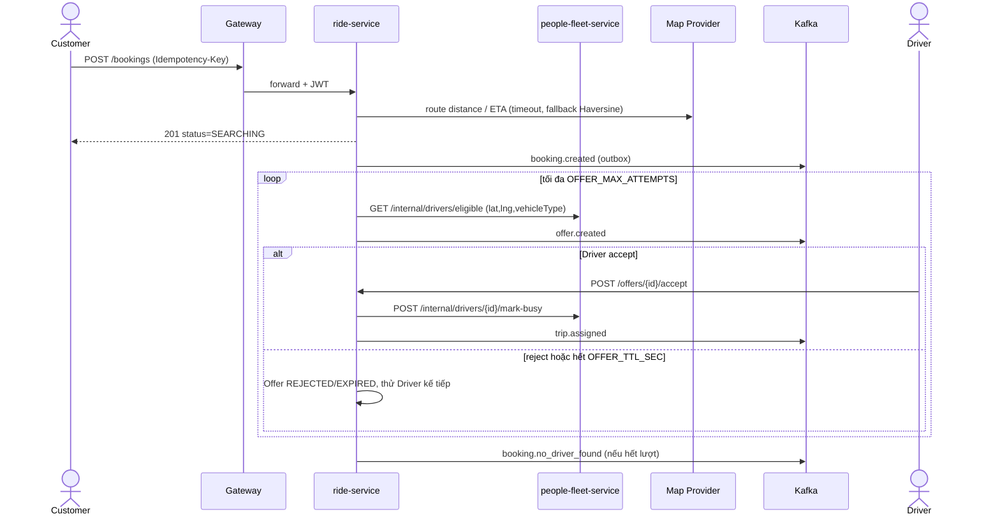
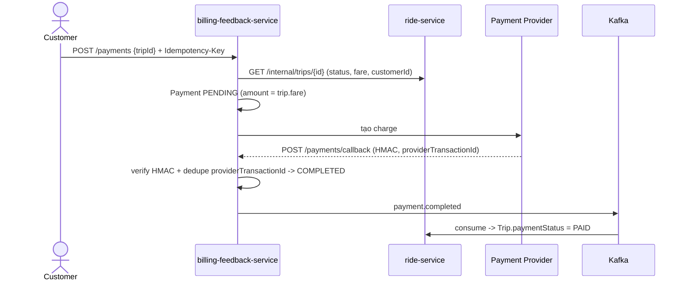
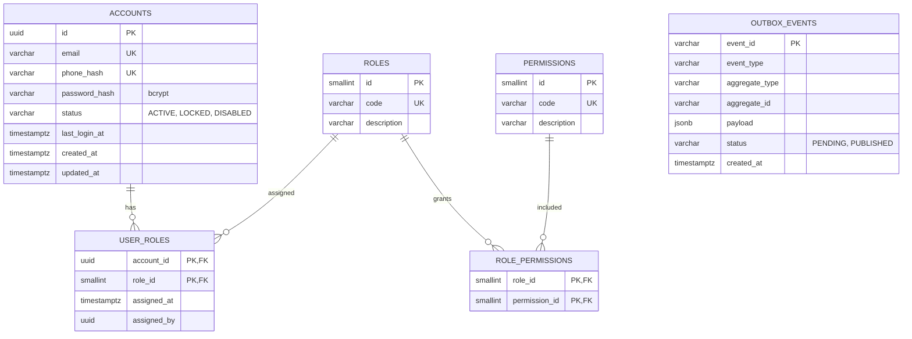
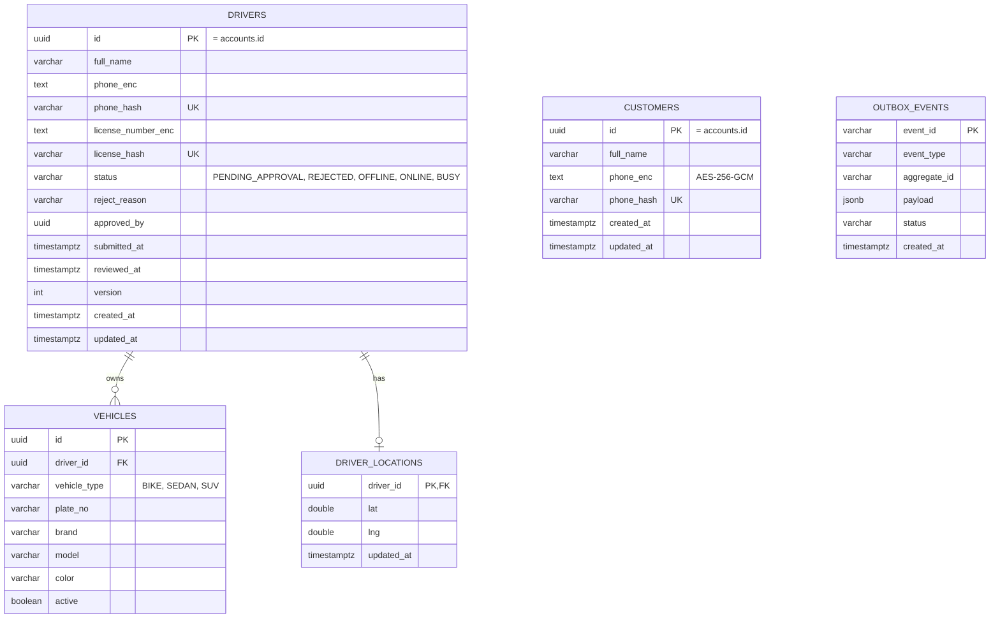
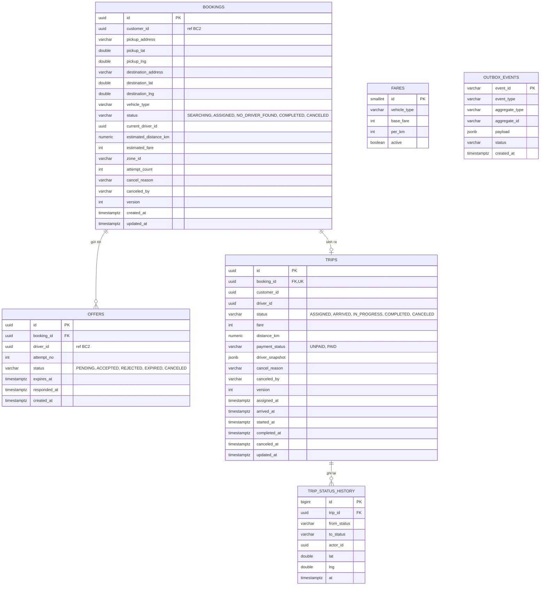
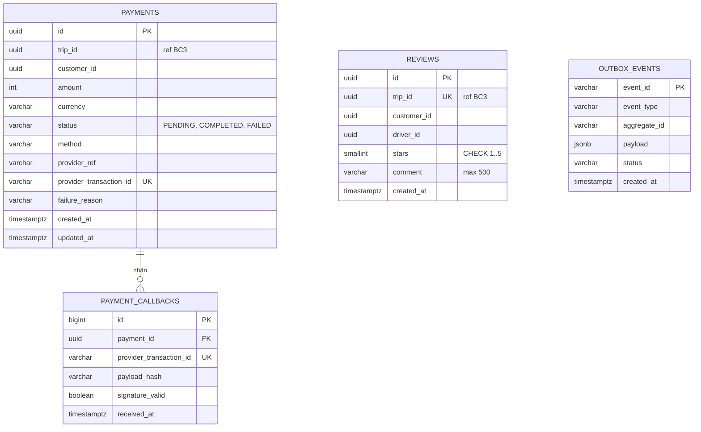
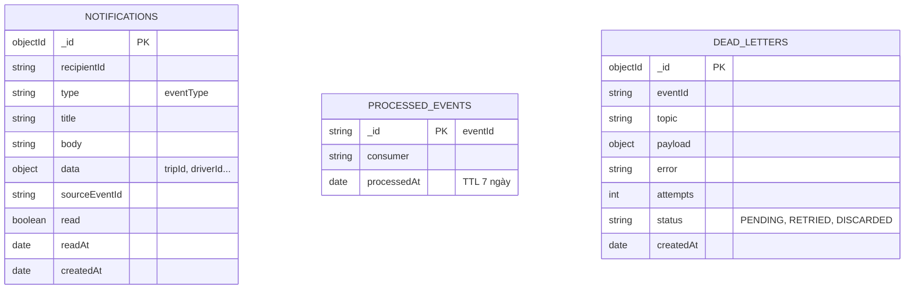
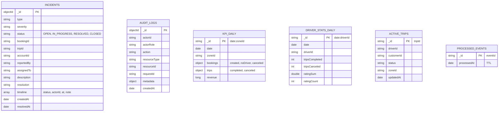

# CAB SYSTEM — Đánh giá SRS v1.2 & Thiết kế Bounded Context / Microservice

> Nguồn: `srs_v1_2.md` + `phieucham.md` (30 tiêu chí, ký hiệu PC1–PC30).
> Database chỉ dùng 3 loại: **PostgreSQL (PS)**, **MongoDB**, **Redis**.

---

## 0. Kết luận nhanh

| Câu hỏi | Trả lời |
|---|---|
| SRS v1.2 đáp ứng đủ 30 tiêu chí chưa? | **Gần đủ.** 21/30 tiêu chí ✅ đầy đủ, 9/30 ⚠️ có FR/UC nhưng còn thiếu chi tiết để test pass chắc chắn (PC2, 4, 7, 13, 16, 17, 19, 21, 30). Không tiêu chí nào bị bỏ trống hoàn toàn. |
| Có khả thi viết microservice không? | **Khả thi.** 6 service + gateway + Kafka + Redis + DB là quy mô hợp lý cho đồ án. Rủi ro chính: (1) tính nhất quán liên service khi Accept Offer, (2) call graph nội bộ SRS còn thiếu, (3) nhiều endpoint FR chưa có đường dẫn. Đều vá được (mục 2). |
| 1 BC = 1 microservice? | Có. 6 BC ↔ 6 service đúng như §15 SRS. Gateway là hạ tầng, không phải BC. Map Provider / Payment Provider là adapter (ACL) nằm trong `ride-service` / `billing-feedback-service`. |

---

## 1. Đối chiếu 30 tiêu chí phiếu chấm

✅ = SRS đủ để thiết kế & test · ⚠️ = có nhưng cần bổ sung

| PC | Nội dung | KQ | Nhận xét / cần vá |
|:-:|---|:-:|---|
| 1 | Mô tả kiến trúc source | ✅ | FR-S14, §9.9.1. Thêm `docs/architecture.md` (context map + sơ đồ mục 4 bên dưới). |
| 2 | `.gitignore`, `.env` trên GitHub | ⚠️ | SRS chỉ nói "không lộ secret" (FR-S05). Thêm rõ: `.gitignore` chứa `.env`, `*.pem`, `secrets/`; chỉ commit `.env.example`; không có secret trong git history. |
| 3 | Nhiệm vụ Gateway | ✅ | FR-S02/S03, UC16. |
| 4 | IPC microservice | ⚠️ | Call graph §14.1 thiếu `billing→ride`, `backoffice→people-fleet/ride/billing`, `ride→billing`(không cần) và luồng đăng ký Driver. Xem G01 và mục 6.3. |
| 5 | Docker Compose, liệt kê container | ✅ | FR-S04, §14. Thêm `healthcheck` + `depends_on: condition: service_healthy`. |
| 6 | `/health`, `/ready`, `/health/services` | ✅ | §16.0 rất rõ. |
| 7 | Kiểm tra Kafka | ⚠️ | Có UC19 nhưng `ride-service` chưa là consumer của `payment.events` (cần để cập nhật `paymentStatus=PAID`), thiếu topic `identity.events`, `audit.events`, `review.events`. Xem G02. Thêm Kafka UI hoặc lệnh `kafka-topics`/`kafka-console-consumer` làm bằng chứng. |
| 8 | Mọi request qua Gateway | ✅ | FR-S15, NFR-16. Test: gọi trực tiếp cổng service → connection refused. |
| 9 | Đăng ký Customer | ✅ | §6.9.1. |
| 10 | Đăng nhập → JWT | ✅ | FR-C02, §9.9.3. |
| 11 | Lấy Customer theo id | ✅ | `GET /customers/{id}`; người khác → 403. |
| 12 | Lấy Driver theo id | ✅ | `GET /drivers/{id}`. |
| 13 | Nearby 1 km + paging | ⚠️ | Rubric yêu cầu **≥5 tài xế trạng thái khác nhau**; seed §16.5 chỉ đảm bảo 4–6 tổng. Sửa seed: ≥5 Driver trong bán kính 1 km (ONLINE/BUSY/OFFLINE) + ≥2 ngoài bán kính + 1 `PENDING_APPROVAL` (không được xuất hiện). Response cần có `distanceM`, `status`. |
| 14 | List Booking + paging | ✅ | FR-C05 định nghĩa response; seed ≥5 booking. |
| 15 | Đặt xe → SEARCHING → offer | ✅ | FR-C06/C07, §6.1. `POST /bookings` trả `SEARCHING` ngay, matching bất đồng bộ. |
| 16 | Tài xế nhận chuyến | ⚠️ | Rubric: "khách hàng nhận thông tin tài xế". SRS chưa nói `GET /trips/{id}` trả thông tin Driver. Thêm `driver{name, phoneMasked, vehicle, plate}` (snapshot trong Trip). |
| 17 | Cập nhật trạng thái chuyến | ⚠️ | Rubric có bước "cập nhật vị trí di chuyển" khi `IN_PROGRESS`. SRS chỉ có `PUT /drivers/me/location`. Thêm `driverLocation` vào `GET /trips/{id}` (đọc từ people-fleet) — xem G08. |
| 18 | Hủy chuyến | ✅ | `POST /bookings/{id}/cancel`, `POST /trips/{id}/cancel` body `{reason}`; event `trip.canceled` gửi cả Customer + Driver. |
| 19 | Thanh toán online + callback | ⚠️ | (a) `payment.completed` phải cập nhật `Trip.paymentStatus` ở service khác → cần ride consume event; (b) `/payments/callback` là route **public** (không JWT, có HMAC) trên Gateway; (c) cần `mock-payment-provider` có endpoint tạo charge + tự gọi callback. |
| 20 | Đánh giá chuyến | ✅ | Cần billing gọi ride để kiểm tra Trip `COMPLETED` và thuộc Customer. |
| 21 | Đăng ký Driver OTP | ⚠️ | Chưa định nghĩa payload `POST /drivers/register` (thiếu `password`, thông tin cá nhân, vehicle) và **service nào tạo Account**. Xem G04. |
| 22 | Duyệt hồ sơ Driver | ✅ | UC14. Nên thêm workflow BP-03 vì §6 chưa có. |
| 23 | Online/Offline | ✅ | FR-D05, state machine §7. |
| 24 | Mã hóa at rest | ✅ | FR-S07, §16.4. bcrypt cho password là **hash một chiều** — tốt hơn "encrypted" của rubric; nên nói rõ với GV. PII `enc:v1:<keyId>:...`. Notification/Audit không được chứa plaintext phone. |
| 25 | SQL injection | ✅ | FR-S08. Thêm NoSQL operator injection (`{"$ne":null}`) vì có MongoDB. |
| 26 | XSS | ✅ | FR-S09. |
| 27 | JWT tampering | ✅ | FR-S10 (kiểm `alg=none`, signature, exp). |
| 28 | Unauthorized access | ✅ | §16.3, FR-S11. Ma trận quyền cần mở rộng (mục 6.5). |
| 29 | Rate limit | ✅ | FR-S12, Redis. Nên định nghĩa hành vi khi Redis down (đề xuất fail-open + log cảnh báo cho demo). |
| 30 | Replay / idempotency | ⚠️ | Payload rubric có `amount` do client gửi, còn SRS (BR-F01/BR-C06) cấm tin amount client. Đề xuất: `POST /payments` nhận `{tripId, amount?}` — **bỏ qua `amount` client**, nếu có và khác fare server → `422`. Replay cùng key + cùng payload → trả lại response cũ. |

---

## 2. Tính khả thi & các điểm cần vá trong SRS

### 2.1 Đánh giá khả thi

- **Số thành phần:** gateway, 6 service, Kafka(+ZK/KRaft), Redis, mock-payment, mock-map, DB ≈ 15–16 container. Máy dev nên gộp: 1 instance PostgreSQL chứa 4 database (mỗi service 1 user riêng, không cấp quyền chéo) và 1 instance MongoDB chứa 2 database. Vẫn giữ nguyên tắc "database per service".
- **Thứ tự xây dựng đề xuất:** gateway + identity → people-fleet → ride → billing-feedback → notification → backoffice. Notification và backoffice có thể làm mỏng ở vòng đầu vì không nằm trong 30 tiêu chí.
- **Điểm khó nhất:** Accept Offer (ride ↔ people-fleet) và đăng ký Driver (identity ↔ people-fleet). Xử lý bằng saga đơn giản có bù trừ (G04, G05).

### 2.2 Danh sách vá

| ID | Vấn đề trong SRS v1.2 | Đề xuất vá |
|---|---|---|
| G01 | Call graph thiếu | Thêm: `billing→ride` (lấy Trip/fare/owner), `backoffice→people-fleet/ride/billing` (Operations facade), `identity→people-fleet` (đã có, mở rộng cho Driver). |
| G02 | Topic/consumer thiếu | Thêm `ride-service` consume `payment.events`; thêm topic `identity.events` (account.locked, role.changed…), `audit.events` (sensitive action từ mọi service → backoffice), `review.events` (review.created). |
| G03 | §16.2 chỉ map 30 PC; nhiều FR không có endpoint | Bổ sung endpoint cho FR-C12/D11/E15 (notifications), FR-E01–E14 (ops, incident, audit), FR-A04–A06 (account/RBAC), FR-B01–B06 (`/reports/*`), resubmit hồ sơ Driver, cập nhật hồ sơ Customer, geo (FR-M01–M04). Có trong mục 5. |
| G04 | Đăng ký Driver mơ hồ | Chọn: **OTP nằm ở identity (Redis)**; `POST /drivers/register` → identity xác thực `registrationToken` (dùng 1 lần), tạo Account `DRIVER`, rồi gọi `people-fleet POST /internal/drivers` tạo hồ sơ `PENDING_APPROVAL`. Lỗi bước 2 → identity xóa/khóa Account vừa tạo (bù trừ). Payload: `registrationToken, fullName, email, password, licenseNumber, vehicle{type,plate,brand,model,color}`. |
| G05 | Accept Offer chạm 2 service | Ride: (1) lock Offer/Booking, (2) gọi `people-fleet mark-busy` (UPDATE có điều kiện `status='ONLINE'`, thất bại → `409`), (3) commit Offer ACCEPTED + tạo Trip + outbox. Nếu (3) lỗi → gọi `release`. Ràng buộc DB: unique partial index `offers(booking_id) WHERE status='ACCEPTED'` là chốt chặn cuối cho "chỉ 1 Accept". |
| G06 | "Khu vực" (FR-B05, FR-E03) chưa định nghĩa | Thêm `zoneId` (ví dụ lưới 0.05° hoặc quận từ reverse geocode) gắn vào Booking/Trip và event. |
| G07 | Payment amount vs rubric PC30 | Xem PC30 ở mục 1. |
| G08 | Vị trí Driver khi Trip chạy | `GET /trips/{id}` trả `driverLocation{lat,lng,updatedAt}`, ride đọc qua `people-fleet GET /internal/drivers/{id}/summary`. Không lưu lịch sử GPS (đúng §5.2). |
| G09 | Idempotency lưu ở đâu | SRS §13.1 liệt kê bảng, §14 lại nói Redis. Chốt: **Redis** (`SET NX`, TTL 24h) + unique constraint DB làm lớp thứ hai (`payments.provider_transaction_id`, outbox `event_id`). |
| G10 | JWT chứa `role` nhưng "role lấy từ server" | Role được nạp từ DB **lúc login** rồi ký vào JWT; service tin JWT đã ký. Khóa Account có hiệu lực tối đa sau `JWT_TTL_MIN` (15 phút) — chấp nhận và ghi vào tài liệu; hoặc identity giữ blacklist ngắn hạn trong Redis (`jwt:revoked:{sub}`, TTL 15 phút). |
| G11 | Cơ chế hết hạn Offer chưa nêu | Worker trong ride quét `offers WHERE status='PENDING' AND expires_at < now()` mỗi 1–2 s, khóa bằng Redis `lock:dispatch:{bookingId}`; hết hạn → `EXPIRED` → offer kế tiếp. |
| G12 | §6 thiếu workflow: duyệt Driver, hủy chuyến, đánh giá, đăng nhập | Thêm BP-03, BP-05 (phần hủy), BP-07 vào catalog mục 3. |
| G13 | Gateway route public chưa liệt kê | Public (không JWT): `/health`, `/ready`, `/health/services`, `/auth/register`, `/auth/login`, `/drivers/otp/*`, `/drivers/register`, `/payments/callback` (HMAC). Các route còn lại bắt buộc JWT. |
| G14 | Employee facade vs §18.2 ("service sở hữu tự kiểm tra quyền") | Backoffice gọi owner service kèm **service credential + forward JWT gốc**; owner vẫn tự kiểm tra role/permission/state. |

---

## 3. Business Process Model (catalog workflow)

| BP | Tên | Nguồn SRS | Lane / Tham gia | BC tham gia |
|---|---|---|---|---|
| BP-01 | Đăng ký & đăng nhập tài khoản | §6.9 | Customer/Driver/Employee/Admin/Board → Gateway → Identity | BC1, BC2 |
| BP-02 | Driver onboarding bằng OTP | §6.8 | Driver → Identity (OTP) → People&Fleet (hồ sơ) | BC1, BC2, BC5 |
| BP-03 | Duyệt / từ chối hồ sơ Driver | **bổ sung** | Admin → People&Fleet → Kafka → Notification, Backoffice(Audit) | BC2, BC5, BC6 |
| BP-04 | Customer đặt xe & matching | §6.1 | Customer → Ride → People&Fleet → Driver → Ride | BC3, BC2, BC5 |
| BP-05 | Thực hiện Trip & hủy Trip | §6.2 + **bổ sung hủy** | Driver/Customer → Ride → People&Fleet | BC3, BC2, BC5 |
| BP-06 | Thanh toán online | §6.7 | Customer → Billing ↔ Payment Provider → Kafka → Ride | BC4, BC3, BC5 |
| BP-07 | Đánh giá chuyến đi | **bổ sung** | Customer → Billing → Ride (kiểm Trip) → Kafka | BC4, BC3, BC6 |
| BP-08 | Notification qua Kafka | §6.5, §12 | Domain service → Kafka → Notification → User | BC5 (+ tất cả producer) |
| BP-09 | Employee vận hành & Incident | §6.3 | Employee → Backoffice → Ride/People/Billing → Audit | BC6, BC2, BC3, BC4 |
| BP-10 | Board xem báo cáo | §6.4 | Board → Backoffice (read model) | BC6 |
| BP-11 | Tích hợp Map | §6.6 | Ride → Map Provider (timeout/fallback) | BC3 |
| BP-12 | Audit thao tác nhạy cảm | §11 | Identity/People/Ride/Backoffice → `audit.events` → Backoffice | BC6 (+ producer) |

### 3.1 BP-04 — Đặt xe & matching



### 3.2 BP-06 — Thanh toán



---

## 4. Context Map

```mermaid
flowchart LR
  Client([Client]) --> GW[API Gateway]
  GW --> ID["BC1 Identity and Access"]
  GW --> PF["BC2 People and Fleet"]
  GW --> RD["BC3 Ride"]
  GW --> BL["BC4 Billing and Feedback"]
  GW --> NT["BC5 Notification"]
  GW --> BO["BC6 Backoffice"]

  ID -- REST internal --> PF
  RD -- REST internal --> PF
  BL -- REST internal --> RD
  BO -- REST internal --> PF
  BO -- REST internal --> RD
  BO -- REST internal --> BL

  RD -- ACL --> MAP[(Map Provider)]
  BL -- ACL --> PAY[(Payment Provider)]

  ID -. Kafka .-> K{{Kafka}}
  PF -. Kafka .-> K
  RD -. Kafka .-> K
  BL -. Kafka .-> K
  BO -. Kafka .-> K
  K -. subscribe .-> NT
  K -. subscribe .-> BO
  K -. payment.events .-> RD
```

| Quan hệ | Upstream → Downstream | Pattern |
|---|---|---|
| Identity → People&Fleet | Identity gọi tạo hồ sơ | Customer/Supplier (REST) |
| Ride → People&Fleet | Tìm Driver đủ điều kiện, mark BUSY | Customer/Supplier (REST) |
| Billing → Ride | Lấy Trip/fare | Customer/Supplier (REST) |
| Backoffice → các BC | Operations facade | Open Host Service (REST) |
| Mọi BC → Notification, Backoffice | Domain event | Published Language (Kafka + Event Envelope) |
| Ride → Map, Billing → Payment | Adapter | Anticorruption Layer |

### 4.1 Từ vựng dùng chung giữa các BC (cùng từ – khác nghĩa)

| Từ | BC1 Identity | BC2 People&Fleet | BC3 Ride | BC4 Billing | BC6 Backoffice |
|---|---|---|---|---|---|
| Driver | Account có role `DRIVER` | Aggregate hồ sơ + trạng thái | `driverId` tham chiếu + snapshot | `driverId` để gắn Review | Đối tượng cần thống kê/tra cứu |
| Customer | Account có role `CUSTOMER` | Aggregate hồ sơ | `customerId` tham chiếu | `customerId` chủ Payment | Đối tượng tra cứu |
| Status | Trạng thái Account | Trạng thái Driver | Booking/Offer/Trip | Payment | Incident |
| Trip | — | — | Aggregate | `tripId` tham chiếu | Read model `active_trips` |
| User/Actor | Account + role | — | Actor trong JWT | Actor trong JWT | Actor trong Audit |

Quy ước: **`customers.id` = `drivers.id` = `accounts.id`** (UUID cấp bởi identity), không có FK xuyên database.

---

## 5. Thiết kế từng Bounded Context

Quy ước chung cho mọi service:

- Mỗi service có `GET /health`, `GET /ready` (§16.0), không publish port ra host (chỉ gateway).
- Lỗi theo format §9.9.2 (`code, message, requestId`).
- Service PostgreSQL có bảng `outbox_events` (§13.7) + relay đẩy lên Kafka; service MongoDB dùng collection `outbox_events` tương đương (chỉ backoffice có publish: `incident.events`).
- Consumer Kafka ghi `eventId` đã xử lý (idempotency, NFR-03).
- Cột nhạy cảm dùng `enc:v1:<keyId>:<iv>:<tag>:<ciphertext>` (AES-256-GCM); cột tra cứu dùng HMAC-SHA256 (`*_hash`).

---

### 5.1 BC1 — Identity & Access → `identity-service`

#### a. Thông tin Bounded Context

| Mục | Nội dung |
|---|---|
| Mục đích | Là nguồn sự thật duy nhất về **danh tính, xác thực và phân quyền**: ai đang gọi hệ thống, role gì, permission gì. |
| Làm gì | Đăng ký Customer; đăng nhập chung mọi role, cấp JWT HS256; OTP + `registrationToken` cho Driver; tạo Account cho Driver; quản trị Account (khóa/mở, trạng thái); quản lý Role/Permission; phát event cho audit. |
| Không làm | Hồ sơ cá nhân (BC2); hành vi nghiệp vụ; rate limit (Gateway). |
| FR | FR-C01, FR-C02, FR-D01, FR-D02, FR-D03 (phần tạo Account), FR-A04, FR-A05, FR-A06, FR-S07 (bcrypt), FR-S10 (phát/kiểm JWT) |
| BR | BR-A01–A03, BR-D01–D02, BR-O01–O04, BR-S03 |
| BP | BP-01, BP-02, BP-12 |
| PC | 9, 10, 21, 24, 27 |
| Actor | Customer, Driver (đăng ký), Employee, Admin, Board (đăng nhập), Admin (quản trị) |
| Aggregate | `Account` (kèm `UserRole`), `Role` (kèm `RolePermission`) |

#### b. Ngôn ngữ thống nhất (Ubiquitous Language)

| Thuật ngữ | Định nghĩa trong BC này |
|---|---|
| Account | Tài khoản đăng nhập, định danh bằng `email` (unique) và `phone_hash` (unique); mang đúng một role chính. |
| Credential | Cặp email + password; password lưu bcrypt, không bao giờ trả ra ngoài. |
| Role | Nhóm quyền: `CUSTOMER, DRIVER, OPERATIONS_STAFF, USER_STAFF, FINANCE_STAFF, SUPERVISOR, ADMIN, BOARD`. |
| Permission | Quyền nguyên tử dạng `resource.action` (vd `booking.cancel`); Role được gán tập Permission. |
| Access Token (JWT) | Token HS256, claims `sub, role, iat, exp`, sống 15 phút; chỉ sinh khi login thành công. |
| Account Status | `ACTIVE`, `LOCKED`, `DISABLED`; chỉ `ACTIVE` mới đăng nhập được. |
| OTP | Mã 6 số, TTL 5 phút, lưu dạng hash; sai quá 5 lần khóa 15 phút. |
| Registration Token | Token 15 phút, dùng 1 lần, chỉ để hoàn tất đăng ký Driver sau khi OTP đúng. |
| Phone Hash | HMAC-SHA256(phone, `PHONE_HASH_PEPPER`) — dùng để tra cứu/kiểm tra trùng mà không cần giải mã. |
| Service Credential | Bí mật để service gọi internal REST của service khác. |
| Sensitive Action | Khóa/mở Account, đổi Role/Permission — bắt buộc phát audit event. |

#### c. Microservice `identity-service`

**API qua Gateway**

| Method | Path | Ai gọi | FR | PC | Ghi chú |
|---|---|---|---|:-:|---|
| POST | `/auth/register` | Public | C01 | 9 | `fullName,email,phone,password(≥8)`; trùng → 409; sai format → 400. Gọi `people-fleet` tạo Customer profile. |
| POST | `/auth/login` | Public | C02 | 10 | Mọi role; rate limit 10/phút/IP. |
| GET | `/auth/me` | Mọi role | C02 | — | Trả `sub, role, permissions` (tùy chọn, tiện cho Postman). |
| POST | `/drivers/otp/request` | Public | D01 | 21 | `{phone}`; test mode log OTP. |
| POST | `/drivers/otp/verify` | Public | D02 | 21 | `{phone, otp}` → `registrationToken`. |
| POST | `/drivers/register` | Public + registrationToken | D03 | 21 | Payload ở G04; tạo Account + hồ sơ `PENDING_APPROVAL`. |
| GET | `/admin/accounts` | Admin | A05 | — | Lọc `role,status`, có paging. |
| PATCH | `/admin/accounts/{id}/status` | Admin | A04, A05 | — | `{status, reason}`; sinh audit `account.locked/unlocked`. |
| GET | `/admin/roles`, `/admin/permissions` | Admin | A06 | — | |
| PUT | `/admin/accounts/{id}/roles` | Admin | A06 | — | Sinh audit `role.changed`. |
| PUT | `/admin/roles/{id}/permissions` | Admin | A06 | — | Sinh audit. |

**API nội bộ**

| Method | Path | Ai gọi | Mục đích |
|---|---|---|---|
| GET | `/internal/accounts/{id}` | backoffice, people-fleet | Tra cứu Account (email, status, role). |

**Kafka:** publish `identity.events` (`account.created`, `account.locked`, `account.unlocked`, `role.changed`) và `audit.events`. Không consume.

**Ma trận Role → Permission tối thiểu**

| Role | Permission mẫu |
|---|---|
| OPERATIONS_STAFF | `booking.read, booking.cancel, trip.monitor, driver.read, offer.read, incident.manage` |
| USER_STAFF | `customer.read, customer.manage, driver.read, driver.manage, account.read` |
| FINANCE_STAFF | `payment.read` |
| SUPERVISOR | tất cả của OPERATIONS + `booking.reassign, audit.read` |
| ADMIN | `rbac.manage, account.manage, driver.approve, audit.read` |
| BOARD | `report.read` |
| CUSTOMER / DRIVER | quyền theo ownership, không cần permission code |

**Database: PostgreSQL** (`db_identity`) + **Redis**



| Redis key | Kiểu | TTL | Mục đích |
|---|---|---|---|
| `id:otp:{phoneHash}` | hash `{otpHash, attempts}` | 300 s | OTP (BR-D01/O03) |
| `id:otp:lock:{phoneHash}` | string | 900 s | Khóa sau 5 lần sai |
| `id:regtoken:{sha256(token)}` | string → `phoneHash` | 900 s | Dùng 1 lần (`GETDEL`) |
| `id:jwt:revoked:{accountId}` | string (tùy chọn) | 900 s | Hiệu lực khóa Account tức thời (G10) |

---

### 5.2 BC2 — People & Fleet → `people-fleet-service`

#### a. Thông tin Bounded Context

| Mục | Nội dung |
|---|---|
| Mục đích | Sở hữu **hồ sơ con người và đội xe**: Customer, Driver, Vehicle, trạng thái nhận chuyến và vị trí Driver. |
| Làm gì | Lưu/xem hồ sơ Customer và Driver; tiếp nhận hồ sơ Driver; Admin duyệt/từ chối; bật/tắt Online/Offline theo state machine; nhận vị trí; tìm Driver quanh tọa độ; cung cấp "Driver đủ điều kiện" cho Dispatch; chuyển `ONLINE↔BUSY` theo lệnh của Ride. |
| Không làm | Xác thực/mật khẩu (BC1); Booking/Offer/Trip (BC3); lịch sử GPS chi tiết. |
| FR | FR-C03, FR-C04, FR-D03 (phần hồ sơ), FR-D04, FR-D05, FR-D06, FR-A01, FR-A02, FR-A03, FR-E01–E04 (dữ liệu owner) |
| BR | BR-D03, BR-D04, BR-M04 (Haversine fallback), BR-B03 (mask) |
| BP | BP-02, BP-03, BP-04 (cấp Driver eligible), BP-05 (release Driver) |
| PC | 11, 12, 13, 21, 22, 23, 24 |
| Actor | Customer, Driver, Admin, Employee (qua Backoffice) |
| Aggregate | `Customer`, `Driver` (kèm `Vehicle`, `DriverLocation`) |

#### b. Ngôn ngữ thống nhất

| Thuật ngữ | Định nghĩa trong BC này |
|---|---|
| Customer | Người dùng dịch vụ có hồ sơ (`fullName`, `phone` mã hóa). |
| Driver | Người thực hiện chuyến; có hồ sơ, giấy phép, Vehicle và trạng thái. |
| Driver Status | `PENDING_APPROVAL, REJECTED, OFFLINE, ONLINE, BUSY` (§7). |
| Approved | Điều kiện nghiệp vụ (đã qua `PENDING_APPROVAL`), **không** phải trạng thái lưu riêng. |
| Vehicle / VehicleType | Xe của Driver; loại `BIKE, SEDAN, SUV` quyết định Offer nào Driver nhận được. |
| Driver Location | Vị trí gần nhất `{lat,lng,updatedAt}`; bắt buộc hợp lệ khi chuyển `ONLINE`. |
| Availability | Ý định nhận chuyến của Driver (Online/Offline) — khác với `BUSY` do hệ thống đặt. |
| Nearby | Truy vấn Driver trong `NEARBY_RADIUS_M` (mặc định 1000 m) quanh tọa độ, có `status`, `page`, `limit`. |
| Eligible Driver | Driver đã duyệt, `ONLINE`, đúng `vehicleType`, không `BUSY`, vị trí còn mới — đầu vào của Dispatch. |
| License Number | Số giấy phép lái xe — PII, mã hóa AES-256-GCM. |
| Reject Reason | Lý do Admin từ chối hồ sơ. |

#### c. Microservice `people-fleet-service`

**API qua Gateway**

| Method | Path | Ai gọi | FR | PC | Ghi chú |
|---|---|---|---|:-:|---|
| GET | `/customers/{id}` | Customer(own), Employee, Admin | C03, E01 | 11 | Người khác → 403. |
| PATCH | `/customers/me` | Customer | — | — | Cập nhật `fullName` (thiếu FR trong SRS, nên thêm). |
| GET | `/drivers/{id}` | Driver(own), Customer(own-in-trip), Employee, Admin | D04 | 12 | Customer chỉ thấy khi Driver đang trong Trip của mình; mask phone. |
| GET | `/drivers/nearby` | Customer, Driver, Employee | C04 | 13 | `lat,lng,radius=1000,status,page,limit≤50`; trả `distanceM`. |
| PUT | `/drivers/me/location` | Driver | D06 | 13 | `{lat,lng}` hợp lệ. |
| PUT | `/drivers/me/availability` | Driver | D05 | 23 | `{status: ONLINE|OFFLINE}`; `BUSY→OFFLINE` → 409. |
| POST | `/drivers/me/resubmit` | Driver (REJECTED) | D03 | — | `REJECTED→PENDING_APPROVAL` (§7.2, thiếu endpoint). |
| GET | `/admin/drivers` | Admin | A01 | 22 | `?status=PENDING_APPROVAL&page&limit`. |
| GET | `/admin/drivers/{id}` | Admin | A01 | 22 | Chi tiết, giải mã license cho Admin. |
| POST | `/admin/drivers/{id}/approve` | Admin | A02 | 22 | `PENDING_APPROVAL→OFFLINE`; audit + `driver.approved`. |
| POST | `/admin/drivers/{id}/reject` | Admin | A03 | 22 | `{rejectReason}`; audit + `driver.rejected`. |

**API nội bộ**

| Method | Path | Ai gọi | Mục đích |
|---|---|---|---|
| POST | `/internal/customers` | identity | Tạo hồ sơ Customer sau register. |
| POST | `/internal/drivers` | identity | Tạo Driver + Vehicle (`PENDING_APPROVAL`). |
| GET | `/internal/drivers/eligible` | ride | `lat,lng,vehicleType,limit,excludeIds` → danh sách xếp theo khoảng cách. |
| GET | `/internal/drivers/{id}/summary` | ride, backoffice | Tên, vehicle, plate, phone mask, status, location. |
| POST | `/internal/drivers/{id}/mark-busy` | ride | `ONLINE→BUSY` có điều kiện; sai trạng thái → 409. |
| POST | `/internal/drivers/{id}/release` | ride | `BUSY→ONLINE`. |
| GET | `/internal/customers/{id}/summary` | backoffice | Hồ sơ rút gọn. |
| GET | `/internal/customers`, `/internal/drivers` | backoffice | Tìm kiếm cho Operations (phone → HMAC → `phone_hash`). |

**Kafka:** publish `driver.events` (`driver.registered`, `driver.approved`, `driver.rejected`, `driver.status_changed`; key = `driverId`) và `audit.events` (approve/reject). Không consume.

**Database: PostgreSQL** (`db_people_fleet`) + **Redis**



| Redis key | Kiểu | TTL | Mục đích |
|---|---|---|---|
| `pf:geo:drivers` | GEO (member = driverId) | — | `GEOSEARCH` bán kính cho Nearby/Eligible |
| `pf:loc:{driverId}` | hash `{lat,lng,updatedAt}` | 120 s | Phát hiện vị trí cũ (stale) khi chuyển `ONLINE` |

Ghi chú: Redis GEO chỉ là chỉ mục tra cứu nhanh; `driver_locations` (PostgreSQL) là bản gần nhất để phục hồi và làm **Haversine fallback** khi Redis/Map lỗi (BR-M04). Nearby: lấy id từ GEO → lọc `status` bằng PostgreSQL → phân trang.

---

### 5.3 BC3 — Ride → `ride-service`

#### a. Thông tin Bounded Context

| Mục | Nội dung |
|---|---|
| Mục đích | Sở hữu **vòng đời chuyến đi**: từ Booking, tìm Driver (Dispatch/Offer) đến Trip và cước (Fare). |
| Làm gì | Tạo/liệt kê/hủy Booking; matching tự động theo TTL & số lần thử; Offer accept/reject/expire; tạo Trip; state machine Trip; cascade Booking↔Trip; tính Fare từ `vehicleType` + `distanceKm`; gọi Map Provider (geocode, distance, ETA) qua adapter; Reassign; nhận `payment.completed` để đánh dấu `PAID`. |
| Không làm | Hồ sơ/trạng thái Driver (BC2); thanh toán và đánh giá (BC4); thông báo (BC5). |
| FR | FR-C05–C09, FR-D07–D10, FR-E05–E10 (owner), FR-M01–M06, FR-S13 (idempotency `POST /bookings`) |
| BR | BR-C01, C03, C04, BR-D04–D06, BR-E04, E05, BR-F01, F02, BR-M01–M04, §7.3, §7.4 |
| BP | BP-04, BP-05, BP-11 |
| PC | 14, 15, 16, 17, 18, 30 (booking) |
| Actor | Customer, Driver, Employee/Supervisor (qua Backoffice) |
| Aggregate | `Booking` (kèm `Offer`), `Trip` (kèm `TripStatusHistory`), `Fare` (bảng cấu hình) |

#### b. Ngôn ngữ thống nhất

| Thuật ngữ | Định nghĩa trong BC này |
|---|---|
| Booking | Yêu cầu đặt xe của Customer: pickup, destination, `vehicleType`. Status `SEARCHING, ASSIGNED, NO_DRIVER_FOUND, COMPLETED, CANCELED`. |
| Pickup / Destination | Địa chỉ hiển thị + `lat/lng` chuẩn hóa. |
| Dispatch | Quá trình tự động chọn Driver eligible gần nhất và gửi Offer cho tới khi có người nhận hoặc hết lượt. |
| Offer | Lời mời một Driver nhận một Booking; sống `OFFER_TTL_SEC`; `PENDING, ACCEPTED, REJECTED, EXPIRED, CANCELED`. |
| Attempt | Lần gửi Offer thứ n của một Booking, tối đa `OFFER_MAX_ATTEMPTS`. |
| Trip | Chuyến thực tế sau khi Offer được Accept: `ASSIGNED, ARRIVED, IN_PROGRESS, COMPLETED, CANCELED`. |
| Fare | Bảng giá theo `vehicleType` (`baseFare`, `perKm`); `fare = round(base + perKm × distanceKm)`. |
| Distance / ETA | Khoảng cách và thời gian dự kiến lấy từ Map Provider, có fallback Haversine. |
| Payment Status | Bản sao chỉ đọc `UNPAID/PAID` trên Trip; chỉ đổi khi nhận `payment.completed`. |
| Reassign | Supervisor đổi Driver cho Booking/Trip chưa ở trạng thái cuối. |
| Cancellation Reason | Lý do bắt buộc khi hủy (Customer, Driver, Employee). |
| Zone | `zoneId` vùng địa lý của điểm đón, dùng cho lọc báo cáo. |
| Driver Snapshot | Tên/xe/biển số Driver lưu trên Trip tại thời điểm Accept. |

#### c. Microservice `ride-service`

**API qua Gateway**

| Method | Path | Ai gọi | FR | PC | Ghi chú |
|---|---|---|---|:-:|---|
| POST | `/bookings` | Customer | C06, C07 | 15, 30 | Bắt buộc `Idempotency-Key`; trả `201` `status=SEARCHING`, `estimatedFare`. Rate limit 10/phút/user. |
| GET | `/bookings` | Customer(own) | C05 | 14 | `page,limit`; response `{data, pagination{page,limit,total,totalPages}}`. |
| GET | `/bookings/{id}` | Customer(own) | C08 | 14 | |
| POST | `/bookings/{id}/cancel` | Customer(own) | C09 | 18 | `{reason}`; `SEARCHING` → hủy, không tạo Trip/Payment; `ASSIGNED` → hủy Trip. |
| GET | `/offers` | Driver(own) | D07 | 16 | Offer `PENDING` của mình. |
| GET | `/offers/{id}` | Driver(own) | D07 | 16 | Xem thông tin chuyến trước khi nhận. |
| POST | `/offers/{id}/accept` | Driver(own) | D08 | 16 | Đồng thời: người commit trước thắng, người sau → 409. |
| POST | `/offers/{id}/reject` | Driver(own) | D08 | 16 | |
| GET | `/trips/{id}` | Customer(own), Driver(own) | C08 | 17 | Kèm `driver{...}` và `driverLocation` (G08). |
| PATCH | `/trips/{id}/status` | Driver được phân công | D09 | 17 | `{status}` theo đúng chuỗi `ARRIVED→IN_PROGRESS→COMPLETED`. |
| POST | `/trips/{id}/cancel` | Customer(own), Driver(own) | C09, D10 | 18 | `{reason}`; `IN_PROGRESS` → 409. |
| GET | `/fares/estimate` | Customer | C06 | — | Tùy chọn: ước giá trước khi đặt. |
| GET | `/geo/geocode`, `/geo/reverse`, `/geo/route` | Customer, Driver, Employee | M01–M04 | — | Map key chỉ ở server (FR-M06). |

**API nội bộ**

| Method | Path | Ai gọi | Mục đích |
|---|---|---|---|
| GET | `/internal/trips/{id}` | billing | `status, fare, customerId, driverId, paymentStatus`. |
| GET | `/internal/bookings`, `/internal/bookings/{id}`, `/internal/bookings/{id}/offers` | backoffice | Tìm/giám sát (FR-E05, E07). |
| GET | `/internal/trips/active` | backoffice | Trip đang chạy + Driver + location (FR-E08). |
| POST | `/internal/bookings/{id}/cancel` | backoffice | Employee hủy (`reason`, forward JWT). |
| POST | `/internal/bookings/{id}/reassign` | backoffice | Supervisor reassign (`driverId?`, `reason`). |

**Kafka:** publish `booking.events` (`booking.created`, `offer.created`, `booking.no_driver_found`, `booking.canceled`, `booking.completed`; key = `bookingId`), `trip.events` (`trip.assigned`, `trip.arrived`, `trip.started`, `trip.completed`, `trip.canceled`, `trip.reassigned`; key = `tripId`), `audit.events` (Employee cancel/reassign). **Consume** `payment.events` (`payment.completed` → `payment_status=PAID`).

**Database: PostgreSQL** (`db_ride`) + **Redis**



Ràng buộc quan trọng: `UNIQUE (booking_id, attempt_no)`; **unique partial index** `offers(booking_id) WHERE status='ACCEPTED'`; `bookings.version`/`trips.version` cho optimistic lock; index `bookings(customer_id, created_at DESC)` cho paging.

| Redis key | Kiểu | TTL | Mục đích |
|---|---|---|---|
| `ride:idem:{userId}:{endpoint}:{key}` | hash `{requestHash,status,body}` | 24 h | Idempotency `POST /bookings` (FR-S13) |
| `ride:lock:dispatch:{bookingId}` | string | 30 s | Chỉ 1 worker xử lý Offer/hết hạn cho một Booking |
| `ride:map:route:{hash}` | string (JSON) | 10 phút | Cache distance/ETA (giảm gọi Map Provider) |

---

### 5.4 BC4 — Billing & Feedback → `billing-feedback-service`

#### a. Thông tin Bounded Context

| Mục | Nội dung |
|---|---|
| Mục đích | Sở hữu **tiền và đánh giá** của một chuyến đã hoàn thành. |
| Làm gì | Tạo Payment cho Trip `COMPLETED` với amount do server lấy từ fare; gọi Payment Provider; nhận & xác thực callback HMAC; chống trùng theo `providerTransactionId` và `Idempotency-Key`; lưu Review (1 sao 1–5, comment ≤500, mỗi Trip 1 Review); tra cứu Payment cho Finance. |
| Không làm | Tính fare (BC3); cập nhật trực tiếp Trip (chỉ phát event); thông báo. |
| FR | FR-C10, FR-C11, FR-P01, FR-P02, FR-E11 (owner), FR-S13 (`POST /payments`) |
| BR | BR-C05, BR-C06, BR-P01–P03, BR-F03, BR-F04 |
| BP | BP-06, BP-07 |
| PC | 19, 20, 30 |
| Actor | Customer, Payment Provider, Finance (qua Backoffice) |
| Aggregate | `Payment` (kèm `PaymentCallback`), `Review` |

#### b. Ngôn ngữ thống nhất

| Thuật ngữ | Định nghĩa trong BC này |
|---|---|
| Payment | Giao dịch thanh toán một Trip; `PENDING, COMPLETED, FAILED`. Một Trip tối đa một Payment `COMPLETED`. |
| Amount | Số tiền do server lấy từ `trip.fare`; client không quyết định. |
| Payment Provider | Hệ thống ngoài xử lý tiền; không phải nguồn sự thật về trạng thái nội bộ. |
| Provider Transaction Id | Mã giao dịch của provider, **unique**, khóa chống xử lý callback lần hai. |
| Callback | Thông báo kết quả từ provider, xác thực HMAC; sai chữ ký → 401, Payment không đổi. |
| Idempotency-Key | Header bắt buộc trên `POST /payments`; cùng key + payload → response cũ; khác payload → 422. |
| Double Charge | Sự cố trừ tiền hai lần — hệ thống phải ngăn tuyệt đối. |
| Review | Đánh giá 1 Trip của Customer: `stars` 1–5, `comment` ≤500. |
| Stars | Điểm 1–5. |

#### c. Microservice `billing-feedback-service`

**API qua Gateway**

| Method | Path | Ai gọi | FR | PC | Ghi chú |
|---|---|---|---|:-:|---|
| POST | `/payments` | Customer | C10 | 19, 30 | `Idempotency-Key` bắt buộc; `{tripId}` (bỏ qua `amount` client, xem PC30); Trip phải `COMPLETED` và thuộc Customer. |
| POST | `/payments/callback` | Payment Provider | P02 | 19 | **Public + HMAC**; sai chữ ký 401; callback trùng → 200 idempotent. |
| GET | `/payments/{id}` | Customer(own), FINANCE | C10, E11 | 19 | |
| GET | `/payments?tripId=` | Customer(own) | C10 | 19 | Tùy chọn. |
| POST | `/trips/{id}/reviews` | Customer(own) | C11 | 20 | `{stars, comment}`; Trip `COMPLETED`; trùng → 409. |
| GET | `/trips/{id}/reviews` | Customer, Driver | C11 | 20 | Tùy chọn. |

**API nội bộ**

| Method | Path | Ai gọi | Mục đích |
|---|---|---|---|
| GET | `/internal/payments` | backoffice | Tra cứu theo `tripId` / `providerTransactionId` (FR-E11). |

**Gọi ra:** `ride-service GET /internal/trips/{id}` (kiểm Trip, lấy fare, owner); Payment Provider adapter `POST /charges`.

**Kafka:** publish `payment.events` (`payment.created`, `payment.completed`, `payment.failed`; key = `tripId`) và `review.events` (`review.created`). Không consume.

**Database: PostgreSQL** (`db_billing`) + **Redis**



Ràng buộc: **partial unique index** `payments(trip_id) WHERE status='COMPLETED'` (BR-F04); `UNIQUE(provider_transaction_id)`; `UNIQUE(reviews.trip_id)`; `CHECK (stars BETWEEN 1 AND 5)`.

| Redis key | Kiểu | TTL | Mục đích |
|---|---|---|---|
| `bill:idem:{userId}:{endpoint}:{key}` | hash `{requestHash,status,body}` | 24 h | Idempotency `POST /payments` |
| `bill:cb:{providerTransactionId}` | string | 24 h | Lớp chặn nhanh callback lặp (DB unique vẫn là nguồn sự thật) |

---

### 5.5 BC5 — Notification → `notification-service`

#### a. Thông tin Bounded Context

| Mục | Nội dung |
|---|---|
| Mục đích | Biến **domain event** thành thông báo lưu trữ và cho người dùng xem lại. |
| Làm gì | Subscribe các topic; kiểm tra idempotency theo `eventId`; tạo Notification cho từng `recipientId`; retry, DLQ; API xem/đánh dấu đã đọc. |
| Không làm | Quyết định nghiệp vụ; xác định người nhận (producer đặt `recipientIds` trong envelope). |
| FR | FR-C12, FR-D11, FR-E15, FR-K01–K07 |
| BR | BR-K01–K05 |
| BP | BP-08 (và phần thông báo của BP-03, 04, 05, 06) |
| PC | 7, 18 ("các bên nhận thông báo"), 22 ("tài xế nhận kết quả") |
| Actor | Customer, Driver, Employee, Kafka |
| Aggregate | `Notification` |

#### b. Ngôn ngữ thống nhất

| Thuật ngữ | Định nghĩa trong BC này |
|---|---|
| Notification | Bản ghi thông báo gắn một người nhận, tạo từ đúng một event. |
| Recipient | `recipientId` (Account) lấy từ `recipientIds` của envelope. |
| Event Envelope | `{eventId, eventType, occurredAt, producer, recipientIds, data}`. |
| eventId | Định danh duy nhất của event; khóa idempotency. |
| Delivery at-least-once | Event có thể đến trùng; xử lý lặp không được tạo Notification trùng. |
| Retry | Thử lại khi lỗi tạm thời (backoff). |
| DLQ | Topic `notification.dlq` + collection `dead_letters` cho event lỗi lặp. |
| Read State | `read=false/true`, `readAt`. |
| Template | Ánh xạ `eventType` → tiêu đề/nội dung (cố định trong code). |

#### c. Microservice `notification-service`

**API qua Gateway**

| Method | Path | Ai gọi | FR | Ghi chú |
|---|---|---|---|---|
| GET | `/notifications` | Customer, Driver, Employee (own) | C12, D11, E15 | `page,limit,unread`; luôn lọc theo `sub` trong JWT. |
| PATCH | `/notifications/{id}/read` | own | — | |
| POST | `/notifications/read-all` | own | — | |
| GET | `/admin/notifications/dlq` | Admin | K04 | Xem DLQ (tùy chọn). |
| POST | `/admin/notifications/dlq/{id}/retry` | Admin | K04 | Tùy chọn. |

**Kafka:** consume `booking.events`, `trip.events`, `driver.events`, `payment.events`, `review.events`, `incident.events`, `notification.commands` (consumer group `notification-service`); publish `notification.dlq`.

**Database: MongoDB** (`db_notification`) — payload sự kiện đa dạng, ghi nhiều, không cần join.



Index: `notifications` **unique** `(sourceEventId, recipientId)` (FR-K06), `(recipientId, createdAt desc)`, `(recipientId, read)`; `processed_events` TTL trên `processedAt`. Chống NoSQL injection: `recipientId` chỉ lấy từ JWT, tham số query ép kiểu string/number, loại bỏ key bắt đầu bằng `$`. **Không dùng Redis.**

---

### 5.6 BC6 — Backoffice (Operations, Incident, Reporting, Audit) → `backoffice-service`

#### a. Thông tin Bounded Context

| Mục | Nội dung |
|---|---|
| Mục đích | Phục vụ **nhân viên nội bộ và Ban giám đốc**: vận hành, xử lý sự cố, truy vết và báo cáo — không nằm trên đường găng của khách. |
| Làm gì | **Operations facade:** tìm/xem Customer, Driver, Booking, Offer, Trip, Payment; hủy Booking/Trip, Reassign (gọi owner service kèm JWT gốc). **Incident:** tạo, gán, chuyển trạng thái. **Audit:** thu `audit.events` + ghi audit của chính mình, cho tra cứu. **Reporting:** dựng read model từ Kafka cho Dashboard/KPI/Doanh thu/Driver performance, lọc theo thời gian & khu vực. |
| Không làm | Sửa trực tiếp dữ liệu của BC khác; bỏ qua state machine của owner; Board không mutate (BR-B02). |
| FR | FR-E01–E14 (facade), FR-B01–B06, §11 Audit, FR-A02/A03/A04/A06 (phần audit) |
| BR | BR-E01–E08, BR-B01–B04, BR-A02–A04, BR-S06 |
| BP | BP-09, BP-10, BP-12 |
| PC | (không có PC riêng; hỗ trợ NFR-08, NFR-09, NFR-10) |
| Actor | Employee (4 role), Admin (xem Audit), Board |
| Aggregate | `Incident`, `AuditLog`, Read model (`kpi_daily`, `driver_stats_daily`, `active_trips`) |

Cân nhắc tách sau này: Operations+Incident / Audit / Reporting. Hiện giữ chung 1 service theo §15 để tiết kiệm tài nguyên; nội bộ chia 4 module rõ ràng.

#### b. Ngôn ngữ thống nhất

| Thuật ngữ | Định nghĩa trong BC này |
|---|---|
| Employee | Người dùng nội bộ với 1 trong 4 role, mọi thao tác kiểm theo Permission. |
| Operation | Thao tác vận hành lên dữ liệu của BC khác thông qua owner service (cancel, reassign). |
| Supervisor | Employee duy nhất được Reassign và xử lý ngoại lệ. |
| Incident | Sự cố gắn Booking/Trip/Account: `OPEN→IN_PROGRESS→RESOLVED→CLOSED`. |
| Severity | Mức độ nghiêm trọng của Incident (`LOW, MEDIUM, HIGH, CRITICAL`). |
| Assignee | Employee xử lý Incident; bắt buộc có khi `IN_PROGRESS`. |
| Audit Log | Bản ghi bất biến `{actorId, actorRole, action, resourceType, resourceId, requestId, metadata, createdAt}`. |
| Sensitive Action | Hành động phải audit (§11). |
| Request / Correlation ID | Mã truy vết Gateway → Service → Kafka. |
| KPI | Chỉ số vận hành: số Booking/Trip, Completion Rate, Cancellation Rate, Revenue. |
| Completion / Cancellation Rate | `completed/total` và `canceled/total` Trip trong kỳ. |
| Driver Performance | Số chuyến hoàn thành/hủy, điểm đánh giá trung bình theo Driver. |
| Read Model | Dữ liệu tổng hợp dựng từ event, chỉ để đọc, tách khỏi OLTP (NFR-08). |
| Zone | Bộ lọc khu vực (`zoneId`). |

#### c. Microservice `backoffice-service`

**API qua Gateway**

*Operations (Employee + permission; forward tới owner):*

| Method | Path | Permission | FR | Gọi tới |
|---|---|---|---|---|
| GET | `/ops/customers`, `/ops/customers/{id}` | `customer.read` | E01, E02 | people-fleet |
| PATCH | `/ops/customers/{id}` | `customer.manage` | E02 | people-fleet |
| GET | `/ops/drivers`, `/ops/drivers/{id}` | `driver.read` | E03, E04 | people-fleet |
| GET | `/ops/bookings`, `/ops/bookings/{id}`, `/ops/bookings/{id}/offers` | `booking.read` | E05, E07 | ride |
| GET | `/ops/trips/active`, `/ops/trips/{id}` | `trip.monitor` | E08 | ride |
| POST | `/ops/bookings/{id}/cancel`, `/ops/trips/{id}/cancel` | `booking.cancel` | E09 | ride (bắt buộc `reason`; audit) |
| POST | `/ops/bookings/{id}/reassign` | `booking.reassign` (SUPERVISOR) | E10 | ride (audit: actor, reason, time) |
| GET | `/ops/payments`, `/ops/payments/{id}` | `payment.read` (FINANCE) | E11 | billing |

*Incident:*

| Method | Path | Permission | FR |
|---|---|---|---|
| POST | `/incidents` | `incident.manage` | E12 |
| GET | `/incidents`, `/incidents/{id}` | `incident.manage` | E12, E13 |
| POST | `/incidents/{id}/assign` | `incident.manage` | E13 |
| POST | `/incidents/{id}/transition` | `incident.manage` | E13 (`{to, resolution?}`, không nhảy bước) |

*Audit:*

| Method | Path | Permission | FR |
|---|---|---|---|
| GET | `/audit-logs` | `audit.read` (SUPERVISOR, ADMIN) | E14 (`actorId, action, resourceType, from, to`, paging) |

*Reporting (Board, chỉ đọc):*

| Method | Path | FR |
|---|---|---|
| GET | `/reports/overview` | B01 |
| GET | `/reports/trips` | B02 (tổng, completed/canceled, rate) |
| GET | `/reports/revenue?granularity=day|month|quarter` | B03 |
| GET | `/reports/drivers/performance` | B04 |
| — | tất cả nhận `from, to, zoneId` | B05, BR-B04 |

**Kafka:** consume `booking.events`, `trip.events`, `driver.events`, `payment.events`, `review.events`, `identity.events`, `audit.events` (consumer group `backoffice-service`); publish `incident.events` (`incident.created`, `incident.resolved`).

**Database: MongoDB** (`db_backoffice`) + **Redis** (cache)



Lý do chọn MongoDB: `audit_logs.metadata` là JSON tự do, ghi append-only lớn; Incident là 1 document nên chuyển trạng thái bằng `findOneAndUpdate({_id, status: <trạng thái hiện tại>})` là atomic; `kpi_daily`/`driver_stats_daily` là pre-aggregate cập nhật bằng `$inc` từ event (idempotent nhờ `processed_events`).

Index: `audit_logs (actorId, createdAt)`, `(resourceType, resourceId)`, `(requestId)`; user DB của service **không cấp quyền update/delete** collection `audit_logs`. `incidents (status, assignedTo)`, `(bookingId)`, `(tripId)`.

| Redis key | Kiểu | TTL | Mục đích |
|---|---|---|---|
| `bo:dash:{reportName}:{hash(filters)}` | string (JSON) | 60 s | Cache Dashboard/Report (NFR-08) |

---

## 6. Tổng hợp

### 6.1 Loại database theo service

| Service | PostgreSQL | MongoDB | Redis |
|---|:-:|:-:|:-:|
| identity-service | ✅ Account, RBAC, outbox | — | ✅ OTP, registration token, (revoked JWT) |
| people-fleet-service | ✅ Customer, Driver, Vehicle, location snapshot | — | ✅ GEO + location TTL |
| ride-service | ✅ Booking, Offer, Trip, Fare | — | ✅ idempotency, lock, cache route |
| billing-feedback-service | ✅ Payment, Review | — | ✅ idempotency, callback dedupe |
| notification-service | — | ✅ Notification, DLQ | — |
| backoffice-service | — | ✅ Audit, Incident, read model | ✅ cache dashboard |
| gateway | — | — | ✅ rate limit counter (`gw:rl:{policy}:{id}`, TTL theo policy) |

### 6.2 Phủ FR → BC (không FR nào mồ côi)

| Nhóm FR | BC chịu trách nhiệm |
|---|---|
| FR-C01, C02 | BC1 |
| FR-C03, C04 | BC2 |
| FR-C05–C09 | BC3 |
| FR-C10, C11 | BC4 |
| FR-C12, D11, E15 | BC5 |
| FR-D01, D02 | BC1 |
| FR-D03 | BC1 (Account) + BC2 (hồ sơ) |
| FR-D04–D06 | BC2 |
| FR-D07–D10 | BC3 |
| FR-A01–A03 | BC2 (audit → BC6) |
| FR-A04–A06 | BC1 |
| FR-E01–E04 | BC6 facade → BC2 |
| FR-E05–E10 | BC6 facade → BC3 |
| FR-E11 | BC6 facade → BC4 |
| FR-E12–E14 | BC6 |
| FR-B01–B06 | BC6 |
| FR-P01, P02 | BC4 (adapter Payment) |
| FR-M01–M06 | BC3 (adapter Map) |
| FR-K01 | mọi BC phát event; FR-K02–K07 → BC5 |
| FR-S01, S04, S05, S14, S15 | Nền tảng (mọi service/compose/repo) |
| FR-S02, S03, S12 | Gateway (+ RBAC lại ở service) |
| FR-S06 | Nền tảng (REST nội bộ + Kafka) |
| FR-S07 | Mọi service có PII; bcrypt ở BC1 |
| FR-S08, S09, S10, S11 | Thư viện `shared/` dùng ở mọi service |
| FR-S13 | BC3 (`/bookings`), BC4 (`/payments`, callback), BC5/BC6 (event) |

### 6.3 Call graph nội bộ đã chỉnh (thay §14.1)

| Caller | Callee | Cơ chế | Mục đích |
|---|---|---|---|
| Gateway | mọi service | REST | Routing + JWT + rate limit |
| identity | people-fleet | Internal REST | Tạo Customer/Driver profile |
| ride | people-fleet | Internal REST | Eligible drivers, mark-busy/release, summary |
| ride | Map Provider adapter | REST | Distance/ETA/geocode |
| billing-feedback | ride | Internal REST | Kiểm Trip, lấy fare/owner |
| billing-feedback | Payment Provider adapter | REST + callback HMAC | Tạo charge, nhận kết quả |
| backoffice | people-fleet, ride, billing-feedback, identity | Internal REST (service credential + JWT gốc) | Operations facade |
| Domain services | Kafka | Publish | Event + outbox |
| notification, backoffice | Kafka | Subscribe | Xử lý event |
| ride | Kafka | Subscribe `payment.events` | `paymentStatus=PAID` |

### 6.4 Kafka topics sau khi vá (thay §12.1)

| Topic | Producer | Consumer | Key |
|---|---|---|---|
| `booking.events` | ride | notification, backoffice | `bookingId` |
| `trip.events` | ride | notification, backoffice | `tripId` |
| `driver.events` | people-fleet | notification, backoffice | `driverId` |
| `payment.events` | billing-feedback | notification, backoffice, **ride** | `tripId` |
| `review.events` *(mới)* | billing-feedback | notification, backoffice | `tripId` |
| `identity.events` *(mới)* | identity | backoffice | `accountId` |
| `audit.events` *(mới)* | identity, people-fleet, ride | backoffice | `resourceId` |
| `incident.events` | backoffice | notification | `incidentId` |
| `notification.commands` | domain services | notification | `recipientId` |
| `notification.dlq` | notification | operator/admin | `eventId` |

Dữ liệu tối thiểu trong `data` để backoffice dựng báo cáo: `trip.completed` → `tripId, bookingId, customerId, driverId, vehicleType, fare, distanceKm, zoneId`; `trip.canceled` → `+ canceledBy, reason`; `payment.completed` → `paymentId, tripId, amount, zoneId`; `review.created` → `tripId, driverId, stars`.

### 6.5 Ma trận quyền cần bổ sung (mở rộng §16.3)

| Route | Customer | Driver | Employee | Admin | Board |
|---|:-:|:-:|:-:|:-:|:-:|
| `GET /bookings` | own | ✗ | qua `/ops` | ✗ | ✗ |
| `POST /bookings/{id}/cancel` | own | ✗ | qua `/ops` | ✗ | ✗ |
| `GET /offers` | ✗ | own | ✗ | ✗ | ✗ |
| `POST /trips/{id}/cancel` | own | own | qua `/ops` | ✗ | ✗ |
| `POST /payments` | own | ✗ | ✗ | ✗ | ✗ |
| `POST /trips/{id}/reviews` | own | ✗ | ✗ | ✗ | ✗ |
| `PUT /drivers/me/availability` | ✗ | own | ✗ | ✗ | ✗ |
| `GET /notifications` | own | own | own | own | own |
| `/ops/*` | ✗ | ✗ | theo permission | ✗ | ✗ |
| `/incidents/*` | ✗ | ✗ | `incident.manage` | ✗ | ✗ |
| `GET /audit-logs` | ✗ | ✗ | SUPERVISOR | ✓ | ✗ |
| `/admin/accounts`, `/admin/roles` | ✗ | ✗ | ✗ | ✓ | ✗ |
| `/reports/*` | ✗ | ✗ | ✗ | ✗ | ✓ |

### 6.6 Container tối thiểu (`docker compose ps`)

`gateway`, `identity-service`, `people-fleet-service`, `ride-service`, `billing-feedback-service`, `notification-service`, `backoffice-service`, `kafka` (+ `zookeeper` nếu không dùng KRaft), `redis`, `postgres` (4 database) hoặc `postgres-identity/people/ride/billing`, `mongo` (2 database) hoặc `mongo-notification/backoffice`, `mock-payment-provider`, `mock-map-provider`, (tùy chọn) `kafka-ui`. Chỉ `gateway` publish port ra host (FR-S15).
