# CAB SYSTEM — Microservice Design (v15)

> **Kiến trúc:** API Gateway + 7 Bounded Context (Identity, Customer, Driver, Booking, Trip, Payment, Notification) + hạ tầng Kafka, Redis, PostgreSQL, MongoDB + 2 mock provider
> **Nguồn nghiệp vụ:** `srs_v13.md` (SRS v1.3) và phiếu chấm 30 tiêu chí (PC1–PC30)
> **Giao tiếp:** REST/HTTPS (Client → Gateway) · **Internal REST** (đồng bộ nội bộ, FR-S06) · Kafka (bất đồng bộ)
> **Ngày:** 01/10/2026 · **Thay đổi so với v14:** xem [mục 12.3](#123-thay-đổi-v14--v15)

> **Ghi chú thuật ngữ:** "IPC" là *Inter-Process Communication*: cách service này gọi service khác. Trong hệ thống này IPC đồng bộ là **Internal REST** (`/internal/**`), IPC bất đồng bộ là **Kafka**.

---

## Mục lục

1. [Tổng quan](#1-t%E1%BB%95ng-quan)
2. [Context Map & tương tác giữa các service](#2-context-map--t%C6%B0%C6%A1ng-t%C3%A1c-gi%E1%BB%AFa-c%C3%A1c-service)
3. [Ngôn ngữ chung toàn hệ thống](#3-ng%C3%B4n-ng%E1%BB%AF-chung-to%C3%A0n-h%E1%BB%87-th%E1%BB%91ng)
4. [Loại cơ sở dữ liệu sử dụng](#4-lo%E1%BA%A1i-c%C6%A1-s%E1%BB%9F-d%E1%BB%AF-li%E1%BB%87u-s%E1%BB%AD-d%E1%BB%A5ng)
5. [Thiết kế từng Bounded Context](#5-thi%E1%BA%BFt-k%E1%BA%BF-t%E1%BB%ABng-bounded-context)
6. [Luồng nghiệp vụ liên service](#6-lu%E1%BB%93ng-nghi%E1%BB%87p-v%E1%BB%A5-li%C3%AAn-service)
7. [Kafka topics & event catalog](#7-kafka-topics--event-catalog)
8. [Thiết kế Database chi tiết (ERD & data dictionary)](#8-thi%E1%BA%BFt-k%E1%BA%BF-database-chi-ti%E1%BA%BFt-erd--data-dictionary)
9. [Các vấn đề cắt ngang (cross-cutting)](#9-c%C3%A1c-v%E1%BA%A5n-%C4%91%E1%BB%81-c%E1%BA%AFt-ngang-cross-cutting)
10. [Cấu trúc project, Docker Compose và dữ liệu mẫu](#10-c%E1%BA%A5u-tr%C3%BAc-project-docker-compose-v%C3%A0-d%E1%BB%AF-li%E1%BB%87u-m%E1%BA%ABu)
11. [Kiểm chứng 30 tiêu chí](#11-ki%E1%BB%83m-ch%E1%BB%A9ng-30-ti%C3%AAu-ch%C3%AD)
12. [Quyết định, điểm lệch và thay đổi](#12-quy%E1%BA%BFt-%C4%91%E1%BB%8Bnh-%C4%91i%E1%BB%83m-l%E1%BB%87ch-v%C3%A0-thay-%C4%91%E1%BB%95i)

---

## 1. Tổng quan

### 1.1 Các thành phần

| Thành phần | Công nghệ | Vai trò | Publish port |
|---|---|---|:-:|
| `gateway` | Node.js + Express | Entry point duy nhất: JWT, RBAC, routing, rate limit, tracing | ✓ `8000` |
| `identity-service` | Node.js + `identity-db` (PostgreSQL) | Account, đăng ký/đăng nhập, JWT, role/permission | ✗ |
| `customer-service` | Node.js + `customer-db` (PostgreSQL) | Hồ sơ Customer, phương thức thanh toán | ✗ |
| `driver-service` | Node.js + `driver-db` (PostgreSQL) + Redis | Hồ sơ Driver, Vehicle, OTP, availability, vị trí, reservation | ✗ |
| `booking-service` | Node.js + `booking-db` (PostgreSQL) | Booking, Dispatch, Offer | ✗ |
| `trip-service` | Node.js + `trip-db` (PostgreSQL) + Redis | Trip, Fare, tracking, Review | ✗ |
| `payment-service` | Node.js + `payment-db` (PostgreSQL) | Payment, callback từ Payment Provider | ✗ |
| `notification-service` | Node.js + `notification-db` (MongoDB) | Tiêu thụ Kafka, lưu và phát Notification | ✗ |
| `kafka` | KRaft single node | Event backbone | ✗ |
| `redis` | Redis 7 | Rate limit, OTP, GEO, reservation, trip location | ✗ |
| `mock-payment-provider` | Node.js | Giả lập cổng thanh toán, tự gửi callback | ✗ |
| `mock-map-provider` | Node.js | Giả lập geocode/route (distance, ETA) | ✗ |

`backoffice-service` (Employee, Incident, Board, Audit) thuộc giai đoạn **P2**, không nằm trong 30 tiêu chí; chưa dựng ở P1.

### 1.2 Sơ đồ kiến trúc

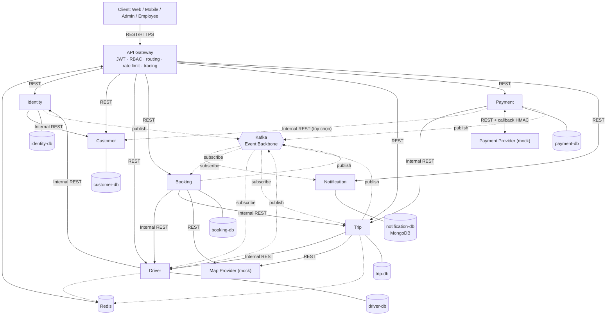

### 1.3 Quy ước chung

| Hạng mục | Quy ước |
|---|---|
| Đồng bộ nội bộ | Internal REST, prefix `/internal`, JSON, kèm service credential ([2.4](#24-xác-thực-giữa-các-service)) |
| Bất đồng bộ | Kafka, event envelope thống nhất ([mục 7](#7-kafka-topics--event-catalog)), phát qua **outbox** |
| Database | Mỗi service một database riêng; không FK xuyên service; không đọc DB của service khác |
| Đồ thị gọi | Không có vòng: Identity → Customer · Driver → Identity · Booking → Driver, Trip · Trip → Driver · Payment → Trip, Customer |
| Idempotency | Mọi lệnh ghi quan trọng có khóa idempotency (`Idempotency-Key`, `bookingId`, `providerTransactionId`, `eventId`) |
| Định dạng | JSON `camelCase` ở API, `snake_case` ở DB; thời gian ISO-8601 UTC; tiền là số nguyên VND; ID là UUID |
| Lỗi | `{ "code", "message", "requestId" }` ([9.5](#95-hợp-đồng-api-chung)) |

### 1.4 Đối chiếu SRS v1.3

| SRS v1.3 §14 | Thiết kế này |
|---|---|
| `identity-service` | `identity-service` |
| `customer-service` | `customer-service` |
| `driver-service` | `driver-service` |
| `booking-service` | `booking-service` |
| `trip-service` (gồm Review) | `trip-service` |
| `payment-service` | `payment-service` |
| `notification-service` | `notification-service` |
| `backoffice-service` (P2) | chưa dựng ở P1 |
| `mock-payment-provider`, `mock-map-provider` | có, mục [10.4](#104-mock-provider) |

### 1.5 Phạm vi triển khai

| Giai đoạn | Nội dung |
|---|---|
| **P1** | Mọi thứ cần cho PC1–PC30. Thành phần P1 được đánh dấu mặc định; thứ gì thuộc P2 được ghi rõ **(P2)** |
| **P2** | `backoffice-service`, quản lý account/role bởi Admin, `refresh_tokens`/logout, CRUD `payment_methods`, `customer_activity`, Employee/Incident/Board |

---

## 2. Context Map & tương tác giữa các service

### 2.1 Quan hệ giữa các Bounded Context

| Upstream (cung cấp) | Downstream (dùng) | Kiểu quan hệ | Mục đích |
|---|---|---|---|
| Customer | Identity | Customer/Supplier (sync) | Identity tạo hồ sơ Customer khi đăng ký |
| Identity | Driver | Customer/Supplier (sync) | Driver tạo Account cho tài xế |
| Driver | Booking, Trip | Customer/Supplier (sync) | Tìm/giữ/đánh dấu bận tài xế; lấy thông tin hiển thị |
| Trip | Booking, Payment | Customer/Supplier (sync) | Booking tạo Trip; Payment đọc Trip để lấy cước |
| Booking, Trip, Driver, Payment, Identity | Notification | Published Language (Kafka) | Sự kiện nghiệp vụ → thông báo |
| Trip | Booking, Driver | Published Language (Kafka) | `trip.completed`/`trip.canceled` làm đổi trạng thái Booking, Driver |
| Payment | Trip | Published Language (Kafka) + sync best-effort | `payment.completed` → `paymentStatus = PAID` |
| Driver | Trip | Published Language (Kafka) | `driver.location` trong chuyến |
| Payment Provider, Map Provider | Payment, Booking, Trip | Anti-corruption layer (adapter) | Hệ thống ngoài không chạm vào model nội bộ |

### 2.2 Danh mục Internal REST

Chỉ gọi được từ service network, luôn kèm `X-Service-Token` và `X-Request-Id`. Tất cả trả JSON; lỗi theo [9.5](#95-hợp-đồng-api-chung).

| Callee | Endpoint | Caller | Mục đích | Idempotency |
|---|---|---|---|---|
| Identity | `POST /internal/accounts` | driver | Tạo Account role `DRIVER` (`accountId`, `phone`, `email?`, `password`, `displayName`) | theo `accountId` |
| Identity | `GET /internal/roles/{role}/permissions` | gateway | Nạp permission cho RBAC (cache 60 giây) | đọc |
| Customer | `POST /internal/customers` | identity | Tạo hồ sơ Customer (`id = accountId`, `fullName`, `email`, `phone`) | theo `id` |
| Customer | `GET /internal/customers/{id}/payment-methods/{pmId}` | payment | Lấy token phương thức thanh toán (khi `POST /payments` có `paymentMethodId`) **(P2)** | đọc |
| Driver | `GET /internal/drivers/nearby` | booking | Ứng viên theo `lat`, `lng`, `radius`, `vehicleType`, `excludeIds`, `limit` | đọc |
| Driver | `POST /internal/drivers/{id}/reservations` | booking | Giữ chỗ tài xế cho một Offer (`bookingId`, `ttlSec`) | theo `(driverId, bookingId)` |
| Driver | `DELETE /internal/drivers/{id}/reservations/{bookingId}` | booking | Nhả giữ chỗ | idempotent |
| Driver | `POST /internal/drivers/{id}/busy` | booking | `ONLINE → BUSY`, ghi `currentTripId`, xóa reservation | theo `tripId` |
| Driver | `GET /internal/drivers/{id}/summary` | booking, trip | Tên, ảnh, rating, thông tin xe để hiển thị | đọc |
| Trip | `POST /internal/trips` | booking | Tạo Trip từ Booking (tính `distanceKm`, `fare`) | theo `bookingId` |
| Trip | `GET /internal/trips/{id}` | payment | Đọc `status`, `fare`, `customerId`, `paymentStatus` | đọc |
| Trip | `POST /internal/trips/{id}/payment-status` | payment | Đồng bộ `PAID` ngay sau khi Payment `COMPLETED` (best-effort) | idempotent |

Map Provider và Payment Provider là hệ thống ngoài, gọi qua adapter REST, không thuộc danh mục này.

### 2.3 Tương tác Kafka (tóm tắt)

| Topic | Producer | Consumer | Tác động chính |
|---|---|---|---|
| `identity.events` | identity | notification | Thông báo khóa/mở khóa account |
| `driver.events` | driver | notification, booking | Kết quả duyệt; `driver.offline` hủy Offer `PENDING` |
| `driver.location` | driver | trip | Vị trí tài xế trong chuyến |
| `booking.events` | booking | notification, driver, customer **(P2)** | Offer cho tài xế; hủy Booking; lịch sử |
| `trip.events` | trip | booking, driver, notification, customer **(P2)** | Hoàn tất/hủy → Booking, Driver đổi trạng thái |
| `payment.events` | payment | trip, notification, customer **(P2)** | `payment.completed` → `PAID` |
| `notification.commands`, `notification.dlq` | các service / notification | notification / vận hành | Lệnh gửi riêng; event lỗi |

Catalog đầy đủ ở [mục 7](#7-kafka-topics--event-catalog).

### 2.4 Xác thực giữa các service

Bảo đảm PC8 (không đi vòng qua Gateway) và FR-S06/FR-S17:

1. **Network:** chỉ `gateway` publish port; các service nằm trong network `cab-internal` của Compose.
2. **Service credential:** mỗi lời gọi nội bộ (kể cả từ Gateway) mang header `X-Service-Token` là JWT `HS256` ký bằng `INTERNAL_JWT_SECRET`, TTL `INTERNAL_JWT_TTL_SEC` (60 giây), claims `iss` (service gọi), `aud` (service được gọi), `iat`, `exp`. Thiếu hoặc sai → `401`.
3. **Allowlist theo endpoint:** mỗi endpoint `/internal/**` khai báo danh sách `iss` được phép (ví dụ `POST /internal/drivers/{id}/busy` chỉ `booking-service`); sai `iss` → `403`.
4. **JWT người dùng:** Gateway chuyển tiếp nguyên `Authorization: Bearer ...`; **mỗi service tự verify** chữ ký, `exp` và kiểm tra ownership (FR-S11), không chỉ tin Gateway. Header `X-User-Id`, `X-User-Role`, `X-Service-Token` do client gửi lên đều bị Gateway xóa trước khi chuyển tiếp.
5. **Public nhưng tự bảo vệ:** `POST /payments/callback` không dùng JWT mà dùng chữ ký HMAC; `POST /auth/*`, `POST /drivers/otp/*` là public có rate limit.

---

## 3. Ngôn ngữ chung toàn hệ thống

### 3.1 Thuật ngữ

| Thuật ngữ | Ý nghĩa |
|---|---|
| Account | Danh tính đăng nhập: định danh (`email` hoặc `phone`), mật khẩu băm, trạng thái, role |
| Role / Permission | Role: `CUSTOMER`, `DRIVER`, `OPERATIONS_STAFF`, `USER_STAFF`, `FINANCE_STAFF`, `SUPERVISOR`, `ADMIN`, `BOARD`. Permission dạng `resource:action` |
| Customer | Hồ sơ người đặt xe; `id` trùng `accountId` |
| Driver | Hồ sơ tài xế; `id` trùng `accountId`; trạng thái `PENDING_APPROVAL`, `REJECTED`, `OFFLINE`, `ONLINE`, `BUSY` |
| Booking | Yêu cầu đặt xe của Customer; trạng thái `SEARCHING`, `ASSIGNED`, `NO_DRIVER_FOUND`, `COMPLETED`, `CANCELED` |
| Offer | Lời mời một Driver nhận Booking, có TTL; `PENDING`, `ACCEPTED`, `REJECTED`, `EXPIRED`, `CANCELED` |
| Reservation | Khóa tạm (Redis) giữ một Driver cho một Offer để không bị mời trùng |
| Trip | Chuyến đi sau khi có Driver; `ASSIGNED`, `ARRIVED`, `IN_PROGRESS`, `COMPLETED`, `CANCELED` |
| Fare | Cước = `round(baseFare + perKm × distanceKm)`, tính phía server theo `vehicleType` |
| Payment | Một lần thanh toán online cho Trip đã `COMPLETED`: `PENDING`, `COMPLETED`, `FAILED` |
| Callback | Request từ Payment Provider báo kết quả, xác thực bằng HMAC |
| Review | Đánh giá `stars` 1–5 và `comment` của Customer cho Trip đã hoàn thành |
| Outbox | Bảng lưu event cùng transaction nghiệp vụ, relay lên Kafka sau |
| Idempotency | Gọi lại cùng yêu cầu không tạo hiệu ứng lần hai |

### 3.2 Trạng thái thuộc service nào

| Đối tượng | Service sở hữu | Service khác chỉ **đề nghị** qua |
|---|---|---|
| Account | Identity | — |
| Driver | Driver | `POST /internal/drivers/{id}/busy` (Booking); event `trip.*` (Driver tự chuyển `ONLINE`) |
| Booking, Offer | Booking | event `trip.*`, `driver.offline` |
| Trip | Trip | `POST /internal/trips` (Booking), `payment-status` (Payment) |
| Payment | Payment | — |

Nguyên tắc: một service **không bao giờ ghi** vào dữ liệu của service khác; chỉ gửi yêu cầu hoặc phát event để chủ sở hữu tự đổi trạng thái.

### 3.3 Quy ước đặt tên

| Hạng mục | Quy ước |
|---|---|
| Event | `<aggregate>.<hành_động_quá_khứ>`, ví dụ `trip.completed`, `payment.completed` |
| Topic | `<context>.events`; `driver.location` riêng cho tần suất cao |
| Biến cấu hình | `UPPER_SNAKE_CASE`, khai báo trong `.env.example` |
| Bảng/cột | `snake_case`, bảng số nhiều |
| Mã lỗi | `UPPER_SNAKE_CASE` ổn định, ví dụ `TRIP_NOT_COMPLETED`, `IDEMPOTENCY_KEY_REQUIRED` |

---

## 4. Loại cơ sở dữ liệu sử dụng

### 4.1 Vai trò từng công nghệ

| Công nghệ | Dùng cho | Lý do |
|---|---|---|
| PostgreSQL | Dữ liệu nghiệp vụ có quan hệ và cần transaction: account, hồ sơ, booking, offer, trip, payment, outbox | ACID, unique/partial unique index (một tài xế thắng Offer, một Payment hiệu lực cho mỗi Trip), `FOR UPDATE SKIP LOCKED` cho worker |
| MongoDB | Notification: lưu theo document, TTL, schema linh hoạt theo từng loại thông báo | Ghi nhiều, truy vấn theo người nhận, không cần join |
| Redis | Rate limit, OTP, registration token, GEO index tài xế, reservation, vị trí trong chuyến | TTL, tốc độ, GEO; mất Redis không làm mất source of truth |
| Kafka | Event backbone | Tách service, replay, nhiều consumer |

### 4.2 Database theo service

| Service | Database | Dữ liệu tạm |
|---|---|---|
| `gateway` | Redis (`gateway_runtime`) | `rl:*` (rate limit), `cache:rbac:{role}` |
| `identity-service` | PostgreSQL `identity_db` | — |
| `customer-service` | PostgreSQL `customer_db` | — |
| `driver-service` | PostgreSQL `driver_db` | Redis: `otp:*`, `regtoken:*`, `driver:geo`, `driver:reserve:{id}` |
| `booking-service` | PostgreSQL `booking_db` | — |
| `trip-service` | PostgreSQL `trip_db` | Redis: `trip:location:{tripId}` |
| `payment-service` | PostgreSQL `payment_db` | — |
| `notification-service` | MongoDB `notification_db` | — |

### 4.3 Bảng/collection của từng service

| Service | Bảng / collection |
|---|---|
| `identity-service` | `accounts`, `roles`, `permissions`, `account_roles`, `role_permissions`, `audit_logs`, `outbox_events`, `refresh_tokens` **(P2)** |
| `customer-service` | `customer_profiles`, `payment_methods` **(P2)**, `customer_activity` **(P2)**, `processed_events` **(P2)** |
| `driver-service` | `drivers`, `vehicles`, `work_schedules`, `driver_status_history`, `driver_locations`, `audit_logs`, `outbox_events`, `processed_events` |
| `booking-service` | `bookings`, `offers`, `booking_status_history`, `idempotency_records`, `outbox_events`, `processed_events` |
| `trip-service` | `trips`, `trip_status_history`, `fare_rules`, `reviews`, `outbox_events`, `processed_events` |
| `payment-service` | `payments`, `webhook_events`, `idempotency_records`, `outbox_events` |
| `notification-service` | `notifications`, `notification_templates`, `device_tokens`, `delivery_attempts`, `processed_events` |

Cột, kiểu, ràng buộc và index chi tiết ở [mục 8](#8-thiết-kế-database-chi-tiết-erd--data-dictionary).

---

## 5. Thiết kế từng Bounded Context

### 5.0 API Gateway

**Trách nhiệm (PC3):** điểm vào duy nhất của client; xác thực JWT; kiểm tra RBAC; định tuyến; rate limit; gán `requestId`; tổng hợp health. Gateway **không** chứa nghiệp vụ và **không** có database nghiệp vụ.

**Luồng xử lý một request**

1. Gán `X-Request-Id` (giữ nguyên nếu client gửi hợp lệ, ngược lại sinh mới).
2. Xóa mọi header giả mạo: `X-Service-Token`, `X-User-Id`, `X-User-Role`.
3. Rate limit theo IP (`100 req/phút`); `POST /auth/login` và `POST /drivers/otp/*` theo IP (`10 req/phút`). Counter dùng Redis; vượt ngưỡng → `429` + `Retry-After`.
4. Với route cần đăng nhập: verify JWT (chỉ `HS256`, từ chối `alg=none`, kiểm tra chữ ký, `exp`, `iat`, `sub`, `role`) → sai → `401`.
5. Rate limit theo user cho `POST /bookings` (`10 req/phút/user`), sau bước 4.
6. Kiểm tra route policy (role). `EMPLOYEE` còn phải có permission cụ thể (cache từ Identity) → sai → `403`.
7. Chuyển tiếp tới service kèm `Authorization`, `X-Request-Id`, `X-Service-Token` (timeout 15 giây); ánh xạ `DEADLINE_EXCEEDED`/không kết nối được → `504`/`503`.

**Bảng route (P1)**

| Route | Service | Role được phép | Ghi chú |
|---|---|---|---|
| `GET /health`, `GET /ready`, `GET /health/services` | gateway | public | `/health/services` gọi `/ready` từng service |
| `POST /auth/register`, `POST /auth/login` | identity | public | login: giới hạn 10/phút/IP |
| `GET /customers/{id}` | customer | `CUSTOMER` (own), `EMPLOYEE` (`customer:read`), `ADMIN` | |
| `GET /drivers/nearby` | driver | `CUSTOMER`, `EMPLOYEE`, `ADMIN` | |
| `GET /drivers/{id}` | driver | `DRIVER` (own), `CUSTOMER` (own-in-trip), `EMPLOYEE`, `ADMIN` | |
| `PUT /drivers/me/location`, `PUT /drivers/me/availability` | driver | `DRIVER` | |
| `POST /drivers/otp/request`, `POST /drivers/otp/verify`, `POST /drivers/register` | driver | public | giới hạn 10/phút/IP |
| `GET /admin/drivers`, `GET /admin/drivers/{id}`, `POST /admin/drivers/{id}/approve`, `POST /admin/drivers/{id}/reject` | driver | `ADMIN` | |
| `GET /bookings`, `POST /bookings`, `POST /bookings/{id}/cancel` | booking | `CUSTOMER` | `POST /bookings`: 10/phút/user |
| `GET /offers`, `POST /offers/{id}/accept`, `POST /offers/{id}/reject` | booking | `DRIVER` | |
| `GET /trips/{id}`, `GET /trips/{id}/location` | trip | `CUSTOMER` (own), `DRIVER` (own), `EMPLOYEE` | |
| `PATCH /trips/{id}/status` | trip | `DRIVER` (own) | |
| `POST /trips/{id}/cancel` | trip | `CUSTOMER` (own), `DRIVER` (own), `EMPLOYEE` | |
| `POST /trips/{id}/reviews` | trip | `CUSTOMER` (own) | |
| `POST /payments`, `GET /payments/{id}` | payment | `CUSTOMER` (own); `GET` thêm `FINANCE_STAFF`, `ADMIN` | |
| `POST /payments/callback` | payment | public | xác thực HMAC, không dùng JWT |
| `GET /notifications`, `PATCH /notifications/{id}/read` | notification | mọi role đã đăng nhập (own) | |

Route Employee/Incident/Board/Admin account **(P2)** thêm sau khi dựng `backoffice-service`.

**Health tổng hợp (`GET /health/services`):** gọi song song `GET /ready` của từng service với timeout 2 giây, trả `{ "status": "UP" hoặc "DEGRADED", "services": [ { "name", "status", "latencyMs" } ] }`.

---

### 5.1 Identity Service

| Mục | Nội dung |
|---|---|
| **a. Trách nhiệm** | Account, đăng ký/đăng nhập, cấp JWT, role và permission |
| **b. API qua Gateway** | `POST /auth/register`, `POST /auth/login` |
| **c. Internal REST cung cấp** | `POST /internal/accounts` (cho Driver), `GET /internal/roles/{role}/permissions` (cho Gateway) |
| **d. Gọi đi** | `POST /internal/customers` (Customer) |
| **e. Kafka** | Publish `identity.events`: `account.registered`, `account.locked`, `account.unlocked`, `account.role_changed`. Không subscribe |
| **f. Bảng** | Xem [4.3](#43-bảngcollection-của-từng-service) và [8.5.1](#851-identity_db) |

**Quy tắc**

1. Đăng ký Customer: chuẩn hóa `email` (lowercase), `phone` (E.164, `+84…`); `phone_hash = HMAC-SHA256(phone, PHONE_HASH_PEPPER)`; **không lưu phone dạng rõ** ở Identity. Trùng email/phone → `409`; sai định dạng → `400`.
2. Mật khẩu: bcrypt (cost 10), tối thiểu 8 ký tự.
3. Đăng nhập bằng `email` **hoặc** `phone` (Driver chỉ có phone). Tra cứu bằng tham số hóa (email) hoặc `phone_hash`; sai thông tin → `401` thông báo chung.
4. Sai mật khẩu liên tiếp 5 lần → khóa 15 phút (`failed_login_count`, `locked_until`).
5. JWT `HS256`, TTL 15 phút, claims `sub` (= accountId), `role`, `iat`, `exp`, `jti`. Role lấy từ DB, không lấy từ body.
6. **Saga đăng ký:** tạo Account `PENDING` → `POST /internal/customers` (idempotent theo `id`) → Account `ACTIVE` + outbox `account.registered`. Customer lỗi → xóa Account `PENDING`. Job dọn Account `PENDING` quá 10 phút: gọi lại Customer; thành công thì `ACTIVE`, lỗi thì xóa.
7. `POST /internal/accounts` (Driver gọi) tạo Account `ACTIVE` role `DRIVER`, idempotent theo `accountId`; trùng phone/email → `409`.
8. Seed: 8 role, permission, Admin, Board, Employee từng role, Customer và Driver mẫu ([10.5](#105-seed-dữ-liệu)).
9. **(P2)** Admin khóa/mở khóa account, gán role, refresh token và logout; mọi thao tác ghi `audit_logs`.

---

### 5.2 Customer Service

| Mục | Nội dung |
|---|---|
| **a. Trách nhiệm** | Hồ sơ Customer; phương thức thanh toán **(P2)** |
| **b. API qua Gateway** | `GET /customers/{id}` |
| **c. Internal REST cung cấp** | `POST /internal/customers`; `GET /internal/customers/{id}/payment-methods/{pmId}` **(P2)** |
| **d. Gọi đi** | Không |
| **e. Kafka** | Không publish. Subscribe `booking.events`, `trip.events`, `payment.events` để dựng `customer_activity` **(P2)** |
| **f. Bảng** | [4.3](#43-bảngcollection-của-từng-service), [8.5.2](#852-customer_db) |

**Quy tắc**

1. `GET /customers/{id}`: `CUSTOMER` chỉ xem hồ sơ của chính mình (`sub == id`), sai → `403`; `EMPLOYEE` cần `customer:read`; `ADMIN` được xem. Customer khác trả `403`, không tồn tại trả `404`.
2. `phone` lưu mã hóa AES-256-GCM (`phone_enc`) và `phone_hash` để tra cứu; response chỉ trả phone dạng rõ cho chính chủ, còn lại trả dạng che (`+84•••••1234`).
3. `POST /internal/customers` idempotent theo `id` (gọi lại trả lại hồ sơ đã có).
4. Payment không được thành điều kiện để đặt xe: Customer **không cần** có phương thức thanh toán lưu sẵn (`POST /payments` chỉ dùng `paymentMethodId` khi được gửi).

---

### 5.3 Driver Service

| Mục | Nội dung |
|---|---|
| **a. Trách nhiệm** | Hồ sơ Driver, Vehicle, OTP và onboarding, duyệt hồ sơ, availability, vị trí, giữ chỗ (reservation) |
| **b. API qua Gateway** | `POST /drivers/otp/request`, `POST /drivers/otp/verify`, `POST /drivers/register`, `GET /drivers/{id}`, `GET /drivers/nearby`, `PUT /drivers/me/location`, `PUT /drivers/me/availability`, `GET /admin/drivers`, `GET /admin/drivers/{id}`, `POST /admin/drivers/{id}/approve`, `POST /admin/drivers/{id}/reject` |
| **c. Internal REST cung cấp** | `GET /internal/drivers/nearby`, `POST /internal/drivers/{id}/reservations`, `DELETE /internal/drivers/{id}/reservations/{bookingId}`, `POST /internal/drivers/{id}/busy`, `GET /internal/drivers/{id}/summary` |
| **d. Gọi đi** | `POST /internal/accounts` (Identity) |
| **e. Kafka** | Publish `driver.events` (`driver.registered`, `driver.approved`, `driver.rejected`, `driver.online`, `driver.offline`, `driver.busy`) và `driver.location`. Subscribe `trip.events` (`trip.completed`/`trip.canceled` → `ONLINE`; `trip.reviewed` → rating), `booking.events` (`booking.canceled` → nhả reservation) |
| **f. Bảng / Redis** | [4.3](#43-bảngcollection-của-từng-service), [8.5.3](#853-driver_db); Redis `otp:{phone_hash}`, `otp_fail:{phone_hash}`, `regtoken:{token}`, `driver:geo`, `driver:reserve:{driverId}` |

**Quy tắc**

1. **OTP (PC21):** 6 chữ số, TTL 300 giây, lưu **hash** trong Redis; sai quá 5 lần → khóa 15 phút; đúng → `registrationToken` (15 phút, dùng một lần, chỉ bị đánh dấu đã dùng sau khi transaction lưu hồ sơ commit). Môi trường test: OTP được ghi ra log của service (không gửi SMS thật).
2. **Đăng ký:** Driver sinh `driverId` trước → `POST /internal/accounts` (idempotent theo `accountId`) → transaction lưu `drivers`, `vehicles` ở `PENDING_APPROVAL` + outbox `driver.registered`. Lưu hồ sơ lỗi thì retry cùng `driverId`, không sinh Account mồ côi. Trường bắt buộc theo SRS 6.9.4; bằng lái hết hạn bị từ chối (`400`).
3. **Duyệt (PC22):** chỉ `ADMIN`; `PENDING_APPROVAL → OFFLINE` (duyệt, ghi `reviewed_by`, `reviewed_at`) hoặc `→ REJECTED` (bắt buộc `rejected_reason`); ghi `audit_logs`; outbox `driver.approved`/`driver.rejected`.
4. **Availability (PC23):** chỉ Driver đã duyệt; `OFFLINE ↔ ONLINE`; `BUSY` không được chuyển `OFFLINE` (`409`); chuyển `ONLINE` yêu cầu đã có vị trí hợp lệ; mọi thay đổi ghi `driver_status_history` + outbox.
5. **Vị trí (PC13):** `PUT /drivers/me/location` kiểm tra `lat ∈ [-90,90]`, `lng ∈ [-180,180]` (sai → `400`); ghi `driver:geo` (Redis `GEOADD`) và upsert `driver_locations` (mỗi tài xế một dòng). Chỉ khi Driver đang `BUSY` mới phát `driver.location_updated` (kèm `tripId`) để Trip theo dõi.
6. **GEO index:** nạp lại từ `driver_locations` khi service khởi động (mất Redis không mất dữ liệu). Chứa mọi Driver đã duyệt có vị trí.
7. **Nearby (`GET /drivers/nearby`):** `GEOSEARCH` theo `lat`, `lng`, `radius` (mặc định 1000 m) lấy tối đa 500 ID kèm khoảng cách → lọc trong PostgreSQL theo `status` (mặc định `ONLINE`), `vehicleType`, đã duyệt → sắp xếp theo `distanceM` tăng dần → phân trang (`page`, `limit ≤ 50`) và trả `pagination.total` theo FR-S16. Internal `nearby` dùng cùng thuật toán nhưng luôn `status = ONLINE`, bỏ `excludeIds`, bỏ tài xế đang có reservation, và nếu bật `LOCATION_STALE_SEC` thì bỏ tài xế có vị trí cũ hơn ngưỡng (mặc định tắt để seed tĩnh vẫn khớp được).
8. **Reservation:** `SET driver:reserve:{driverId} {bookingId} NX EX 35`. Gọi lại cùng `(driverId, bookingId)` là idempotent; khác `bookingId` → `409`. `busy` và `DELETE` xóa key. TTL 35 giây = `OFFER_TTL_SEC` + 5 giây.
9. **`POST /internal/drivers/{id}/busy`:** `ONLINE → BUSY`, ghi `current_trip_id`, xóa reservation, ghi history, outbox `driver.busy`; idempotent theo `tripId`.
10. **Phản ứng event:** `trip.completed`/`trip.canceled` → `BUSY → ONLINE`, xóa `current_trip_id`, `completed_trips + 1` khi hoàn tất; `trip.reviewed` → cộng `rating_sum`, `rating_count`. Mọi consumer ghi `processed_events` cùng transaction.
11. `GET /drivers/{id}`: `DRIVER` chỉ xem của mình; `CUSTOMER` chỉ xem Driver của Trip đang/đã thuộc mình (own-in-trip, kiểm tra qua Trip); `EMPLOYEE`/`ADMIN` được xem. Phone, số CCCD, bằng lái luôn che.

---

### 5.4 Booking Service

| Mục | Nội dung |
|---|---|
| **a. Trách nhiệm** | Tạo và quản lý Booking, Dispatch/matching, Offer, điều phối luồng nhận chuyến |
| **b. API qua Gateway** | `GET /bookings`, `POST /bookings`, `POST /bookings/{id}/cancel`, `GET /offers`, `POST /offers/{id}/accept`, `POST /offers/{id}/reject` |
| **c. Internal REST cung cấp** | Không |
| **d. Gọi đi** | Driver: `nearby`, `reservations`, `busy`, `summary`; Trip: `POST /internal/trips`; Map Provider: geocode (khi thiếu tọa độ) |
| **e. Kafka** | Publish `booking.events` (`booking.created`, `offer.created`, `booking.assigned`, `booking.no_driver_found`, `booking.canceled`, `booking.completed`). Subscribe `trip.events` (`trip.completed` → `COMPLETED`, `trip.canceled` → `CANCELED`), `driver.events` (`driver.offline` → hủy Offer `PENDING`) |
| **f. Bảng** | [4.3](#43-bảngcollection-của-từng-service), [8.5.4](#854-booking_db) |

**Quy tắc**

1. **Tạo Booking (PC15):** `Idempotency-Key` bắt buộc (thiếu → `400`); validate `pickup`, `destination`, `vehicleType`; thiếu `lat/lng` thì geocode qua Map Provider. Một transaction ghi `bookings` (`SEARCHING`, `next_dispatch_at = now()`) + `booking_status_history` + outbox `booking.created` + `idempotency_records`. Trả `201` ngay, không chờ matching.
2. **Idempotency:** cùng `(customerId, endpoint, key)` + cùng payload → trả lại response cũ; payload khác → `422`. TTL 24 giờ.
3. **Dispatch worker:** quét định kỳ (1 giây) `bookings` `SEARCHING` có `next_dispatch_at <= now()` và không có Offer `PENDING`, dùng `FOR UPDATE SKIP LOCKED` nên nhiều instance không tranh nhau, và vẫn chạy lại sau khi restart.
4. **Một bước dispatch:** `attempt_count < OFFER_MAX_ATTEMPTS` → gọi `nearby` (loại tài xế đã mời) → chọn tài xế gần nhất → `POST reservations` → transaction ghi `offers` (`PENDING`, `expires_at = now + OFFER_TTL_SEC`), tăng `attempt_count`, outbox `offer.created`. Không còn ứng viên hoặc hết lượt → Booking `NO_DRIVER_FOUND` + outbox `booking.no_driver_found`.
5. **Hết hạn Offer:** job chuyển Offer quá `expires_at` thành `EXPIRED`, nhả reservation, đặt `next_dispatch_at = now()` để thử tài xế kế. Driver `reject` làm tương tự với `REJECTED`.
6. **Nhận chuyến (PC16):** `POST /offers/{id}/accept` chỉ do Driver sở hữu Offer gọi.
   1. Transaction: khóa Booking `FOR UPDATE`, kiểm tra Offer `PENDING` chưa hết hạn, Booking `SEARCHING` → Offer `ACCEPTED`, Offer `PENDING` khác của Booking → `CANCELED`. Partial unique index `offers(booking_id) WHERE status='ACCEPTED'` bảo đảm đúng một tài xế thắng; request thua nhận `409`.
   2. `POST /internal/trips` (idempotent theo `bookingId`).
   3. `POST /internal/drivers/{id}/busy` (idempotent theo `tripId`).
   4. Transaction: Booking `ASSIGNED`, ghi `trip_id`, `current_driver_id`, outbox `booking.assigned`.
   5. Trả `200` kèm `tripId`.
   Gọi lại accept với cùng Driver khi Offer đã `ACCEPTED` thì **tiếp tục từ bước chưa xong** (idempotent).
7. **Saga recovery:** worker quét Booking `SEARCHING` có Offer `ACCEPTED` nhưng `trip_id IS NULL` quá 30 giây → chạy lại các bước 2–4. Quá 10 phút vẫn lỗi → Booking `CANCELED` (`cancel_reason = SYSTEM_ERROR`), nhả reservation, outbox `booking.canceled`.
8. **Hủy (PC18 phần Booking):** `POST /bookings/{id}/cancel` với `reason`, chỉ khi `SEARCHING`: Offer `PENDING` → `CANCELED`, nhả reservation, Booking `CANCELED`, outbox `booking.canceled`. Đang có Offer `ACCEPTED` chưa `ASSIGNED` → `409 BOOKING_ASSIGNING`; đã `ASSIGNED` → `409 BOOKING_ALREADY_ASSIGNED` (hủy qua `POST /trips/{id}/cancel`).
9. **Phản ứng event:** `trip.completed` → Booking `COMPLETED`; `trip.canceled` → Booking `CANCELED` (`cancel_reason = TRIP_CANCELED`); `driver.offline` → Offer `PENDING` của tài xế đó `CANCELED` và `next_dispatch_at = now()`. Event chỉ áp dụng nếu chuyển trạng thái hợp lệ; event lặp/đến muộn không làm lùi trạng thái.
10. `GET /bookings` chỉ trả Booking của Customer đang đăng nhập, sắp xếp mới nhất trước, paging theo FR-S16.
11. `GET /offers` (Driver): Offer `PENDING` của chính tài xế, chưa hết hạn, kèm thông tin điểm đón.

---

### 5.5 Trip Service

| Mục | Nội dung |
|---|---|
| **a. Trách nhiệm** | Trip, tính Fare, chuyển trạng thái chuyến, theo dõi vị trí, Review |
| **b. API qua Gateway** | `GET /trips/{id}`, `GET /trips/{id}/location`, `PATCH /trips/{id}/status`, `POST /trips/{id}/cancel`, `POST /trips/{id}/reviews` |
| **c. Internal REST cung cấp** | `POST /internal/trips`, `GET /internal/trips/{id}`, `POST /internal/trips/{id}/payment-status` |
| **d. Gọi đi** | Driver: `GET /internal/drivers/{id}/summary`; Map Provider: route distance/ETA |
| **e. Kafka** | Publish `trip.events` (`trip.assigned`, `trip.arrived`, `trip.started`, `trip.completed`, `trip.canceled`, `trip.reviewed`). Subscribe `driver.location` (ghi vị trí), `payment.events` (`payment.completed` → `PAID`) |
| **f. Bảng / Redis** | [4.3](#43-bảngcollection-của-từng-service), [8.5.5](#855-trip_db); Redis `trip:location:{tripId}` (TTL 1 giờ) |

**Quy tắc**

1. **Tạo Trip:** `POST /internal/trips` (chỉ `booking-service`) idempotent theo `bookingId` (`UNIQUE trips.booking_id`, gọi lại trả Trip đã có). Lấy `summary` tài xế → lưu `driver_snapshot`; gọi Map Provider lấy `distanceKm` (lỗi → Haversine); chọn `fare_rules` active theo `vehicleType`; `fare = round(base_fare + per_km × distanceKm)` và **khóa cố định** cùng snapshot `base_fare`, `per_km_fare`; Trip `ASSIGNED`, `payment_status = UNPAID`; outbox `trip.assigned`.
2. **Chuyển trạng thái (PC17):** `PATCH /trips/{id}/status` do **Driver được phân công** gọi: `ASSIGNED → ARRIVED → IN_PROGRESS → COMPLETED`; nhảy bước hoặc không đúng Driver → `409`/`403`. Mỗi lần ghi `trip_status_history` (kèm vị trí, người thực hiện) + outbox. Nếu bật `ARRIVAL_CONFIRM_RADIUS_M` thì kiểm tra khoảng cách tới điểm đón/trả (mặc định tắt).
3. **Hủy (PC18):** `POST /trips/{id}/cancel` với `reason` bắt buộc, chỉ `ASSIGNED`/`ARRIVED` (`IN_PROGRESS` → `409`); người gọi là Customer của Trip, Driver được phân công, hoặc Employee có quyền. Ghi người hủy, `trip.canceled` → Booking `CANCELED`, Driver `ONLINE`, Notification báo bên còn lại. Không có Payment nên không hoàn tiền.
4. **Vị trí:** consumer `driver.location` ghi `trip:location:{tripId}`; `GET /trips/{id}/location` trả vị trí gần nhất (và `updatedAt`), chưa có thì trả `location: null`. Chỉ Customer của Trip, Driver được gán hoặc Employee có quyền.
5. **Payment status:** `POST /internal/trips/{id}/payment-status` (chỉ `payment-service`) và event `payment.completed` cùng đặt `payment_status = PAID`; idempotent, không lùi từ `PAID`.
6. **Review (PC20):** `POST /trips/{id}/reviews` với `stars` (1–5), `comment` (≤ 500 ký tự, đã escape); chỉ Customer của Trip, Trip phải `COMPLETED`, mỗi Trip một Review (`UNIQUE trip_id` → `409`); outbox `trip.reviewed` kèm `driverId`, `stars`.
7. `GET /trips/{id}`: Customer hoặc Driver của Trip, Employee có quyền; người khác `403`. Trả `driver` (từ `driver_snapshot`), `fare`, `distanceKm`, `status`, `paymentStatus`.

---

### 5.6 Payment Service

| Mục | Nội dung |
|---|---|
| **a. Trách nhiệm** | Tạo Payment cho Trip đã hoàn thành, làm việc với Payment Provider, nhận callback |
| **b. API qua Gateway** | `POST /payments`, `GET /payments/{id}`, `POST /payments/callback` |
| **c. Internal REST cung cấp** | Không |
| **d. Gọi đi** | Trip: `GET /internal/trips/{id}`, `POST /internal/trips/{id}/payment-status`; Customer: `GET /internal/customers/{id}/payment-methods/{pmId}` **(P2)**; Payment Provider: `POST /transactions` |
| **e. Kafka** | Publish `payment.events` (`payment.completed`, `payment.failed`). Không subscribe |
| **f. Bảng** | [4.3](#43-bảngcollection-của-từng-service), [8.5.6](#856-payment_db) |

**Tạo Payment (PC19, PC30)**

1. `Idempotency-Key` bắt buộc (thiếu → `400`). Tra `idempotency_records` theo `(userId, endpoint, key)`: cùng payload → trả lại response cũ (không gọi Provider lần hai); payload khác → `422`.
2. `GET /internal/trips/{tripId}` → Trip phải `COMPLETED` (`409 TRIP_NOT_COMPLETED`), `customerId` phải bằng người gọi (`403`), `paymentStatus` chưa `PAID` (`409 TRIP_ALREADY_PAID`). `amount = Trip.fare`; body không được chứa `amount`.
3. Transaction: tạo `payments` `PENDING`. Partial unique index `payments(trip_id) WHERE status IN ('PENDING','COMPLETED')` bảo đảm một Payment hiệu lực cho mỗi Trip (vi phạm → `409`).
4. Gọi Provider `POST /transactions` (`merchantRef = paymentId`, `amount`, `currency`, `callbackUrl`, `methodToken` nếu có `paymentMethodId`) → ghi `provider_transaction_id`; Provider lỗi → Payment `FAILED` (`failure_code = PROVIDER_ERROR`) + outbox `payment.failed`.
5. Trả `201` `{ id, tripId, amount, status: "PENDING", providerTransactionId }`.

**Callback (`POST /payments/callback`)**

1. Đọc **raw body**; tính `HMAC-SHA256(rawBody, PAYMENT_CALLBACK_SECRET)` so sánh hằng thời gian với `X-Signature`; sai → `401`, ghi `webhook_events` (`signature_valid = false`, `REJECTED`), **không** đổi Payment.
2. Tra `webhook_events` theo `(provider, provider_event_id)`: đã có → trả `200` không xử lý lại (**không double charge**).
3. Tìm Payment theo `providerTransactionId`/`merchantRef`; kiểm tra `amount` khớp; không khớp → `REJECTED`.
4. `SUCCESS` và Payment `PENDING` → transaction: `COMPLETED` + outbox `payment.completed`. `FAILED` → `FAILED` (`failure_code` từ Provider) + outbox `payment.failed`.
5. Sau commit `COMPLETED`: gọi `POST /internal/trips/{id}/payment-status` (best-effort). Không thành công thì Trip vẫn nhận `payment.completed` qua Kafka.
6. Payment đã `COMPLETED`/`FAILED` nhận callback khác kết quả → `IGNORED`, ghi log và cảnh báo; không đổi trạng thái.

**Timeout:** job chuyển Payment `PENDING` quá `PAYMENT_PENDING_TIMEOUT_MIN` phút thành `FAILED` (`failure_code = TIMEOUT`), outbox `payment.failed`. Callback `SUCCESS` đến muộn sau đó được ghi `IGNORED` và cảnh báo Finance (đối soát thủ công).

**Đọc:** `GET /payments/{id}`: Customer chủ Payment, `FINANCE_STAFF`, `ADMIN`; người khác `403`.

**Không có trong hệ thống:** giữ tiền (hold), hoàn tiền (refund), payout cho Driver, hoa hồng (SRS 5.2, BR-F05).

---

### 5.7 Notification Service

| Mục | Nội dung |
|---|---|
| **a. Trách nhiệm** | Tiêu thụ event, tạo và lưu Notification, phát tới người nhận |
| **b. API qua Gateway** | `GET /notifications` (paging, `unread`), `PATCH /notifications/{id}/read` |
| **c. Internal REST cung cấp** | Không |
| **d. Gọi đi** | Không |
| **e. Kafka** | Subscribe `identity.events`, `driver.events`, `booking.events`, `trip.events`, `payment.events`, `notification.commands`. Publish `notification.dlq` |
| **f. Collection** | [4.3](#43-bảngcollection-của-từng-service), [8.5.7](#857-notification_db-mongodb) |

**Quy tắc**

1. Mỗi event có `recipientIds` → tạo một Notification cho từng người nhận, render từ `notification_templates` theo `eventType` + `channel` + `locale`.
2. **Idempotent:** `processed_events` (unique `eventId + recipientId`); event trùng không tạo Notification trùng (FR-K06).
3. Kênh `IN_APP` lưu DB và truy vấn qua API; `PUSH`/`EMAIL` được mock (ghi log) ở môi trường test.
4. Gửi lỗi: retry 3 lần (1 giây, 5 giây, 30 giây); vẫn lỗi → `notification.dlq`.
5. `GET /notifications` luôn lọc theo `recipientId = sub` của JWT (không nhận `recipientId` từ client); tham số truy vấn được validate và chống NoSQL injection ([9.4](#94-validation-và-chống-injection)).
6. Ánh xạ chính:

| Event | Người nhận | Nội dung |
|---|---|---|
| `offer.created` | Driver | Có chuyến mới, hạn trả lời |
| `booking.assigned` / `trip.assigned` | Customer, Driver | Thông tin tài xế/chuyến đã gán |
| `trip.arrived`, `trip.started` | Customer | Tài xế đã đến / chuyến bắt đầu |
| `trip.completed` | Customer, Driver | Hoàn thành chuyến, mời thanh toán/đánh giá |
| `trip.canceled`, `booking.canceled` | bên còn lại | Chuyến/đặt xe bị hủy, lý do |
| `booking.no_driver_found` | Customer | Không tìm được tài xế |
| `payment.completed` / `payment.failed` | Customer | Kết quả thanh toán |
| `driver.approved` / `driver.rejected` | Driver | Kết quả duyệt hồ sơ |
| `account.locked` / `account.unlocked` | chủ account | Thay đổi trạng thái tài khoản |

---

## 6. Luồng nghiệp vụ liên service

Nguyên tắc: bước cần kết quả ngay (để quyết định tiếp) dùng **Internal REST**; phản ứng phụ và thông báo dùng **Kafka qua outbox**. Mỗi service chỉ đổi trạng thái của chính mình; service khác chỉ đề nghị hoặc phản ứng bằng event. Deadline/retry xem [9.3](#93-timeout-retry-và-circuit-breaker).

### 6.1 Đăng ký tài khoản

#### 6.1.1 Customer đăng ký (PC9)

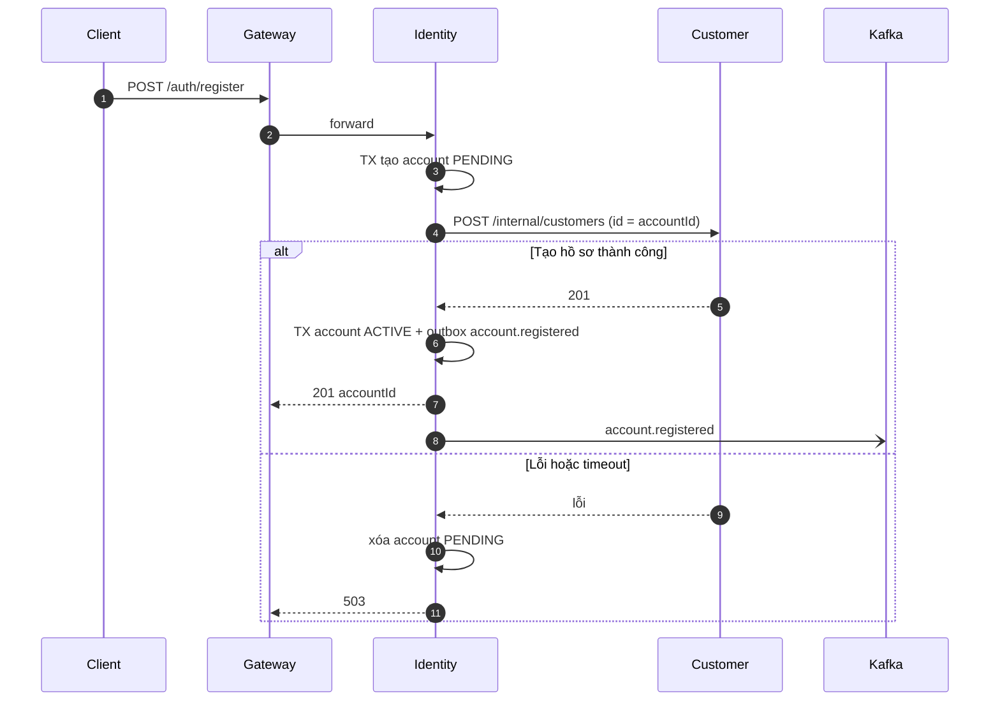

`POST /internal/customers` idempotent theo `id`, nên Identity gọi lại được khi mất response. Job dọn account `PENDING` quá 10 phút giải quyết trường hợp Identity crash giữa chừng.

#### 6.1.2 Driver đăng ký và được duyệt (PC21, PC22)

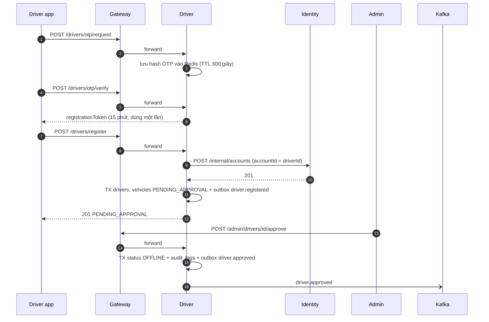

Driver sinh `driverId` trước và `POST /internal/accounts` idempotent theo `accountId`, nên lưu hồ sơ lỗi chỉ cần retry cùng `driverId`.

### 6.2 Đặt xe → tài xế nhận chuyến (PC15, PC16)

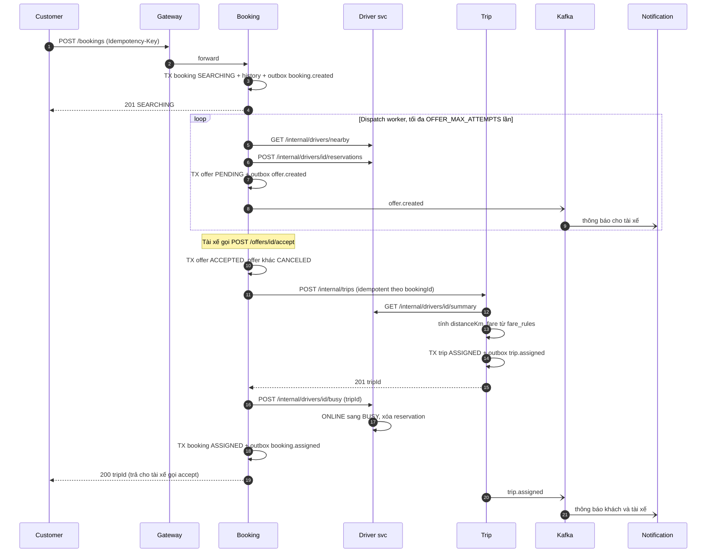

**Điểm thiết kế cần nhớ**

1. **Không có thanh toán trong luồng này.** Payment chỉ phát sinh sau khi Trip `COMPLETED` (SRS BR-F03), nên saga nhận chuyến chỉ gồm Booking, Trip, Driver.
2. **Một tài xế thắng duy nhất** nhờ partial unique index `offers(booking_id) WHERE status='ACCEPTED'` kết hợp khóa `FOR UPDATE`; request thua nhận `409`.
3. **Idempotent từng bước:** `CreateBooking` theo `Idempotency-Key`; Trip theo `bookingId`; `busy` theo `tripId`. Accept lặp lại của cùng Driver tiếp tục từ bước chưa xong.
4. **Saga recovery:** Booking `SEARCHING` có Offer `ACCEPTED` mà `trip_id IS NULL` quá 30 giây → Booking chạy lại bước tạo Trip → `busy` → `ASSIGNED`; quá 10 phút vẫn lỗi thì `CANCELED` (`SYSTEM_ERROR`) và nhả reservation.
5. **Khách thấy thông tin tài xế** qua `GET /trips/{id}` (`driver_snapshot`) và notification `trip.assigned`.
6. **Khách hủy trong lúc saga** nhận `409 BOOKING_ASSIGNING`; sau khi `ASSIGNED` thì hủy qua `POST /trips/{id}/cancel`.

### 6.3 Vòng đời chuyến và thanh toán (PC17, PC19)

| Bước | Ai gọi | Trip chuyển | Event | Phản ứng |
|---|---|---|---|---|
| Tới điểm đón | Driver `PATCH /trips/{id}/status` | `ASSIGNED → ARRIVED` | `trip.arrived` | Notification báo khách |
| Khách lên xe | Driver | `ARRIVED → IN_PROGRESS` | `trip.started` | Notification báo khách |
| Trong chuyến | Driver `PUT /drivers/me/location` | — | `driver.location_updated` | Trip ghi vị trí; khách xem `GET /trips/{id}/location` |
| Tới điểm trả | Driver | `IN_PROGRESS → COMPLETED` | `trip.completed` | Booking `COMPLETED` · Driver `ONLINE` · Notification mời thanh toán |
| Thanh toán | Customer `POST /payments` | — | `payment.completed` | Trip `paymentStatus = PAID` · Notification |

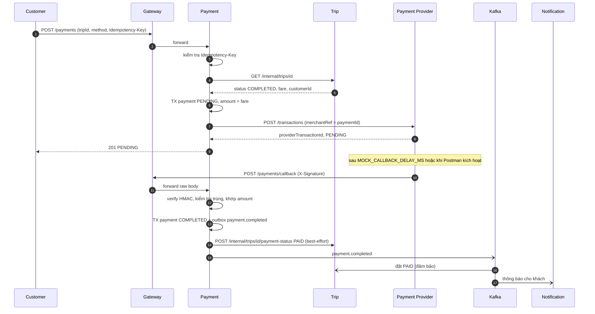

- Số tiền luôn là `Trip.fare`; client không gửi `amount`.
- `POST /payments` lặp lại với cùng `Idempotency-Key` và payload trả **response cũ**, không tạo giao dịch thứ hai (PC30). Ngay cả khi thiếu key, partial unique index theo `trip_id` vẫn chặn Payment thứ hai.
- Callback có chữ ký sai → `401`; callback trùng `provider_event_id` → `200` nhưng không xử lý lại.

### 6.4 Hủy và các nhánh kết thúc sớm (PC18)

| Tình huống | Điều kiện | Người thực hiện | Hệ quả |
|---|---|---|---|
| Hủy khi đang tìm tài xế | Booking `SEARCHING`, chưa có Offer `ACCEPTED` | Customer `POST /bookings/{id}/cancel` | Offer `PENDING → CANCELED`, nhả reservation, `booking.canceled`. Không có Trip, không có Payment |
| Hủy giữa lúc nhận chuyến | Có Offer `ACCEPTED`, Booking chưa `ASSIGNED` | Customer | `409 BOOKING_ASSIGNING` |
| Hủy Booking đã có Trip | Booking `ASSIGNED` | Customer | `409 BOOKING_ALREADY_ASSIGNED`; hủy qua Trip |
| Hủy chuyến | Trip `ASSIGNED` hoặc `ARRIVED`, bắt buộc `reason` | Customer, Driver, Employee | Trip `CANCELED` → `trip.canceled` → Booking `CANCELED` · Driver `ONLINE` · Notification báo bên còn lại. Không có Payment nên không có hoàn tiền |
| Hủy khi đang chạy | Trip `IN_PROGRESS` | — | `409` |
| Không tìm được tài xế | Hết lượt hoặc hết ứng viên | Hệ thống | Booking `NO_DRIVER_FOUND`, `booking.no_driver_found` |

### 6.5 Xử lý lỗi, nhất quán và phục hồi

| Tình huống | Phát hiện bởi | Xử lý |
|---|---|---|
| Tạo Trip timeout, không rõ đã tạo chưa | Booking | Gọi lại `POST /internal/trips`; Trip trả Trip đã có (theo `bookingId`) |
| Booking crash giữa Offer `ACCEPTED` và `ASSIGNED` | Booking recovery worker | Chạy lại các bước chưa xong; quá 10 phút thì hủy `SYSTEM_ERROR` |
| Relay outbox lỗi hoặc Kafka tạm down | Outbox relay | Event nằm lại `outbox_events` (`PENDING`), relay retry backoff; luồng đồng bộ vẫn chạy, chỉ thông báo trễ |
| Consumer nhận event trùng | Consumer | Bỏ qua nhờ `processed_events` |
| Event đến muộn/sai thứ tự | Consumer | Kiểm tra state machine; không áp dụng chuyển trạng thái không hợp lệ |
| Callback trùng hoặc sai chữ ký | Payment | Sai HMAC → `401`; trùng `provider_event_id` → `200`, không xử lý lại |
| Payment `PENDING` không có callback | Job timeout | `FAILED (TIMEOUT)` sau `PAYMENT_PENDING_TIMEOUT_MIN` phút; callback đến muộn ghi `IGNORED` và cảnh báo |
| Đồng bộ `PAID` sang Trip thất bại | Payment | Trip vẫn nhận `payment.completed` qua Kafka |
| Tài xế `OFFLINE` khi đang có Offer `PENDING` | Booking (consume `driver.offline`) | Offer `CANCELED`, thử tài xế kế tiếp |
| Redis mất | Driver, Trip | Driver nạp lại `driver:geo` từ `driver_locations`; reservation/OTP là dữ liệu tạm, sinh lại; vị trí Trip trả `null` tới khi có update mới |
| Map Provider chậm/lỗi | Booking, Trip | Timeout + circuit breaker; Trip fallback Haversine để tính `distanceKm` |
| Service nội bộ không phản hồi | Gateway | `503`/`504` có `requestId`, không lộ chi tiết nội bộ |

### 6.6 State machine và service sở hữu

| Đối tượng | Service | Trạng thái | Chuyển hợp lệ |
|---|---|---|---|
| Account | Identity | `PENDING`, `ACTIVE`, `LOCKED` | `PENDING→ACTIVE`, `ACTIVE↔LOCKED` |
| Driver | Driver | `PENDING_APPROVAL`, `REJECTED`, `OFFLINE`, `ONLINE`, `BUSY` | `PENDING_APPROVAL→OFFLINE/REJECTED`, `REJECTED→PENDING_APPROVAL`, `OFFLINE↔ONLINE`, `ONLINE→BUSY`, `BUSY→ONLINE` |
| Booking | Booking | `SEARCHING`, `ASSIGNED`, `NO_DRIVER_FOUND`, `COMPLETED`, `CANCELED` | `SEARCHING→ASSIGNED/NO_DRIVER_FOUND/CANCELED`, `ASSIGNED→COMPLETED/CANCELED` |
| Offer | Booking | `PENDING`, `ACCEPTED`, `REJECTED`, `EXPIRED`, `CANCELED` | `PENDING→` các trạng thái còn lại |
| Trip | Trip | `ASSIGNED`, `ARRIVED`, `IN_PROGRESS`, `COMPLETED`, `CANCELED` | `ASSIGNED→ARRIVED/CANCELED`, `ARRIVED→IN_PROGRESS/CANCELED`, `IN_PROGRESS→COMPLETED` |
| Trip.paymentStatus | Trip | `UNPAID`, `PAID` | `UNPAID→PAID` |
| Payment | Payment | `PENDING`, `COMPLETED`, `FAILED` | `PENDING→COMPLETED/FAILED`; Payment mới được tạo sau `FAILED` |
| Notification delivery | Notification | `PENDING`, `SENT`, `FAILED` | `PENDING→SENT/FAILED`, `FAILED→PENDING` (retry) |

Mọi chuyển trạng thái được ghi `*_status_history` (hoặc `audit_logs`) trong cùng transaction với thay đổi và outbox.

---

## 7. Kafka topics & event catalog

### 7.1 Event envelope

```json
{
  "eventId": "0192f3c0-7a1e-7c3b-9b7a-3f2d5e8a1c01",
  "eventType": "trip.completed",
  "eventVersion": 1,
  "occurredAt": "2026-10-01T03:15:30.123Z",
  "producer": "trip-service",
  "aggregateType": "Trip",
  "aggregateId": "b1c2d3e4-0000-4000-8000-000000000001",
  "requestId": "req-7f3a",
  "recipientIds": ["<customerId>", "<driverId>"],
  "data": { }
}
```

| Trường | Ý nghĩa |
|---|---|
| `eventId` | UUID duy nhất, bằng `outbox_events.id`; khóa idempotency của consumer |
| `eventType` | `<aggregate>.<hành_động_quá_khứ>` |
| `eventVersion` | Phiên bản schema `data`; thêm field tùy chọn thì giữ nguyên, đổi nghĩa thì tăng |
| `recipientIds` | Người nhận thông báo, để Notification không phải gọi service khác; rỗng nếu không cần thông báo |
| `requestId` | Truy vết từ Gateway, đồng thời nằm trong Kafka header |
| `data` | Payload nghiệp vụ; **không** chứa dữ liệu nhạy cảm (số thẻ, token, mật khẩu, phone dạng rõ) |

### 7.2 Danh sách topic

| Topic | Producer | Partition key | Consumer (group) | Retention | Partition (gợi ý) |
|---|---|---|---|---|---|
| `identity.events` | identity | `accountId` | notification | 7 ngày | 3 |
| `driver.events` | driver | `driverId` | notification, booking | 7 ngày | 3 |
| `driver.location` | driver | `driverId` | trip | 1 giờ | 6 |
| `booking.events` | booking | `bookingId` | notification, driver, customer (P2) | 7 ngày | 3 |
| `trip.events` | trip | `tripId` | booking, driver, notification, customer (P2) | 7 ngày | 3 |
| `payment.events` | payment | `tripId` | trip, notification, customer (P2) | 7 ngày | 3 |
| `notification.commands` | các service | `recipientId` | notification | 3 ngày | 1 |
| `notification.dlq` | notification | `eventId` | operator/admin | 14 ngày | 1 |

- Khóa partition là ID của aggregate để giữ thứ tự event của cùng một booking/trip/driver; `payment.events` khóa theo `tripId`.
- Môi trường Compose chạy Kafka một node: replication factor 1. Production: factor 3, `min.insync.replicas = 2`, `acks=all`, idempotent producer.
- Topic được tạo bởi job `kafka-init` (`scripts/init-kafka-topics`), không dựa vào auto-create.
- `driver.location` tách riêng vì tần suất cao và không lưu lâu (không lưu lịch sử GPS theo SRS 5.2).

### 7.3 Event catalog

#### `identity.events`

| Event | Phát khi | `data` chính | `recipientIds` | Xử lý ở consumer |
|---|---|---|---|---|
| `account.registered` | Account `ACTIVE` | `accountId`, `role`, `displayName` | `[accountId]` | Notification: chào mừng (tùy chọn) |
| `account.locked` | Khóa do sai mật khẩu hoặc Admin | `accountId`, `reason`, `lockedUntil` | `[accountId]` | Notification |
| `account.unlocked` | Mở khóa | `accountId` | `[accountId]` | Notification |
| `account.role_changed` | Đổi role | `accountId`, `oldRoles`, `newRoles`, `changedBy` | `[]` | — |

#### `driver.events`

| Event | Phát khi | `data` chính | `recipientIds` | Xử lý ở consumer |
|---|---|---|---|---|
| `driver.registered` | Hoàn tất đăng ký | `driverId`, `vehicleType` | `[]` | — |
| `driver.approved` | Admin duyệt | `driverId`, `reviewedBy` | `[driverId]` | Notification |
| `driver.rejected` | Admin từ chối | `driverId`, `reason` | `[driverId]` | Notification |
| `driver.online` | `OFFLINE → ONLINE` | `driverId`, `lat`, `lng` | `[]` | — |
| `driver.offline` | `ONLINE → OFFLINE` | `driverId`, `reason` | `[]` | Booking: hủy Offer `PENDING` của tài xế, thử tài xế kế |
| `driver.busy` | `ONLINE → BUSY` | `driverId`, `tripId` | `[]` | — |

#### `driver.location`

| Event | Phát khi | `data` chính | Xử lý ở consumer |
|---|---|---|---|
| `driver.location_updated` | Tài xế `BUSY` cập nhật vị trí | `driverId`, `tripId`, `lat`, `lng`, `heading`, `recordedAt` | Trip: ghi `trip:location:{tripId}` |

#### `booking.events`

| Event | Phát khi | `data` chính | `recipientIds` | Xử lý ở consumer |
|---|---|---|---|---|
| `booking.created` | Tạo Booking | `bookingId`, `customerId`, `vehicleType`, `pickup`, `destination` | `[customerId]` | Notification (tùy chọn); Customer activity (P2) |
| `offer.created` | Gửi Offer | `offerId`, `bookingId`, `driverId`, `expiresAt`, `pickupAddress`, `distanceToPickupM` | `[driverId]` | Notification: đẩy cho tài xế |
| `booking.assigned` | Saga nhận chuyến xong | `bookingId`, `tripId`, `driverId` | `[customerId]` | Customer activity (P2) |
| `booking.no_driver_found` | Hết lượt | `bookingId`, `attempts` | `[customerId]` | Notification |
| `booking.canceled` | Booking bị hủy | `bookingId`, `reason`, `canceledByRole`, `tripId?` | `[customerId, driverId?]` | Notification; Driver: nhả reservation nếu còn (idempotent) |
| `booking.completed` | Nhận `trip.completed` | `bookingId`, `tripId` | `[]` | Customer activity (P2) |

#### `trip.events`

| Event | Phát khi | `data` chính | `recipientIds` | Xử lý ở consumer |
|---|---|---|---|---|
| `trip.assigned` | Trip tạo xong | `tripId`, `bookingId`, `customerId`, `driverId`, `vehicleType`, `fare`, `distanceKm`, `pickup`, `destination` | `[customerId, driverId]` | Notification |
| `trip.arrived` | `→ ARRIVED` | `tripId`, `driverId`, `arrivedAt` | `[customerId]` | Notification |
| `trip.started` | `→ IN_PROGRESS` | `tripId`, `startedAt` | `[customerId]` | Notification |
| `trip.completed` | `→ COMPLETED` | `tripId`, `bookingId`, `customerId`, `driverId`, `fare`, `completedAt` | `[customerId, driverId]` | Booking `COMPLETED`; Driver `ONLINE`, `completed_trips + 1`; Notification |
| `trip.canceled` | `→ CANCELED` | `tripId`, `bookingId`, `customerId`, `driverId`, `reason`, `canceledByRole`, `fromStatus` | bên còn lại | Booking `CANCELED`; Driver `ONLINE`; Notification |
| `trip.reviewed` | Customer đánh giá | `tripId`, `driverId`, `customerId`, `stars` | `[driverId]` | Driver cập nhật rating |

#### `payment.events`

| Event | Phát khi | `data` chính | `recipientIds` | Xử lý ở consumer |
|---|---|---|---|---|
| `payment.completed` | `PENDING → COMPLETED` | `paymentId`, `tripId`, `customerId`, `amount`, `providerTransactionId` | `[customerId]` | Trip `PAID`; Notification |
| `payment.failed` | `PENDING → FAILED` | `paymentId`, `tripId`, `customerId`, `failureCode` | `[customerId]` | Notification |

#### `notification.commands` và `notification.dlq`

| Topic | Event | `data` chính | Ghi chú |
|---|---|---|---|
| `notification.commands` | `notification.send_requested` | `recipientIds`, `templateCode`, `templateData`, `channels` | Dùng cho thông báo không gắn với domain event (ví dụ cảnh báo Finance) |
| `notification.dlq` | `notification.failed` | `originalEventId`, `recipientId`, `channel`, `lastError`, `attempts` | Lỗi sau 3 lần retry |

### 7.4 Quy ước vận hành Kafka

1. **Outbox relay:** worker đọc `outbox_events` `PENDING` theo `created_at`, publish kèm header (`eventId`, `eventType`, `requestId`), rồi đánh dấu `PUBLISHED`. Publish trùng là chấp nhận được (at-least-once) vì consumer idempotent.
2. **Consumer idempotent:** xử lý trong transaction cùng với `INSERT processed_events(event_id)`; trùng khóa thì bỏ qua.
3. **Retry và DLT:** consumer lỗi tạm thời retry 3 lần với backoff; vẫn lỗi → topic `<topic>.<group>.dlt` (Notification dùng `notification.dlq`) và ghi log cảnh báo; không chặn partition vì một event lỗi.
4. **Thứ tự:** chỉ bảo đảm trong một partition (cùng aggregate). Consumer kiểm tra state machine khi áp dụng event.
5. **Tiến hóa schema:** chỉ thêm field tùy chọn trong cùng `eventVersion`; thay đổi phá vỡ thì tăng `eventVersion` và chạy song song hai phiên bản trong giai đoạn chuyển đổi.

---

## 8. Thiết kế Database chi tiết (ERD & data dictionary)

### 8.1 Database per service

| Service | Công nghệ | Database | Dữ liệu bền vững | Dữ liệu tạm (Redis) |
|---|---|---|---|---|
| `gateway` | Redis | `gateway_runtime` | — | rate limit, cache RBAC |
| `identity-service` | PostgreSQL | `identity_db` | accounts, roles, permissions, audit, outbox | — |
| `customer-service` | PostgreSQL | `customer_db` | hồ sơ, phương thức thanh toán (P2), activity (P2) | — |
| `driver-service` | PostgreSQL | `driver_db` | driver, vehicle, lịch làm việc, lịch sử trạng thái, vị trí, audit, outbox, processed events | OTP, registration token, GEO, reservation |
| `booking-service` | PostgreSQL | `booking_db` | booking, offer, lịch sử, idempotency, outbox, processed events | — |
| `trip-service` | PostgreSQL | `trip_db` | trip, lịch sử, bảng giá, review, outbox, processed events | vị trí trong chuyến |
| `payment-service` | PostgreSQL | `payment_db` | payment, webhook, idempotency, outbox | — |
| `notification-service` | MongoDB | `notification_db` | notification, template, device token, delivery attempts, processed events | — |

### 8.2 Quy tắc sở hữu dữ liệu

1. Mỗi service chỉ đọc/ghi database của chính mình, bằng credential DB riêng.
2. Không dùng foreign key xuyên service; chỉ lưu UUID tham chiếu (ghi chú `ref→Service.x`).
3. Cần dữ liệu đồng bộ thì gọi Internal REST; cần phản ứng bất đồng bộ thì nhận Kafka event.
4. `outbox_events` thuộc service **phát** event; `processed_events` thuộc service **nhận** event. Payment chỉ phát nên không có `processed_events`.
5. Redis chỉ là dữ liệu hỗ trợ; mất Redis không được làm mất source of truth trong PostgreSQL/MongoDB.
6. Dữ liệu từ context khác chỉ là **ảnh chụp tại thời điểm xảy ra** (ví dụ `trips.pickup_address`, `trips.driver_snapshot`), không đồng bộ ngược.

### 8.3 Quy ước schema chung

| Hạng mục | Quy ước |
|---|---|
| Khóa chính | `UUID`; bảng danh mục cố định (`roles`, `permissions`) dùng `code` làm khóa tự nhiên |
| Thời gian | `TIMESTAMPTZ`, UTC; mọi bảng nghiệp vụ có `created_at`, `updated_at` (default `now()`) |
| Khóa lạc quan | Bảng có state machine (`accounts`, `drivers`, `bookings`, `trips`, `payments`) có `version INT` tăng mỗi lần update |
| Trạng thái/enum | `VARCHAR` + `CHECK (col IN (...))`, không dùng kiểu enum của DB (dễ migrate) |
| Tiền | `BIGINT` đơn vị VND + `currency CHAR(3) DEFAULT 'VND'`; `CHECK (amount > 0)` |
| Tọa độ | `NUMERIC(9,6)`; `CHECK` lat ∈ [−90, 90], lng ∈ [−180, 180] |
| Dữ liệu nhạy cảm | Cột `*_enc` kiểu `TEXT` định dạng `enc:v1:<keyId>:<iv>:<tag>:<ciphertext>` (AES-256-GCM); cột `*_hash` `CHAR(64)` = HMAC-SHA256 với pepper riêng để tra cứu/unique; mật khẩu bcrypt; xem [9.2](#92-bảo-mật-dữ-liệu-và-quản-lý-khóa) |
| Xóa | Không xóa cứng dữ liệu nghiệp vụ; dùng `status` hoặc `removed_at`. Chỉ bảng kỹ thuật (outbox, processed_events, idempotency, token hết hạn) được dọn theo retention |
| Bảng append-only | `*_status_history`, `audit_logs`, `webhook_events`: chỉ `INSERT` (cấp quyền DB không có `UPDATE/DELETE`) |
| Ký hiệu | `PK` khóa chính · `FK→x` khóa ngoại nội bộ · `ref→Service.x` tham chiếu UUID xuyên service · `UQ` unique · `NULL` cho phép rỗng (mặc định `NOT NULL`) |
| Migration | Mỗi service có thư mục `migrations/` đánh số tuần tự, chạy khi khởi động trước khi nhận request |

**Retention của bảng kỹ thuật**

| Bảng / collection | Dọn khi |
|---|---|
| `outbox_events` | `PUBLISHED` quá 7 ngày |
| `processed_events` (PostgreSQL) | quá 30 ngày (lớn hơn retention Kafka 7 ngày) |
| `idempotency_records` | sau `expires_at` (24 giờ) |
| `refresh_tokens` (P2) | 30 ngày sau `expires_at` |
| `*_status_history`, `audit_logs`, `webhook_events` | giữ theo chính sách lưu trữ (mặc định ≥ 12 tháng) |
| `notifications`, `delivery_attempts`, `processed_events` (Mongo) | TTL index (`expiresAt`) |

### 8.4 ERD từng service

Chỉ vẽ khóa và cột chính; đầy đủ cột ở [8.5](#85-data-dictionary-chi-tiết-từng-service). Tham chiếu sang context khác thể hiện bằng cột có chú thích `ref` chứ không có đường nối.

#### 8.4.1 `identity_db`

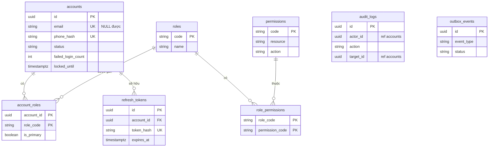

#### 8.4.2 `customer_db`

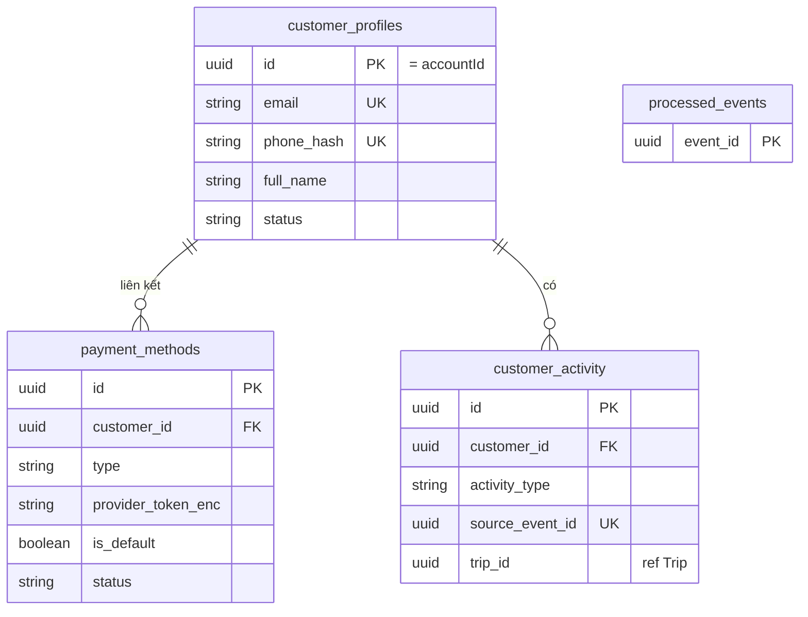

#### 8.4.3 `driver_db`

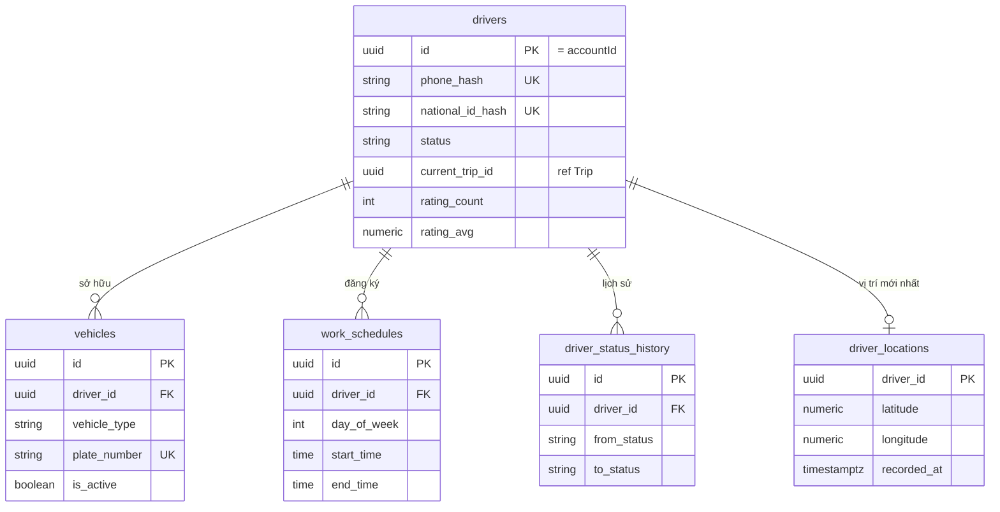

#### 8.4.4 `booking_db`

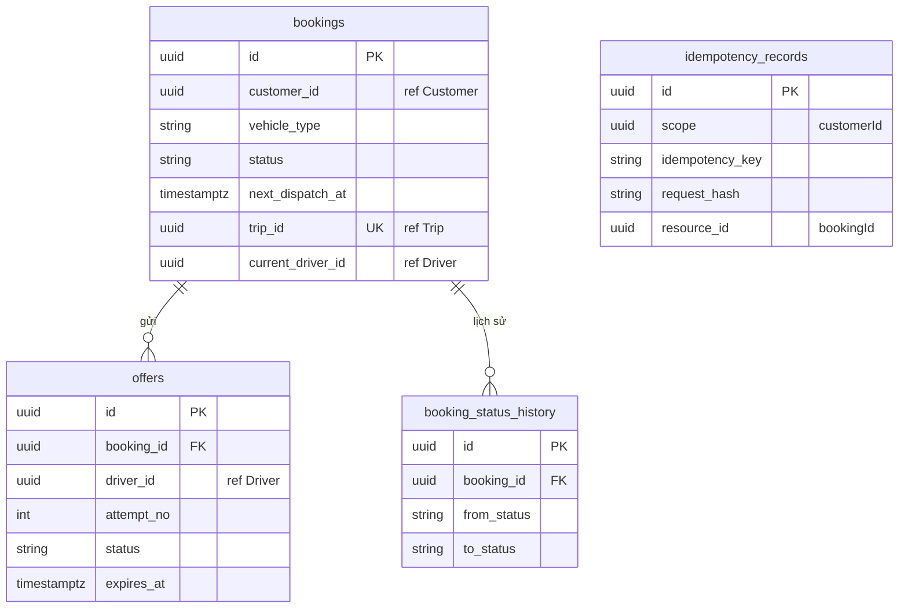

#### 8.4.5 `trip_db`

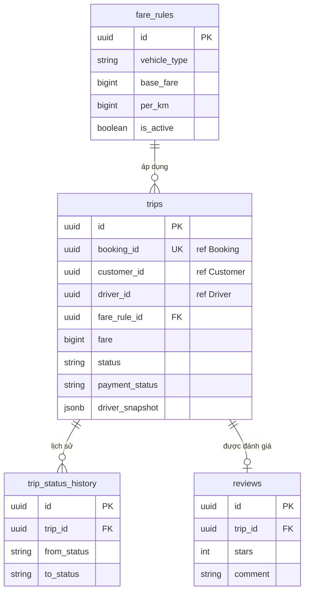

#### 8.4.6 `payment_db`

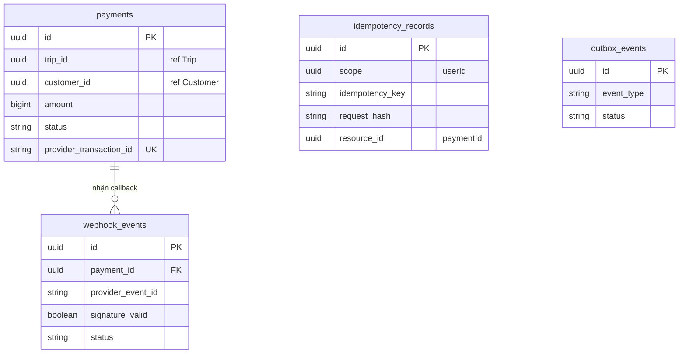

#### 8.4.7 `notification_db` (MongoDB)

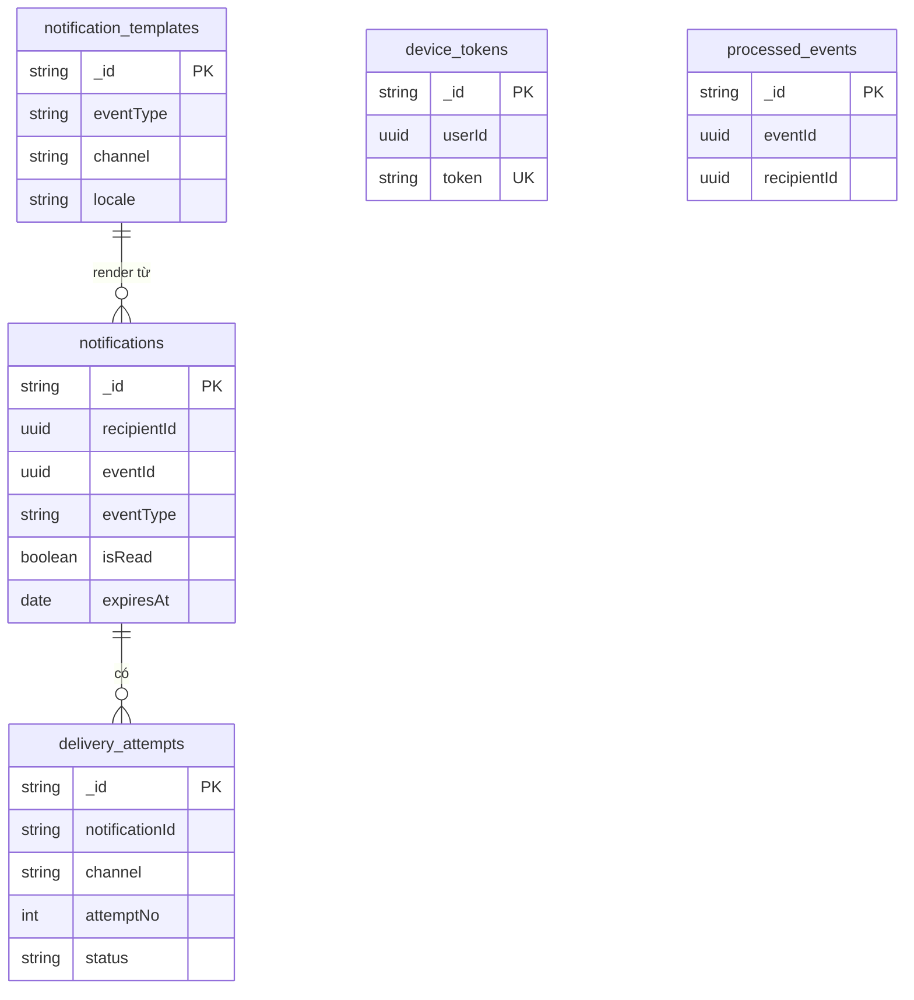

### 8.5 Data dictionary chi tiết từng service

#### 8.5.0 Bảng kỹ thuật dùng chung (PostgreSQL)

Có mặt ở mọi service PostgreSQL theo đúng cấu trúc dưới đây (trừ khi nêu khác).

**`outbox_events`** — Identity, Driver, Booking, Trip, Payment

| Cột | Kiểu | Ràng buộc / Ghi chú |
|---|---|---|
| `id` | UUID | PK; chính là `eventId` trong envelope |
| `aggregate_type` | VARCHAR(40) | `Account`, `Driver`, `Booking`, `Trip`, `Payment`… |
| `aggregate_id` | UUID | ID aggregate; dùng làm partition key mặc định |
| `event_type` | VARCHAR(60) | Ví dụ `trip.completed` |
| `event_version` | SMALLINT | Default 1 |
| `topic` | VARCHAR(60) | Topic đích |
| `partition_key` | VARCHAR(80) | Khóa partition |
| `payload` | JSONB | Toàn bộ envelope (`data`, `recipientIds`) |
| `request_id` | VARCHAR(64) | NULL; truy vết |
| `status` | VARCHAR(12) | `PENDING`, `PUBLISHED`, `FAILED` |
| `attempts` | INT | Default 0 |
| `next_retry_at` | TIMESTAMPTZ | NULL |
| `created_at`, `published_at` | TIMESTAMPTZ | `published_at` NULL |

Index: `(status, created_at)` WHERE `status = 'PENDING'`.

**`processed_events`** — Customer (P2), Driver, Booking, Trip

| Cột | Kiểu | Ràng buộc / Ghi chú |
|---|---|---|
| `event_id` | UUID | PK; `eventId` đã xử lý |
| `topic` | VARCHAR(60) | |
| `event_type` | VARCHAR(60) | |
| `processed_at` | TIMESTAMPTZ | default `now()` |

**`audit_logs`** — Identity, Driver (cùng cấu trúc)

| Cột | Kiểu | Ràng buộc / Ghi chú |
|---|---|---|
| `id` | UUID | PK |
| `actor_id` | UUID | NULL (NULL = hệ thống); ref→Identity.accounts |
| `actor_role` | VARCHAR(30) | |
| `action` | VARCHAR(50) | Identity: `LOCK_ACCOUNT`, `UNLOCK_ACCOUNT`, `ASSIGN_ROLE`, `REVOKE_ROLE`, `CHANGE_PERMISSION` · Driver: `APPROVE_DRIVER`, `REJECT_DRIVER` |
| `target_type` | VARCHAR(40) | |
| `target_id` | UUID | |
| `before_data`, `after_data` | JSONB | NULL; không chứa dữ liệu nhạy cảm |
| `reason` | TEXT | NULL |
| `request_id` | VARCHAR(64) | NULL |
| `ip_address` | INET | NULL |
| `created_at` | TIMESTAMPTZ | Append-only |

Index: `(target_type, target_id, created_at DESC)`, `(actor_id, created_at DESC)`.

**`idempotency_records`** — Booking, Payment (cùng cấu trúc)

| Cột | Kiểu | Ràng buộc / Ghi chú |
|---|---|---|
| `id` | UUID | PK |
| `scope` | VARCHAR(40) | `user_id` của người gọi (Customer) |
| `endpoint` | VARCHAR(60) | `POST /bookings`, `POST /payments` |
| `idempotency_key` | VARCHAR(100) | |
| `request_hash` | CHAR(64) | SHA-256 của payload chuẩn hóa; khác hash với cùng key → `422` |
| `status` | VARCHAR(12) | `IN_PROGRESS`, `COMPLETED` |
| `response_code` | SMALLINT | NULL |
| `response_body` | JSONB | NULL; trả lại nguyên vẹn khi gọi lại |
| `resource_id` | UUID | NULL; `bookingId` / `paymentId` |
| `created_at`, `expires_at` | TIMESTAMPTZ | `expires_at = created_at + 24h` |

Ràng buộc: `UNIQUE (scope, endpoint, idempotency_key)`; index `expires_at` để dọn.

---

#### 8.5.1 `identity_db`

**`accounts`**

| Cột | Kiểu | Ràng buộc / Ghi chú |
|---|---|---|
| `id` | UUID | PK; đồng thời là `customerId` / `driverId` |
| `email` | VARCHAR(255) | NULL; UQ trên `lower(email)` khi không NULL; Customer bắt buộc có, Driver tùy chọn (Driver đăng nhập bằng `phone`) |
| `phone_hash` | CHAR(64) | UQ; `HMAC-SHA256(phone)`, không lưu phone plaintext |
| `password_hash` | VARCHAR(100) | bcrypt |
| `display_name` | VARCHAR(150) | Tên hiển thị; bắt buộc để Employee/Admin/Board (không có profile ở service khác) vẫn có tên |
| `status` | VARCHAR(10) | `PENDING`, `ACTIVE`, `LOCKED`; default `PENDING` |
| `failed_login_count` | INT | Default 0; reset khi đăng nhập thành công |
| `locked_until` | TIMESTAMPTZ | NULL; khóa tạm khi sai quá ngưỡng |
| `lock_reason` | VARCHAR(255) | NULL |
| `last_login_at` | TIMESTAMPTZ | NULL |
| `password_changed_at` | TIMESTAMPTZ | |
| `version` | INT | Default 0 |
| `created_at`, `updated_at` | TIMESTAMPTZ | |

**`roles`** (seed cố định)

| Cột | Kiểu | Ràng buộc / Ghi chú |
|---|---|---|
| `code` | VARCHAR(30) | PK: `CUSTOMER`, `DRIVER`, `OPERATIONS_STAFF`, `USER_STAFF`, `FINANCE_STAFF`, `SUPERVISOR`, `ADMIN`, `BOARD` |
| `name` | VARCHAR(80) | |
| `description` | VARCHAR(255) | NULL |
| `is_system` | BOOLEAN | Default true; role hệ thống không xóa được |
| `created_at`, `updated_at` | TIMESTAMPTZ | |

**`permissions`**

| Cột | Kiểu | Ràng buộc / Ghi chú |
|---|---|---|
| `code` | VARCHAR(80) | PK, dạng `resource:action` (ví dụ `booking:cancel`, `customer:search`, `driver:approve`, `payment:read`, `payment:read_all`, `account:lock`, `role:assign`) |
| `resource` | VARCHAR(40) | |
| `action` | VARCHAR(40) | |
| `description` | VARCHAR(255) | NULL |
| `created_at` | TIMESTAMPTZ | |

**`account_roles`**

| Cột | Kiểu | Ràng buộc / Ghi chú |
|---|---|---|
| `account_id` | UUID | PK, FK→`accounts.id` |
| `role_code` | VARCHAR(30) | PK, FK→`roles.code` |
| `is_primary` | BOOLEAN | Role đưa vào claim `role` của JWT; UQ một role primary cho mỗi account (`UNIQUE (account_id) WHERE is_primary`) |
| `assigned_by` | UUID | NULL (NULL = seed/hệ thống) |
| `assigned_at` | TIMESTAMPTZ | |

**`role_permissions`**

| Cột | Kiểu | Ràng buộc / Ghi chú |
|---|---|---|
| `role_code` | VARCHAR(30) | PK, FK→`roles.code` |
| `permission_code` | VARCHAR(80) | PK, FK→`permissions.code` |
| `granted_by` | UUID | NULL |
| `granted_at` | TIMESTAMPTZ | |

**`refresh_tokens`** (P2)

| Cột | Kiểu | Ràng buộc / Ghi chú |
|---|---|---|
| `id` | UUID | PK |
| `account_id` | UUID | FK→`accounts.id`; index `(account_id, revoked_at)` |
| `token_hash` | CHAR(64) | UQ; chỉ lưu SHA-256 của token |
| `jti` | UUID | `jti` của access token được cấp cùng lượt, phục vụ denylist khi logout |
| `expires_at` | TIMESTAMPTZ | |
| `revoked_at` | TIMESTAMPTZ | NULL |
| `revoked_reason` | VARCHAR(30) | NULL: `LOGOUT`, `ROTATED`, `ACCOUNT_LOCKED`, `ADMIN` |
| `replaced_by_id` | UUID | NULL; refresh token rotation |
| `user_agent` | VARCHAR(255) | NULL |
| `ip_address` | INET | NULL |
| `created_at` | TIMESTAMPTZ | |

`audit_logs`, `outbox_events`: xem [8.5.0](#850-bảng-kỹ-thuật-dùng-chung-postgresql).

---

#### 8.5.2 `customer_db`

**`customer_profiles`**

| Cột | Kiểu | Ràng buộc / Ghi chú |
|---|---|---|
| `id` | UUID | PK; = `accountId` (ref→Identity.accounts) |
| `full_name` | VARCHAR(150) | |
| `email` | VARCHAR(255) | UQ trên `lower(email)` |
| `phone_enc` | TEXT | AES-256-GCM, định dạng `enc:v1:<keyId>:<iv>:<tag>:<ciphertext>` |
| `phone_hash` | CHAR(64) | UQ; HMAC-SHA256 để tìm theo số điện thoại (FR-E01) |
| `date_of_birth` | DATE | NULL |
| `gender` | VARCHAR(10) | NULL: `MALE`, `FEMALE`, `OTHER` |
| `avatar_url` | VARCHAR(500) | NULL |
| `status` | VARCHAR(10) | `ACTIVE`, `INACTIVE`; default `ACTIVE` |
| `created_at`, `updated_at` | TIMESTAMPTZ | |

**`payment_methods`** (P2)

| Cột | Kiểu | Ràng buộc / Ghi chú |
|---|---|---|
| `id` | UUID | PK |
| `customer_id` | UUID | FK→`customer_profiles.id` |
| `type` | VARCHAR(15) | `CARD`, `EWALLET`, `BANK_ACCOUNT` |
| `provider` | VARCHAR(40) | Ví dụ tên cổng thanh toán |
| `provider_token_enc` | TEXT | Token từ provider, mã hóa AES-256-GCM; **không lưu số thẻ** |
| `provider_token_hash` | CHAR(64) | HMAC-SHA256 của token, dùng cho unique |
| `brand` | VARCHAR(30) | NULL (VISA, MASTERCARD…) |
| `last4` | CHAR(4) | NULL; chỉ để hiển thị |
| `expiry_month`, `expiry_year` | SMALLINT | NULL; dùng kiểm tra còn hiệu lực trong `ValidatePaymentMethod` |
| `is_default` | BOOLEAN | Default false |
| `status` | VARCHAR(10) | `ACTIVE`, `EXPIRED`, `REMOVED` |
| `removed_at` | TIMESTAMPTZ | NULL |
| `created_at`, `updated_at` | TIMESTAMPTZ | |

Ràng buộc: `UNIQUE (customer_id) WHERE is_default AND status = 'ACTIVE'` (tối đa một mặc định); `UNIQUE (provider, provider_token_hash)`.

**`customer_activity`** (P2) (read model dựng từ event)

| Cột | Kiểu | Ràng buộc / Ghi chú |
|---|---|---|
| `id` | UUID | PK |
| `customer_id` | UUID | FK→`customer_profiles.id` |
| `activity_type` | VARCHAR(40) | `BOOKING_CREATED`, `BOOKING_CANCELED`, `BOOKING_NO_DRIVER`, `TRIP_ASSIGNED`, `TRIP_COMPLETED`, `TRIP_CANCELED`, `PAYMENT_COMPLETED`, `PAYMENT_FAILED` |
| `source_event_id` | UUID | UQ; một event tạo tối đa một dòng |
| `booking_id`, `trip_id`, `payment_id` | UUID | NULL; ref→Booking / Trip / Payment |
| `amount` | BIGINT | NULL |
| `currency` | CHAR(3) | NULL |
| `status` | VARCHAR(30) | Trạng thái kết quả tại thời điểm đó |
| `summary` | JSONB | Ảnh chụp hiển thị (địa chỉ đón/đến, `vehicleType`, tên tài xế) |
| `occurred_at` | TIMESTAMPTZ | `occurredAt` của event |
| `created_at` | TIMESTAMPTZ | |

Index: `(customer_id, occurred_at DESC)`.

`processed_events` **(P2)**: xem 8.5.0.

---

#### 8.5.3 `driver_db`

**`drivers`**

| Cột | Kiểu | Ràng buộc / Ghi chú |
|---|---|---|
| `id` | UUID | PK; = `accountId` (Driver sinh trước rồi truyền cho Identity) |
| `full_name` | VARCHAR(150) | |
| `email` | VARCHAR(255) | NULL; UQ trên `lower(email)` khi không NULL (Driver đăng nhập bằng `phone`) |
| `phone_enc` | TEXT | AES-256-GCM, định dạng `enc:v1:…` |
| `phone_hash` | CHAR(64) | UQ |
| `date_of_birth` | DATE | |
| `national_id_enc` | TEXT | Số CCCD/CMND, mã hóa AES-256-GCM |
| `national_id_hash` | CHAR(64) | UQ; HMAC để chống đăng ký trùng |
| `license_number_enc` | TEXT | Số bằng lái, mã hóa AES-256-GCM |
| `license_class` | VARCHAR(10) | Hạng bằng (A1, A2, B1, B2…) |
| `license_expiry_date` | DATE | Hết hạn thì không được duyệt/online |
| `avatar_url` | VARCHAR(500) | NULL |
| `status` | VARCHAR(20) | `PENDING_APPROVAL`, `REJECTED`, `OFFLINE`, `ONLINE`, `BUSY` |
| `reviewed_by` | UUID | NULL; Admin duyệt/từ chối (ref→Identity.accounts) |
| `reviewed_at` | TIMESTAMPTZ | NULL |
| `rejected_reason` | VARCHAR(500) | NULL; bắt buộc khi `REJECTED` |
| `rating_sum` | INT | Default 0 |
| `rating_count` | INT | Default 0 |
| `rating_avg` | NUMERIC(3,2) | Default 0; = `rating_sum / rating_count` |
| `completed_trips` | INT | Default 0 |
| `current_trip_id` | UUID | NULL; ref→Trip; có giá trị khi `BUSY`, dùng gắn `tripId` vào `driver.location_updated` |
| `last_online_at` | TIMESTAMPTZ | NULL |
| `version` | INT | Default 0 |
| `created_at`, `updated_at` | TIMESTAMPTZ | |

Index: `(status)`; `CHECK (status <> 'REJECTED' OR rejected_reason IS NOT NULL)`.

**`vehicles`**

| Cột | Kiểu | Ràng buộc / Ghi chú |
|---|---|---|
| `id` | UUID | PK |
| `driver_id` | UUID | FK→`drivers.id` |
| `vehicle_type` | VARCHAR(10) | `BIKE`, `SEDAN`, `SUV` |
| `plate_number` | VARCHAR(20) | UQ |
| `brand` | VARCHAR(50) | |
| `model` | VARCHAR(50) | |
| `color` | VARCHAR(30) | |
| `manufacture_year` | SMALLINT | |
| `seat_count` | SMALLINT | `CHECK (seat_count > 0)` |
| `is_active` | BOOLEAN | Xe đang dùng; `UNIQUE (driver_id) WHERE is_active` |
| `created_at`, `updated_at` | TIMESTAMPTZ | |

**`work_schedules`**

| Cột | Kiểu | Ràng buộc / Ghi chú |
|---|---|---|
| `id` | UUID | PK |
| `driver_id` | UUID | FK→`drivers.id` |
| `day_of_week` | SMALLINT | `CHECK (day_of_week BETWEEN 1 AND 7)` (1 = thứ Hai) |
| `start_time`, `end_time` | TIME | `CHECK (end_time > start_time)` |
| `is_active` | BOOLEAN | Default true |
| `created_at`, `updated_at` | TIMESTAMPTZ | |

Ràng buộc: `UNIQUE (driver_id, day_of_week, start_time)`.

**`driver_status_history`** (append-only)

| Cột | Kiểu | Ràng buộc / Ghi chú |
|---|---|---|
| `id` | UUID | PK |
| `driver_id` | UUID | FK→`drivers.id`; index `(driver_id, created_at DESC)` |
| `from_status` | VARCHAR(20) | NULL khi tạo mới |
| `to_status` | VARCHAR(20) | |
| `reason` | VARCHAR(255) | NULL |
| `actor_id` | UUID | NULL (NULL = hệ thống/event) |
| `actor_role` | VARCHAR(30) | `DRIVER`, `ADMIN`, `SYSTEM` |
| `trip_id` | UUID | NULL; ref→Trip khi chuyển do `trip.*` |
| `request_id` | VARCHAR(64) | NULL |
| `created_at` | TIMESTAMPTZ | |

**`driver_locations`** (mỗi tài xế một dòng, chỉ vị trí mới nhất, không lưu lịch sử GPS)

| Cột | Kiểu | Ràng buộc / Ghi chú |
|---|---|---|
| `driver_id` | UUID | PK, FK→`drivers.id` |
| `latitude` | NUMERIC(9,6) | `CHECK (latitude BETWEEN -90 AND 90)` |
| `longitude` | NUMERIC(9,6) | `CHECK (longitude BETWEEN -180 AND 180)` |
| `heading` | SMALLINT | NULL; 0–359 |
| `speed_kmh` | NUMERIC(5,1) | NULL |
| `accuracy_m` | NUMERIC(6,1) | NULL |
| `recorded_at` | TIMESTAMPTZ | Thời điểm thiết bị đo |
| `updated_at` | TIMESTAMPTZ | Ghi theo throttle ≥ 10 giây |

Index: `(latitude, longitude)` để lọc bounding box trước khi tính Haversine (hoặc GiST nếu bật PostGIS).

`audit_logs`, `outbox_events`, `processed_events`: xem 8.5.0.

---

#### 8.5.4 `booking_db`

**`bookings`**

| Cột | Kiểu | Ràng buộc / Ghi chú |
|---|---|---|
| `id` | UUID | PK |
| `customer_id` | UUID | ref→Customer; index `(customer_id, created_at DESC)` |
| `vehicle_type` | VARCHAR(10) | `BIKE`, `SEDAN`, `SUV` |
| `pickup_address` | VARCHAR(500) | Đã chuẩn hóa qua `Geocode` |
| `pickup_lat`, `pickup_lng` | NUMERIC(9,6) | |
| `destination_address` | VARCHAR(500) | |
| `destination_lat`, `destination_lng` | NUMERIC(9,6) | |
| `note` | VARCHAR(255) | NULL; ghi chú cho tài xế |
| `status` | VARCHAR(20) | `SEARCHING`, `ASSIGNED`, `NO_DRIVER_FOUND`, `COMPLETED`, `CANCELED` |
| `next_dispatch_at` | TIMESTAMPTZ | NULL; thời điểm worker được phép dispatch tiếp; index `(next_dispatch_at) WHERE status = 'SEARCHING'` |
| `attempt_count` | SMALLINT | Số Offer đã gửi; `CHECK (attempt_count <= 5)` (= `OFFER_MAX_ATTEMPTS`) |
| `trip_id` | UUID | NULL, UQ; ref→Trip; set khi `ASSIGNED` |
| `current_driver_id` | UUID | NULL; ref→Driver; tài xế được gán |
| `cancel_reason` | VARCHAR(40) | NULL: `CUSTOMER_REQUEST`, `TRIP_CANCELED`, `SYSTEM_ERROR`, `EMPLOYEE_REQUEST` |
| `canceled_by_id` | UUID | NULL; `canceled_by_role` VARCHAR(30) NULL |
| `requested_at` | TIMESTAMPTZ | |
| `assigned_at`, `completed_at`, `canceled_at` | TIMESTAMPTZ | NULL |
| `version` | INT | Default 0 |
| `created_at`, `updated_at` | TIMESTAMPTZ | |

Index: `(status, created_at)`; `CHECK (status <> 'CANCELED' OR cancel_reason IS NOT NULL)`.

**`offers`**

| Cột | Kiểu | Ràng buộc / Ghi chú |
|---|---|---|
| `id` | UUID | PK |
| `booking_id` | UUID | FK→`bookings.id` |
| `driver_id` | UUID | ref→Driver |
| `attempt_no` | SMALLINT | Lần thử thứ mấy (1..5) |
| `status` | VARCHAR(10) | `PENDING`, `ACCEPTED`, `REJECTED`, `EXPIRED`, `CANCELED` |
| `distance_to_pickup_m` | INT | NULL; khoảng cách lúc gửi Offer |
| `eta_seconds` | INT | NULL |
| `offered_at` | TIMESTAMPTZ | |
| `expires_at` | TIMESTAMPTZ | `offered_at + OFFER_TTL_SEC` |
| `responded_at` | TIMESTAMPTZ | NULL |
| `reject_reason` | VARCHAR(255) | NULL |
| `created_at`, `updated_at` | TIMESTAMPTZ | |

Ràng buộc: `UNIQUE (booking_id) WHERE status = 'ACCEPTED'` (một tài xế thắng); `UNIQUE (booking_id, driver_id)` (không mời lại tài xế đã mời); `UNIQUE (booking_id, attempt_no)`; `UNIQUE (driver_id) WHERE status = 'PENDING'` (một tài xế chỉ có một Offer đang chờ). Index worker: `(status, expires_at) WHERE status = 'PENDING'` dùng với `FOR UPDATE SKIP LOCKED`.

**`booking_status_history`** (append-only)

| Cột | Kiểu | Ràng buộc / Ghi chú |
|---|---|---|
| `id` | UUID | PK |
| `booking_id` | UUID | FK→`bookings.id`; index `(booking_id, created_at)` |
| `from_status` | VARCHAR(20) | NULL khi tạo mới |
| `to_status` | VARCHAR(20) | |
| `reason` | VARCHAR(255) | NULL |
| `actor_id` | UUID | NULL |
| `actor_role` | VARCHAR(30) | `CUSTOMER`, `EMPLOYEE`, `SYSTEM` |
| `request_id` | VARCHAR(64) | NULL |
| `created_at` | TIMESTAMPTZ | |

`idempotency_records` (`scope = customer_id`, `endpoint = POST /bookings`, `resource_id = bookingId`), `outbox_events`, `processed_events`: xem 8.5.0.

---

#### 8.5.5 `trip_db`

**`trips`**

| Cột | Kiểu | Ràng buộc / Ghi chú |
|---|---|---|
| `id` | UUID | PK |
| `booking_id` | UUID | UQ; ref→Booking; khóa idempotency của `CreateTrip` |
| `customer_id` | UUID | ref→Customer; index `(customer_id, created_at DESC)` |
| `driver_id` | UUID | ref→Driver; index `(driver_id, created_at DESC)` |
| `vehicle_id` | UUID | ref→Driver.vehicles |
| `driver_snapshot` | JSONB | Ảnh chụp lúc gán: `fullName`, `avatarUrl`, `ratingAvg`, `vehicle { vehicleType, plateNumber, brand, model, color }` (nguồn `GET /internal/drivers/{id}/summary`) |
| `vehicle_type` | VARCHAR(10) | |
| `pickup_address` | VARCHAR(500) | Ảnh chụp từ booking |
| `pickup_lat`, `pickup_lng` | NUMERIC(9,6) | |
| `destination_address` | VARCHAR(500) | |
| `destination_lat`, `destination_lng` | NUMERIC(9,6) | |
| `distance_km` | NUMERIC(8,2) | Từ Map Provider (hoặc Haversine) lúc tạo Trip |
| `estimated_duration_sec` | INT | NULL; ETA |
| `fare_rule_id` | UUID | FK→`fare_rules.id`; bảng giá đã áp dụng |
| `base_fare` | BIGINT | Ảnh chụp từ `fare_rules` |
| `per_km_fare` | BIGINT | Ảnh chụp từ `fare_rules` |
| `fare` | BIGINT | `CHECK (fare > 0)`; khóa cố định, = `round(base_fare + per_km_fare × distance_km)` |
| `currency` | CHAR(3) | Default `VND` |
| `status` | VARCHAR(12) | `ASSIGNED`, `ARRIVED`, `IN_PROGRESS`, `COMPLETED`, `CANCELED` |
| `payment_id` | UUID | NULL; ref→Payment; điền khi nhận `payment.completed` |
| `payment_status` | VARCHAR(10) | `UNPAID`, `PAID`; default `UNPAID`; chỉ đi một chiều `UNPAID → PAID` |
| `assigned_at` | TIMESTAMPTZ | |
| `arrived_at`, `started_at`, `completed_at`, `canceled_at` | TIMESTAMPTZ | NULL |
| `cancel_reason` | VARCHAR(500) | NULL; bắt buộc khi `CANCELED` |
| `canceled_by_id` | UUID | NULL; `canceled_by_role` VARCHAR(30) NULL |
| `version` | INT | Default 0 |
| `created_at`, `updated_at` | TIMESTAMPTZ | |

Index: `(status)`. `CHECK (status <> 'CANCELED' OR cancel_reason IS NOT NULL)`.

**`trip_status_history`** (append-only)

| Cột | Kiểu | Ràng buộc / Ghi chú |
|---|---|---|
| `id` | UUID | PK |
| `trip_id` | UUID | FK→`trips.id`; index `(trip_id, created_at)` |
| `from_status` | VARCHAR(12) | NULL khi tạo |
| `to_status` | VARCHAR(12) | |
| `actor_id` | UUID | NULL |
| `actor_role` | VARCHAR(30) | `DRIVER`, `CUSTOMER`, `EMPLOYEE`, `SYSTEM` |
| `reason` | VARCHAR(500) | NULL |
| `latitude`, `longitude` | NUMERIC(9,6) | NULL; vị trí tài xế lúc xác nhận (kiểm tra bán kính) |
| `distance_to_target_m` | INT | NULL; khoảng cách tới điểm đón/trả lúc xác nhận |
| `request_id` | VARCHAR(64) | NULL |
| `created_at` | TIMESTAMPTZ | |

**`fare_rules`**

| Cột | Kiểu | Ràng buộc / Ghi chú |
|---|---|---|
| `id` | UUID | PK |
| `vehicle_type` | VARCHAR(10) | `BIKE`, `SEDAN`, `SUV` |
| `base_fare` | BIGINT | `CHECK (base_fare >= 0)`, VND |
| `per_km` | BIGINT | `CHECK (per_km >= 0)`, VND/km |
| `currency` | CHAR(3) | Default `VND` |
| `is_active` | BOOLEAN | `UNIQUE (vehicle_type) WHERE is_active` (mỗi loại xe một bảng giá active) |
| `effective_from` | TIMESTAMPTZ | |
| `effective_to` | TIMESTAMPTZ | NULL |
| `created_by` | UUID | NULL; ref→Identity.accounts |
| `created_at`, `updated_at` | TIMESTAMPTZ | |

**`reviews`**

| Cột | Kiểu | Ràng buộc / Ghi chú |
|---|---|---|
| `id` | UUID | PK |
| `trip_id` | UUID | FK→`trips.id`, UQ (mỗi Trip một Review) |
| `customer_id` | UUID | ref→Customer; phải trùng `trips.customer_id` |
| `driver_id` | UUID | ref→Driver; index `(driver_id, created_at DESC)` |
| `stars` | SMALLINT | `CHECK (stars BETWEEN 1 AND 5)` |
| `comment` | VARCHAR(500) | NULL |
| `created_at` | TIMESTAMPTZ | |

`outbox_events`, `processed_events`: xem 8.5.0.

---

#### 8.5.6 `payment_db`

**`payments`**

| Cột | Kiểu | Ràng buộc / Ghi chú |
|---|---|---|
| `id` | UUID | PK; dùng làm `merchantRef` gửi Provider |
| `trip_id` | UUID | ref→Trip; index `(trip_id)` |
| `customer_id` | UUID | ref→Customer (người thanh toán); index `(customer_id, created_at DESC)` |
| `amount` | BIGINT | `CHECK (amount > 0)`; = `Trip.fare` lúc tạo, **không** nhận từ client |
| `currency` | CHAR(3) | Default `VND` |
| `method` | VARCHAR(20) | `CHECK (method IN ('ONLINE'))`; default `ONLINE` |
| `payment_method_id` | UUID | NULL; ref→Customer.payment_methods **(P2)** |
| `status` | VARCHAR(10) | `PENDING`, `COMPLETED`, `FAILED` |
| `failure_code` | VARCHAR(50) | NULL; `TIMEOUT`, `PROVIDER_ERROR`, `PROVIDER_DECLINED`…; bắt buộc khi `FAILED` |
| `failure_message` | VARCHAR(255) | NULL |
| `provider` | VARCHAR(40) | Tên Provider đã dùng |
| `provider_transaction_id` | VARCHAR(100) | NULL lúc tạo, điền khi Provider trả; UQ khi không NULL |
| `idempotency_key` | VARCHAR(100) | Key của `POST /payments` đã tạo Payment này |
| `completed_at`, `failed_at` | TIMESTAMPTZ | NULL |
| `version` | INT | Default 0 |
| `created_at`, `updated_at` | TIMESTAMPTZ | |

Ràng buộc: `UNIQUE (trip_id) WHERE status IN ('PENDING','COMPLETED')` (BR-F04, BR-F07: một Payment hiệu lực cho mỗi Trip, Payment `FAILED` được tạo lại); `CHECK (status <> 'FAILED' OR failure_code IS NOT NULL)`; index `(status, created_at) WHERE status = 'PENDING'` cho job timeout.

**`webhook_events`** (append-only)

| Cột | Kiểu | Ràng buộc / Ghi chú |
|---|---|---|
| `id` | UUID | PK |
| `payment_id` | UUID | NULL, FK→`payments.id` (điền khi khớp được Payment) |
| `provider` | VARCHAR(40) | |
| `provider_event_id` | VARCHAR(100) | NULL; id sự kiện/giao dịch của Provider |
| `provider_transaction_id` | VARCHAR(100) | NULL |
| `event_type` | VARCHAR(50) | Ví dụ `transaction.result` |
| `result` | VARCHAR(10) | NULL; `SUCCESS`, `FAILED` |
| `amount` | BIGINT | NULL; số tiền Provider báo, đối chiếu với `payments.amount` |
| `signature` | VARCHAR(128) | Chữ ký nhận được |
| `signature_valid` | BOOLEAN | Sai chữ ký vẫn được ghi để điều tra nhưng không đổi Payment |
| `payload` | JSONB | Body gốc (đã loại dữ liệu nhạy cảm) |
| `status` | VARCHAR(10) | `RECEIVED`, `PROCESSED`, `IGNORED`, `REJECTED` |
| `error_message` | VARCHAR(500) | NULL |
| `received_at` | TIMESTAMPTZ | |
| `processed_at` | TIMESTAMPTZ | NULL |

Ràng buộc: `UNIQUE (provider, provider_event_id) WHERE signature_valid` (callback hợp lệ trùng không xử lý lần hai; callback giả mạo không chiếm khóa của callback thật).

`idempotency_records` (`scope = user_id` của người gọi, `endpoint = POST /payments`, `resource_id = paymentId`) và `outbox_events`: xem 8.5.0.

---

#### 8.5.7 `notification_db` (MongoDB)

**`notifications`**

| Field | Kiểu | Ghi chú |
|---|---|---|
| `_id` | string (UUID) | |
| `recipientId` | string (UUID) | ref→Identity.accounts |
| `recipientRole` | string | `CUSTOMER`, `DRIVER`, `OPERATIONS_STAFF`… |
| `eventId` | string (UUID) | Event gốc |
| `eventType` | string | Ví dụ `trip.assigned` |
| `templateCode` | string | Mẫu đã dùng |
| `title`, `body` | string | Đã render theo `locale` |
| `locale` | string | `vi`, `en` |
| `data` | object | `bookingId`, `tripId`, `paymentId`… để client điều hướng |
| `channels` | array<string> | `IN_APP`, `PUSH`, `EMAIL` |
| `deliveries` | array<object> | `{ channel, status: PENDING/SENT/FAILED, attempts, lastAttemptAt, sentAt, error }` (trạng thái mới nhất từng kênh) |
| `isRead` | boolean | Default false |
| `readAt` | date | null nếu chưa đọc |
| `createdAt`, `updatedAt` | date | |
| `expiresAt` | date | TTL, mặc định `createdAt + 90 ngày` |

Index: `{ recipientId: 1, createdAt: -1 }`; `{ recipientId: 1, isRead: 1 }` (đếm chưa đọc); TTL `{ expiresAt: 1 }` (`expireAfterSeconds: 0`); unique `{ eventId: 1, recipientId: 1 }`.

**`processed_events`**

| Field | Kiểu | Ghi chú |
|---|---|---|
| `_id` | ObjectId | |
| `eventId` | string (UUID) | |
| `recipientId` | string (UUID) | |
| `topic` | string | |
| `processedAt` | date | |
| `expiresAt` | date | TTL, mặc định 30 ngày |

Index: unique `{ eventId: 1, recipientId: 1 }`; TTL `{ expiresAt: 1 }`.

**`device_tokens`**

| Field | Kiểu | Ghi chú |
|---|---|---|
| `_id` | string (UUID) | |
| `userId` | string (UUID) | |
| `role` | string | |
| `platform` | string | `IOS`, `ANDROID`, `WEB` |
| `token` | string | Push token (FCM/APNs) |
| `appVersion` | string | |
| `locale` | string | |
| `isActive` | boolean | Đặt false khi provider báo token không hợp lệ |
| `lastSeenAt` | date | |
| `createdAt`, `updatedAt` | date | |

Index: unique `{ token: 1 }`; `{ userId: 1, isActive: 1 }`.

**`delivery_attempts`**

| Field | Kiểu | Ghi chú |
|---|---|---|
| `_id` | string (UUID) | |
| `notificationId` | string | ref→`notifications._id` |
| `channel` | string | |
| `attemptNo` | int | |
| `status` | string | `SENT`, `FAILED` |
| `providerMessageId` | string | null nếu thất bại |
| `errorCode`, `errorMessage` | string | null nếu thành công |
| `attemptedAt` | date | |
| `nextRetryAt` | date | null nếu không retry nữa (→ DLQ) |
| `expiresAt` | date | TTL 30 ngày |

Index: `{ notificationId: 1, attemptNo: 1 }`; `{ status: 1, nextRetryAt: 1 }` cho worker retry; TTL `{ expiresAt: 1 }`.

**`notification_templates`**

| Field | Kiểu | Ghi chú |
|---|---|---|
| `_id` | string | |
| `templateCode` | string | Ví dụ `TRIP_ASSIGNED` |
| `eventType` | string | |
| `channel` | string | `IN_APP`, `PUSH`, `EMAIL` |
| `locale` | string | |
| `titleTemplate`, `bodyTemplate` | string | Có placeholder `{{fare}}`, `{{driverName}}`… |
| `isActive` | boolean | |
| `version` | int | |
| `updatedAt` | date | |

Index: unique `{ eventType: 1, channel: 1, locale: 1 }`.

---

## 9. Các vấn đề cắt ngang (cross-cutting)

### 9.1 Outbox, inbox và idempotency

- **Outbox:** service phát event ghi dữ liệu nghiệp vụ + `outbox_events` trong **cùng transaction** PostgreSQL; relay publish sau, nên không có trường hợp đã commit mà mất event hay đã phát event mà rollback.
- **Inbox (`processed_events`):** consumer ghi `event_id` cùng transaction với tác động nghiệp vụ; trùng khóa thì bỏ qua. Notification dùng `(eventId, recipientId)`.
- **Idempotency API:** `Idempotency-Key` cho `POST /bookings` và `POST /payments`, lưu `(scope, endpoint, key, request_hash, response)` trong 24 giờ.
- **Idempotency lời gọi nội bộ:** theo khóa tự nhiên (`accountId`, `id`, `bookingId`, `tripId`, `(driverId, bookingId)`) như bảng [2.2](#22-danh-mục-internal-rest).
- Retry không được làm sai state machine hoặc tạo Payment thành công lần hai.

### 9.2 Bảo mật dữ liệu và quản lý khóa

**Dữ liệu nhạy cảm khi lưu (PC24)**

| Dữ liệu | Cách bảo vệ | Cột |
|---|---|---|
| Mật khẩu | bcrypt (cost 10) | `accounts.password_hash` |
| Số điện thoại | AES-256-GCM + HMAC để tra cứu | `customer_profiles.phone_enc`, `drivers.phone_enc`; `phone_hash` ở Identity, Customer, Driver |
| Số CCCD, số bằng lái | AES-256-GCM (+ HMAC cho CCCD để chống trùng) | `drivers.national_id_enc`, `national_id_hash`, `license_number_enc` |
| Token phương thức thanh toán | AES-256-GCM | `payment_methods.provider_token_enc` **(P2)** |
| Refresh token, OTP, registration token | chỉ lưu hash (SHA-256/HMAC) | `refresh_tokens.token_hash`, Redis |

Một attacker đọc trực tiếp DB chỉ thấy `password_hash = "$2b$10$…"`, `phone_enc = "enc:v1:k1:…"`, không có plaintext.

**Định dạng và khóa**

- Giá trị mã hóa: `enc:v1:<keyId>:<iv>:<tag>:<ciphertext>` (base64url). Mỗi lần mã hóa dùng IV ngẫu nhiên 12 byte; `keyId` cho biết khóa nào đã dùng.
- `DATA_ENCRYPTION_KEYS` là map `keyId → khóa 32 byte (base64)`; `DATA_ENCRYPTION_ACTIVE_KEY_ID` chọn khóa ghi mới.
- `PHONE_HASH_PEPPER` và `NATIONAL_ID_HASH_PEPPER` là khóa HMAC **riêng**, không dùng chung với khóa mã hóa.
- **Xoay khóa:** thêm khóa mới và đổi `ACTIVE_KEY_ID`; dữ liệu cũ vẫn đọc được bằng `keyId` của nó; script `scripts/reencrypt` mã hóa lại dữ liệu cũ theo lô.
- Khóa nằm trong `.env`/Docker secret, **không** nằm trong repository hay image; `.env.example` chỉ có giá trị giữ chỗ. Script `scripts/gen-env` sinh `.env` bằng `openssl rand`.
- Thư viện dùng chung `shared/crypto` là nơi duy nhất mã hóa/giải mã/băm; service không tự cài đặt.

**Khác**

- Mỗi service dùng một user DB riêng chỉ có quyền trên database của mình; bảng append-only không cấp `UPDATE/DELETE`.
- Không expose PostgreSQL/MongoDB/Redis/Kafka ra host.
- Không ghi vào log: mật khẩu, token, OTP, số thẻ, phone dạng rõ; log chỉ có `requestId`, `userId`, mã lỗi.
- Header bảo mật ở Gateway: `helmet` (`X-Content-Type-Options: nosniff`, …), CORS giới hạn origin, body size giới hạn.

### 9.3 Timeout, retry và circuit breaker

Chuỗi đồng bộ dài nhất là `AcceptOffer → POST /internal/trips → (Driver summary, Map) → POST /internal/drivers/{id}/busy`. Deadline phải **giảm dần** theo chiều sâu để tầng trên không timeout trước tầng dưới.

| Lời gọi | Deadline | Retry | Ghi chú |
|---|---|---|---|
| Client → Gateway → service | 15 giây | Client tự quyết (POST cần `Idempotency-Key`) | Gateway trả `504` khi quá hạn |
| Booking → Trip `POST /internal/trips` | 8 giây | 1 lần (idempotent theo `bookingId`) | Quá hạn → saga recovery |
| Trip → Driver `summary` | 2 giây | 1 lần | |
| Trip, Booking → Map Provider | 3 giây | 1 lần | Circuit breaker; Trip fallback Haversine |
| Booking → Driver `nearby`, `reservations`, `busy` | 2 giây | 1 lần (idempotent) | |
| Payment → Trip `GET /internal/trips/{id}` | 2 giây | 1 lần | |
| Payment → Trip `payment-status` | 2 giây | không | Best-effort; có Kafka bù |
| Payment → Payment Provider `POST /transactions` | 5 giây | không tự retry (dùng `Idempotency-Key` phía Provider nếu retry thủ công) | Circuit breaker |
| Identity → Customer `POST /internal/customers` | 3 giây | 1 lần (idempotent theo `id`) | |

- Chỉ retry lời gọi **idempotent**; mọi thao tác ghi tiền hoặc tạo đối tượng mang khóa idempotency.
- Circuit breaker mở khi tỉ lệ lỗi > 50% trong 10 giây; nửa mở thử lại sau 30 giây.
- Giá trị là mặc định, cấu hình qua biến môi trường.

### 9.4 Validation và chống injection

**SQL injection (PC25)**

- Mọi truy vấn PostgreSQL dùng **parameterized query** (`$1, $2…`); không nối chuỗi từ input.
- Input qua schema validation (ví dụ Zod/Ajv) trước khi vào service: `email` đúng định dạng, `phone` đúng E.164, UUID đúng định dạng, enum nằm trong tập cho phép, số nằm trong miền.
- `{ "email": "' OR 1=1 --", "password": "anything" }` bị chặn ngay ở validation → `400` (hoặc `401` nếu qua validation), **không** đổi logic truy vấn, không lộ thông tin DB; lỗi DB không bao giờ trả nguyên văn ra client.

**NoSQL injection (Notification/MongoDB)**

- Bộ lọc luôn dựng từ giá trị đã ép kiểu (string/number/boolean); body/query chứa key bắt đầu bằng `$` hoặc có dấu `.` bị từ chối (`400`).
- `recipientId` lấy từ JWT, không nhận từ client.

**XSS (PC26)**

- Các trường text tự do (`comment`, `note`, `reason`, địa chỉ): trim, giới hạn độ dài, **escape** `& < > " '` thành entity trước khi lưu (`shared/sanitize`); `<script>alert('hack')</script>` được lưu thành `&lt;script&gt;…`, không bao giờ thực thi.
- Các trường định danh (`fullName`, `plateNumber`, `phone`, `email`): chỉ chấp nhận ký tự hợp lệ theo allowlist, ký tự HTML → `400`.
- Response luôn `Content-Type: application/json` kèm `X-Content-Type-Options: nosniff`; API không render HTML.

**Khác**

- Giới hạn kích thước body (ví dụ 100 KB) và số phần tử mảng; từ chối field lạ (`additionalProperties: false`).
- Chuẩn hóa input trước khi băm/so sánh (lowercase email, E.164 phone).

### 9.5 Hợp đồng API chung

**Lỗi**

```json
{ "code": "RESOURCE_FORBIDDEN", "message": "You do not have permission to access this resource.", "requestId": "req_123" }
```

| HTTP | Dùng cho |
|---|---|
| `400` | Validation, thiếu `Idempotency-Key`, tham số phân trang sai |
| `401` | Chưa đăng nhập, JWT sai/hết hạn/bị sửa, callback sai chữ ký, thiếu service credential |
| `403` | Sai role/permission/ownership |
| `404` | Không tồn tại |
| `409` | Xung đột state (Offer đã nhận, hủy Trip `IN_PROGRESS`, Payment đang hiệu lực…) |
| `422` | Cùng `Idempotency-Key` nhưng payload khác |
| `429` | Rate limit, kèm `Retry-After` |
| `503`/`504` | Service nội bộ không sẵn sàng/quá hạn |

**Phân trang (FR-S16):** `?page=1&limit=10` → `{ "data": [...], "pagination": { "page": 1, "limit": 10, "total": 37, "totalPages": 4 } }`; `limit` mặc định 10, tối đa 50; giá trị ngoài miền → `400`.

**JWT:** `HS256`; claims `sub`, `role`, `iat`, `exp`, `jti`; TTL 15 phút. Từ chối: `alg ≠ HS256` (kể cả `none`), sai chữ ký, hết hạn, thiếu claim bắt buộc, `role` không hợp lệ.

**Header chung:** `Authorization`, `X-Request-Id` (trả lại trong response), `Idempotency-Key`, `X-Signature` (callback).

### 9.6 Health và ready

| Endpoint | Ý nghĩa | Trả về |
|---|---|---|
| `GET /health` | Liveness: tiến trình còn sống | `200 { "status": "UP", "service": "trip-service" }` |
| `GET /ready` | Readiness: sẵn sàng nhận request | `200 { "status": "READY", "service": "…", "checks": { "db": "UP", "redis": "UP", "kafka": "UP" } }`; thiếu phụ thuộc → `503` kèm check lỗi |
| `GET /health/services` (chỉ Gateway) | Tổng hợp mọi service | `{ "status": "UP" hoặc "DEGRADED", "services": [ { "name", "status", "latencyMs" } ] }` |

Mỗi service chỉ kiểm tra phụ thuộc mà nó dùng (Identity: DB + Kafka; Driver: DB + Redis + Kafka; Notification: MongoDB + Kafka…). Compose `healthcheck` gọi `/health`; `depends_on` dùng `service_healthy`.

### 9.7 Logging và truy vết

- Log JSON một dòng: `timestamp`, `level`, `service`, `requestId`, `userId`, `route`, `status`, `latencyMs`.
- `requestId` đi xuyên Gateway → Internal REST (`X-Request-Id`) → Kafka header/envelope → log của consumer.
- Thao tác nhạy cảm (duyệt Driver, đổi role/khóa account) ghi `audit_logs` kèm `requestId`.

---

## 10. Cấu trúc project, Docker Compose và dữ liệu mẫu

### 10.1 Cấu trúc source code (PC1)

```text
cab-system/
├── gateway/                     # Express + proxy, JWT, RBAC, rate limit
├── services/
│   ├── identity-service/
│   ├── customer-service/
│   ├── driver-service/
│   ├── booking-service/
│   ├── trip-service/
│   ├── payment-service/
│   └── notification-service/
├── mocks/
│   ├── mock-payment-provider/
│   └── mock-map-provider/
├── shared/                      # @cab/shared: auth, service-auth, kafka, outbox, idempotency,
│                                #   crypto, sanitize, validation, errors, pagination, logger
├── postman/                     # collection + environment, chạy theo thứ tự PC1–PC30
├── tests/                       # unit, integration, e2e (smoke theo từng PC)
├── docs/                        # srs_v13.md, microservice_design_v15.md, sơ đồ kiến trúc, ERD
├── scripts/                     # init-kafka-topics, gen-env, reencrypt, seed
├── docker-compose.yml
├── .env.example                 # chỉ giá trị giữ chỗ; được commit
├── .gitignore                   # node_modules/, .env, *.log, coverage/, dist/
└── README.md                    # kiến trúc, cách chạy, danh sách container, cách chạy Postman/test
```

Cấu trúc bên trong mỗi service:

```text
<service>/
├── src/
│   ├── routes/          # định nghĩa endpoint (public + /internal)
│   ├── controllers/     # parse request, gọi service, format response
│   ├── services/        # nghiệp vụ, state machine
│   ├── repositories/    # truy vấn DB (parameterized)
│   ├── events/          # producers (outbox) và consumers (inbox)
│   ├── clients/         # Internal REST client tới service khác, adapter provider
│   ├── workers/         # outbox relay, dispatch worker, job timeout
│   ├── config/
│   └── index.js
├── migrations/
├── tests/
├── Dockerfile
└── package.json
```

**Công nghệ (khớp code Node.js sẵn có của dự án):** Node.js 20, Express, `pg`, `mongodb`, `ioredis`, `kafkajs`, `jsonwebtoken`, `bcrypt`, `zod`, `helmet`, `http-proxy-middleware`, `prom-client`/log JSON; monorepo npm workspaces để dùng `@cab/shared`.

### 10.2 Docker Compose (PC5, PC8)

| Container | Image / build | Ghi chú |
|---|---|---|
| `gateway` | build `gateway/` | **Duy nhất** publish port `8000:8000` |
| `identity-service`, `customer-service`, `driver-service`, `booking-service`, `trip-service`, `payment-service`, `notification-service` | build tương ứng | Không publish port; lắng nghe `3000` trong mạng nội bộ |
| `identity-db`, `customer-db`, `driver-db`, `booking-db`, `trip-db`, `payment-db` | `postgres:16-alpine` | Mỗi service một DB, volume riêng |
| `notification-db` | `mongo:7` | |
| `kafka` | `apache/kafka` (KRaft, một node) | |
| `kafka-init` | cùng image Kafka | One-shot: tạo topic theo [7.2](#72-danh-sách-topic) rồi thoát |
| `redis` | `redis:7-alpine` | |
| `mock-payment-provider`, `mock-map-provider` | build `mocks/…` | |

**Tổng:** 19 container chạy thường trực + 1 job `kafka-init`. Nếu máy yếu, có thể gộp 6 PostgreSQL thành một instance với 6 database và 6 user riêng (profile `slim`), vẫn giữ nguyên quy tắc "mỗi service một database".

Quy tắc Compose:

- Network `cab-internal` cho mọi container; chỉ `gateway` thêm `ports`.
- `healthcheck` cho mọi container; `depends_on: condition: service_healthy` (DB, Kafka, Redis healthy trước khi service chạy; `kafka-init` hoàn tất trước khi service dùng Kafka chạy).
- Cấu hình và secret lấy từ `.env` (không commit); service chỉ nhận biến nó cần.
- `restart: unless-stopped`; dữ liệu DB dùng named volume.
- Kiểm tra PC8: gọi trực tiếp `identity-service:3000` từ host thất bại (không có port); từ trong mạng mà thiếu/sai `X-Service-Token` → `401`.

### 10.3 Biến môi trường và secret

`.env.example` liệt kê đủ các khóa dưới đây với giá trị `change-me`; `.env` thật do `scripts/gen-env` sinh và **không** commit.

| Nhóm | Biến |
|---|---|
| Bí mật | `JWT_SECRET`, `INTERNAL_JWT_SECRET`, `DATA_ENCRYPTION_KEYS`, `DATA_ENCRYPTION_ACTIVE_KEY_ID`, `PHONE_HASH_PEPPER`, `NATIONAL_ID_HASH_PEPPER`, `PAYMENT_CALLBACK_SECRET` |
| Database | `IDENTITY_DB_PASSWORD`, `CUSTOMER_DB_PASSWORD`, `DRIVER_DB_PASSWORD`, `BOOKING_DB_PASSWORD`, `TRIP_DB_PASSWORD`, `PAYMENT_DB_PASSWORD`, `NOTIFICATION_DB_PASSWORD` |
| Cấu hình nghiệp vụ | `NEARBY_RADIUS_M=1000`, `PAGE_LIMIT_DEFAULT=10`, `PAGE_LIMIT_MAX=50`, `OFFER_TTL_SEC=30`, `OFFER_MAX_ATTEMPTS=5`, `OTP_LENGTH=6`, `OTP_TTL_SEC=300`, `OTP_MAX_ATTEMPTS=5`, `OTP_LOCK_SEC=900`, `REGISTRATION_TOKEN_TTL_MIN=15`, `JWT_ALG=HS256`, `JWT_TTL_MIN=15`, `IDEMPOTENCY_TTL_H=24`, `PAYMENT_PENDING_TIMEOUT_MIN=15`, `RESERVATION_TTL_SEC=35`, `LOCATION_STALE_SEC=0`, `ARRIVAL_CONFIRM_RADIUS_M=0`, `INTERNAL_JWT_TTL_SEC=60` |
| Rate limit | `RATE_LIMIT_GENERAL=100`, `RATE_LIMIT_BOOKING=10`, `RATE_LIMIT_LOGIN=10` (mỗi phút) |
| Mock | `MOCK_CALLBACK_DELAY_MS=2000`, `MOCK_PAYMENT_AUTO_RESULT=SUCCESS` |
| Seed | `SEED_ON_START=true`, `SEED_PASSWORD` |

### 10.4 Mock provider

**`mock-payment-provider`** (REST, không publish port):

| Endpoint | Mô tả |
|---|---|
| `POST /transactions` | Nhận `merchantRef`, `amount`, `currency`, `callbackUrl`, `methodToken?` → `202 { providerTransactionId, status: "PENDING" }`. Sau `MOCK_CALLBACK_DELAY_MS` tự gửi callback |
| `POST /mock/transactions/{id}/complete?result=SUCCESS` hoặc `?result=FAILED` | Kích hoạt callback thủ công (phục vụ Postman) |
| Callback gửi đi | `POST {callbackUrl}` body `{ providerTransactionId, merchantRef, status, amount, occurredAt }`, header `X-Signature = HMAC-SHA256(rawBody, PAYMENT_CALLBACK_SECRET)` |

`callbackUrl` trỏ về Gateway (`http://gateway:8000/payments/callback`) để callback đi qua đúng đường vào của hệ thống.

**`mock-map-provider`:**

| Endpoint | Mô tả |
|---|---|
| `GET /geocode?address=…` | `{ lat, lng, formattedAddress }` |
| `GET /route?fromLat&fromLng&toLat&toLng` | `{ distanceKm, durationSec }` (tính theo Haversine nhân hệ số đường đi) |

### 10.5 Seed dữ liệu

Mỗi service tự seed bảng của mình khi `SEED_ON_START=true`, dùng **UUID cố định** (`shared/seed-ids`) để Account, hồ sơ và Driver khớp nhau. Mật khẩu seed lấy từ `SEED_PASSWORD`. Điểm tham chiếu: `10.7769, 106.7009`.

| Dữ liệu | Service seed | Nội dung |
|---|---|---|
| Role, permission | identity | 8 role, permission, ánh xạ role↔permission |
| Account | identity | `customer01`, `admin`, `board`, 4 Employee (`OPERATIONS_STAFF`, `USER_STAFF`, `FINANCE_STAFF`, `SUPERVISOR`), Driver D1–D7 (đăng nhập bằng phone) |
| Hồ sơ Customer | customer | `customer01` (email + phone) |
| Driver D1–D7 | driver | D1 `OFFLINE` ~300 m; D2 `ONLINE` ~200 m `SEDAN`; D3 `ONLINE` ~450 m `BIKE`; D4 `ONLINE` ~800 m `SEDAN`; D5 `BUSY` ~600 m; D6 `ONLINE` ~2500 m; D7 `PENDING_APPROVAL`; kèm Vehicle và vị trí; nạp `driver:geo` |
| Bảng giá | trip | `BIKE` 10 000 + 4 000/km; `SEDAN` 20 000 + 9 000/km; `SUV` 30 000 + 12 000/km |
| Booking + Trip mẫu | booking, trip | ≥ 5 Booking của `customer01` (đủ trạng thái, đủ để thử phân trang), trong đó 2 Trip `COMPLETED` chưa thanh toán (dùng cho PC19, PC20) |

---

## 11. Kiểm chứng 30 tiêu chí

Mọi lời gọi đi qua Gateway (`http://localhost:8000`). Postman collection chia thư mục theo ba bảng chấm; môi trường seed ở [10.5](#105-seed-dữ-liệu).

| PC | Nội dung | Endpoint / bằng chứng | Service xử lý | Kết quả mong đợi |
|---:|---|---|---|---|
| 1 | Cấu trúc source code | [10.1](#101-cấu-trúc-source-code-pc1), `README.md` | — | Cấu trúc thư mục khớp, README mô tả |
| 2 | `.gitignore`, `.env` | Repo GitHub | — | `.env`, `node_modules/` không có trong repo; có `.env.example`; không lộ secret |
| 3 | Nhiệm vụ Gateway | [5.0](#50-api-gateway) | gateway | Mô tả routing, JWT, RBAC, rate limit, tracing |
| 4 | IPC | [2.2](#22-danh-mục-internal-rest), [2.3](#23-tương-tác-kafka-tóm-tắt) | tất cả | Internal REST + Kafka, có service credential |
| 5 | Compose, liệt kê container | `docker compose up -d`, `docker compose ps` | — | 19 container thường trực + `kafka-init`, chỉ `gateway` có port |
| 6 | Health | `GET /health`, `GET /ready`, `GET /health/services` | gateway + mọi service | healthy/ready, danh sách service |
| 7 | Kafka | topic `*.events`, consumer group, message mẫu | kafka | Event được phát và tiêu thụ |
| 8 | Mọi request qua Gateway | Gọi thẳng service từ host thất bại; thiếu `X-Service-Token` → `401` | gateway, mọi service | Không đi vòng được |
| 9 | Đăng ký Customer | `POST /auth/register` | identity → customer | `201`, đăng nhập được |
| 10 | Đăng nhập | `POST /auth/login` (`email` hoặc `phone`) | identity | `200` + JWT |
| 11 | Hồ sơ Customer | `GET /customers/{id}` | customer | Chủ sở hữu xem được, người khác `403` |
| 12 | Hồ sơ Driver | `GET /drivers/{id}` | driver | Driver xem của mình, Customer chỉ khi own-in-trip |
| 13 | Nearby | `GET /drivers/nearby?lat&lng&radius=1000&status&page&limit` | driver | Chỉ Driver trong 1 km, có `distanceM`, `pagination` |
| 14 | Danh sách Booking | `GET /bookings?page&limit` | booking | Chỉ Booking của Customer, có `pagination` |
| 15 | Đặt xe | `POST /bookings` | booking, driver | `201 SEARCHING`; sau đó có Offer cho Driver gần nhất |
| 16 | Tài xế nhận chuyến | `GET /offers`, `POST /offers/{id}/accept` | booking, trip, driver | Trip `ASSIGNED`, Driver `BUSY`, Booking `ASSIGNED`, khách thấy thông tin tài xế |
| 17 | Trạng thái chuyến | `PATCH /trips/{id}/status`, `PUT /drivers/me/location`, `GET /trips/{id}/location` | trip, driver | `ARRIVED → IN_PROGRESS → COMPLETED` đúng thứ tự; vị trí cập nhật |
| 18 | Hủy chuyến | `POST /trips/{id}/cancel` (+ `reason`) | trip | Trip `CANCELED`, Booking `CANCELED`, các bên có Notification |
| 19 | Thanh toán online | `POST /payments` → callback → `GET /payments/{id}` | payment, trip | `PENDING` → callback hợp lệ → `COMPLETED`; Trip `PAID` |
| 20 | Đánh giá | `POST /trips/{id}/reviews` | trip | Review lưu và gắn với Trip |
| 21 | Đăng ký Driver | `POST /drivers/otp/request` → `verify` → `register` | driver, identity | Hồ sơ `PENDING_APPROVAL` |
| 22 | Duyệt Driver | `GET /admin/drivers`, `POST /admin/drivers/{id}/approve` hoặc `/reject` | driver | Trạng thái cập nhật, Driver nhận Notification |
| 23 | Online/Offline | `PUT /drivers/me/availability` | driver | Trạng thái đổi và được ghi nhận |
| 24 | Mã hóa dữ liệu | Truy vấn trực tiếp DB | identity, customer, driver | `password_hash` bcrypt, `*_enc` có `enc:v1:<keyId>:…`, không có plaintext |
| 25 | SQL injection | `POST /auth/login` với `' OR 1=1 --` | gateway, identity | `400`/`401`, không đăng nhập, không lộ DB |
| 26 | XSS | Gửi `<script>…</script>` vào `comment`/`note` | trip, booking | Được escape khi lưu, không thực thi |
| 27 | JWT tampering | Sửa payload/`alg=none` | gateway, mọi service | `401` |
| 28 | Truy cập trái phép | Customer gọi API Driver | gateway | `403`, không trả dữ liệu |
| 29 | Rate limit | Spam `POST /bookings` | gateway | `429` + `Retry-After`, hệ thống vẫn chạy |
| 30 | Replay/idempotency | Gửi lại `POST /payments` (cùng key + payload) | payment | Trả response cũ, không double charge |

---

## 12. Quyết định, điểm lệch và thay đổi

### 12.1 Quyết định đã chốt

| # | Quyết định |
|---|---|
| 1 | Không thu hoa hồng; không payout cho Driver; không giữ tiền/hoàn tiền. Payment = `Trip.fare` sau khi Trip `COMPLETED` |
| 2 | Tài xế đăng ký/đăng nhập bằng số điện thoại (email tùy chọn); Customer vẫn bắt buộc email + phone; login nhận `email` hoặc `phone` |
| 3 | Hồ sơ Driver gồm CCCD, bằng lái (số, hạng, hạn) và thông tin xe |
| 4 | Internal REST thay cho gRPC theo FR-S06; service credential là JWT nội bộ ngắn hạn |
| 5 | `nearby` mặc định `status=ONLINE`; có `status` để lọc `OFFLINE`/`BUSY` |
| 6 | `LOCATION_STALE_SEC=0` (tắt) để seed tĩnh vẫn khớp được Driver; bật ở môi trường thật |
| 7 | Driver chỉ phát `driver.location` khi `BUSY`; Driver chuyển `BUSY` bằng lời gọi đồng bộ từ Booking |
| 8 | Booking và Trip tự gọi Map Provider qua adapter; Driver không phụ thuộc Map Provider |
| 9 | Review thuộc `trip-service` |
| 10 | Mỗi service một database riêng (có profile `slim` gộp instance nếu cần) |

### 12.2 Sơ đồ kiến trúc (hình) cần cập nhật

| # | Trên sơ đồ hình | Theo thiết kế v15 |
|---|---|---|
| 1 | Chú thích "gRPC (synchronous)" | Đổi thành **Internal REST** |
| 2 | "Luồng thanh toán" gồm đặt cọc, capture, hoàn tiền | Vẽ lại: Trip `COMPLETED` → `POST /payments` → Payment `PENDING` → Provider → callback → `COMPLETED`; hủy chuyến thì không có Payment |
| 3 | Payment Provider nối vào ô Payment DB | Nối với Payment Service (REST + callback HMAC qua Gateway) |
| 4 | Nhãn "REST/HTTPS (Callback)" giữa Payment và Notification | Đặt ở nhánh Payment Provider; Notification không liên quan |
| 5 | Map Provider nối từ Driver DB, gRPC | Booking Service và Trip Service gọi Map Provider (REST) |
| 6 | Booking ↔ Trip "Create/Update Trip" | Booking chỉ gọi tạo Trip (REST); trạng thái Trip quay về Booking qua Kafka |
| 7 | Thiếu các lời gọi nội bộ | Bổ sung Identity→Customer, Driver→Identity, Booking→Driver, Trip→Driver, Payment→Trip |
| 8 | Kafka chỉ nối tới Notification | Booking, Driver, Trip cũng subscribe; Identity publish |
| 9 | Redis chỉ nối Gateway | Driver (OTP, GEO, reservation) và Trip (vị trí) cũng dùng Redis |

### 12.3 Thay đổi v14 → v15

| Hạng mục | Nội dung |
|---|---|
| IPC | gRPC → Internal REST `/internal/**` + service credential (mục 2.2, 2.4); toàn bộ luồng và rule viết lại |
| Thanh toán | Bỏ hold/capture/release/payout; Payment tạo sau Trip `COMPLETED`, callback HMAC, `PENDING/COMPLETED/FAILED` (5.6, 6.3). Bỏ bảng `provider_transactions`, `payouts`, `payout_accounts`, bỏ `processed_events` và `audit_logs` của Payment |
| Saga nhận chuyến | Chỉ Booking → Trip → Driver `busy` (không còn `HoldFunds`); recovery 30 giây/10 phút (5.4, 6.2) |
| Booking | Bỏ `payment_method_id`; thêm `next_dispatch_at` (dispatch worker bền vững) |
| Driver | Bỏ payout; thêm `current_trip_id`; GEO nạp lại từ DB; `driver.location` chỉ khi `BUSY` |
| Trip | `payment_status` còn `UNPAID/PAID`; thêm `driver_snapshot`; Review dùng `stars` |
| Account | `accounts.email` cho phép NULL; login bằng `email` hoặc `phone` |
| Mã hóa | `BYTEA` → `TEXT` định dạng `enc:v1:<keyId>:…`; tách pepper (9.2) |
| Mới | Gateway chi tiết + bảng route (5.0), cross-cutting: validation/chống injection, hợp đồng API, health (9.4–9.6), cấu trúc project, Compose, biến môi trường, mock provider, seed (mục 10), ma trận kiểm chứng PC1–PC30 (mục 11) |
| Kafka | Bỏ event `payment.held/captured/released/payout_*`; thêm `payment.completed/failed`; bỏ consumer Payment; số partition giảm cho môi trường Compose |
