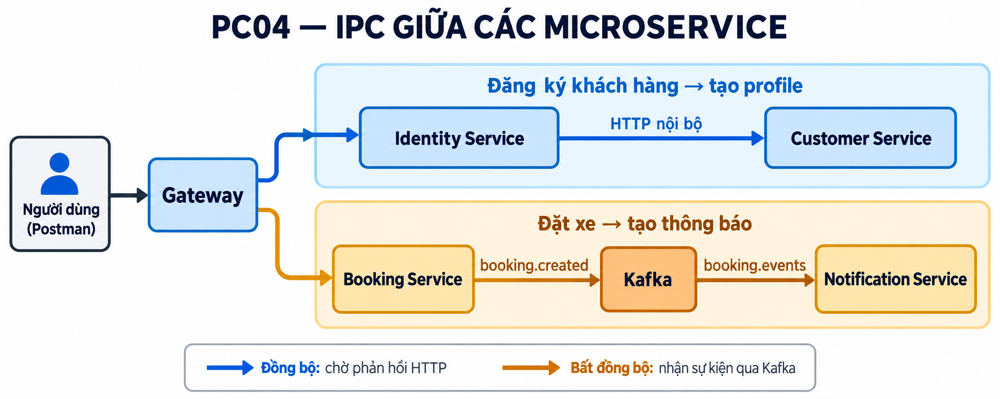

# Kịch bản demo theo `phieucham.md`

Các mục có chữ POSTMAN trong phiếu chấm là **PC6 và PC9–PC30**. Mỗi bảng chỉ có Method, URL, Data body, loại token và Idempotency-Key. Đặt `baseUrl = http://localhost:8000` trong Postman; với JSON, chọn **Body → raw → JSON**. Ở cột token, chọn **Authorization → Bearer Token** và nhập biến tương ứng; `Không` nghĩa là không gửi Authorization. Với `Có: ...`, thêm header `Idempotency-Key` mang giá trị sau dấu hai chấm. Sao chép ID, token và OTP từ response vào các biến Postman được nhắc trong URL/body. PC15 chọn một trong hai phương thức BANK/CASH; các mục PC17–PC19 dùng booking BANK. PC29 gửi request bằng Collection Runner 55 lần liên tiếp.

Thứ tự dùng để tránh booking đang hoạt động cản booking mới: PC9–PC14 → PC21–PC23 → PC15–PC17 → PC19–PC20 → PC18 → PC24–PC30. Số điện thoại/email ví dụ cần đổi nếu đã được đăng ký.

## Thực hành 1

### PC1 – Kiến trúc source code

Mở `backend/` trong IDE: `gateway/`, `shared/`, `services/` (identity, customer, driver, booking, trip, payment, notification), `mocks/` và `docker-compose.yml`.

### PC2 – `.gitignore` và `.env` trên GitHub

Mở nhánh hiện tại trên GitHub. Repository này không đưa `.env`, `.env.example` hay `.gitignore` lên nhánh; các file cần dùng chỉ giữ ở máy local. Vì vậy không thể trình bày `.gitignore` trên GitHub như câu chữ PC2.

### PC3 – Nhiệm vụ Gateway

Mở [Gateway](backend/gateway/src/index.js) và chỉ route map, xác minh JWT, rate limit. Các API nghiệp vụ bên dưới đều đi qua cổng 8000.

### PC4 – IPC giữa các service

Chỉ luồng Identity gọi Customer qua HTTP khi đăng ký, cùng producer/consumer Kafka trong luồng Booking → Notification.

### PC5 – Docker Compose và container

Mở `backend/docker-compose.yml` và Docker Desktop: chỉ Gateway, 7 service, Kafka, Redis, MongoDB và mock provider. PostgreSQL của dự án chạy trên host.

### PC6 – POSTMAN: API health check

| Method | URL | Data body | Loại token | Idempotency-Key |
|---|---|---|---|---|
| GET | `{{baseUrl}}/health` | Không | Không | Không |
| GET | `{{baseUrl}}/ready` | Không | Không | Không |
| GET | `{{baseUrl}}/health/services` | Không | Không | Không |

### PC7 – Kafka/RabbitMQ

Mở Compose để chỉ Kafka, topic `booking.events` và consumer của notification-service. Có thể dùng booking ở PC15 rồi xem notification của Customer để minh họa sự kiện `booking.created`.

### PC8 – Mọi request qua Gateway

Trong Compose/Docker Desktop xem cột Ports: chỉ Gateway publish `8000:8000`. Cổng `27017/tcp` của MongoDB là cổng nội bộ khi không có mapping host.

### PC9 – POSTMAN: Đăng ký Customer

| Method | URL | Data body | Loại token | Idempotency-Key |
|---|---|---|---|---|
| POST | `{{baseUrl}}/api/v1/auth/register` | `{"fullName":"Khach Demo","email":"khachdemo01@example.com","phone":"0912345001","password":"DemoPass@123"}` | Không | Không |

### PC10 – POSTMAN: Đăng nhập Customer

| Method | URL | Data body | Loại token | Idempotency-Key |
|---|---|---|---|---|
| POST | `{{baseUrl}}/api/v1/auth/login` | `{"email":"khachdemo01@example.com","password":"DemoPass@123"}` | Không | Không |
| POST | `{{baseUrl}}/api/v1/auth/login` | `{"email":"admin@gmail.com","password":"12345678"}` | Không | Không |

## Thực hành 2

### PC11 – POSTMAN: Lấy Customer theo ID

| Method | URL | Data body | Loại token | Idempotency-Key |
|---|---|---|---|---|
| GET | `{{baseUrl}}/api/v1/customers/{{customerId}}` | Không | Customer (`{{customerToken}}`) | Không |
| GET | `{{baseUrl}}/api/v1/customers/me` | Không | Customer (`{{customerToken}}`) | Không |

### PC12 – POSTMAN: Lấy Driver theo ID

| Method | URL | Data body | Loại token | Idempotency-Key |
|---|---|---|---|---|
| GET | `{{baseUrl}}/api/v1/drivers/20000000-0000-4000-8000-000000000001` | Không | Customer (`{{customerToken}}`) | Không |

### PC13 – POSTMAN: Driver quanh khu vực, limit, paging

| Method | URL | Data body | Loại token | Idempotency-Key |
|---|---|---|---|---|
| GET | `{{baseUrl}}/api/v1/drivers?page=1&limit=50` | Không | Admin (`{{adminToken}}`) | Không |
| GET | `{{baseUrl}}/api/v1/drivers/nearby?lat=10.7769&lng=106.7008&radius=1000&limit=5&page=1` | Không | Không | Không |
| GET | `{{baseUrl}}/api/v1/drivers/nearby?lat=10.7769&lng=106.7008&radius=1000&limit=1&page=1` | Không | Không | Không |
| GET | `{{baseUrl}}/api/v1/drivers/nearby?lat=10.7769&lng=106.7008&radius=1000&limit=1&page=2` | Không | Không | Không |

### PC14 – POSTMAN: Booking của Customer

| Method | URL | Data body | Loại token | Idempotency-Key |
|---|---|---|---|---|
| POST | `{{baseUrl}}/api/v1/auth/login` | `{"email":"kh01@gmail.com","password":"12345678"}` | Không | Không |
| GET | `{{baseUrl}}/api/v1/bookings?limit=2&page=1` | Không | Customer mẫu (`{{seedCustomerToken}}`) | Không |
| GET | `{{baseUrl}}/api/v1/bookings?limit=2&page=2` | Không | Customer mẫu (`{{seedCustomerToken}}`) | Không |
| GET | `{{baseUrl}}/api/v1/bookings/{{seedBookingId}}` | Không | Customer mẫu (`{{seedCustomerToken}}`) | Không |

### PC15 – POSTMAN: Đặt xe và tìm Driver

| Method | URL | Data body | Loại token | Idempotency-Key |
|---|---|---|---|---|
| POST | `{{baseUrl}}/api/v1/bookings` | `{"pickupAddress":"Diem don demo","pickupLat":10.7901,"pickupLng":106.7101,"destinationAddress":"Diem den demo","destinationLat":10.8001,"destinationLng":106.7201,"vehicleType":"BIKE","paymentMethod":"BANK"}` | Customer (`{{customerToken}}`) | Có: `demo-ride-001` |
| POST | `{{baseUrl}}/api/v1/bookings` | `{"pickupAddress":"Diem don demo","pickupLat":10.7901,"pickupLng":106.7101,"destinationAddress":"Diem den demo","destinationLat":10.8001,"destinationLng":106.7201,"vehicleType":"BIKE","paymentMethod":"CASH"}` | Customer (`{{customerToken}}`) | Có: `demo-cash-001` |
| GET | `{{baseUrl}}/api/v1/bookings/{{bookingId}}` | Không | Customer (`{{customerToken}}`) | Không |
| GET | `{{baseUrl}}/api/v1/offers` | Không | Driver (`{{driverToken}}`) | Không |

### PC16 – POSTMAN: Driver nhận chuyến

| Method | URL | Data body | Loại token | Idempotency-Key |
|---|---|---|---|---|
| GET | `{{baseUrl}}/api/v1/offers` | Không | Driver (`{{driverToken}}`) | Không |
| POST | `{{baseUrl}}/api/v1/bookings/{{bookingId}}/accept` | Không | Driver (`{{driverToken}}`) | Không |
| GET | `{{baseUrl}}/api/v1/trips/{{tripId}}` | Không | Customer (`{{customerToken}}`) | Không |
| GET | `{{baseUrl}}/api/v1/bookings/{{bookingId}}` | Không | Customer (`{{customerToken}}`) | Không |

### PC17 – POSTMAN: Trạng thái chuyến theo trình tự

| Method | URL | Data body | Loại token | Idempotency-Key |
|---|---|---|---|---|
| PATCH | `{{baseUrl}}/api/v1/trips/{{tripId}}/status` | `{"status":"ARRIVED","lat":10.7901,"lng":106.7101}` | Driver (`{{driverToken}}`) | Không |
| PATCH | `{{baseUrl}}/api/v1/trips/{{tripId}}/status` | `{"status":"IN_PROGRESS","lat":10.7950,"lng":106.7150}` | Driver (`{{driverToken}}`) | Không |
| PATCH | `{{baseUrl}}/api/v1/trips/{{tripId}}/status` | `{"status":"PAYMENT_PENDING","lat":10.8001,"lng":106.7201}` | Driver (`{{driverToken}}`) | Không |
| GET | `{{baseUrl}}/api/v1/trips/{{tripId}}` | Không | Customer (`{{customerToken}}`) | Không |

### PC18 – POSTMAN: Hủy chuyến và thông báo

| Method | URL | Data body | Loại token | Idempotency-Key |
|---|---|---|---|---|
| POST | `{{baseUrl}}/api/v1/bookings` | `{"pickupAddress":"Diem don demo","pickupLat":10.7901,"pickupLng":106.7101,"destinationAddress":"Diem den demo","destinationLat":10.8001,"destinationLng":106.7201,"vehicleType":"BIKE","paymentMethod":"BANK"}` | Customer (`{{customerToken}}`) | Có: `demo-cancel-trip-001` |
| GET | `{{baseUrl}}/api/v1/offers` | Không | Driver (`{{driverToken}}`) | Không |
| POST | `{{baseUrl}}/api/v1/bookings/{{cancelBookingId}}/accept` | Không | Driver (`{{driverToken}}`) | Không |
| POST | `{{baseUrl}}/api/v1/bookings/{{cancelBookingId}}/cancel` | `{"reason":"Khach doi lich"}` | Customer (`{{customerToken}}`) | Không |
| GET | `{{baseUrl}}/api/v1/trips/{{cancelTripId}}` | Không | Customer (`{{customerToken}}`) | Không |
| GET | `{{baseUrl}}/api/v1/payments/{{cancelBookingId}}` | Không | Customer (`{{customerToken}}`) | Không |
| GET | `{{baseUrl}}/api/v1/notifications?limit=20` | Không | Customer (`{{customerToken}}`) | Không |
| GET | `{{baseUrl}}/api/v1/notifications?limit=20` | Không | Driver (`{{driverToken}}`) | Không |

### PC19 – POSTMAN: Thanh toán online

| Method | URL | Data body | Loại token | Idempotency-Key |
|---|---|---|---|---|
| GET | `{{baseUrl}}/api/v1/customers/me` | Không | Customer (`{{customerToken}}`) | Không |
| GET | `{{baseUrl}}/api/v1/payments/{{bookingId}}` | Không | Customer (`{{customerToken}}`) | Không |
| GET | `{{baseUrl}}/api/v1/drivers/me` | Không | Driver (`{{driverToken}}`) | Không |
| POST | `{{baseUrl}}/api/v1/payments/{{tripId}}` | Không | Customer (`{{customerToken}}`) | Không |
| GET | `{{baseUrl}}/api/v1/payments/{{bookingId}}` | Không | Customer (`{{customerToken}}`) | Không |
| GET | `{{baseUrl}}/api/v1/trips/{{tripId}}` | Không | Customer (`{{customerToken}}`) | Không |
| GET | `{{baseUrl}}/api/v1/drivers/me` | Không | Driver (`{{driverToken}}`) | Không |

### PC20 – POSTMAN: Đánh giá chuyến đi

| Method | URL | Data body | Loại token | Idempotency-Key |
|---|---|---|---|---|
| POST | `{{baseUrl}}/api/v1/trips/{{tripId}}/reviews` | `{"stars":5,"comment":"Tai xe dung gio"}` | Customer (`{{customerToken}}`) | Không |
| GET | `{{baseUrl}}/api/v1/trips/{{tripId}}` | Không | Customer (`{{customerToken}}`) | Không |

## Thực hành 3

### PC21 – POSTMAN: Đăng ký Driver bằng OTP

| Method | URL | Data body | Loại token | Idempotency-Key |
|---|---|---|---|---|
| POST | `{{baseUrl}}/api/v1/drivers/otp/request` | `{"phone":"0912345002"}` | Không | Không |
| POST | `{{baseUrl}}/api/v1/drivers/otp/verify` | `{"phone":"0912345002","otp":"{{otp}}"}` | Không | Không |
| POST | `{{baseUrl}}/api/v1/drivers/register` | `{"registrationToken":"{{registrationToken}}","phone":"0912345002","password":"TaiXeDemo@123","fullName":"Tai Xe Demo","licenseNumber":"GPLX-DEMO-02","licenseClass":"A1","licenseExpiryDate":"2035-01-01","vehicle":{"vehicleType":"BIKE","plateNumber":"59A1-12345","brand":"Honda","model":"Wave"}}` | Không | Không |

### PC22 – POSTMAN: Admin duyệt/từ chối Driver

| Method | URL | Data body | Loại token | Idempotency-Key |
|---|---|---|---|---|
| GET | `{{baseUrl}}/api/v1/drivers?status=PENDING_APPROVAL` | Không | Admin (`{{adminToken}}`) | Không |
| GET | `{{baseUrl}}/api/v1/drivers/{{driverId}}/application` | Không | Admin (`{{adminToken}}`) | Không |
| POST | `{{baseUrl}}/api/v1/drivers/{{driverId}}/approve` | `{}` | Admin (`{{adminToken}}`) | Không |
| POST | `{{baseUrl}}/api/v1/auth/login` | `{"phone":"0912345002","password":"TaiXeDemo@123"}` | Không | Không |
| GET | `{{baseUrl}}/api/v1/notifications?limit=20` | Không | Driver (`{{driverToken}}`) | Không |

### PC23 – POSTMAN: Online/Offline

| Method | URL | Data body | Loại token | Idempotency-Key |
|---|---|---|---|---|
| PUT | `{{baseUrl}}/api/v1/drivers/me/location` | `{"lat":10.7901,"lng":106.7101}` | Driver (`{{driverToken}}`) | Không |
| PUT | `{{baseUrl}}/api/v1/drivers/me/availability` | `{"status":"ONLINE"}` | Driver (`{{driverToken}}`) | Không |
| PUT | `{{baseUrl}}/api/v1/drivers/me/availability` | `{"status":"OFFLINE"}` | Driver (`{{driverToken}}`) | Không |
| GET | `{{baseUrl}}/api/v1/drivers/{{driverId}}` | Không | Driver (`{{driverToken}}`) | Không |
| PUT | `{{baseUrl}}/api/v1/drivers/me/availability` | `{"status":"ONLINE"}` | Driver (`{{driverToken}}`) | Không |

### PC24 – POSTMAN: Mã hóa dữ liệu lúc lưu

| Method | URL | Data body | Loại token | Idempotency-Key |
|---|---|---|---|---|
| GET | `{{baseUrl}}/api/v1/auth/demo/storage/{{customerId}}` | Không | Admin (`{{adminToken}}`) | Không |
| GET | `{{baseUrl}}/api/v1/drivers/{{driverId}}/storage` | Không | Admin (`{{adminToken}}`) | Không |

### PC25 – POSTMAN: SQL injection

| Method | URL | Data body | Loại token | Idempotency-Key |
|---|---|---|---|---|
| POST | `{{baseUrl}}/api/v1/auth/login` | `{"email":"' OR 1=1 --","password":"anything"}` | Không | Không |

### PC26 – POSTMAN: XSS input

| Method | URL | Data body | Loại token | Idempotency-Key |
|---|---|---|---|---|
| POST | `{{baseUrl}}/api/v1/bookings` | `{"pickupAddress":"","pickupLat":10.85,"pickupLng":106.75,"destinationAddress":"Diem den","destinationLat":10.86,"destinationLng":106.76,"vehicleType":"BIKE","paymentMethod":"BANK"}` | Customer (`{{customerToken}}`) | Có: `demo-xss-booking-001` |
| GET | `{{baseUrl}}/api/v1/bookings/{{xssBookingId}}` | Không | Customer (`{{customerToken}}`) | Không |
| POST | `{{baseUrl}}/api/v1/bookings/{{xssBookingId}}/cancel` | `{"reason":"Ket thuc demo XSS"}` | Customer (`{{customerToken}}`) | Không |

### PC27 – POSTMAN: JWT tampering

| Method | URL | Data body | Loại token | Idempotency-Key |
|---|---|---|---|---|
| GET | `{{baseUrl}}/api/v1/drivers` | Không | Customer (`{{customerToken}}`) | Không |
| POST | `{{baseUrl}}/api/v1/demo/jwt-tampered` | Không | Customer (`{{customerToken}}`) | Không |
| GET | `{{baseUrl}}/api/v1/drivers` | Không | Token đã sửa (`{{tamperedToken}}`) | Không |

### PC28 – POSTMAN: Truy cập API trái quyền

| Method | URL | Data body | Loại token | Idempotency-Key |
|---|---|---|---|---|
| PUT | `{{baseUrl}}/api/v1/drivers/me/availability` | `{"status":"ONLINE"}` | Customer (`{{customerToken}}`) | Không |
| GET | `{{baseUrl}}/api/v1/drivers` | Không | Customer (`{{customerToken}}`) | Không |
| GET | `{{baseUrl}}/api/v1/drivers` | Không | Không | Không |

### PC29 – POSTMAN: Rate limit

| Method | URL | Data body | Loại token | Idempotency-Key |
|---|---|---|---|---|
| GET | `{{baseUrl}}/api/v1/drivers/nearby?limit=1` | Không | Không | Không |
| GET | `{{baseUrl}}/health` | Không | Không | Không |

### PC30 – POSTMAN: Replay/idempotency

| Method | URL | Data body | Loại token | Idempotency-Key |
|---|---|---|---|---|
| POST | `{{baseUrl}}/api/v1/bookings` | `{"pickupAddress":"Diem don demo","pickupLat":10.7901,"pickupLng":106.7101,"destinationAddress":"Diem den demo","destinationLat":10.8001,"destinationLng":106.7201,"vehicleType":"BIKE","paymentMethod":"BANK"}` | Customer (`{{customerToken}}`) | Có: `demo-ride-001` |
| GET | `{{baseUrl}}/api/v1/customers/me` | Không | Customer (`{{customerToken}}`) | Không |
| GET | `{{baseUrl}}/api/v1/payments/{{bookingId}}` | Không | Customer (`{{customerToken}}`) | Không |
| POST | `{{baseUrl}}/api/v1/bookings` | `{"pickupAddress":"Diem don demo","pickupLat":10.7901,"pickupLng":106.7101,"destinationAddress":"Diem den khac","destinationLat":10.8001,"destinationLng":106.7201,"vehicleType":"BIKE","paymentMethod":"BANK"}` | Customer (`{{customerToken}}`) | Có: `demo-ride-001` |
| POST | `{{baseUrl}}/api/v1/payments/{{tripId}}` | Không | Customer (`{{customerToken}}`) | Không |
| GET | `{{baseUrl}}/api/v1/drivers/me` | Không | Driver (`{{driverToken}}`) | Không |
