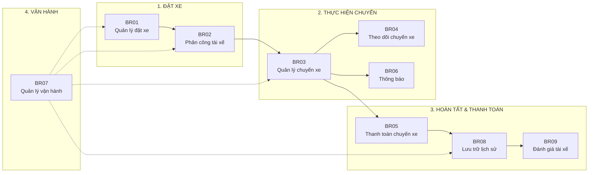
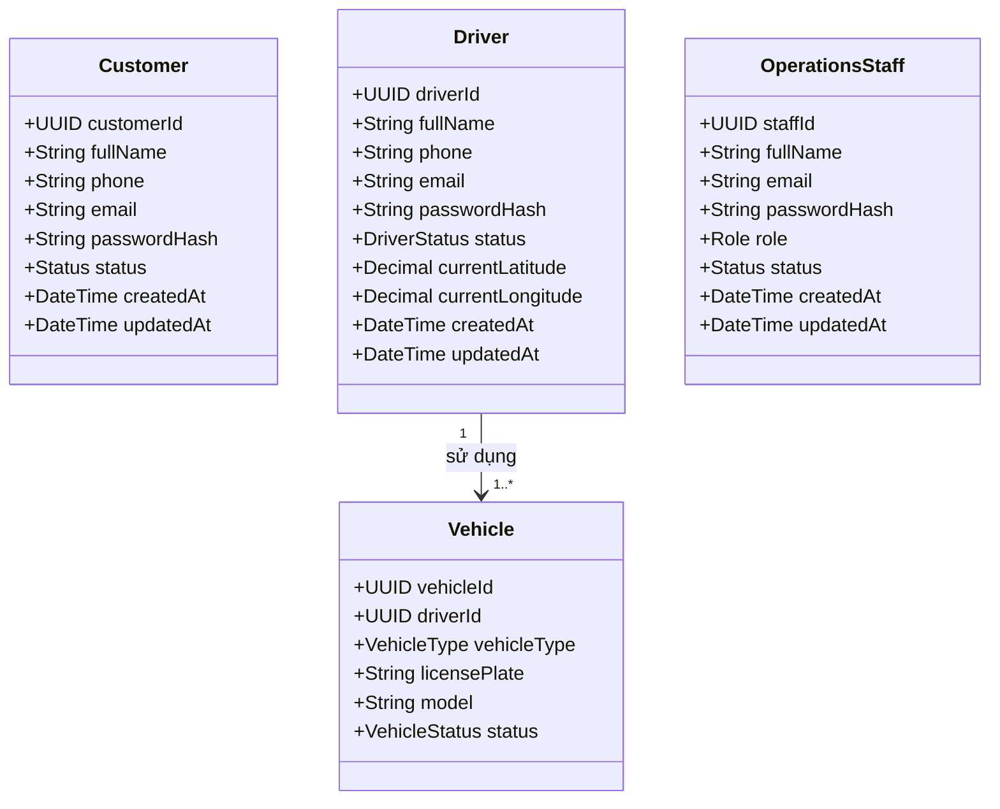
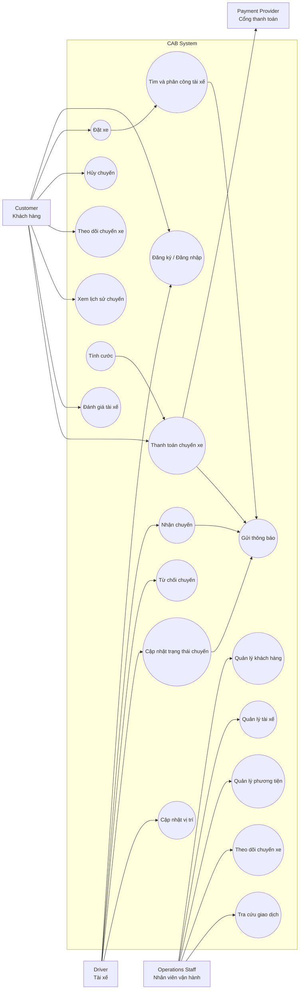
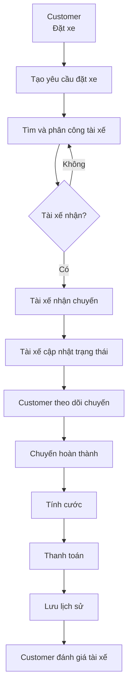

## Bước 1: ác định Business context và Business problem

**1. Khách hàng cần giải quyết vấn đề gì?**

Công ty ABC cần giải quyết vấn đề quản lý và vận hành dịch vụ đặt xe chưa hiệu quả, đặc biệt ở các khâu:
- Phân công tài xế còn thủ công, khó tìm tài xế phù hợp và gần khách hàng.
- Khách hàng khó theo dõi trạng thái chuyến đi.
- Thông tin thanh toán chưa được quản lý tập trung.
- Khi tài xế từ chối/không phản hồi, hệ thống chưa có cơ chế tự động tìm tài xế khác.
- Bộ phận vận hành khó quản lý khách hàng, tài xế, phương tiện và chuyến đi.
- Hệ thống chưa đáp ứng tốt khi số lượng khách hàng và tài xế tăng cao.
- Khó mở rộng thêm các tính năng, phương thức thanh toán hoặc kênh thông báo mới.
  
*-> Vấn đề cốt lõi: ABC cần một hệ thống đặt xe có khả năng tự động hóa quy trình, quản lý tập trung và mở rộng được khi quy mô tăng.*

**2. Vì sao hệ thống cũ không đủ đáp ứng?**

Hệ thống cũ gồm tổng đài và một ứng dụng đơn giản, nhưng chủ yếu chỉ đáp ứng việc tiếp nhận yêu cầu đặt xe.
Nó không đủ đáp ứng vì:

- Phân công tài xế thủ công	-> Chậm, khó tối ưu tài xế gần khách
- Theo dõi chuyến đi hạn chế -> Khách hàng không biết chuyến đang ở trạng thái nào
- Thanh toán chưa tập trung -> Khó quản lý giao dịch
- Không có cơ chế tự tìm tài xế khác -> Khi tài xế từ chối phải xử lý lại
- Quản lý vận hành khó khăn -> Nhân viên khó theo dõi toàn bộ hệ thống
- Khả năng mở rộng thấp -> Khó phục vụ lượng lớn người dùng
- Các thành phần phụ thuộc lẫn nhau -> Một lỗi thanh toán/thông báo có thể ảnh hưởng hệ thống
- Khó mở rộng tính năng	-> Thêm payment/notification/service mới phải thay đổi nhiều phần
  
**3. Ai sử dụng hệ thống mới?**
- *Khách hàng*
- *Tài xế*
- *Nhân viên vận hành*
  
**4. Hệ thống mới đáp ứng gì?**

Hệ thống CAB mới sẽ cung cấp toàn bộ quy trình đặt xe từ đầu đến cuối:

Khách hàng tạo yêu cầu -> Hệ thống tìm tài xế phù hợp -> Tài xế nhận/từ chối -> Tài xê thực hiện chuyến -> Cập nhật trạng thái, vị trí -> Hoàn thành chuyến -> Tính cước -> Thanh toán -> Đánh giá tài xế

## Bước 2: Xác định các Stakeholders

**Yêu cầu 1. Xác định các Stakeholders**
| Tên role                                                   | Chức năng                                                                                                                                                       |
| ---------------------------------------------------------- | --------------------------------------------------------------------------------------------------------------------------------------------------------------- |
| **Khách hàng**                                  | Đăng ký/đăng nhập, quản lý thông tin cá nhân, đặt xe, chọn điểm đón/điểm đến và loại xe, theo dõi chuyến đi, thanh toán, xem lịch sử chuyến và đánh giá tài xế. |
| **Tài xế**                                        | Quản lý hồ sơ và phương tiện, cập nhật trạng thái sẵn sàng, nhận/chấp nhận/từ chối chuyến, cập nhật trạng thái chuyến và vị trí trong quá trình hoạt động.      |
| **Nhân viên vận hành**                  | Quản lý khách hàng, tài xế, phương tiện và chuyến đi; theo dõi chuyến đang diễn ra; xử lý sự cố; tra cứu giao dịch và hỗ trợ vận hành.                          |
| **Quản trị viên**                          | Quản lý tài khoản và phân quyền, thực hiện các thao tác quản trị nhạy cảm, kiểm soát truy cập và theo dõi nhật ký hoạt động.                                    |
| **Ban lãnh đạo**                              | Theo dõi báo cáo về số lượng chuyến, doanh thu, tỷ lệ hoàn thành, tỷ lệ hủy và hiệu quả hoạt động của tài xế để hỗ trợ ra quyết định.                           |
| **Nhà cung cấp thanh toán**             | Xử lý các giao dịch thanh toán điện tử và trả kết quả thành công/thất bại cho hệ thống CAB.

**Yêu cầu 2. Vẽ ma trận Stakeholders**
|                    | **Quan tâm thấp**           | **Quan tâm cao**                                            |
| ------------------ | --------------------------- | ----------------------------------------------------------- |
| **Quyền lực cao**  | **Nhà cung cấp thanh toán** | **Ban lãnh đạo**, **Nhân viên vận hành**, **Quản trị viên** |
| **Quyền lực thấp** | **Nhà cung cấp thông báo**  | **Khách hàng**, **Tài xế**                                  |

## Bước 3. Xác định Business Goals

| Mã số    | Mô tả                                                                                        |
| -------- | -------------------------------------------------------------------------------------------- |
| **BG01** | Cho phép khách hàng đăng ký, đăng nhập và tạo yêu cầu đặt xe.                                |
| **BG02** | Tự động tìm và phân công tài xế phù hợp cho yêu cầu đặt xe.                                  |
| **BG03** | Cho phép tài xế nhận hoặc từ chối chuyến và cập nhật trạng thái chuyến đi.                   |
| **BG04** | Cho phép khách hàng theo dõi trạng thái chuyến đi từ lúc đặt xe đến khi hoàn thành.          |
| **BG05** | Tính cước và hỗ trợ thanh toán chuyến đi bằng tiền mặt hoặc thanh toán trực tuyến.           |
| **BG06** | Gửi thông báo cơ bản đến khách hàng và tài xế về các thay đổi quan trọng của chuyến đi.      |
| **BG07** | Cho phép nhân viên vận hành quản lý và theo dõi khách hàng, tài xế và các chuyến đi.         |
| **BG08** | Lưu trữ lịch sử chuyến đi và thông tin thanh toán để khách hàng và nhân viên có thể tra cứu. |
| **BG09** | Cho phép khách hàng đánh giá tài xế sau khi chuyến đi hoàn thành.                            |

## Bước 4: Xác định Scope (Phạm vi)

| Phạm vi          | Nội dung                                                                                          |
| ---------------- | ------------------------------------------------------------------------------------------------- |
| **In Scope**     | Quản lý tài khoản khách hàng và tài xế                                                            |
| **In Scope**     | Khách hàng tạo yêu cầu đặt xe với điểm đón, điểm đến và loại xe                                   |
| **In Scope**     | Tìm kiếm và phân công tài xế phù hợp                                                              |
| **In Scope**     | Cập nhật trạng thái chuyến |
| **In Scope**     | Tính cước chuyến đi                                                                               |
| **In Scope**     | Thanh toán tiền mặt và thanh toán trực tuyến                                                      |
| **In Scope**     | Thông báo các sự kiện quan trọng của chuyến đi                                                    |
| **In Scope**     | Xem lịch sử chuyến đi và thông tin thanh toán                                                     |
| **In Scope**     | Khách hàng đánh giá tài xế sau chuyến đi                                                          |
| **In Scope**     | Nhân viên vận hành xem và quản lý khách hàng, tài xế, chuyến đi                                   |

## Bước 5: Chuyển đổi yêu cầu sang Business Requirements

| Mã       | Tên                  | Mô tả                                                                                                    |
| -------- | -------------------- | -------------------------------------------------------------------------------------------------------- |
| **BR01** | Quản lý đặt xe       | Hệ thống phải hỗ trợ khách hàng tạo và quản lý yêu cầu đặt xe bằng việc khách hàng cung cấp điểm đón và điểm đến.                                           |
| **BR02** | Phân công tài xế     | Hệ thống phải hỗ trợ tự động tìm và phân công tài xế phù hợp cho mỗi yêu cầu đặt xe dựa theo vị trí với khách hàng.                     |
| **BR03** | Quản lý chuyến xe    | Hệ thống phải hỗ trợ tài xế tiếp nhận và thực hiện các chuyến xe được phân công.                         |
| **BR04** | Theo dõi chuyến xe   | Hệ thống phải hỗ trợ khách hàng theo dõi trạng thái chuyến xe trong quá trình sử dụng dịch vụ.           |
| **BR05** | Thanh toán chuyến xe | Hệ thống phải hỗ trợ tính cước và thu tiền theo hình thức tiền mặt hoặc chuyển khoản cho các chuyến xe hoàn thành.                                 |
| **BR06** | Thông báo            | Hệ thống phải hỗ trợ gửi thông báo về các sự kiện quan trọng trong quá trình đặt và thực hiện chuyến xe. |
| **BR07** | Quản lý vận hành     | Hệ thống phải hỗ trợ nhân viên vận hành theo dõi và quản lý khách hàng, tài xế và chuyến xe.             |
| **BR08** | Lưu trữ lịch sử      | Hệ thống phải lưu trữ thông tin chuyến xe và giao dịch để phục vụ tra cứu.                               |
| **BR09** | Đánh giá tài xế      | Hệ thống phải hỗ trợ khách hàng đánh giá tài xế sau khi hoàn thành chuyến xe.                            | | **BR10**     | Quản lý tài khoản người dùng                                  |

## Bước 6. Kết hợp các nghiệp vụ (Business Process)

   
## Bước 7. Phân rã yêu cầu chức năng

Dưới đây là bản đầy đủ **Mã – Tên yêu cầu – Mô tả**, giữ đúng scope MVP hiện tại:

### 1. BR01 – Quản lý đặt xe

| Mã       | Tên yêu cầu                       | Mô tả                                                                                            |
| -------- | --------------------------------- | ------------------------------------------------------------------------------------------------ |
| **FR01** | Xác định điểm đón                 | Hệ thống phải cho phép khách hàng cung cấp điểm đón cho chuyến xe.                               |
| **FR02** | Xác định điểm đến                 | Hệ thống phải cho phép khách hàng cung cấp điểm đến của chuyến xe.                               |
| **FR03** | Lựa chọn loại xe                  | Hệ thống phải cho phép khách hàng lựa chọn loại xe phù hợp với nhu cầu.                          |
| **FR04** | Tạo yêu cầu đặt xe                | Hệ thống phải cho phép khách hàng tạo yêu cầu đặt xe dựa trên thông tin đã cung cấp.             |
| **FR05** | Kiểm tra thông tin yêu cầu đặt xe | Hệ thống phải kiểm tra các thông tin bắt buộc trước khi tiếp nhận yêu cầu đặt xe.                |
| **FR06** | Hủy yêu cầu đặt xe                | Hệ thống phải cho phép khách hàng hủy yêu cầu đặt xe theo trạng thái và chính sách của hệ thống. |

### 2. BR02 – Phân công tài xế

| Mã       | Tên yêu cầu                     | Mô tả                                                                                      |
| -------- | ------------------------------- | ------------------------------------------------------------------------------------------ |
| **FR07** | Xác định vị trí khách hàng      | Hệ thống phải xác định vị trí điểm đón để phục vụ việc tìm kiếm tài xế.                    |
| **FR08** | Tìm tài xế sẵn sàng             | Hệ thống phải tìm các tài xế đang ở trạng thái sẵn sàng nhận chuyến.                       |
| **FR09** | Lọc tài xế theo loại xe         | Hệ thống phải lọc các tài xế có phương tiện phù hợp với loại xe khách hàng yêu cầu.        |
| **FR10** | Lọc tài xế theo khoảng cách     | Hệ thống phải xác định khoảng cách giữa tài xế và điểm đón để lọc tài xế phù hợp.          |
| **FR11** | Ưu tiên tài xế phù hợp          | Hệ thống phải ưu tiên tài xế phù hợp và có khoảng cách gần điểm đón hơn.                   |
| **FR12** | Gửi yêu cầu đến tài xế          | Hệ thống phải gửi thông tin yêu cầu chuyến xe đến tài xế được lựa chọn.                    |
| **FR13** | Xử lý tài xế từ chối            | Hệ thống phải tiếp tục tìm tài xế khác khi tài xế được đề xuất từ chối chuyến.             |
| **FR14** | Xử lý tài xế không phản hồi     | Hệ thống phải tiếp tục tìm tài xế khác khi tài xế không phản hồi trong thời gian quy định. |
| **FR15** | Xác nhận tài xế nhận chuyến     | Hệ thống phải xác nhận và gán chuyến xe cho tài xế đầu tiên chấp nhận yêu cầu.             |
| **FR16** | Thông báo không tìm được tài xế | Hệ thống phải thông báo cho khách hàng khi không tìm được tài xế phù hợp.                  |

### 3. BR03 – Quản lý chuyến xe

| Mã       | Tên yêu cầu                           | Mô tả                                                                                        |
| -------- | ------------------------------------- | -------------------------------------------------------------------------------------------- |
| **FR17** | Tài xế nhận chuyến                    | Hệ thống phải ghi nhận việc tài xế chấp nhận chuyến xe.                                      |
| **FR18** | Tài xế từ chối chuyến                 | Hệ thống phải ghi nhận việc tài xế từ chối chuyến xe và kích hoạt quá trình tìm tài xế khác. |
| **FR19** | Cập nhật trạng thái "Đã đến điểm đón" | Hệ thống phải cho phép tài xế cập nhật trạng thái khi đã đến điểm đón.                       |
| **FR20** | Cập nhật trạng thái "Đã đón khách"    | Hệ thống phải cho phép tài xế cập nhật trạng thái sau khi đón khách.                         |
| **FR21** | Cập nhật trạng thái "Đang di chuyển"  | Hệ thống phải cho phép tài xế cập nhật trạng thái khi bắt đầu thực hiện chuyến đi.           |
| **FR22** | Cập nhật trạng thái "Hoàn thành"      | Hệ thống phải cho phép tài xế cập nhật trạng thái khi chuyến xe kết thúc.                    |
| **FR23** | Hủy chuyến                            | Hệ thống phải cho phép hủy chuyến theo trạng thái hiện tại và chính sách của doanh nghiệp.   |

### 4. BR04 – Theo dõi chuyến xe

| Mã       | Tên yêu cầu                        | Mô tả                                                                             |
| -------- | ---------------------------------- | --------------------------------------------------------------------------------- |
| **FR24** | Xem trạng thái chuyến              | Hệ thống phải cho phép khách hàng xem trạng thái hiện tại của chuyến xe.          |
| **FR25** | Xem thông tin tài xế               | Hệ thống phải cung cấp thông tin cơ bản của tài xế được phân công cho khách hàng. |
| **FR26** | Xem thông tin phương tiện          | Hệ thống phải cung cấp thông tin cơ bản về phương tiện thực hiện chuyến xe.       |
| **FR27** | Xem thông tin điểm đón và điểm đến | Hệ thống phải cho phép khách hàng xem lại điểm đón và điểm đến của chuyến xe.     |

### 5. BR05 – Thanh toán chuyến xe

| Mã       | Tên yêu cầu                     | Mô tả                                                                                                              |
| -------- | ------------------------------- | ------------------------------------------------------------------------------------------------------------------ |
| **FR28** | Tính cước chuyến xe             | Hệ thống phải tính số tiền khách hàng cần thanh toán dựa trên thông tin chuyến xe.                                 |
| **FR29** | Xác định phương thức thanh toán | Hệ thống phải cho phép khách hàng lựa chọn phương thức thanh toán được hỗ trợ.                                     |
| **FR30** | Ghi nhận thanh toán tiền mặt    | Hệ thống phải ghi nhận kết quả thanh toán bằng tiền mặt sau khi chuyến xe hoàn thành.                              |
| **FR31** | Xử lý thanh toán trực tuyến     | Hệ thống phải gửi yêu cầu thanh toán trực tuyến đến nhà cung cấp thanh toán bên ngoài và nhận kết quả giao dịch.   |
| **FR32** | Xử lý thanh toán thất bại       | Hệ thống phải ghi nhận trạng thái thất bại và thông báo cho khách hàng khi thanh toán trực tuyến không thành công. |
| **FR33** | Xác nhận kết quả thanh toán     | Hệ thống phải cập nhật và xác nhận trạng thái thanh toán của chuyến xe.                                            |

### 6. BR06 – Thông báo

| Mã       | Tên yêu cầu                        | Mô tả                                                                                  |
| -------- | ---------------------------------- | -------------------------------------------------------------------------------------- |
| **FR34** | Thông báo tiếp nhận yêu cầu đặt xe | Hệ thống phải thông báo cho khách hàng khi yêu cầu đặt xe được tiếp nhận.              |
| **FR35** | Thông báo tài xế nhận chuyến       | Hệ thống phải thông báo cho khách hàng khi tài xế đã nhận chuyến.                      |
| **FR36** | Thông báo tài xế đến điểm đón      | Hệ thống phải thông báo cho khách hàng khi tài xế cập nhật trạng thái đã đến điểm đón. |
| **FR37** | Thông báo hoàn thành chuyến        | Hệ thống phải thông báo cho khách hàng khi chuyến xe hoàn thành.                       |
| **FR38** | Thông báo kết quả thanh toán       | Hệ thống phải thông báo cho khách hàng về kết quả thanh toán của chuyến xe.            |

### 7. BR07 – Quản lý vận hành

| Mã       | Tên yêu cầu                | Mô tả                                                                               |
| -------- | -------------------------- | ----------------------------------------------------------------------------------- |
| **FR39** | Quản lý khách hàng         | Hệ thống phải cho phép nhân viên vận hành xem và quản lý thông tin khách hàng.      |
| **FR40** | Quản lý tài xế             | Hệ thống phải cho phép nhân viên vận hành xem và quản lý thông tin tài xế.          |
| **FR41** | Quản lý phương tiện        | Hệ thống phải cho phép nhân viên vận hành quản lý thông tin phương tiện của tài xế. |
| **FR42** | Xem danh sách chuyến xe    | Hệ thống phải cho phép nhân viên vận hành xem danh sách các chuyến xe.              |
| **FR43** | Xem chi tiết chuyến xe     | Hệ thống phải cho phép nhân viên vận hành xem thông tin chi tiết của một chuyến xe. |
| **FR44** | Theo dõi trạng thái tài xế | Hệ thống phải cho phép nhân viên vận hành xem trạng thái hoạt động của tài xế.      |

### 8. BR08 – Lưu trữ lịch sử

| Mã       | Tên yêu cầu                 | Mô tả                                                                                 |
| -------- | --------------------------- | ------------------------------------------------------------------------------------- |
| **FR45** | Lưu thông tin chuyến xe     | Hệ thống phải lưu trữ thông tin của các chuyến xe đã được tạo.                        |
| **FR46** | Lưu thông tin thanh toán    | Hệ thống phải lưu trữ thông tin và trạng thái thanh toán của chuyến xe.               |
| **FR47** | Tra cứu lịch sử chuyến xe   | Hệ thống phải cho phép khách hàng tra cứu lịch sử các chuyến xe của mình.             |
| **FR48** | Tra cứu thông tin giao dịch | Hệ thống phải cho phép nhân viên vận hành tra cứu thông tin các giao dịch thanh toán. |

### 9. BR09 – Đánh giá tài xế

| Mã       | Tên yêu cầu         | Mô tả                                                                           |
| -------- | ------------------- | ------------------------------------------------------------------------------- |
| **FR49** | Đánh giá tài xế     | Hệ thống phải cho phép khách hàng đánh giá tài xế sau khi chuyến xe hoàn thành. |
| **FR50** | Lưu đánh giá        | Hệ thống phải lưu trữ đánh giá của khách hàng đối với tài xế.                   |
| **FR51** | Xem đánh giá tài xế | Hệ thống phải cho phép xem đánh giá đã được lưu của tài xế.                     |

### 10. BR010 – Quản lý tài khoản

| Mã       | Tên yêu cầu         | Mô tả                                                                           |
| -------- | ------------------- | ------------------------------------------------------------------------------- |
| **FR52** | Đăng ký tài khoản  | Hệ thống phải cho phép tạo tài khoản cho khách hàng và tài xế. |
| **FR53** | Đăng nhập        | Hệ thống phải cho phép người dùng đăng nhập.                   |
| **FR54** | Cập nhật tài khoản | Hệ thống phải cho phép người dùng thay đổi thông tin tài khoản.                     |
| **FR55** | Phân quyền người dùng | Hệ thống phải phân quyền người dùng đúng theo vai trò.                     |

## 8. Quy tắc nghiệp vụ và ngoại lệ (Business Rules & Exceptions)

Với CAB System và scope **MVP 7 tuần**, phần **Business Rules & Exceptions** nên tập trung vào các quy tắc trực tiếp ảnh hưởng đến luồng đặt xe → tìm tài xế → thực hiện chuyến → thanh toán.

## 8. Quy tắc nghiệp vụ và ngoại lệ

### 8.1. Business Rules

| Mã          | Quy tắc nghiệp vụ                                     | Mô tả                                                                                                  |
| ----------- | ----------------------------------------------------- | ------------------------------------------------------------------------------------------------------ |
| **BRULE01** | Khách hàng phải đăng nhập                             | Chỉ khách hàng đã xác thực mới được tạo yêu cầu đặt xe.                                                |
| **BRULE02** | Yêu cầu đặt xe phải đầy đủ thông tin                  | Yêu cầu phải có điểm đón, điểm đến và loại xe trước khi được tạo.                                      |
| **BRULE03** | Tài xế phải ở trạng thái sẵn sàng                     | Chỉ tài xế đang ở trạng thái sẵn sàng mới được hệ thống đưa vào danh sách tìm kiếm.                    |
| **BRULE04** | Tài xế phải phù hợp với loại xe                       | Tài xế chỉ được nhận chuyến nếu phương tiện phù hợp với loại xe khách hàng yêu cầu.                    |
| **BRULE05** | Ưu tiên tài xế gần khách hàng                         | Khi có nhiều tài xế phù hợp, hệ thống ưu tiên tài xế có khoảng cách gần điểm đón hơn.                  |
| **BRULE06** | Tài xế chỉ nhận một chuyến tại một thời điểm          | Sau khi nhận chuyến, tài xế chuyển sang trạng thái không sẵn sàng nhận chuyến khác.                    |
| **BRULE07** | Tài xế từ chối thì tìm tài xế khác                    | Nếu tài xế từ chối chuyến, hệ thống phải tiếp tục tìm tài xế phù hợp khác.                             |
| **BRULE08** | Tài xế không phản hồi                                 | Nếu tài xế không phản hồi trong thời gian quy định, hệ thống chuyển sang tìm tài xế khác.              |
| **BRULE09** | Chuyến xe phải theo đúng trạng thái                   | Chuyến xe phải chuyển trạng thái theo trình tự hợp lệ, không được bỏ qua các trạng thái không phù hợp. |
| **BRULE10** | Chỉ được thanh toán khi chuyến hoàn thành             | Hệ thống chỉ thực hiện tính cước và thanh toán sau khi chuyến xe được hoàn thành.                      |
| **BRULE11** | Mỗi chuyến chỉ có một giao dịch thanh toán thành công | Hệ thống không ghi nhận nhiều giao dịch thanh toán thành công cho cùng một chuyến xe.                  |
| **BRULE12** | Chỉ được đánh giá sau khi hoàn thành chuyến           | Khách hàng chỉ có thể đánh giá tài xế sau khi chuyến xe đã hoàn thành.                                 |

### 8.2. Exceptions

| Mã       | Ngoại lệ                       | Cách xử lý                                                                                                 |
| -------- | ------------------------------ | ---------------------------------------------------------------------------------------------------------- |
| **EX01** | Không tìm thấy tài xế          | Hệ thống thông báo cho khách hàng rằng hiện không có tài xế phù hợp.                                       |
| **EX02** | Tài xế từ chối chuyến          | Hệ thống loại tài xế đó khỏi yêu cầu hiện tại và tiếp tục tìm tài xế khác.                                 |
| **EX03** | Tài xế không phản hồi          | Sau thời gian quy định, hệ thống chuyển yêu cầu sang tài xế khác.                                          |
| **EX04** | Thanh toán trực tuyến thất bại | Hệ thống ghi nhận giao dịch thất bại và thông báo cho khách hàng.                                          |
| **EX05** | Thông tin đặt xe không hợp lệ  | Hệ thống từ chối tạo yêu cầu và yêu cầu khách hàng cung cấp lại thông tin.                                 |
| **EX06** | Tài xế hủy chuyến              | Hệ thống thông báo cho khách hàng và thực hiện tìm tài xế khác nếu chính sách cho phép.                    |
| **EX07** | Khách hàng hủy chuyến          | Hệ thống cập nhật chuyến thành trạng thái đã hủy và kết thúc quá trình tìm/điều phối tài xế.               |
| **EX08** | Tài xế mất kết nối             | Hệ thống không tiếp tục chờ tài xế nếu không thể nhận phản hồi và chuyển sang tài xế khác theo chính sách. |

## Bước 9. Mô hình hoá dữ liệu (Data modeling)

### 9.1. Lớp Customer

| Thuộc tính     | Kiểu dữ liệu | Mô tả                                |
| -------------- | ------------ | ------------------------------------ |
| `customerId`   | UUID         | Mã định danh duy nhất của khách hàng |
| `fullName`     | String       | Họ và tên khách hàng                 |
| `phone`        | String       | Số điện thoại                        |
| `email`        | String       | Email                                |
| `passwordHash` | String       | Mật khẩu đã được mã hóa              |
| `status`       | Enum         | Trạng thái tài khoản                 |
| `createdAt`    | DateTime     | Thời điểm tạo tài khoản              |
| `updatedAt`    | DateTime     | Thời điểm cập nhật thông tin         |

### 9.2. Lớp Driver

| Thuộc tính         | Kiểu dữ liệu | Mô tả                            |
| ------------------ | ------------ | -------------------------------- |
| `driverId`         | UUID         | Mã định danh duy nhất của tài xế |
| `fullName`         | String       | Họ và tên tài xế                 |
| `phone`            | String       | Số điện thoại                    |
| `email`            | String       | Email                            |
| `passwordHash`     | String       | Mật khẩu đã được mã hóa          |
| `status`           | Enum         | Trạng thái tài xế                |
| `currentLatitude`  | Decimal      | Vĩ độ hiện tại                   |
| `currentLongitude` | Decimal      | Kinh độ hiện tại                 |
| `createdAt`        | DateTime     | Thời điểm tạo tài khoản          |
| `updatedAt`        | DateTime     | Thời điểm cập nhật thông tin     |

### 9.3. Lớp Vehicle

| Thuộc tính     | Kiểu dữ liệu | Mô tả                             |
| -------------- | ------------ | --------------------------------- |
| `vehicleId`    | UUID         | Mã phương tiện                    |
| `driverId`     | UUID         | Tài xế sở hữu/sử dụng phương tiện |
| `vehicleType`  | Enum         | Loại xe                           |
| `licensePlate` | String       | Biển số xe                        |
| `model`        | String       | Tên/model phương tiện             |
| `status`       | Enum         | Trạng thái phương tiện            |

### 9.4. Lớp OperationsStaff

| Thuộc tính     | Kiểu dữ liệu | Mô tả                   |
| -------------- | ------------ | ----------------------- |
| `staffId`      | UUID         | Mã nhân viên            |
| `fullName`     | String       | Họ và tên               |
| `email`        | String       | Email                   |
| `passwordHash` | String       | Mật khẩu đã được mã hóa |
| `role`         | Enum         | Vai trò/phân quyền      |
| `status`       | Enum         | Trạng thái tài khoản    |
| `createdAt`    | DateTime     | Thời điểm tạo tài khoản |
| `updatedAt`    | DateTime     | Thời điểm cập nhật      |

### 9.5. Quan hệ giữa các lớp người dùng

## Bước 10. Xác định yêu cầu phi chức năng (Non-Functional Requirements)

| Mã        | Nhóm                       | Yêu cầu phi chức năng                                                                                                              |
| --------- | -------------------------- | ---------------------------------------------------------------------------------------------------------------------------------- |
| **NFR01** | Bảo mật                    | Hệ thống phải yêu cầu xác thực đối với khách hàng, tài xế và nhân viên vận hành trước khi sử dụng các chức năng yêu cầu tài khoản. |
| **NFR02** | Phân quyền                 | Hệ thống phải kiểm soát quyền truy cập dựa trên vai trò của người dùng.                                                            |
| **NFR03** | Bảo mật dữ liệu            | Thông tin cá nhân, thông tin tài xế, dữ liệu vị trí và thông tin giao dịch phải được bảo vệ khỏi truy cập trái phép.               |
| **NFR04** | Thanh toán                 | Hệ thống không được lưu trực tiếp thông tin nhạy cảm của thẻ hoặc tài khoản thanh toán của khách hàng.                             |
| **NFR05** | Tin cậy                    | Lỗi của dịch vụ thanh toán hoặc thông báo không được làm cho toàn bộ chức năng đặt xe ngừng hoạt động.                             |
| **NFR06** | Khả năng mở rộng           | Các thành phần chính của hệ thống phải có khả năng được mở rộng độc lập khi số lượng người dùng và chuyến xe tăng.                 |
| **NFR07** | Khả năng bảo trì           | Hệ thống phải được thiết kế theo các service có trách nhiệm rõ ràng để thuận tiện cho việc bảo trì và phát triển thêm chức năng.   |
| **NFR08** | Khả năng mở rộng chức năng | Hệ thống phải cho phép bổ sung phương thức thanh toán hoặc kênh thông báo mới mà hạn chế ảnh hưởng đến các chức năng hiện có.      |
| **NFR09** | Tính sẵn sàng              | Hệ thống phải tiếp tục cung cấp các chức năng cốt lõi khi một thành phần phụ trợ gặp lỗi, trong phạm vi có thể xử lý.              |
| **NFR10** | Logging                    | Hệ thống phải ghi nhận các lỗi và các thao tác quan trọng để hỗ trợ kiểm tra và xử lý sự cố.                                       |

## Bước 11. Vẽ Use Case

### Luồng Use Case chính

## Bước 12. Đặc tả Use Case (Use Case Specification)

# UC01 – Đặt xe

| Thành phần         | Nội dung                                                                                    |
| ------------------ | ------------------------------------------------------------------------------------------- |
| **Use Case ID**    | UC01                                                                                        |
| **Tên**            | Đặt xe                                                                                      |
| **Actor chính**    | Customer                                                                                    |
| **Actor phụ**      | Driver, Notification Service                                                                |
| **Mục tiêu**       | Cho phép khách hàng tạo yêu cầu đặt xe và hệ thống tìm tài xế phù hợp.                      |
| **Tiền điều kiện** | Customer đã đăng nhập.                                                                      |
| **Hậu điều kiện**  | Yêu cầu đặt xe được tạo và chuyển sang trạng thái tìm tài xế hoặc đã được phân công tài xế. |
| **Trigger**        | Customer gửi yêu cầu đặt xe.                                                                |

### Main Flow

1. Customer nhập điểm đón.
2. Customer nhập điểm đến.
3. Customer lựa chọn loại xe.
4. Hệ thống kiểm tra thông tin yêu cầu đặt xe.
5. Hệ thống tạo yêu cầu đặt xe.
6. Hệ thống xác định vị trí điểm đón.
7. Hệ thống tìm các Driver đang sẵn sàng.
8. Hệ thống lọc Driver theo loại xe và khoảng cách.
9. Hệ thống ưu tiên Driver phù hợp.
10. Hệ thống gửi yêu cầu chuyến đến Driver.
11. Driver chấp nhận chuyến.
12. Hệ thống gán chuyến cho Driver.
13. Hệ thống thông báo cho Customer thông tin Driver.
14. Use Case kết thúc.

### Alternative / Exception Flow

| Mã     | Tại bước | Trường hợp                    | Xử lý                                                          |
| ------ | -------: | ----------------------------- | -------------------------------------------------------------- |
| **A1** |        1 | Thiếu điểm đón                | Hệ thống yêu cầu Customer nhập lại điểm đón.                   |
| **A2** |        2 | Thiếu điểm đến                | Hệ thống yêu cầu Customer nhập lại điểm đến.                   |
| **A3** |        7 | Không có Driver sẵn sàng      | Hệ thống thông báo không tìm được Driver và kết thúc Use Case. |
| **A4** |       10 | Driver từ chối                | Hệ thống tìm Driver phù hợp tiếp theo.                         |
| **A5** |       10 | Driver không phản hồi         | Hệ thống chuyển yêu cầu sang Driver khác.                      |
| **A6** |       10 | Không còn Driver phù hợp      | Hệ thống thông báo cho Customer và kết thúc yêu cầu.           |
| **A7** |        4 | Thông tin đặt xe không hợp lệ | Hệ thống yêu cầu Customer chỉnh sửa thông tin.                 |

---

# UC02 – Nhận chuyến

| Thành phần         | Nội dung                                                                 |
| ------------------ | ------------------------------------------------------------------------ |
| **Use Case ID**    | UC02                                                                     |
| **Tên**            | Nhận chuyến                                                              |
| **Actor chính**    | Driver                                                                   |
| **Mục tiêu**       | Cho phép Driver chấp nhận yêu cầu chuyến xe được hệ thống gửi đến.       |
| **Tiền điều kiện** | Driver đã đăng nhập và đang ở trạng thái sẵn sàng.                       |
| **Hậu điều kiện**  | Chuyến xe được gán cho Driver và Driver chuyển sang trạng thái đang bận. |
| **Trigger**        | Driver nhận được yêu cầu chuyến xe.                                      |

### Main Flow

1. Hệ thống gửi yêu cầu chuyến đến Driver.
2. Driver xem thông tin chuyến xe.
3. Driver chọn **Nhận chuyến**.
4. Hệ thống kiểm tra trạng thái chuyến.
5. Hệ thống xác nhận Driver nhận chuyến.
6. Hệ thống gán chuyến cho Driver.
7. Hệ thống cập nhật trạng thái Driver thành đang bận.
8. Hệ thống thông báo cho Customer.
9. Use Case kết thúc.

### Alternative / Exception Flow

| Mã     | Tại bước | Trường hợp                             | Xử lý                                                                  |
| ------ | -------: | -------------------------------------- | ---------------------------------------------------------------------- |
| **A1** |        3 | Driver từ chối chuyến                  | Hệ thống ghi nhận từ chối và tiếp tục tìm Driver khác.                 |
| **A2** |        4 | Chuyến đã được Driver khác nhận        | Hệ thống thông báo chuyến không còn khả dụng.                          |
| **A3** |        1 | Driver không phản hồi                  | Hệ thống chờ đến thời gian quy định và chuyển yêu cầu cho Driver khác. |
| **A4** |        4 | Driver không còn ở trạng thái sẵn sàng | Hệ thống không cho phép nhận chuyến.                                   |
| **A5** |        5 | Không thể gán chuyến                   | Hệ thống thông báo lỗi và đưa chuyến về trạng thái tìm Driver.         |

---

# UC03 – Thực hiện chuyến xe

| Thành phần         | Nội dung                                                              |
| ------------------ | --------------------------------------------------------------------- |
| **Use Case ID**    | UC03                                                                  |
| **Tên**            | Thực hiện chuyến xe                                                   |
| **Actor chính**    | Driver                                                                |
| **Mục tiêu**       | Cho phép Driver cập nhật trạng thái trong quá trình thực hiện chuyến. |
| **Tiền điều kiện** | Driver đã nhận chuyến.                                                |
| **Hậu điều kiện**  | Chuyến xe chuyển sang trạng thái hoàn thành.                          |
| **Trigger**        | Driver bắt đầu thực hiện chuyến.                                      |

### Main Flow

1. Driver bắt đầu thực hiện chuyến.
2. Driver cập nhật trạng thái **Đã đến điểm đón**.
3. Hệ thống cập nhật trạng thái chuyến.
4. Driver đón Customer.
5. Driver cập nhật trạng thái **Đã đón khách**.
6. Hệ thống cập nhật trạng thái chuyến.
7. Driver bắt đầu di chuyển.
8. Driver cập nhật trạng thái **Đang di chuyển**.
9. Hệ thống cập nhật trạng thái chuyến.
10. Driver đến điểm đến.
11. Driver cập nhật trạng thái **Hoàn thành**.
12. Hệ thống cập nhật chuyến thành **Hoàn thành**.
13. Hệ thống chuyển Driver về trạng thái sẵn sàng.
14. Hệ thống thông báo hoàn thành chuyến cho Customer.

### Alternative / Exception Flow

| Mã     | Tại bước | Trường hợp                              | Xử lý                                                                       |
| ------ | -------: | --------------------------------------- | --------------------------------------------------------------------------- |
| **A1** |        2 | Driver cập nhật trạng thái không hợp lệ | Hệ thống từ chối cập nhật và giữ nguyên trạng thái hiện tại.                |
| **A2** |        4 | Driver hủy chuyến                       | Hệ thống cập nhật chuyến thành trạng thái hủy và thông báo Customer.        |
| **A3** |        4 | Customer hủy chuyến                     | Hệ thống xử lý hủy theo chính sách và thông báo Driver.                     |
| **A4** |     2–11 | Driver mất kết nối                      | Hệ thống giữ trạng thái chuyến và xử lý khi Driver kết nối lại.             |
| **A5** |       11 | Không thể cập nhật hoàn thành           | Hệ thống giữ trạng thái hiện tại và cho phép Driver thực hiện lại thao tác. |

---

# UC04 – Thanh toán chuyến xe

| Thành phần         | Nội dung                                                         |
| ------------------ | ---------------------------------------------------------------- |
| **Use Case ID**    | UC04                                                             |
| **Tên**            | Thanh toán chuyến xe                                             |
| **Actor chính**    | Customer                                                         |
| **Actor phụ**      | Payment Provider                                                 |
| **Mục tiêu**       | Cho phép Customer thanh toán chi phí chuyến xe.                  |
| **Tiền điều kiện** | Chuyến xe đã hoàn thành và hệ thống đã tính cước.                |
| **Hậu điều kiện**  | Giao dịch được ghi nhận với trạng thái thành công hoặc thất bại. |
| **Trigger**        | Chuyến xe hoàn thành.                                            |

### Main Flow

1. Hệ thống xác định chuyến xe đã hoàn thành.
2. Hệ thống tính cước chuyến xe.
3. Hệ thống hiển thị số tiền cần thanh toán.
4. Customer lựa chọn phương thức thanh toán.
5. Nếu chọn tiền mặt, hệ thống ghi nhận thanh toán.
6. Nếu chọn thanh toán trực tuyến, hệ thống gửi yêu cầu đến Payment Provider.
7. Payment Provider xử lý giao dịch.
8. Payment Provider trả kết quả.
9. Hệ thống cập nhật trạng thái thanh toán.
10. Hệ thống thông báo kết quả cho Customer.
11. Use Case kết thúc.

### Alternative / Exception Flow

| Mã     | Tại bước | Trường hợp                        | Xử lý                                                               |
| ------ | -------: | --------------------------------- | ------------------------------------------------------------------- |
| **A1** |        1 | Chuyến chưa hoàn thành            | Hệ thống không cho phép thanh toán.                                 |
| **A2** |        2 | Không thể tính cước               | Hệ thống thông báo lỗi và chưa thực hiện thanh toán.                |
| **A3** |        7 | Thanh toán trực tuyến thất bại    | Hệ thống ghi nhận giao dịch thất bại và thông báo Customer.         |
| **A4** |        7 | Payment Provider không phản hồi   | Hệ thống ghi nhận giao dịch cần xử lý và thông báo Customer.        |
| **A5** |        8 | Không nhận được kết quả giao dịch | Hệ thống không xác nhận thanh toán thành công và yêu cầu xử lý lại. |

---

# UC05 – Đánh giá tài xế

| Thành phần         | Nội dung                                                        |
| ------------------ | --------------------------------------------------------------- |
| **Use Case ID**    | UC05                                                            |
| **Tên**            | Đánh giá tài xế                                                 |
| **Actor chính**    | Customer                                                        |
| **Mục tiêu**       | Cho phép Customer đánh giá Driver sau khi chuyến xe hoàn thành. |
| **Tiền điều kiện** | Chuyến xe đã hoàn thành và Customer đã đăng nhập.               |
| **Hậu điều kiện**  | Đánh giá được lưu vào hệ thống.                                 |
| **Trigger**        | Customer gửi đánh giá.                                          |

### Main Flow

1. Customer chọn chuyến xe đã hoàn thành.
2. Hệ thống kiểm tra điều kiện đánh giá.
3. Customer nhập mức đánh giá.
4. Customer gửi đánh giá.
5. Hệ thống kiểm tra dữ liệu đánh giá.
6. Hệ thống lưu đánh giá.
7. Hệ thống thông báo đánh giá thành công.
8. Use Case kết thúc.

### Alternative / Exception Flow

| Mã     | Tại bước | Trường hợp                  | Xử lý                                           |
| ------ | -------: | --------------------------- | ----------------------------------------------- |
| **A1** |        2 | Chuyến chưa hoàn thành      | Hệ thống không cho phép đánh giá.               |
| **A2** |        2 | Customer đã đánh giá chuyến | Hệ thống không cho phép tạo đánh giá mới.       |
| **A3** |        5 | Mức đánh giá không hợp lệ   | Hệ thống yêu cầu Customer nhập lại.             |
| **A4** |        6 | Không thể lưu đánh giá      | Hệ thống thông báo đánh giá chưa được ghi nhận. |

---

# UC06 – Đăng ký tài khoản

| Thành phần         | Nội dung                                               |
| ------------------ | ------------------------------------------------------ |
| **Use Case ID**    | UC06                                                   |
| **Tên**            | Đăng ký tài khoản                                      |
| **Actor chính**    | Customer, Driver                                       |
| **Mục tiêu**       | Cho phép người dùng tạo tài khoản để sử dụng hệ thống. |
| **Tiền điều kiện** | Người dùng chưa có tài khoản.                          |
| **Hậu điều kiện**  | Tài khoản được tạo thành công.                         |
| **Trigger**        | Người dùng gửi yêu cầu đăng ký.                        |

### Main Flow

1. Người dùng nhập họ tên.
2. Người dùng nhập số điện thoại/email.
3. Người dùng nhập mật khẩu.
4. Hệ thống kiểm tra dữ liệu.
5. Hệ thống kiểm tra tài khoản đã tồn tại.
6. Hệ thống mã hóa mật khẩu.
7. Hệ thống tạo tài khoản.
8. Hệ thống thông báo đăng ký thành công.
9. Use Case kết thúc.

### Alternative / Exception Flow

| Mã     | Tại bước | Trường hợp                     | Xử lý                                    |
| ------ | -------: | ------------------------------ | ---------------------------------------- |
| **A1** |        4 | Thiếu thông tin bắt buộc       | Hệ thống yêu cầu bổ sung thông tin.      |
| **A2** |        4 | Thông tin không hợp lệ         | Hệ thống yêu cầu nhập lại thông tin.     |
| **A3** |        5 | Tài khoản đã tồn tại           | Hệ thống thông báo tài khoản đã tồn tại. |
| **A4** |        3 | Mật khẩu không đáp ứng yêu cầu | Hệ thống yêu cầu tạo mật khẩu hợp lệ.    |
| **A5** |        7 | Không thể tạo tài khoản        | Hệ thống thông báo đăng ký thất bại.     |

---

# UC07 – Đăng nhập

| Thành phần         | Nội dung                                                               |
| ------------------ | ---------------------------------------------------------------------- |
| **Use Case ID**    | UC07                                                                   |
| **Tên**            | Đăng nhập                                                              |
| **Actor chính**    | Customer, Driver, Operations Staff                                     |
| **Mục tiêu**       | Xác thực người dùng trước khi sử dụng các chức năng yêu cầu tài khoản. |
| **Tiền điều kiện** | Người dùng đã có tài khoản.                                            |
| **Hậu điều kiện**  | Người dùng được xác thực và có quyền truy cập hệ thống.                |
| **Trigger**        | Người dùng gửi thông tin đăng nhập.                                    |

### Main Flow

1. Người dùng nhập thông tin đăng nhập.
2. Hệ thống kiểm tra thông tin.
3. Hệ thống xác thực tài khoản.
4. Hệ thống xác định vai trò người dùng.
5. Hệ thống cấp thông tin xác thực.
6. Hệ thống cho phép người dùng truy cập các chức năng tương ứng.
7. Use Case kết thúc.

### Alternative / Exception Flow

| Mã     | Tại bước | Trường hợp                        | Xử lý                                        |
| ------ | -------: | --------------------------------- | -------------------------------------------- |
| **A1** |        1 | Thiếu thông tin đăng nhập         | Hệ thống yêu cầu nhập đầy đủ thông tin.      |
| **A2** |        2 | Sai thông tin đăng nhập           | Hệ thống từ chối đăng nhập và thông báo lỗi. |
| **A3** |        2 | Tài khoản không tồn tại           | Hệ thống thông báo tài khoản không tồn tại.  |
| **A4** |        3 | Tài khoản bị khóa/ngừng hoạt động | Hệ thống từ chối đăng nhập.                  |
| **A5** |        5 | Không thể cấp thông tin xác thực  | Hệ thống thông báo đăng nhập thất bại.       |

---

# UC08 – Quản lý vận hành

| Thành phần         | Nội dung                                                                          |
| ------------------ | --------------------------------------------------------------------------------- |
| **Use Case ID**    | UC08                                                                              |
| **Tên**            | Quản lý vận hành                                                                  |
| **Actor chính**    | Operations Staff                                                                  |
| **Mục tiêu**       | Cho phép nhân viên vận hành theo dõi và quản lý các đối tượng chính của hệ thống. |
| **Tiền điều kiện** | Staff đã đăng nhập và có quyền vận hành.                                          |
| **Hậu điều kiện**  | Thông tin được xem hoặc cập nhật thành công.                                      |
| **Trigger**        | Staff thực hiện thao tác quản lý.                                                 |

### Main Flow

1. Staff đăng nhập hệ thống.
2. Staff lựa chọn đối tượng cần quản lý.
3. Hệ thống kiểm tra quyền truy cập.
4. Hệ thống hiển thị danh sách đối tượng.
5. Staff chọn đối tượng cần xem hoặc cập nhật.
6. Hệ thống hiển thị thông tin chi tiết.
7. Staff thực hiện thao tác.
8. Hệ thống kiểm tra dữ liệu.
9. Hệ thống lưu thay đổi.
10. Hệ thống thông báo kết quả.
11. Use Case kết thúc.

### Alternative / Exception Flow

| Mã     | Tại bước | Trường hợp                    | Xử lý                                        |
| ------ | -------: | ----------------------------- | -------------------------------------------- |
| **A1** |        3 | Staff không có quyền          | Hệ thống từ chối thao tác.                   |
| **A2** |        4 | Không có dữ liệu              | Hệ thống thông báo không có dữ liệu phù hợp. |
| **A3** |        5 | Không tìm thấy đối tượng      | Hệ thống thông báo không tìm thấy đối tượng. |
| **A4** |        8 | Dữ liệu cập nhật không hợp lệ | Hệ thống yêu cầu Staff chỉnh sửa dữ liệu.    |
| **A5** |        9 | Không thể lưu thay đổi        | Hệ thống thông báo cập nhật thất bại.        |

---

# UC09 – Tra cứu lịch sử

| Thành phần         | Nội dung                                                                       |
| ------------------ | ------------------------------------------------------------------------------ |
| **Use Case ID**    | UC09                                                                           |
| **Tên**            | Tra cứu lịch sử                                                                |
| **Actor chính**    | Customer, Operations Staff                                                     |
| **Mục tiêu**       | Cho phép người dùng tra cứu thông tin các chuyến xe và giao dịch đã phát sinh. |
| **Tiền điều kiện** | Người dùng đã đăng nhập.                                                       |
| **Hậu điều kiện**  | Danh sách hoặc chi tiết lịch sử được hiển thị.                                 |
| **Trigger**        | Người dùng yêu cầu xem lịch sử.                                                |

### Main Flow

1. Người dùng chọn chức năng **Tra cứu lịch sử**.
2. Hệ thống xác định vai trò người dùng.
3. Hệ thống xác định phạm vi dữ liệu được phép truy cập.
4. Hệ thống truy vấn lịch sử.
5. Hệ thống hiển thị danh sách chuyến xe/giao dịch.
6. Người dùng chọn một bản ghi.
7. Hệ thống hiển thị thông tin chi tiết.
8. Use Case kết thúc.

### Alternative / Exception Flow

| Mã     | Tại bước | Trường hợp                                | Xử lý                                                         |
| ------ | -------: | ----------------------------------------- | ------------------------------------------------------------- |
| **A1** |        4 | Không có lịch sử                          | Hệ thống thông báo chưa có dữ liệu lịch sử.                   |
| **A2** |        6 | Không tìm thấy bản ghi                    | Hệ thống thông báo không tìm thấy dữ liệu.                    |
| **A3** |        3 | Người dùng không có quyền truy cập        | Hệ thống từ chối truy cập dữ liệu.                            |
| **A4** |        4 | Lỗi truy vấn dữ liệu                      | Hệ thống thông báo không thể tải lịch sử và cho phép thử lại. |
| **A5** |        6 | Bản ghi không thuộc phạm vi được phép xem | Hệ thống từ chối hiển thị chi tiết bản ghi.                   |

---

# UC10 – Theo dõi chuyến xe

| Thành phần         | Nội dung                                                          |
| ------------------ | ----------------------------------------------------------------- |
| **Use Case ID**    | UC10                                                              |
| **Tên**            | Theo dõi chuyến xe                                                |
| **Actor chính**    | Customer                                                          |
| **Mục tiêu**       | Cho phép Customer theo dõi trạng thái và thông tin của chuyến xe. |
| **Tiền điều kiện** | Customer đã đăng nhập và có chuyến xe đang hoạt động.             |
| **Hậu điều kiện**  | Customer xem được trạng thái mới nhất của chuyến xe.              |
| **Trigger**        | Customer yêu cầu xem chuyến xe.                                   |

### Main Flow

1. Customer chọn chuyến xe đang hoạt động.
2. Hệ thống xác định chuyến xe.
3. Hệ thống lấy trạng thái hiện tại.
4. Hệ thống lấy thông tin Driver.
5. Hệ thống lấy thông tin Vehicle.
6. Hệ thống hiển thị điểm đón và điểm đến.
7. Hệ thống hiển thị trạng thái chuyến xe.
8. Use Case kết thúc.

### Alternative / Exception Flow

| Mã     | Tại bước | Trường hợp                       | Xử lý                                              |
| ------ | -------: | -------------------------------- | -------------------------------------------------- |
| **A1** |        2 | Không tìm thấy chuyến xe         | Hệ thống thông báo chuyến xe không tồn tại.        |
| **A2** |        3 | Không lấy được trạng thái chuyến | Hệ thống thông báo không thể cập nhật trạng thái.  |
| **A3** |        4 | Chưa có Driver                   | Hệ thống hiển thị trạng thái đang tìm Driver.      |
| **A4** |        5 | Không có thông tin Vehicle       | Hệ thống thông báo thông tin phương tiện chưa có.  |
| **A5** |        7 | Chuyến đã hoàn thành/hủy         | Hệ thống hiển thị trạng thái cuối cùng của chuyến. |

## Bước 13. Tiêu chí chấp nhận (Acceptant Criteria)

## AC01 – Đăng ký tài khoản

| Mã         | Given                                     | When                                    | Then                                               |
| ---------- | ----------------------------------------- | --------------------------------------- | -------------------------------------------------- |
| **AC01.1** | Người dùng chưa có tài khoản              | Nhập đầy đủ thông tin hợp lệ và đăng ký | Hệ thống tạo tài khoản thành công                  |
| **AC01.2** | Số điện thoại/email đã tồn tại            | Người dùng đăng ký                      | Hệ thống từ chối và thông báo tài khoản đã tồn tại |
| **AC01.3** | Thông tin đăng ký thiếu hoặc không hợp lệ | Người dùng gửi form                     | Hệ thống yêu cầu bổ sung/chỉnh sửa thông tin       |

---

## AC02 – Đăng nhập

| Mã         | Given                          | When                          | Then                         |
| ---------- | ------------------------------ | ----------------------------- | ---------------------------- |
| **AC02.1** | Người dùng có tài khoản hợp lệ | Nhập đúng thông tin đăng nhập | Hệ thống xác thực thành công |
| **AC02.2** | Người dùng có tài khoản        | Nhập sai thông tin đăng nhập  | Hệ thống từ chối đăng nhập   |
| **AC02.3** | Tài khoản không hoạt động      | Người dùng đăng nhập          | Hệ thống từ chối truy cập    |

---

## AC03 – Đặt xe

| Mã         | Given                               | When                                      | Then                                                   |
| ---------- | ----------------------------------- | ----------------------------------------- | ------------------------------------------------------ |
| **AC03.1** | Customer đã đăng nhập               | Nhập điểm đón, điểm đến và loại xe hợp lệ | Hệ thống tạo yêu cầu đặt xe                            |
| **AC03.2** | Thiếu điểm đón hoặc điểm đến        | Customer gửi yêu cầu                      | Hệ thống không tạo chuyến và yêu cầu bổ sung thông tin |
| **AC03.3** | Yêu cầu đặt xe hợp lệ               | Hệ thống tiếp nhận                        | Chuyến được chuyển sang trạng thái tìm tài xế          |
| **AC03.4** | Customer có yêu cầu đang tìm tài xế | Customer hủy yêu cầu                      | Hệ thống hủy yêu cầu và dừng quá trình tìm tài xế      |

---

## AC04 – Tìm và phân công tài xế

| Mã         | Given                       | When                            | Then                                               |
| ---------- | --------------------------- | ------------------------------- | -------------------------------------------------- |
| **AC04.1** | Có tài xế đang sẵn sàng     | Hệ thống tìm tài xế             | Chỉ tài xế phù hợp với loại xe được lựa chọn       |
| **AC04.2** | Có nhiều tài xế phù hợp     | Hệ thống thực hiện phân công    | Tài xế phù hợp và gần điểm đón hơn được ưu tiên    |
| **AC04.3** | Tài xế được đề xuất từ chối | Tài xế từ chối chuyến           | Hệ thống tiếp tục tìm tài xế khác                  |
| **AC04.4** | Tài xế không phản hồi       | Hết thời gian phản hồi          | Hệ thống chuyển sang tài xế khác                   |
| **AC04.5** | Không còn tài xế phù hợp    | Hệ thống kết thúc quá trình tìm | Customer nhận được thông báo không tìm được tài xế |

---

## AC05 – Thực hiện chuyến xe

| Mã         | Given                 | When                                | Then                                                     |
| ---------- | --------------------- | ----------------------------------- | -------------------------------------------------------- |
| **AC05.1** | Driver đã nhận chuyến | Driver cập nhật "Đã đến điểm đón"   | Trạng thái chuyến được cập nhật                          |
| **AC05.2** | Driver đã đón khách   | Driver cập nhật trạng thái          | Chuyến chuyển sang "Đang di chuyển"                      |
| **AC05.3** | Chuyến đang thực hiện | Driver hoàn thành chuyến            | Chuyến chuyển sang "Hoàn thành"                          |
| **AC05.4** | Chuyến đã hoàn thành  | Driver tiếp tục cập nhật trạng thái | Hệ thống không cho phép cập nhật trạng thái không hợp lệ |

---

## AC06 – Theo dõi chuyến xe

| Mã         | Given                             | When                          | Then                                    |
| ---------- | --------------------------------- | ----------------------------- | --------------------------------------- |
| **AC06.1** | Customer có chuyến đang thực hiện | Customer xem chuyến           | Hệ thống hiển thị trạng thái hiện tại   |
| **AC06.2** | Chuyến đã có Driver               | Customer xem thông tin chuyến | Hệ thống hiển thị thông tin Driver      |
| **AC06.3** | Chuyến đã có phương tiện          | Customer xem chuyến           | Hệ thống hiển thị thông tin phương tiện |
| **AC06.4** | Chuyến có điểm đón và điểm đến    | Customer xem chi tiết         | Hệ thống hiển thị hai địa điểm          |

---

## AC07 – Thanh toán

| Mã         | Given                               | When                                  | Then                                             |
| ---------- | ----------------------------------- | ------------------------------------- | ------------------------------------------------ |
| **AC07.1** | Chuyến đã hoàn thành                | Hệ thống xử lý thanh toán             | Hệ thống tính được số tiền cần thanh toán        |
| **AC07.2** | Customer chọn tiền mặt              | Thanh toán được ghi nhận              | Hệ thống lưu trạng thái thanh toán thành công    |
| **AC07.3** | Customer chọn thanh toán trực tuyến | Giao dịch thành công                  | Hệ thống cập nhật thanh toán thành công          |
| **AC07.4** | Thanh toán trực tuyến thất bại      | Payment Provider trả kết quả thất bại | Hệ thống ghi nhận thất bại và thông báo Customer |

---

## AC08 – Quản lý vận hành

| Mã         | Given                                   | When                   | Then                                             |
| ---------- | --------------------------------------- | ---------------------- | ------------------------------------------------ |
| **AC08.1** | Staff đã đăng nhập và có quyền          | Xem danh sách Customer | Hệ thống hiển thị Customer                       |
| **AC08.2** | Staff có quyền quản lý Driver           | Xem thông tin Driver   | Hệ thống hiển thị thông tin Driver               |
| **AC08.3** | Staff có quyền                          | Xem chuyến xe          | Hệ thống hiển thị danh sách và trạng thái chuyến |
| **AC08.4** | Staff không có quyền thực hiện thao tác | Gửi yêu cầu quản trị   | Hệ thống từ chối thao tác                        |

---

## AC09 – Tra cứu lịch sử

| Mã         | Given                    | When          | Then                                             |
| ---------- | ------------------------ | ------------- | ------------------------------------------------ |
| **AC09.1** | Customer đã có chuyến xe | Xem lịch sử   | Hệ thống hiển thị các chuyến của Customer        |
| **AC09.2** | Customer chọn một chuyến | Xem chi tiết  | Hệ thống hiển thị thông tin chuyến và thanh toán |
| **AC09.3** | Customer chưa có chuyến  | Xem lịch sử   | Hệ thống thông báo chưa có lịch sử               |
| **AC09.4** | Staff có quyền tra cứu   | Xem giao dịch | Hệ thống hiển thị thông tin giao dịch phù hợp    |

---

## AC10 – Đánh giá tài xế

| Mã         | Given                       | When                       | Then                                              |
| ---------- | --------------------------- | -------------------------- | ------------------------------------------------- |
| **AC10.1** | Chuyến đã hoàn thành        | Customer đánh giá Driver   | Hệ thống lưu đánh giá thành công                  |
| **AC10.2** | Chuyến chưa hoàn thành      | Customer cố đánh giá       | Hệ thống không cho phép đánh giá                  |
| **AC10.3** | Customer đã đánh giá chuyến | Customer gửi thêm đánh giá | Hệ thống không tạo đánh giá trùng cho cùng chuyến |

## Bước 14. Truy xuất nguồn gốc yêu cầu (Requirements Traceability)
