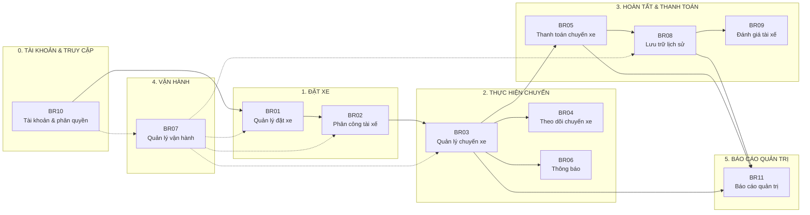
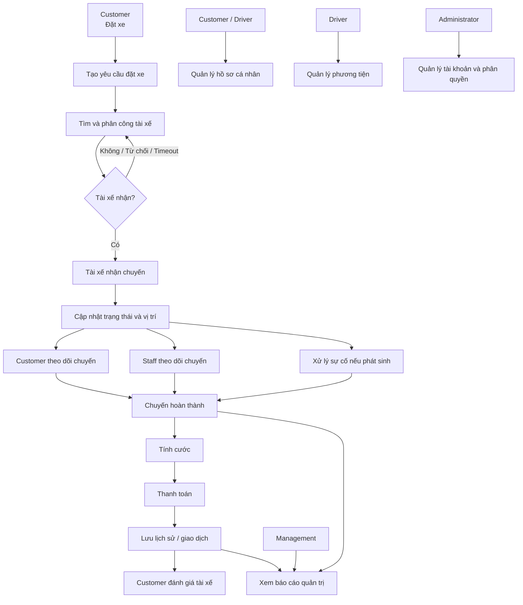
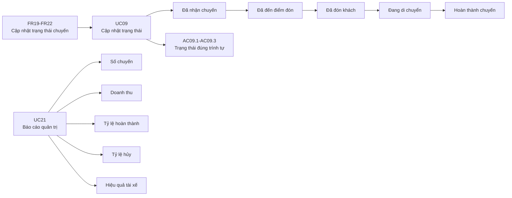

## Bước 1: Xác định Business context và Business problem

**1. Khách hàng cần giải quyết vấn đề gì?**

Công ty ABC cần giải quyết vấn đề quản lý và vận hành dịch vụ đặt xe chưa hiệu quả, đặc biệt ở các khâu:
- Phân công tài xế còn thủ công, khó tìm tài xế phù hợp và gần khách hàng.
- Khách hàng khó theo dõi trạng thái chuyến đi.
- Thông tin thanh toán chưa được quản lý tập trung.
- Khi tài xế từ chối/không phản hồi, hệ thống chưa có cơ chế tự động tìm tài xế khác.
- Bộ phận vận hành khó quản lý khách hàng, tài xế, phương tiện và chuyến đi.
- Hệ thống chưa đáp ứng tốt khi số lượng khách hàng và tài xế tăng cao.
- Khó mở rộng thêm các tính năng, phương thức thanh toán hoặc kênh thông báo mới.
  
*-> Vấn đề cốt lõi: ABC cần một hệ thống đặt xe có khả năng tự động hóa quy trình, quản lý tập trung và mở rộng được khi quy mô tăng.*

**2. Vì sao hệ thống cũ không đủ đáp ứng?**

Hệ thống cũ gồm tổng đài và một ứng dụng đơn giản, nhưng chủ yếu chỉ đáp ứng việc tiếp nhận yêu cầu đặt xe.
Nó không đủ đáp ứng vì:

- Phân công tài xế thủ công	-> Chậm, khó tối ưu tài xế gần khách
- Theo dõi chuyến đi hạn chế -> Khách hàng không biết chuyến đang ở trạng thái nào
- Thanh toán chưa tập trung -> Khó quản lý giao dịch
- Không có cơ chế tự tìm tài xế khác -> Khi tài xế từ chối phải xử lý lại
- Quản lý vận hành khó khăn -> Nhân viên khó theo dõi toàn bộ hệ thống
- Khả năng mở rộng thấp -> Khó phục vụ lượng lớn người dùng
- Các thành phần phụ thuộc lẫn nhau -> Một lỗi thanh toán/thông báo có thể ảnh hưởng hệ thống
- Khó mở rộng tính năng	-> Thêm payment/notification/service mới phải thay đổi nhiều phần
  
**3. Ai sử dụng hệ thống mới?**
- *Khách hàng*
- *Tài xế*
- *Nhân viên vận hành*
- *Quản trị viên*
- *Ban lãnh đạo*
  
**4. Hệ thống mới đáp ứng gì?**

Hệ thống CAB mới sẽ cung cấp toàn bộ quy trình đặt xe từ đầu đến cuối:

Khách hàng tạo yêu cầu -> Hệ thống tìm tài xế phù hợp -> Tài xế nhận/từ chối -> Tài xê thực hiện chuyến -> Cập nhật trạng thái, vị trí -> Hoàn thành chuyến -> Tính cước -> Thanh toán -> Đánh giá tài xế

## Bước 2: Xác định các Stakeholders

**Yêu cầu 1. Xác định các Stakeholders**
| Tên role                                                   | Chức năng                                                                                                                                                       |
| ---------------------------------------------------------- | --------------------------------------------------------------------------------------------------------------------------------------------------------------- |
| **Khách hàng**                                  | Đăng ký/đăng nhập, quản lý thông tin cá nhân, đặt xe, chọn điểm đón/điểm đến và loại xe, theo dõi chuyến đi, thanh toán, xem lịch sử chuyến và đánh giá tài xế. |
| **Tài xế**                                        | Quản lý hồ sơ và phương tiện, cập nhật trạng thái sẵn sàng, nhận/chấp nhận/từ chối chuyến, cập nhật trạng thái chuyến và vị trí trong quá trình hoạt động.      |
| **Nhân viên vận hành**                  | Quản lý khách hàng, tài xế, phương tiện và chuyến đi; theo dõi chuyến đang diễn ra; xử lý sự cố; tra cứu giao dịch và hỗ trợ vận hành.                          |
| **Quản trị viên**                          | Quản lý tài khoản và phân quyền, thực hiện các thao tác quản trị nhạy cảm, kiểm soát truy cập và theo dõi nhật ký hoạt động.                                    |
| **Ban lãnh đạo**                              | Theo dõi báo cáo về số lượng chuyến, doanh thu, tỷ lệ hoàn thành, tỷ lệ hủy và hiệu quả hoạt động của tài xế để hỗ trợ ra quyết định.                           |
| **Nhà cung cấp thanh toán**             | Xử lý các giao dịch thanh toán điện tử và trả kết quả thành công/thất bại cho hệ thống CAB.
| **Nhà cung cấp thông báo**               | Cung cấp dịch vụ gửi thông báo đến khách hàng và tài xế khi hệ thống phát sinh sự kiện cần thông báo.


**Yêu cầu 2. Vẽ ma trận Stakeholders**
|                    | **Quan tâm thấp**           | **Quan tâm cao**                                            |
| ------------------ | --------------------------- | ----------------------------------------------------------- |
| **Quyền lực cao**  | **Nhà cung cấp thanh toán** | **Ban lãnh đạo**, **Nhân viên vận hành**, **Quản trị viên** |
| **Quyền lực thấp** | **Nhà cung cấp thông báo**  | **Khách hàng**, **Tài xế**                                  |

## Bước 3. Xác định Business Goals

| Mã số    | Mô tả |
| -------- | ----- |
| **BG01** | Cho phép khách hàng đăng ký, đăng nhập và tạo yêu cầu đặt xe. |
| **BG02** | Tự động tìm và phân công tài xế phù hợp cho yêu cầu đặt xe. |
| **BG03** | Cho phép tài xế nhận hoặc từ chối chuyến và cập nhật trạng thái chuyến đi. |
| **BG04** | Cho phép khách hàng theo dõi trạng thái chuyến đi từ lúc đặt xe đến khi hoàn thành. |
| **BG05** | Tính cước và hỗ trợ thanh toán chuyến đi bằng tiền mặt hoặc thanh toán trực tuyến. |
| **BG06** | Gửi thông báo cơ bản đến khách hàng và tài xế về các thay đổi quan trọng của chuyến đi. |
| **BG07** | Cho phép nhân viên vận hành quản lý và theo dõi khách hàng, tài xế, phương tiện và chuyến đi. |
| **BG08** | Lưu trữ lịch sử chuyến đi và thông tin thanh toán để khách hàng và nhân viên có thể tra cứu. |
| **BG09** | Cho phép khách hàng đánh giá tài xế sau khi chuyến đi hoàn thành. |
| **BG10** | Quản lý tài khoản, trạng thái tài khoản và phân quyền người dùng theo vai trò. |
| **BG11** | Cung cấp báo cáo quản trị về số lượng chuyến, doanh thu, tỷ lệ hoàn thành, tỷ lệ hủy và hiệu quả hoạt động của tài xế. |

## Bước 4: Xác định Scope (Phạm vi)

| Phạm vi | Nội dung |
| ------ | ------ |
| **In Scope** | Quản lý tài khoản khách hàng, tài xế, nhân viên vận hành và quản trị viên |
| **In Scope** | Đăng ký, đăng nhập và cập nhật thông tin tài khoản |
| **In Scope** | Phân quyền người dùng theo vai trò |
| **In Scope** | Khách hàng tạo yêu cầu đặt xe với điểm đón, điểm đến và loại xe |
| **In Scope** | Tìm kiếm và phân công tài xế phù hợp |
| **In Scope** | Nhận, từ chối và xử lý lại yêu cầu chuyến xe |
| **In Scope** | Cập nhật trạng thái và vị trí chuyến xe |
| **In Scope** | Hủy chuyến theo trạng thái và chính sách |
| **In Scope** | Tính cước chuyến đi |
| **In Scope** | Thanh toán tiền mặt và thanh toán trực tuyến |
| **In Scope** | Thông báo các sự kiện quan trọng của chuyến đi |
| **In Scope** | Xem lịch sử chuyến đi và thông tin thanh toán |
| **In Scope** | Khách hàng đánh giá tài xế sau chuyến đi |
| **In Scope** | Khách hàng và tài xế quản lý/cập nhật hồ sơ cá nhân trong phạm vi cho phép |
| **In Scope** | Tài xế quản lý thông tin phương tiện của mình trong phạm vi cho phép |
| **In Scope** | Nhân viên vận hành tiếp nhận và xử lý sự cố vận hành |
| **In Scope** | Nhân viên vận hành xem và quản lý khách hàng, tài xế, phương tiện và chuyến đi |
| **In Scope** | Ban lãnh đạo xem báo cáo số lượng chuyến và các chỉ số vận hành, kinh doanh |
| **In Scope** | Lọc báo cáo theo khoảng thời gian và xem chi tiết dữ liệu nguồn |

## Bước 5: Chuyển đổi yêu cầu sang Business Requirements

| Mã | Tên | Mô tả |
| -------- | -------------------- | ----- |
| **BR01** | Quản lý đặt xe | Hệ thống phải hỗ trợ khách hàng tạo và quản lý yêu cầu đặt xe bằng việc cung cấp điểm đón, điểm đến và loại xe. |
| **BR02** | Phân công tài xế | Hệ thống phải hỗ trợ tự động tìm và phân công tài xế phù hợp cho mỗi yêu cầu đặt xe dựa theo trạng thái, loại xe và khoảng cách. |
| **BR03** | Quản lý chuyến xe | Hệ thống phải hỗ trợ tài xế tiếp nhận, từ chối, thực hiện, cập nhật trạng thái và hủy các chuyến xe theo quy định. |
| **BR04** | Theo dõi chuyến xe | Hệ thống phải hỗ trợ khách hàng và nhân viên vận hành theo dõi trạng thái chuyến xe trong quá trình sử dụng dịch vụ. |
| **BR05** | Thanh toán chuyến xe | Hệ thống phải hỗ trợ tính cước và thu tiền theo hình thức tiền mặt hoặc thanh toán trực tuyến cho các chuyến xe hoàn thành. |
| **BR06** | Thông báo | Hệ thống phải hỗ trợ gửi thông báo về các sự kiện quan trọng trong quá trình đặt và thực hiện chuyến xe. |
| **BR07** | Quản lý vận hành | Hệ thống phải hỗ trợ nhân viên vận hành theo dõi và quản lý khách hàng, tài xế, phương tiện, chuyến xe và xử lý các sự cố vận hành. |
| **BR08** | Lưu trữ lịch sử | Hệ thống phải lưu trữ thông tin chuyến xe và giao dịch để phục vụ tra cứu. |
| **BR09** | Đánh giá tài xế | Hệ thống phải hỗ trợ khách hàng đánh giá tài xế sau khi hoàn thành chuyến xe và lưu kết quả đánh giá. |
| **BR10** | Quản lý tài khoản, hồ sơ và phân quyền | Hệ thống phải cho phép người dùng quản lý hồ sơ cá nhân và cho phép quản trị viên quản lý trạng thái tài khoản, vai trò và quyền truy cập. |
| **BR11** | Báo cáo quản trị | Hệ thống phải cung cấp báo cáo về số lượng chuyến, doanh thu, tỷ lệ hoàn thành, tỷ lệ hủy và hiệu quả hoạt động của tài xế cho Ban lãnh đạo. |

## Bước 6. Kết hợp các nghiệp vụ (Business Process)



## Bước 7. Phân rã yêu cầu chức năng

Dưới đây là bản đầy đủ **Mã – Tên yêu cầu – Mô tả**, bao gồm các yêu cầu cốt lõi, quản trị tài khoản/phân quyền và báo cáo quản trị.

### 1. BR01 – Quản lý đặt xe

| Mã | Tên yêu cầu | Mô tả |
| -------- | --------------------------------- | ------------------------------------------------------------------------------------------------ |
| **FR01** | Xác định điểm đón | Hệ thống phải cho phép khách hàng cung cấp điểm đón cho chuyến xe. |
| **FR02** | Xác định điểm đến | Hệ thống phải cho phép khách hàng cung cấp điểm đến của chuyến xe. |
| **FR03** | Lựa chọn loại xe | Hệ thống phải cho phép khách hàng lựa chọn loại xe phù hợp với nhu cầu. |
| **FR04** | Tạo yêu cầu đặt xe | Hệ thống phải cho phép khách hàng tạo yêu cầu đặt xe dựa trên thông tin đã cung cấp. |
| **FR05** | Kiểm tra thông tin yêu cầu đặt xe | Hệ thống phải kiểm tra các thông tin bắt buộc trước khi tiếp nhận yêu cầu đặt xe. |
| **FR06** | Hủy yêu cầu đặt xe | Hệ thống phải cho phép khách hàng hủy yêu cầu đặt xe theo trạng thái và chính sách của hệ thống. |

### 2. BR02 – Phân công tài xế

| Mã | Tên yêu cầu | Mô tả |
| -------- | ------------------------------- | ------------------------------------------------------------------------------------------ |
| **FR07** | Xác định vị trí khách hàng | Hệ thống phải xác định vị trí điểm đón để phục vụ việc tìm kiếm tài xế. |
| **FR08** | Tìm tài xế sẵn sàng | Hệ thống phải tìm các tài xế đang ở trạng thái sẵn sàng nhận chuyến. |
| **FR09** | Lọc tài xế theo loại xe | Hệ thống phải lọc các tài xế có phương tiện phù hợp với loại xe khách hàng yêu cầu. |
| **FR10** | Lọc tài xế theo khoảng cách | Hệ thống phải xác định khoảng cách giữa tài xế và điểm đón để lọc tài xế phù hợp. |
| **FR11** | Ưu tiên tài xế phù hợp | Hệ thống phải ưu tiên tài xế phù hợp và có khoảng cách gần điểm đón hơn. |
| **FR12** | Gửi yêu cầu đến tài xế | Hệ thống phải gửi thông tin yêu cầu chuyến xe đến tài xế được lựa chọn. |
| **FR13** | Xử lý tài xế từ chối | Hệ thống phải tiếp tục tìm tài xế khác khi tài xế được đề xuất từ chối chuyến. |
| **FR14** | Xử lý tài xế không phản hồi | Hệ thống phải tiếp tục tìm tài xế khác khi tài xế không phản hồi trong thời gian quy định. |
| **FR15** | Xác nhận tài xế nhận chuyến | Hệ thống phải xác nhận và gán chuyến xe cho tài xế đầu tiên chấp nhận yêu cầu. |
| **FR16** | Thông báo không tìm được tài xế | Hệ thống phải thông báo cho khách hàng khi không tìm được tài xế phù hợp. |

### 3. BR03 – Quản lý chuyến xe

| Mã | Tên yêu cầu | Mô tả |
| -------- | ------------------------------------- | -------------------------------------------------------------------------------- |
| **FR17** | Tài xế nhận chuyến | Hệ thống phải ghi nhận việc tài xế chấp nhận chuyến xe. |
| **FR18** | Tài xế từ chối chuyến | Hệ thống phải ghi nhận việc tài xế từ chối chuyến xe và kích hoạt quá trình tìm tài xế khác. |
| **FR19** | Cập nhật trạng thái "Đã đến điểm đón" | Hệ thống phải cho phép tài xế cập nhật trạng thái khi đã đến điểm đón. |
| **FR20** | Cập nhật trạng thái "Đã đón khách" | Hệ thống phải cho phép tài xế cập nhật trạng thái sau khi đón khách. |
| **FR21** | Cập nhật trạng thái "Đang di chuyển" | Hệ thống phải cho phép tài xế cập nhật trạng thái khi bắt đầu thực hiện chuyến đi. |
| **FR22** | Cập nhật trạng thái "Hoàn thành" | Hệ thống phải cho phép tài xế cập nhật trạng thái khi chuyến xe kết thúc. |
| **FR23** | Hủy chuyến | Hệ thống phải cho phép hủy chuyến theo trạng thái hiện tại và chính sách của doanh nghiệp. |

### 4. BR04 – Theo dõi chuyến xe

| Mã | Tên yêu cầu | Mô tả |
| -------- | ---------------------------------- | ----------------------------------------------------------------------------- |
| **FR24** | Xem trạng thái chuyến | Hệ thống phải cho phép khách hàng và nhân viên vận hành xem trạng thái hiện tại của chuyến xe theo phạm vi quyền hạn. |
| **FR25** | Xem thông tin tài xế | Hệ thống phải cung cấp thông tin cơ bản của tài xế được phân công cho khách hàng và nhân viên có quyền. |
| **FR26** | Xem thông tin phương tiện | Hệ thống phải cung cấp thông tin cơ bản về phương tiện thực hiện chuyến xe. |
| **FR27** | Xem thông tin điểm đón và điểm đến | Hệ thống phải cho phép xem lại điểm đón và điểm đến của chuyến xe theo quyền truy cập. |

### 5. BR05 – Thanh toán chuyến xe

| Mã | Tên yêu cầu | Mô tả |
| -------- | ------------------------------- | ------------------------------------------------------------------------------------------------------------------ |
| **FR28** | Tính cước chuyến xe | Hệ thống phải tính số tiền khách hàng cần thanh toán dựa trên thông tin chuyến xe. |
| **FR29** | Xác định phương thức thanh toán | Hệ thống phải cho phép khách hàng lựa chọn phương thức thanh toán được hỗ trợ. |
| **FR30** | Ghi nhận thanh toán tiền mặt | Hệ thống phải ghi nhận kết quả thanh toán bằng tiền mặt sau khi chuyến xe hoàn thành. |
| **FR31** | Xử lý thanh toán trực tuyến | Hệ thống phải gửi yêu cầu thanh toán trực tuyến đến nhà cung cấp thanh toán bên ngoài và nhận kết quả giao dịch. |
| **FR32** | Xử lý thanh toán thất bại | Hệ thống phải ghi nhận trạng thái thất bại và thông báo cho khách hàng khi thanh toán trực tuyến không thành công. |
| **FR33** | Xác nhận kết quả thanh toán | Hệ thống phải cập nhật và xác nhận trạng thái thanh toán của chuyến xe. |

### 6. BR06 – Thông báo

| Mã | Tên yêu cầu | Mô tả |
| -------- | ---------------------------------- | -------------------------------------------------------------------------------------- |
| **FR34** | Thông báo tiếp nhận yêu cầu đặt xe | Hệ thống phải thông báo cho khách hàng khi yêu cầu đặt xe được tiếp nhận. |
| **FR35** | Thông báo tài xế nhận chuyến | Hệ thống phải thông báo cho khách hàng khi tài xế đã nhận chuyến. |
| **FR36** | Thông báo tài xế đến điểm đón | Hệ thống phải thông báo cho khách hàng khi tài xế cập nhật trạng thái đã đến điểm đón. |
| **FR37** | Thông báo hoàn thành chuyến | Hệ thống phải thông báo cho khách hàng khi chuyến xe hoàn thành. |
| **FR38** | Thông báo kết quả thanh toán | Hệ thống phải thông báo cho khách hàng về kết quả thanh toán của chuyến xe. |

### 7. BR07 – Quản lý vận hành

| Mã | Tên yêu cầu | Mô tả |
| -------- | -------------------------- | ----------------------------------------------------------------------------------- |
| **FR39** | Quản lý khách hàng | Hệ thống phải cho phép nhân viên vận hành xem và quản lý thông tin khách hàng. |
| **FR40** | Quản lý tài xế | Hệ thống phải cho phép nhân viên vận hành xem và quản lý thông tin tài xế. |
| **FR41** | Quản lý phương tiện | Hệ thống phải cho phép nhân viên vận hành quản lý thông tin phương tiện của tài xế. |
| **FR42** | Xem danh sách chuyến xe | Hệ thống phải cho phép nhân viên vận hành xem danh sách các chuyến xe. |
| **FR43** | Xem chi tiết chuyến xe | Hệ thống phải cho phép nhân viên vận hành xem thông tin chi tiết của một chuyến xe. |
| **FR44** | Theo dõi trạng thái tài xế | Hệ thống phải cho phép nhân viên vận hành xem trạng thái hoạt động của tài xế. |

### 8. BR08 – Lưu trữ lịch sử

| Mã | Tên yêu cầu | Mô tả |
| -------- | --------------------------- | ------------------------------------------------------------------------------------- |
| **FR45** | Lưu thông tin chuyến xe | Hệ thống phải lưu trữ thông tin của các chuyến xe đã được tạo. |
| **FR46** | Lưu thông tin thanh toán | Hệ thống phải lưu trữ thông tin và trạng thái thanh toán của chuyến xe. |
| **FR47** | Tra cứu lịch sử chuyến xe | Hệ thống phải cho phép khách hàng tra cứu lịch sử các chuyến xe của mình. |
| **FR48** | Tra cứu thông tin giao dịch | Hệ thống phải cho phép nhân viên vận hành tra cứu thông tin các giao dịch thanh toán. |

### 9. BR09 – Đánh giá tài xế

| Mã | Tên yêu cầu | Mô tả |
| -------- | ------------------- | ------------------------------------------------------------------------------- |
| **FR49** | Đánh giá tài xế | Hệ thống phải cho phép khách hàng đánh giá tài xế sau khi chuyến xe hoàn thành. |
| **FR50** | Lưu đánh giá | Hệ thống phải lưu trữ đánh giá của khách hàng đối với tài xế. |
| **FR51** | Xem đánh giá tài xế | Hệ thống phải cho phép xem đánh giá đã được lưu của tài xế theo quyền hạn. |

### 10. BR10 – Quản lý tài khoản và phân quyền

| Mã | Tên yêu cầu | Mô tả |
| -------- | ------------------- | --------------------------------------------------------------------------- |
| **FR52** | Đăng ký tài khoản | Hệ thống phải cho phép tạo tài khoản cho khách hàng và tài xế. |
| **FR53** | Đăng nhập | Hệ thống phải cho phép người dùng đăng nhập và xác thực thông tin tài khoản. |
| **FR54** | Cập nhật thông tin tài khoản | Hệ thống phải cho phép người dùng thay đổi các thông tin tài khoản được phép cập nhật, bao gồm thông tin liên hệ và thông tin xác thực theo chính sách. |
| **FR55** | Phân quyền người dùng | Hệ thống phải phân quyền người dùng đúng theo vai trò và quyền được cấp. |
| **FR56** | Quản lý trạng thái tài khoản | Hệ thống phải cho phép quản trị viên xem, khóa, mở khóa hoặc vô hiệu hóa tài khoản theo quyền hạn. |
| **FR57** | Quản lý vai trò | Hệ thống phải cho phép quản trị viên gán hoặc thay đổi vai trò của tài khoản theo chính sách. |
| **FR58** | Quản lý quyền truy cập | Hệ thống phải kiểm soát quyền truy cập vào chức năng và dữ liệu dựa trên vai trò. |
| **FR59** | Ghi nhận thao tác quản trị | Hệ thống phải ghi nhận các thao tác quản trị tài khoản và thay đổi phân quyền quan trọng vào Audit Log. |

### 11. BR11 – Báo cáo quản trị

| Mã | Tên yêu cầu | Mô tả |
| -------- | --------------------------- | ------------------------------------------------------------------------------- |
| **FR60** | Báo cáo số lượng chuyến | Hệ thống phải hiển thị số lượng chuyến xe theo khoảng thời gian được chọn. |
| **FR61** | Báo cáo doanh thu | Hệ thống phải hiển thị doanh thu dựa trên các giao dịch thanh toán thành công trong khoảng thời gian được chọn. |
| **FR62** | Báo cáo tỷ lệ chuyến hoàn thành | Hệ thống phải tính và hiển thị tỷ lệ chuyến hoàn thành trên tổng số chuyến thuộc phạm vi báo cáo. |
| **FR63** | Báo cáo tỷ lệ hủy | Hệ thống phải tính và hiển thị tỷ lệ chuyến bị hủy trên tổng số chuyến thuộc phạm vi báo cáo. |
| **FR64** | Báo cáo hiệu quả hoạt động tài xế | Hệ thống phải cung cấp các chỉ số phục vụ đánh giá hoạt động tài xế như số chuyến được phân công, số chuyến hoàn thành, tỷ lệ nhận chuyến và điểm đánh giá trung bình (khi có dữ liệu). |
| **FR65** | Lọc báo cáo theo thời gian | Hệ thống phải cho phép Ban lãnh đạo chọn khoảng thời gian để giới hạn dữ liệu báo cáo. |
| **FR66** | Xem chi tiết dữ liệu báo cáo | Hệ thống phải cho phép xem các dữ liệu nguồn hoặc chi tiết chuyến/giao dịch tạo nên chỉ số báo cáo theo quyền hạn. |
| **FR67** | Quản lý hồ sơ cá nhân | Hệ thống phải cho phép khách hàng và tài xế xem, cập nhật thông tin hồ sơ cá nhân trong phạm vi được phép. |
| **FR68** | Quản lý phương tiện cá nhân | Hệ thống phải cho phép tài xế xem và cập nhật thông tin phương tiện do mình sử dụng trong phạm vi được phép. |
| **FR69** | Xử lý sự cố vận hành | Hệ thống phải cho phép nhân viên vận hành ghi nhận, theo dõi, cập nhật trạng thái và xử lý các sự cố phát sinh trong quá trình vận hành chuyến xe. |
| **FR70** | Cập nhật trạng thái sẵn sàng của tài xế | Hệ thống phải cho phép tài xế chuyển trạng thái sẵn sàng/không sẵn sàng nhận chuyến theo điều kiện nghiệp vụ. |

## 8. Quy tắc nghiệp vụ và ngoại lệ (Business Rules & Exceptions)

Với CAB System và scope **MVP 7 tuần**, phần **Business Rules & Exceptions** tập trung vào các quy tắc trực tiếp ảnh hưởng đến luồng đặt xe → tìm tài xế → thực hiện chuyến → thanh toán, đồng thời bổ sung quy tắc quản trị tài khoản và báo cáo.

### 8.1. Business Rules

| Mã | Quy tắc nghiệp vụ | Mô tả |
| ----------- | ----------------------------------------------------- | ------------------------------------------------------------------------------------------------------ |
| **BRULE01** | Khách hàng phải đăng nhập | Chỉ khách hàng đã xác thực mới được tạo yêu cầu đặt xe. |
| **BRULE02** | Yêu cầu đặt xe phải đầy đủ thông tin | Yêu cầu phải có điểm đón, điểm đến và loại xe trước khi được tạo. |
| **BRULE03** | Tài xế phải ở trạng thái sẵn sàng | Chỉ tài xế đang ở trạng thái sẵn sàng mới được hệ thống đưa vào danh sách tìm kiếm. |
| **BRULE04** | Tài xế phải phù hợp với loại xe | Tài xế chỉ được nhận chuyến nếu phương tiện phù hợp với loại xe khách hàng yêu cầu. |
| **BRULE05** | Ưu tiên tài xế gần khách hàng | Khi có nhiều tài xế phù hợp, hệ thống ưu tiên tài xế có khoảng cách gần điểm đón hơn. |
| **BRULE06** | Tài xế chỉ nhận một chuyến tại một thời điểm | Sau khi nhận chuyến, tài xế chuyển sang trạng thái không sẵn sàng nhận chuyến khác. |
| **BRULE07** | Tài xế từ chối thì tìm tài xế khác | Nếu tài xế từ chối chuyến, hệ thống phải tiếp tục tìm tài xế phù hợp khác. |
| **BRULE08** | Tài xế không phản hồi | Nếu tài xế không phản hồi trong thời gian quy định, hệ thống chuyển sang tìm tài xế khác. |
| **BRULE09** | Chuyến xe phải theo đúng trạng thái | Chuyến xe phải chuyển trạng thái theo trình tự hợp lệ, không được bỏ qua các trạng thái không phù hợp. |
| **BRULE10** | Chỉ được thanh toán khi chuyến hoàn thành | Hệ thống chỉ thực hiện tính cước và thanh toán sau khi chuyến xe được hoàn thành. |
| **BRULE11** | Mỗi chuyến chỉ có một giao dịch thanh toán thành công | Hệ thống không ghi nhận nhiều giao dịch thanh toán thành công cho cùng một chuyến xe. |
| **BRULE12** | Chỉ được đánh giá sau khi hoàn thành chuyến | Khách hàng chỉ có thể đánh giá tài xế sau khi chuyến xe đã hoàn thành. |
| **BRULE13** | Chỉ người có quyền mới được quản trị tài khoản | Chỉ quản trị viên hoặc người được cấp quyền tương ứng mới được khóa/mở khóa tài khoản, thay đổi vai trò hoặc quyền truy cập. |
| **BRULE14** | Quyền truy cập theo vai trò | Người dùng chỉ được truy cập các chức năng và dữ liệu được cấp cho vai trò của mình. |
| **BRULE15** | Báo cáo có phạm vi dữ liệu rõ ràng | Mỗi báo cáo phải xác định khoảng thời gian và phạm vi dữ liệu trước khi tính toán. |
| **BRULE16** | Doanh thu báo cáo dựa trên giao dịch thành công | Chỉ các giao dịch thanh toán được xác nhận thành công mới được tính vào doanh thu báo cáo. |
| **BRULE17** | Tỷ lệ hoàn thành và hủy dùng cùng phạm vi tổng chuyến | Tỷ lệ hoàn thành và tỷ lệ hủy được tính trên tổng số chuyến thuộc cùng phạm vi báo cáo. |
| **BRULE18** | Chỉ số hiệu quả tài xế phụ thuộc dữ liệu có sẵn | Hệ thống chỉ hiển thị các chỉ số tài xế khi có dữ liệu tương ứng và phải thể hiện trường hợp không đủ dữ liệu. |
| **BRULE19** | Tài xế chỉ được chuyển sang sẵn sàng khi không có chuyến đang thực hiện | Tài xế không được chuyển sang trạng thái sẵn sàng nếu đang có chuyến ở trạng thái đang thực hiện. |
| **BRULE20** | Chỉ người có quyền mới được xử lý sự cố | Nhân viên vận hành chỉ được xem và cập nhật sự cố trong phạm vi quyền hạn được cấp. |

### 8.2. Exceptions

| Mã | Ngoại lệ | Cách xử lý |
| -------- | ------------------------------ | ---------------------------------------------------------------------------------------------------------- |
| **EX01** | Không tìm thấy tài xế | Hệ thống thông báo cho khách hàng rằng hiện không có tài xế phù hợp. |
| **EX02** | Tài xế từ chối chuyến | Hệ thống loại tài xế đó khỏi yêu cầu hiện tại và tiếp tục tìm tài xế khác. |
| **EX03** | Tài xế không phản hồi | Sau thời gian quy định, hệ thống chuyển yêu cầu sang tài xế khác. |
| **EX04** | Thanh toán trực tuyến thất bại | Hệ thống ghi nhận giao dịch thất bại và thông báo cho khách hàng. |
| **EX05** | Thông tin đặt xe không hợp lệ | Hệ thống từ chối tạo yêu cầu và yêu cầu khách hàng cung cấp lại thông tin. |
| **EX06** | Tài xế hủy chuyến | Hệ thống thông báo cho khách hàng và thực hiện tìm tài xế khác nếu chính sách cho phép. |
| **EX07** | Khách hàng hủy chuyến | Hệ thống cập nhật chuyến thành trạng thái đã hủy và kết thúc quá trình tìm/điều phối tài xế. |
| **EX08** | Tài xế mất kết nối | Hệ thống không tiếp tục chờ tài xế nếu không thể nhận phản hồi và chuyển sang tài xế khác theo chính sách. |
| **EX09** | Người dùng không có quyền | Hệ thống từ chối thao tác và không cho phép truy cập dữ liệu/chức năng không thuộc quyền. |
| **EX10** | Tài khoản bị khóa hoặc vô hiệu hóa | Hệ thống từ chối đăng nhập và thông báo trạng thái tài khoản. |
| **EX11** | Phân quyền không hợp lệ | Hệ thống từ chối thay đổi vai trò/quyền khi người thực hiện không đủ quyền hoặc dữ liệu không hợp lệ. |
| **EX12** | Không có dữ liệu báo cáo | Hệ thống thông báo không có dữ liệu trong khoảng thời gian hoặc phạm vi được chọn. |
| **EX13** | Dữ liệu báo cáo không đầy đủ | Hệ thống hiển thị chỉ số có thể tính được và thông báo trường dữ liệu chưa đủ để tính các chỉ số còn lại. |
| **EX14** | Lỗi truy vấn báo cáo | Hệ thống thông báo không thể tải báo cáo và ghi nhận lỗi vào log. |

## Bước 9. Mô hình hoá dữ liệu (Data modeling)

### 9.1. Lớp Customer

| Thuộc tính | Kiểu dữ liệu | Mô tả |
| -------------- | ------------ | ------------------------------------ |
| `customerId` | UUID | Mã định danh duy nhất của khách hàng |
| `fullName` | String | Họ và tên khách hàng |
| `phone` | String | Số điện thoại |
| `email` | String | Email |
| `passwordHash` | String | Mật khẩu đã được mã hóa |
| `status` | Enum | Trạng thái tài khoản |
| `createdAt` | DateTime | Thời điểm tạo tài khoản |
| `updatedAt` | DateTime | Thời điểm cập nhật thông tin |

### 9.2. Lớp Driver

| Thuộc tính | Kiểu dữ liệu | Mô tả |
| ------------------ | ------------ | -------------------------------- |
| `driverId` | UUID | Mã định danh duy nhất của tài xế |
| `fullName` | String | Họ và tên tài xế |
| `phone` | String | Số điện thoại |
| `email` | String | Email |
| `passwordHash` | String | Mật khẩu đã được mã hóa |
| `status` | Enum | Trạng thái tài xế |
| `currentLatitude` | Decimal | Vĩ độ hiện tại |
| `currentLongitude` | Decimal | Kinh độ hiện tại |
| `createdAt` | DateTime | Thời điểm tạo tài khoản |
| `updatedAt` | DateTime | Thời điểm cập nhật thông tin |

### 9.3. Lớp Vehicle

| Thuộc tính | Kiểu dữ liệu | Mô tả |
| -------------- | ------------ | --------------------------------- |
| `vehicleId` | UUID | Mã phương tiện |
| `driverId` | UUID | Tài xế sở hữu/sử dụng phương tiện |
| `vehicleType` | Enum | Loại xe |
| `licensePlate` | String | Biển số xe |
| `model` | String | Tên/model phương tiện |
| `status` | Enum | Trạng thái phương tiện |

### 9.4. Lớp OperationsStaff

| Thuộc tính | Kiểu dữ liệu | Mô tả |
| -------------- | ------------ | ----------------------- |
| `staffId` | UUID | Mã nhân viên |
| `fullName` | String | Họ và tên |
| `email` | String | Email |
| `passwordHash` | String | Mật khẩu đã được mã hóa |
| `role` | Enum | Vai trò/phân quyền |
| `status` | Enum | Trạng thái tài khoản |
| `createdAt` | DateTime | Thời điểm tạo tài khoản |
| `updatedAt` | DateTime | Thời điểm cập nhật thông tin |

### 9.5. Lớp Administrator

| Thuộc tính | Kiểu dữ liệu | Mô tả |
| -------------- | ------------ | ----------------------- |
| `adminId` | UUID | Mã định danh quản trị viên |
| `fullName` | String | Họ và tên |
| `email` | String | Email quản trị viên |
| `passwordHash` | String | Mật khẩu đã được mã hóa |
| `role` | Enum | Vai trò quản trị |
| `status` | Enum | Trạng thái tài khoản |
| `createdAt` | DateTime | Thời điểm tạo tài khoản |
| `updatedAt` | DateTime | Thời điểm cập nhật thông tin |

### 9.6. Lớp Booking

| Thuộc tính | Kiểu dữ liệu | Mô tả |
| -------------- | ------------ | ----------------------- |
| `bookingId` | UUID | Mã yêu cầu đặt xe |
| `customerId` | UUID | Khách hàng tạo yêu cầu |
| `pickupLocation` | String | Điểm đón |
| `destination` | String | Điểm đến |
| `vehicleType` | Enum | Loại xe yêu cầu |
| `status` | Enum | Trạng thái Booking |
| `createdAt` | DateTime | Thời điểm tạo yêu cầu |
| `updatedAt` | DateTime | Thời điểm cập nhật |

### 9.7. Lớp Trip

| Thuộc tính | Kiểu dữ liệu | Mô tả |
| -------------- | ------------ | ----------------------- |
| `tripId` | UUID | Mã chuyến xe |
| `bookingId` | UUID | Booking tạo ra chuyến |
| `customerId` | UUID | Khách hàng của chuyến |
| `driverId` | UUID | Tài xế được phân công |
| `vehicleId` | UUID | Phương tiện thực hiện chuyến |
| `status` | Enum | Trạng thái chuyến |
| `fare` | Decimal | Cước chuyến xe |
| `startedAt` | DateTime | Thời điểm bắt đầu chuyến |
| `completedAt` | DateTime | Thời điểm hoàn thành chuyến |
| `cancelledAt` | DateTime | Thời điểm hủy nếu có |
| `cancellationReason` | String | Lý do hủy nếu có |

### 9.8. Lớp Payment

| Thuộc tính | Kiểu dữ liệu | Mô tả |
| -------------- | ------------ | ----------------------- |
| `paymentId` | UUID | Mã thanh toán |
| `tripId` | UUID | Mã chuyến liên quan |
| `method` | Enum | Phương thức thanh toán |
| `amount` | Decimal | Số tiền thanh toán |
| `status` | Enum | Trạng thái thanh toán |
| `providerTransactionId` | String | Mã giao dịch từ cổng thanh toán nếu có |
| `paidAt` | DateTime | Thời điểm thanh toán thành công |

### 9.9. Lớp Rating

| Thuộc tính | Kiểu dữ liệu | Mô tả |
| -------------- | ------------ | ----------------------- |
| `ratingId` | UUID | Mã đánh giá |
| `tripId` | UUID | Chuyến được đánh giá |
| `customerId` | UUID | Khách hàng đánh giá |
| `driverId` | UUID | Tài xế được đánh giá |
| `score` | Integer | Điểm đánh giá |
| `comment` | String | Nội dung nhận xét nếu có |
| `createdAt` | DateTime | Thời điểm đánh giá |

### 9.10. Lớp Notification

| Thuộc tính | Kiểu dữ liệu | Mô tả |
| -------------- | ------------ | ----------------------- |
| `notificationId` | UUID | Mã thông báo |
| `tripId` | UUID | Chuyến liên quan nếu có |
| `recipientId` | UUID | Người nhận |
| `type` | Enum | Loại thông báo |
| `status` | Enum | Trạng thái gửi |
| `sentAt` | DateTime | Thời điểm gửi |

### 9.11. Lớp ManagementUser

| Thuộc tính | Kiểu dữ liệu | Mô tả |
| -------------- | ------------ | ----------------------- |
| `managementId` | UUID | Mã định danh người dùng Ban lãnh đạo |
| `fullName` | String | Họ và tên |
| `email` | String | Email đăng nhập |
| `passwordHash` | String | Mật khẩu đã được mã hóa |
| `role` | Enum | Vai trò quản trị/báo cáo |
| `status` | Enum | Trạng thái tài khoản |
| `createdAt` | DateTime | Thời điểm tạo tài khoản |
| `updatedAt` | DateTime | Thời điểm cập nhật thông tin |

### 9.12. Lớp Incident

| Thuộc tính | Kiểu dữ liệu | Mô tả |
| -------------- | ------------ | ----------------------- |
| `incidentId` | UUID | Mã sự cố |
| `tripId` | UUID | Mã chuyến liên quan nếu có |
| `reportedBy` | UUID | Người ghi nhận sự cố |
| `type` | Enum | Loại sự cố |
| `description` | String | Mô tả sự cố |
| `status` | Enum | Trạng thái xử lý sự cố |
| `resolution` | String | Kết quả/xử lý sự cố |
| `createdAt` | DateTime | Thời điểm ghi nhận |
| `resolvedAt` | DateTime | Thời điểm xử lý xong |

### 9.13. Lớp Role

| Thuộc tính | Kiểu dữ liệu | Mô tả |
| -------------- | ------------ | ----------------------- |
| `roleId` | UUID | Mã vai trò |
| `name` | String | Tên vai trò |
| `description` | String | Mô tả vai trò |

### 9.14. Lớp Permission

| Thuộc tính | Kiểu dữ liệu | Mô tả |
| -------------- | ------------ | ----------------------- |
| `permissionId` | UUID | Mã quyền |
| `code` | String | Mã quyền |
| `name` | String | Tên quyền |
| `description` | String | Mô tả quyền |

### 9.15. Lớp AuditLog

| Thuộc tính | Kiểu dữ liệu | Mô tả |
| -------------- | ------------ | ----------------------- |
| `logId` | UUID | Mã log |
| `actorId` | UUID | Người thực hiện thao tác |
| `action` | String | Hành động được thực hiện |
| `targetType` | String | Loại đối tượng bị tác động |
| `targetId` | UUID | Mã đối tượng bị tác động |
| `timestamp` | DateTime | Thời điểm thực hiện |
| `details` | String | Chi tiết thao tác |

### 9.16. Lớp ManagementReport

| Thuộc tính | Kiểu dữ liệu | Mô tả |
| -------------- | ------------ | ----------------------- |
| `reportId` | UUID | Mã báo cáo |
| `fromDate` | DateTime | Thời điểm bắt đầu phạm vi báo cáo |
| `toDate` | DateTime | Thời điểm kết thúc phạm vi báo cáo |
| `totalTrips` | Integer | Tổng số chuyến trong phạm vi báo cáo |
| `completedTrips` | Integer | Số chuyến hoàn thành |
| `cancelledTrips` | Integer | Số chuyến bị hủy |
| `revenue` | Decimal | Tổng doanh thu từ giao dịch thanh toán thành công |
| `completionRate` | Decimal | Tỷ lệ chuyến hoàn thành |
| `cancellationRate` | Decimal | Tỷ lệ chuyến hủy |
| `driverMetrics` | Object/List | Các chỉ số hiệu quả hoạt động của tài xế |

`ManagementReport` là dữ liệu tổng hợp phục vụ hiển thị báo cáo và có thể được tạo động từ dữ liệu chuyến xe, thanh toán, tài xế và đánh giá; không nhất thiết là thực thể nghiệp vụ độc lập được lưu lâu dài.

### 9.17. Quan hệ giữa các lớp người dùng, nghiệp vụ và báo cáo

```mermaid
classDiagram
    class Customer {
        +UUID customerId
        +String fullName
        +String phone
        +String email
        +String passwordHash
        +Status status
        +DateTime createdAt
        +DateTime updatedAt
    }

    class Driver {
        +UUID driverId
        +String fullName
        +String phone
        +String email
        +String passwordHash
        +DriverStatus status
        +Decimal currentLatitude
        +Decimal currentLongitude
        +DateTime createdAt
        +DateTime updatedAt
    }

    class Vehicle {
        +UUID vehicleId
        +UUID driverId
        +VehicleType vehicleType
        +String licensePlate
        +String model
        +VehicleStatus status
    }

    class OperationsStaff {
        +UUID staffId
        +String fullName
        +String email
        +String passwordHash
        +Role role
        +Status status
        +DateTime createdAt
        +DateTime updatedAt
    }

    class Administrator {
        +UUID adminId
        +String fullName
        +String email
        +String passwordHash
        +Role role
        +Status status
        +DateTime createdAt
        +DateTime updatedAt
    }

    class ManagementUser {
        +UUID managementId
        +String fullName
        +String email
        +String passwordHash
        +Role role
        +Status status
        +DateTime createdAt
        +DateTime updatedAt
    }

    class Booking {
        +UUID bookingId
        +UUID customerId
        +String pickupLocation
        +String destination
        +VehicleType vehicleType
        +BookingStatus status
        +DateTime createdAt
        +DateTime updatedAt
    }

    class Trip {
        +UUID tripId
        +UUID bookingId
        +UUID customerId
        +UUID driverId
        +UUID vehicleId
        +TripStatus status
        +Decimal fare
        +DateTime startedAt
        +DateTime completedAt
        +DateTime cancelledAt
        +String cancellationReason
    }

    class Payment {
        +UUID paymentId
        +UUID tripId
        +PaymentMethod method
        +Decimal amount
        +PaymentStatus status
        +String providerTransactionId
        +DateTime paidAt
    }

    class Rating {
        +UUID ratingId
        +UUID tripId
        +UUID customerId
        +UUID driverId
        +Integer score
        +String comment
        +DateTime createdAt
    }

    class Notification {
        +UUID notificationId
        +UUID tripId
        +UUID recipientId
        +NotificationType type
        +NotificationStatus status
        +DateTime sentAt
    }

    class Incident {
        +UUID incidentId
        +UUID tripId
        +UUID reportedBy
        +IncidentType type
        +String description
        +IncidentStatus status
        +String resolution
        +DateTime createdAt
        +DateTime resolvedAt
    }

    class Role {
        +UUID roleId
        +String name
        +String description
    }

    class Permission {
        +UUID permissionId
        +String code
        +String name
        +String description
    }

    class AuditLog {
        +UUID logId
        +UUID actorId
        +String action
        +String targetType
        +UUID targetId
        +DateTime timestamp
        +String details
    }

    class ManagementReport {
        +UUID reportId
        +DateTime fromDate
        +DateTime toDate
        +Integer totalTrips
        +Integer completedTrips
        +Integer cancelledTrips
        +Decimal revenue
        +Decimal completionRate
        +Decimal cancellationRate
        +Object driverMetrics
    }

    Customer "1" --> "0..*" Booking : tạo
    Booking "1" --> "0..1" Trip : tạo chuyến
    Driver "1" --> "0..*" Trip : thực hiện
    Driver "1" --> "1..*" Vehicle : sử dụng
    Vehicle "1" --> "0..*" Trip : phục vụ
    Trip "1" --> "0..1" Payment : có thanh toán
    Trip "1" --> "0..1" Rating : có đánh giá
    Driver "1" --> "0..*" Rating : nhận
    Trip "1" --> "0..*" Notification : phát sinh
    Trip "0..1" --> "0..*" Incident : liên quan
    OperationsStaff "1" --> "0..*" Incident : xử lý
    ManagementReport ..> Trip : tổng hợp dữ liệu
    ManagementReport ..> Payment : tổng hợp doanh thu
    ManagementReport ..> Driver : tổng hợp hiệu quả
    ManagementUser ..> ManagementReport : xem
    Administrator ..> Role : quản lý
    Administrator ..> Permission : quản lý
    Role "1" --> "0..*" Permission : cấp
    Administrator ..> AuditLog : theo dõi

mermaid
classDiagram
    class Customer {
        +UUID customerId
        +String fullName
        +String phone
        +String email
        +String passwordHash
        +Status status
        +DateTime createdAt
        +DateTime updatedAt
    }

    class Driver {
        +UUID driverId
        +String fullName
        +String phone
        +String email
        +String passwordHash
        +DriverStatus status
        +Decimal currentLatitude
        +Decimal currentLongitude
        +DateTime createdAt
        +DateTime updatedAt
    }

    class Vehicle {
        +UUID vehicleId
        +UUID driverId
        +VehicleType vehicleType
        +String licensePlate
        +String model
        +VehicleStatus status
    }

    class OperationsStaff {
        +UUID staffId
        +String fullName
        +String email
        +String passwordHash
        +Role role
        +Status status
        +DateTime createdAt
        +DateTime updatedAt
    }

    class Administrator {
        +UUID adminId
        +String fullName
        +String email
        +String passwordHash
        +Role role
        +Status status
        +DateTime createdAt
        +DateTime updatedAt
    }

    class ManagementUser {
        +UUID managementId
        +String fullName
        +String email
        +String passwordHash
        +Role role
        +Status status
        +DateTime createdAt
        +DateTime updatedAt
    }

    class Incident {
        +UUID incidentId
        +UUID tripId
        +UUID reportedBy
        +IncidentType type
        +String description
        +IncidentStatus status
        +String resolution
        +DateTime createdAt
        +DateTime resolvedAt
    }

    class Role {
        +UUID roleId
        +String name
        +String description
    }

    class Permission {
        +UUID permissionId
        +String code
        +String name
        +String description
    }

    class AuditLog {
        +UUID logId
        +UUID actorId
        +String action
        +String targetType
        +UUID targetId
        +DateTime timestamp
        +String details
    }

    class ManagementReport {
        +UUID reportId
        +DateTime fromDate
        +DateTime toDate
        +Integer totalTrips
        +Integer completedTrips
        +Integer cancelledTrips
        +Decimal revenue
        +Decimal completionRate
        +Decimal cancellationRate
        +Object driverMetrics
    }

    Driver "1" --> "1..*" Vehicle : sử dụng
    OperationsStaff "1" --> "0..*" Incident : xử lý
    Incident "0..*" --> "0..1" ManagementReport : nguồn dữ liệu tổng hợp
    Role "1" --> "0..*" Permission : cấp quyền
    Administrator ..> Customer : quản lý tài khoản
    Administrator ..> Driver : quản lý tài khoản
    Administrator ..> OperationsStaff : quản lý quyền truy cập
    Administrator ..> ManagementUser : quản lý tài khoản
    Administrator ..> Role : quản lý vai trò
    Administrator ..> Permission : quản lý quyền
    Administrator ..> AuditLog : theo dõi audit
    ManagementUser ..> ManagementReport : xem báo cáo


## Bước 10. Xác định yêu cầu phi chức năng (Non-Functional Requirements)

| Mã | Nhóm | Yêu cầu phi chức năng |
| --------- | -------------------------- | ---------------------------------------------------------------------------------------------------------------------------------- |
| **NFR01** | Bảo mật | Hệ thống phải yêu cầu xác thực đối với khách hàng, tài xế, nhân viên vận hành, quản trị viên và Ban lãnh đạo trước khi sử dụng các chức năng yêu cầu tài khoản. |
| **NFR02** | Phân quyền | Hệ thống phải kiểm soát quyền truy cập dựa trên vai trò của người dùng, bao gồm quyền xem báo cáo và quyền quản trị tài khoản. |
| **NFR03** | Bảo mật dữ liệu | Thông tin cá nhân, thông tin tài xế, dữ liệu vị trí, thông tin giao dịch và dữ liệu báo cáo phải được bảo vệ khỏi truy cập trái phép. |
| **NFR04** | Thanh toán | Hệ thống không được lưu trực tiếp thông tin nhạy cảm của thẻ hoặc tài khoản thanh toán của khách hàng. |
| **NFR05** | Tin cậy | Lỗi của dịch vụ thanh toán, thông báo hoặc truy vấn báo cáo không được làm cho toàn bộ chức năng đặt xe ngừng hoạt động. |
| **NFR06** | Khả năng mở rộng | Các thành phần chính của hệ thống phải có khả năng được mở rộng độc lập khi số lượng người dùng, chuyến xe và dữ liệu báo cáo tăng. |
| **NFR07** | Khả năng bảo trì | Hệ thống phải được thiết kế theo các service có trách nhiệm rõ ràng để thuận tiện cho việc bảo trì và phát triển thêm chức năng. |
| **NFR08** | Khả năng mở rộng chức năng | Hệ thống phải cho phép bổ sung phương thức thanh toán, kênh thông báo hoặc loại báo cáo mới mà hạn chế ảnh hưởng đến các chức năng hiện có. |
| **NFR09** | Tính sẵn sàng | Hệ thống phải tiếp tục cung cấp các chức năng cốt lõi khi một thành phần phụ trợ gặp lỗi, trong phạm vi có thể xử lý. |
| **NFR10** | Logging | Hệ thống phải ghi nhận các lỗi, thao tác quản trị quan trọng và các sự kiện cần thiết để hỗ trợ kiểm tra, audit và xử lý sự cố. |

## Bước 11. Vẽ Use Case

```mermaid
flowchart LR
    Customer["Customer<br/>Khách hàng"]
    Driver["Driver<br/>Tài xế"]
    Staff["Operations Staff<br/>Nhân viên vận hành"]
    Admin["Administrator<br/>Quản trị viên"]
    Management["Management<br/>Ban lãnh đạo"]
    Payment["Payment Provider<br/>Cổng thanh toán"]
    Notification["Notification Provider<br/>Nhà cung cấp thông báo"]

    subgraph CAB["CAB System"]
        UC01(("Đăng ký / Đăng nhập"))
        UC02(("Đặt xe"))
        UC03(("Hủy chuyến"))
        UC04(("Theo dõi chuyến xe - Customer"))
        UC05(("Xem lịch sử chuyến"))
        UC06(("Đánh giá tài xế"))

        UC07(("Nhận chuyến"))
        UC08(("Từ chối chuyến"))
        UC09(("Cập nhật trạng thái chuyến"))
        UC10(("Cập nhật vị trí"))

        UC11(("Tìm và phân công tài xế"))
        UC12(("Tính cước"))
        UC13(("Thanh toán chuyến xe"))
        UC14(("Gửi thông báo"))

        UC15(("Quản lý khách hàng"))
        UC16(("Quản lý tài xế"))
        UC17(("Quản lý phương tiện"))
        UC18(("Theo dõi chuyến xe - Vận hành"))
        UC19(("Tra cứu giao dịch"))
        UC20(("Quản lý tài khoản và phân quyền"))
        UC21(("Xem báo cáo quản trị"))
        UC22(("Quản lý hồ sơ cá nhân"))
        UC23(("Xử lý sự cố vận hành"))
    end

    Customer --> UC01
    Customer --> UC02
    Customer --> UC03
    Driver --> UC03
    Staff --> UC03
    Customer --> UC04
    Customer --> UC05
    Customer --> UC06
    Customer --> UC13
    Customer --> UC22

    Driver --> UC01
    Driver --> UC07
    Driver --> UC08
    Driver --> UC09
    Driver --> UC10
    Driver --> UC17
    Driver --> UC22

    Staff --> UC01
    Staff --> UC15
    Staff --> UC16
    Staff --> UC17
    Staff --> UC18
    Staff --> UC19
    Staff --> UC23

    Admin --> UC20
    Management --> UC01
    Management --> UC21

    UC02 ..> UC11 : <<include>>
    UC11 ..> UC14 : <<include>>
    UC07 ..> UC14 : <<include>>
    UC08 ..> UC11 : <<include>>
    UC09 ..> UC14 : <<include>>
    UC03 ..> UC14 : <<include>>
    UC13 ..> UC12 : <<include>>
    UC13 --> Payment
    UC14 --> Notification
```


### Luồng Use Case chính


mermaid
flowchart TD
    A["Customer<br/>Đặt xe"] --> B["Tạo yêu cầu đặt xe"]
    B --> C["Tìm và phân công tài xế"]
    C --> D{"Tài xế nhận?"}

    D -- "Không / Từ chối / Timeout" --> C
    D -- "Có" --> E["Tài xế nhận chuyến"]

    E --> F["Tài xế cập nhật trạng thái và vị trí"]
    F --> G["Customer theo dõi chuyến"]
    G --> H["Chuyến hoàn thành"]

    H --> I["Tính cước"]
    I --> J["Thanh toán"]
    J --> K["Lưu lịch sử"]
    K --> L["Customer đánh giá tài xế"]

    M["Quản trị viên"] --> N["Quản lý tài khoản và phân quyền"]
    O["Ban lãnh đạo"] --> P["Xem báo cáo quản trị"]
    K --> P
    J --> P
    H --> P
```

## Bước 12. Đặc tả Use Case (Use Case Specification)

# UC01 – Đăng ký / Đăng nhập

| Thành phần | Nội dung |
| --- | --- |
| **Use Case ID** | UC01 |
| **Tên** | Đăng ký / Đăng nhập |
| **Actor chính** | Customer, Driver, Operations Staff, Administrator, Management |
| **Actor phụ** | — |
| **Mục tiêu** | Cho phép người dùng tạo tài khoản, xác thực và truy cập hệ thống theo vai trò. |
| **Tiền điều kiện** | Người dùng chưa đăng nhập; tài khoản phải ở trạng thái được phép truy cập khi đăng nhập. |
| **Hậu điều kiện** | Tài khoản được tạo hoặc phiên đăng nhập được xác thực thành công. |
| **Trigger** | Người dùng gửi yêu cầu đăng ký hoặc đăng nhập. |

### Main Flow

1. Người dùng chọn Đăng ký hoặc Đăng nhập.
2. Nếu đăng ký, người dùng nhập họ tên, số điện thoại/email và mật khẩu.
3. Hệ thống kiểm tra dữ liệu bắt buộc và định dạng.
4. Hệ thống kiểm tra tài khoản đã tồn tại.
5. Hệ thống mã hóa mật khẩu và tạo tài khoản.
6. Nếu đăng nhập, người dùng cung cấp thông tin xác thực.
7. Hệ thống kiểm tra tài khoản, mật khẩu và trạng thái tài khoản.
8. Hệ thống xác định vai trò người dùng.
9. Hệ thống cấp phiên/xác thực và hiển thị chức năng phù hợp với vai trò.
10. Use Case kết thúc.

### Alternative / Exception Flow

| Mã | Tại bước | Trường hợp | Xử lý |
| --- | ---: | --- | --- |
| **A1** | 3 | Thiếu hoặc sai dữ liệu đăng ký | Hệ thống yêu cầu nhập lại dữ liệu hợp lệ. |
| **A2** | 4 | Tài khoản đã tồn tại | Hệ thống thông báo và không tạo tài khoản trùng. |
| **A3** | 7 | Sai thông tin đăng nhập | Hệ thống từ chối đăng nhập và thông báo lỗi. |
| **A4** | 7 | Tài khoản bị khóa/vô hiệu hóa | Hệ thống từ chối đăng nhập và thông báo trạng thái. |
| **A5** | 9 | Không cấp được phiên xác thực | Hệ thống ghi log và thông báo đăng nhập thất bại. |

---

# UC02 – Đặt xe

| Thành phần | Nội dung |
| --- | --- |
| **Use Case ID** | UC02 |
| **Tên** | Đặt xe |
| **Actor chính** | Customer |
| **Actor phụ** | Driver, Notification Provider |
| **Mục tiêu** | Cho phép khách hàng tạo yêu cầu đặt xe và hệ thống tìm tài xế phù hợp. |
| **Tiền điều kiện** | Customer đã đăng nhập. |
| **Hậu điều kiện** | Booking được tạo và chuyển sang trạng thái tìm tài xế hoặc đã được phân công. |
| **Trigger** | Customer gửi yêu cầu đặt xe. |

### Main Flow

1. Customer nhập điểm đón.
2. Customer nhập điểm đến.
3. Customer lựa chọn loại xe.
4. Hệ thống kiểm tra thông tin bắt buộc.
5. Hệ thống tạo yêu cầu đặt xe.
6. Hệ thống xác định vị trí điểm đón.
7. Hệ thống gọi chức năng tìm và phân công tài xế.
8. Hệ thống gửi yêu cầu chuyến đến tài xế phù hợp.
9. Tài xế chấp nhận hoặc từ chối yêu cầu.
10. Nếu có tài xế nhận, hệ thống gán chuyến và thông báo cho Customer.
11. Use Case kết thúc.

### Alternative / Exception Flow

| Mã | Tại bước | Trường hợp | Xử lý |
| --- | ---: | --- | --- |
| **A1** | 1 | Thiếu điểm đón | Hệ thống yêu cầu Customer nhập lại điểm đón. |
| **A2** | 2 | Thiếu điểm đến | Hệ thống yêu cầu Customer nhập lại điểm đến. |
| **A3** | 4 | Thông tin đặt xe không hợp lệ | Hệ thống từ chối tạo yêu cầu. |
| **A4** | 7 | Không có tài xế phù hợp | Hệ thống thông báo không tìm được tài xế. |
| **A5** | 10 | Lỗi tạo booking hoặc phân công | Hệ thống ghi log và thông báo kết quả thất bại. |

---

# UC03 – Hủy chuyến

| Thành phần | Nội dung |
| --- | --- |
| **Use Case ID** | UC03 |
| **Tên** | Hủy chuyến |
| **Actor chính** | Customer, Driver |
| **Actor phụ** | Operations Staff, Notification Provider |
| **Mục tiêu** | Cho phép Customer hoặc Driver hủy chuyến theo trạng thái và chính sách được áp dụng. |
| **Tiền điều kiện** | Customer hoặc Driver có một chuyến ở trạng thái cho phép hủy và actor có quyền thực hiện. |
| **Hậu điều kiện** | Chuyến chuyển sang trạng thái Hủy và các xử lý liên quan được dừng/cập nhật. |
| **Trigger** | Customer yêu cầu hủy chuyến. |

### Main Flow

1. Actor chọn chuyến đang hoạt động.
2. Hệ thống kiểm tra trạng thái chuyến và quyền hủy của actor.
3. Hệ thống hiển thị thông tin xác nhận hủy.
4. Actor xác nhận hủy.
5. Hệ thống cập nhật trạng thái chuyến thành Hủy.
6. Hệ thống dừng việc tìm/phân công tài xế nếu còn đang diễn ra.
7. Hệ thống thông báo kết quả hủy đến các bên liên quan.
8. Use Case kết thúc.

### Alternative / Exception Flow

| Mã | Tại bước | Trường hợp | Xử lý |
| --- | ---: | --- | --- |
| **A1** | 2 | Chuyến không ở trạng thái cho phép hủy | Hệ thống từ chối hủy. |
| **A2** | 4 | Customer không xác nhận | Hệ thống giữ nguyên chuyến. |
| **A3** | 5 | Không thể cập nhật trạng thái | Hệ thống ghi log và thông báo thất bại. |
| **A4** | 6 | Đã có tài xế đang thực hiện chuyến | Hệ thống áp dụng chính sách hủy tương ứng. |
| **A5** | 7 | Lỗi gửi thông báo | Hệ thống vẫn giữ kết quả hủy và ghi nhận lỗi thông báo. |

---

# UC04 – Theo dõi chuyến xe

| Thành phần | Nội dung |
| --- | --- |
| **Use Case ID** | UC04 |
| **Tên** | Theo dõi chuyến xe |
| **Actor chính** | Customer |
| **Actor phụ** | Notification Provider |
| **Mục tiêu** | Cho phép khách hàng theo dõi trạng thái và thông tin chuyến xe đang hoạt động. |
| **Tiền điều kiện** | Customer đã đăng nhập và có chuyến hợp lệ. |
| **Hậu điều kiện** | Thông tin trạng thái chuyến hiện tại được hiển thị. |
| **Trigger** | Customer mở chức năng theo dõi chuyến. |

### Main Flow

1. Customer chọn chuyến đang hoạt động.
2. Hệ thống xác định chuyến và quyền truy cập.
3. Hệ thống lấy trạng thái hiện tại.
4. Hệ thống lấy thông tin tài xế nếu đã được phân công.
5. Hệ thống lấy thông tin phương tiện.
6. Hệ thống lấy điểm đón và điểm đến.
7. Hệ thống hiển thị thông tin chuyến.
8. Hệ thống cập nhật lại khi có thay đổi trạng thái trong phạm vi hỗ trợ.
9. Use Case kết thúc khi Customer đóng màn hình theo dõi.

### Alternative / Exception Flow

| Mã | Tại bước | Trường hợp | Xử lý |
| --- | ---: | --- | --- |
| **A1** | 1 | Không tìm thấy chuyến | Hệ thống thông báo không có chuyến phù hợp. |
| **A2** | 3 | Không lấy được trạng thái | Hệ thống thông báo trạng thái tạm thời unavailable. |
| **A3** | 4 | Chưa có tài xế | Hệ thống hiển thị trạng thái đang tìm tài xế. |
| **A4** | 5 | Thiếu thông tin phương tiện | Hệ thống hiển thị phần dữ liệu có sẵn và ghi log. |
| **A5** | 7 | Chuyến đã hoàn thành/hủy | Hệ thống hiển thị trạng thái cuối cùng của chuyến. |

---

# UC05 – Xem lịch sử chuyến

| Thành phần | Nội dung |
| --- | --- |
| **Use Case ID** | UC05 |
| **Tên** | Xem lịch sử chuyến |
| **Actor chính** | Customer |
| **Actor phụ** | — |
| **Mục tiêu** | Cho phép khách hàng tra cứu các chuyến xe đã phát sinh của chính mình. |
| **Tiền điều kiện** | Người dùng đã đăng nhập. |
| **Hậu điều kiện** | Danh sách và/hoặc chi tiết lịch sử được hiển thị. |
| **Trigger** | Người dùng mở chức năng lịch sử. |

### Main Flow

1. Người dùng chọn chức năng lịch sử.
2. Hệ thống xác định vai trò và phạm vi dữ liệu.
3. Hệ thống truy vấn các chuyến phù hợp.
4. Hệ thống hiển thị danh sách lịch sử.
5. Người dùng chọn một chuyến.
6. Hệ thống hiển thị chi tiết chuyến và thông tin thanh toán liên quan.
7. Use Case kết thúc.

### Alternative / Exception Flow

| Mã | Tại bước | Trường hợp | Xử lý |
| --- | ---: | --- | --- |
| **A1** | 2 | Không đủ quyền | Hệ thống từ chối truy cập. |
| **A2** | 3 | Không có dữ liệu | Hệ thống thông báo chưa có lịch sử. |
| **A3** | 5 | Không tìm thấy bản ghi | Hệ thống thông báo và cho phép quay lại danh sách. |
| **A4** | 3 | Lỗi truy vấn | Hệ thống ghi log và thông báo thất bại. |
| **A5** | 6 | Dữ liệu thanh toán chưa có | Hệ thống chỉ hiển thị thông tin chuyến có sẵn. |

---

# UC06 – Đánh giá tài xế

| Thành phần | Nội dung |
| --- | --- |
| **Use Case ID** | UC06 |
| **Tên** | Đánh giá tài xế |
| **Actor chính** | Customer |
| **Actor phụ** | Driver |
| **Mục tiêu** | Cho phép khách hàng đánh giá tài xế sau khi chuyến hoàn thành. |
| **Tiền điều kiện** | Customer đã đăng nhập và có chuyến đã hoàn thành chưa được đánh giá. |
| **Hậu điều kiện** | Đánh giá được lưu gắn với chuyến và tài xế. |
| **Trigger** | Customer gửi đánh giá. |

### Main Flow

1. Customer chọn chuyến đã hoàn thành.
2. Hệ thống kiểm tra điều kiện được đánh giá.
3. Customer nhập điểm đánh giá và nhận xét nếu có.
4. Hệ thống kiểm tra dữ liệu đánh giá.
5. Hệ thống lưu đánh giá.
6. Hệ thống cập nhật dữ liệu đánh giá của tài xế.
7. Hệ thống thông báo kết quả.
8. Use Case kết thúc.

### Alternative / Exception Flow

| Mã | Tại bước | Trường hợp | Xử lý |
| --- | ---: | --- | --- |
| **A1** | 2 | Chuyến chưa hoàn thành | Hệ thống không cho phép đánh giá. |
| **A2** | 2 | Chuyến đã được đánh giá | Hệ thống không tạo đánh giá trùng. |
| **A3** | 4 | Điểm đánh giá không hợp lệ | Hệ thống yêu cầu nhập lại. |
| **A4** | 5 | Không thể lưu đánh giá | Hệ thống thông báo thất bại. |
| **A5** | 6 | Không cập nhật được thống kê đánh giá | Hệ thống vẫn giữ đánh giá đã lưu và ghi log. |

---

# UC07 – Nhận chuyến

| Thành phần | Nội dung |
| --- | --- |
| **Use Case ID** | UC07 |
| **Tên** | Nhận chuyến |
| **Actor chính** | Driver |
| **Actor phụ** | Customer, Notification Provider |
| **Mục tiêu** | Cho phép tài xế chấp nhận yêu cầu chuyến đang được gửi. |
| **Tiền điều kiện** | Driver đã đăng nhập và đang ở trạng thái sẵn sàng. |
| **Hậu điều kiện** | Chuyến được gán cho Driver và trạng thái Driver chuyển sang bận. |
| **Trigger** | Driver chọn chấp nhận yêu cầu. |

### Main Flow

1. Driver xem yêu cầu chuyến được gửi.
2. Driver chọn nhận chuyến.
3. Hệ thống kiểm tra trạng thái Driver và trạng thái Booking.
4. Hệ thống khóa việc nhận đồng thời bởi Driver khác.
5. Hệ thống gán chuyến cho Driver.
6. Hệ thống chuyển Driver sang trạng thái đang bận.
7. Hệ thống thông báo cho Customer.
8. Use Case kết thúc.

### Alternative / Exception Flow

| Mã | Tại bước | Trường hợp | Xử lý |
| --- | ---: | --- | --- |
| **A1** | 3 | Driver không còn sẵn sàng | Hệ thống từ chối thao tác. |
| **A2** | 3 | Chuyến đã được nhận bởi Driver khác | Hệ thống thông báo chuyến không còn khả dụng. |
| **A3** | 2 | Driver từ chối thay vì nhận | Chuyển sang UC08. |
| **A4** | 5 | Lỗi gán chuyến | Hệ thống không đánh dấu nhận thành công và ghi log. |
| **A5** | 7 | Lỗi thông báo | Kết quả gán chuyến vẫn được giữ và lỗi được ghi nhận. |

---

# UC08 – Từ chối chuyến

| Thành phần | Nội dung |
| --- | --- |
| **Use Case ID** | UC08 |
| **Tên** | Từ chối chuyến |
| **Actor chính** | Driver |
| **Actor phụ** | Notification Provider |
| **Mục tiêu** | Cho phép tài xế từ chối yêu cầu chuyến và kích hoạt tìm tài xế khác. |
| **Tiền điều kiện** | Driver đã đăng nhập và đang nhận yêu cầu chuyến hợp lệ. |
| **Hậu điều kiện** | Yêu cầu từ chối được ghi nhận; hệ thống tiếp tục tìm tài xế khác theo chính sách. |
| **Trigger** | Driver chọn từ chối. |

### Main Flow

1. Driver mở yêu cầu chuyến.
2. Driver chọn Từ chối.
3. Hệ thống ghi nhận việc từ chối.
4. Hệ thống loại Driver khỏi yêu cầu hiện tại.
5. Hệ thống gọi chức năng tìm tài xế khác.
6. Hệ thống gửi yêu cầu cho tài xế tiếp theo.
7. Use Case kết thúc khi tìm được tài xế hoặc không còn tài xế phù hợp.

### Alternative / Exception Flow

| Mã | Tại bước | Trường hợp | Xử lý |
| --- | ---: | --- | --- |
| **A1** | 2 | Chuyến đã được nhận bởi người khác | Hệ thống thông báo yêu cầu không còn khả dụng. |
| **A2** | 3 | Không ghi nhận được thao tác | Hệ thống ghi log và thông báo thất bại. |
| **A3** | 5 | Không còn tài xế phù hợp | Hệ thống thông báo cho Customer. |
| **A4** | 6 | Tài xế tiếp theo từ chối | Hệ thống tiếp tục vòng tìm kiếm. |
| **A5** | 5 | Lỗi phân công lại | Hệ thống ghi log và thông báo lỗi vận hành. |

---

# UC09 – Cập nhật trạng thái chuyến

| Thành phần | Nội dung |
| --- | --- |
| **Use Case ID** | UC09 |
| **Tên** | Cập nhật trạng thái chuyến |
| **Actor chính** | Driver |
| **Actor phụ** | Customer, Notification Provider |
| **Mục tiêu** | Cho phép tài xế cập nhật trạng thái chuyến theo đúng trình tự. |
| **Tiền điều kiện** | Driver đã được gán chuyến và trạng thái hiện tại cho phép chuyển tiếp. |
| **Hậu điều kiện** | Trạng thái chuyến được cập nhật thành công. |
| **Trigger** | Driver gửi trạng thái mới. |

### Main Flow

1. Driver chọn chuyến đang thực hiện.
2. Driver chọn trạng thái mới.
3. Hệ thống kiểm tra trạng thái hiện tại và trạng thái đích.
4. Hệ thống cập nhật trạng thái.
5. Hệ thống lưu thời điểm cập nhật.
6. Hệ thống gửi thông báo phù hợp cho Customer.
7. Nếu trạng thái là Hoàn thành, hệ thống kích hoạt bước tính cước.
8. Use Case kết thúc.

### Alternative / Exception Flow

| Mã | Tại bước | Trường hợp | Xử lý |
| --- | ---: | --- | --- |
| **A1** | 3 | Chuyển trạng thái không hợp lệ | Hệ thống từ chối cập nhật. |
| **A2** | 1 | Driver không sở hữu chuyến | Hệ thống từ chối thao tác. |
| **A3** | 4 | Không lưu được trạng thái | Hệ thống ghi log và yêu cầu thao tác lại. |
| **A4** | 6 | Lỗi thông báo | Hệ thống vẫn lưu trạng thái và ghi nhận lỗi. |
| **A5** | 7 | Không kích hoạt được bước tiếp theo | Hệ thống ghi log để xử lý vận hành. |

---

# UC10 – Cập nhật vị trí

| Thành phần | Nội dung |
| --- | --- |
| **Use Case ID** | UC10 |
| **Tên** | Cập nhật vị trí |
| **Actor chính** | Driver |
| **Actor phụ** | Customer, Notification Provider |
| **Mục tiêu** | Cho phép tài xế cập nhật vị trí hiện tại để phục vụ theo dõi và điều phối. |
| **Tiền điều kiện** | Driver đã đăng nhập và có quyền cập nhật vị trí. |
| **Hậu điều kiện** | Vị trí mới được lưu hoặc truyền thành công trong phạm vi hệ thống. |
| **Trigger** | Driver gửi dữ liệu vị trí. |

### Main Flow

1. Driver gửi vĩ độ và kinh độ hiện tại.
2. Hệ thống kiểm tra dữ liệu vị trí.
3. Hệ thống lưu vị trí và thời điểm cập nhật.
4. Hệ thống sử dụng vị trí mới cho chức năng theo dõi/điều phối.
5. Use Case kết thúc.

### Alternative / Exception Flow

| Mã | Tại bước | Trường hợp | Xử lý |
| --- | ---: | --- | --- |
| **A1** | 2 | Tọa độ không hợp lệ | Hệ thống từ chối dữ liệu. |
| **A2** | 1 | Driver không đăng nhập | Hệ thống yêu cầu xác thực. |
| **A3** | 3 | Không lưu được vị trí | Hệ thống ghi log và thông báo lỗi. |
| **A4** | 3 | Mất kết nối tạm thời | Hệ thống cho phép cập nhật lại khi kết nối khôi phục. |
| **A5** | 4 | Vị trí quá cũ | Hệ thống đánh dấu dữ liệu không còn mới để không dùng làm dữ liệu ưu tiên nếu chính sách yêu cầu. |

---

# UC11 – Tìm và phân công tài xế

| Thành phần | Nội dung |
| --- | --- |
| **Use Case ID** | UC11 |
| **Tên** | Tìm và phân công tài xế |
| **Actor chính** | System |
| **Actor phụ** | Customer, Driver, Notification Provider |
| **Mục tiêu** | Tự động tìm và phân công tài xế phù hợp cho yêu cầu đặt xe. |
| **Tiền điều kiện** | Có Booking hợp lệ đang chờ phân công. |
| **Hậu điều kiện** | Booking được gán Driver hoặc chuyển sang trạng thái không tìm được tài xế. |
| **Trigger** | UC02 yêu cầu tìm tài xế hoặc cần phân công lại. |

### Main Flow

1. Hệ thống xác định điểm đón và loại xe.
2. Hệ thống tìm các Driver đang sẵn sàng.
3. Hệ thống lọc theo loại xe.
4. Hệ thống lọc/so sánh theo khoảng cách.
5. Hệ thống ưu tiên Driver phù hợp.
6. Hệ thống gửi yêu cầu đến Driver.
7. Hệ thống chờ phản hồi theo thời gian quy định.
8. Nếu Driver chấp nhận, hệ thống khóa phân công và gán chuyến.
9. Nếu Driver từ chối/timeout, hệ thống loại Driver và tiếp tục tìm.
10. Nếu hết ứng viên, hệ thống chuyển Booking sang trạng thái không tìm được tài xế và thông báo Customer.
11. Use Case kết thúc.

### Alternative / Exception Flow

| Mã | Tại bước | Trường hợp | Xử lý |
| --- | ---: | --- | --- |
| **A1** | 2 | Không có Driver sẵn sàng | Kết thúc với trạng thái không tìm được tài xế. |
| **A2** | 3 | Không có Driver đúng loại xe | Tiếp tục tìm trong phạm vi khác hoặc kết thúc theo chính sách. |
| **A3** | 7 | Driver timeout | Chuyển sang Driver tiếp theo. |
| **A4** | 8 | Hai Driver cùng nhận gần như đồng thời | Hệ thống chỉ xác nhận Driver đầu tiên theo cơ chế khóa/đồng bộ. |
| **A5** | 10 | Lỗi phân công | Hệ thống không tạo phân công giả và ghi log. |

---

# UC12 – Tính cước

| Thành phần | Nội dung |
| --- | --- |
| **Use Case ID** | UC12 |
| **Tên** | Tính cước |
| **Actor chính** | System |
| **Actor phụ** | Payment Provider |
| **Mục tiêu** | Tính số tiền cần thanh toán cho chuyến xe đã hoàn thành. |
| **Tiền điều kiện** | Chuyến xe đã hoàn thành và có đủ dữ liệu tính cước. |
| **Hậu điều kiện** | Số tiền cước được xác định và gắn với chuyến xe. |
| **Trigger** | Chuyến chuyển sang trạng thái Hoàn thành. |

### Main Flow

1. Hệ thống đọc dữ liệu chuyến xe hoàn thành.
2. Hệ thống lấy thông tin cần thiết cho tính cước.
3. Hệ thống áp dụng quy tắc tính cước của hệ thống.
4. Hệ thống tạo số tiền cước.
5. Hệ thống lưu kết quả tính cước.
6. Hệ thống chuyển sang bước thanh toán.
7. Use Case kết thúc.

### Alternative / Exception Flow

| Mã | Tại bước | Trường hợp | Xử lý |
| --- | ---: | --- | --- |
| **A1** | 1 | Chuyến chưa hoàn thành | Hệ thống không tính cước. |
| **A2** | 2 | Thiếu dữ liệu tính cước | Hệ thống báo lỗi dữ liệu. |
| **A3** | 3 | Không xác định được mức cước | Hệ thống ghi log và yêu cầu xử lý. |
| **A4** | 5 | Không lưu được kết quả | Hệ thống thông báo thất bại. |
| **A5** | 6 | Không kích hoạt được thanh toán | Hệ thống giữ kết quả cước và ghi log. |

---

# UC13 – Thanh toán chuyến xe

| Thành phần | Nội dung |
| --- | --- |
| **Use Case ID** | UC13 |
| **Tên** | Thanh toán chuyến xe |
| **Actor chính** | Customer |
| **Actor phụ** | Payment Provider, Notification Provider |
| **Mục tiêu** | Cho phép khách hàng thanh toán cước bằng tiền mặt hoặc trực tuyến. |
| **Tiền điều kiện** | Chuyến đã hoàn thành và đã có số tiền cước. |
| **Hậu điều kiện** | Trạng thái thanh toán được xác nhận và lưu cho chuyến xe. |
| **Trigger** | Customer thực hiện thanh toán. |

### Main Flow

1. Hệ thống hiển thị số tiền cước.
2. Customer chọn phương thức thanh toán.
3. Nếu tiền mặt, hệ thống ghi nhận kết quả thanh toán.
4. Nếu trực tuyến, hệ thống gửi yêu cầu đến Payment Provider.
5. Payment Provider trả về kết quả.
6. Hệ thống cập nhật trạng thái giao dịch và thanh toán.
7. Hệ thống đảm bảo mỗi chuyến chỉ có một giao dịch thành công.
8. Hệ thống thông báo kết quả cho Customer.
9. Use Case kết thúc.

### Alternative / Exception Flow

| Mã | Tại bước | Trường hợp | Xử lý |
| --- | ---: | --- | --- |
| **A1** | 1 | Chuyến chưa hoàn thành | Hệ thống không cho phép thanh toán. |
| **A2** | 4 | Payment Provider báo thất bại | Hệ thống ghi nhận giao dịch thất bại và thông báo. |
| **A3** | 5 | Payment Provider không phản hồi | Hệ thống giữ trạng thái chờ/không xác định theo cơ chế xử lý và ghi log. |
| **A4** | 6 | Không cập nhật được trạng thái | Hệ thống ghi log để đối soát. |
| **A5** | 7 | Phát sinh nhiều callback thành công | Hệ thống chỉ ghi nhận một giao dịch thành công theo mã giao dịch/chuyến. |

---

# UC14 – Gửi thông báo

| Thành phần | Nội dung |
| --- | --- |
| **Use Case ID** | UC14 |
| **Tên** | Gửi thông báo |
| **Actor chính** | System |
| **Actor phụ** | Notification Provider, Customer, Driver |
| **Mục tiêu** | Gửi thông báo về các sự kiện quan trọng của chuyến đi và thanh toán. |
| **Tiền điều kiện** | Có sự kiện cần thông báo. |
| **Hậu điều kiện** | Yêu cầu thông báo được gửi hoặc ghi nhận trạng thái gửi thất bại. |
| **Trigger** | Một Use Case nghiệp vụ phát sinh sự kiện thông báo. |

### Main Flow

1. Hệ thống tạo nội dung và xác định người nhận.
2. Hệ thống gửi yêu cầu đến Notification Provider.
3. Notification Provider tiếp nhận và trả trạng thái.
4. Hệ thống ghi nhận kết quả gửi.
5. Use Case kết thúc.

### Alternative / Exception Flow

| Mã | Tại bước | Trường hợp | Xử lý |
| --- | ---: | --- | --- |
| **A1** | 2 | Thiếu người nhận | Hệ thống không gửi và ghi log. |
| **A2** | 2 | Thiếu nội dung | Hệ thống tạo nội dung mặc định hoặc ghi log lỗi. |
| **A3** | 3 | Notification Provider không phản hồi | Hệ thống ghi nhận lỗi và không dừng quy trình chính. |
| **A4** | 3 | Notification Provider trả lỗi | Hệ thống lưu trạng thái thất bại. |
| **A5** | 4 | Không lưu được log thông báo | Hệ thống vẫn bảo toàn kết quả nghiệp vụ chính và ghi log lỗi hệ thống. |

---

# UC15 – Quản lý khách hàng

| Thành phần | Nội dung |
| --- | --- |
| **Use Case ID** | UC15 |
| **Tên** | Quản lý khách hàng |
| **Actor chính** | Operations Staff |
| **Actor phụ** | Administrator |
| **Mục tiêu** | Cho phép nhân viên vận hành xem và quản lý thông tin khách hàng trong phạm vi quyền. |
| **Tiền điều kiện** | Staff đã đăng nhập và có quyền vận hành. |
| **Hậu điều kiện** | Thông tin khách hàng được xem hoặc cập nhật thành công. |
| **Trigger** | Staff chọn chức năng quản lý khách hàng. |

### Main Flow

1. Staff đăng nhập.
2. Staff chọn Khách hàng.
3. Hệ thống kiểm tra quyền.
4. Hệ thống hiển thị danh sách khách hàng.
5. Staff chọn một khách hàng.
6. Hệ thống hiển thị chi tiết.
7. Staff thực hiện thao tác được phép.
8. Hệ thống kiểm tra dữ liệu.
9. Hệ thống lưu thay đổi và ghi log nếu cần.
10. Use Case kết thúc.

### Alternative / Exception Flow

| Mã | Tại bước | Trường hợp | Xử lý |
| --- | ---: | --- | --- |
| **A1** | 3 | Staff không có quyền | Hệ thống từ chối thao tác. |
| **A2** | 4 | Không có dữ liệu | Hệ thống thông báo không có khách hàng phù hợp. |
| **A3** | 5 | Không tìm thấy khách hàng | Hệ thống thông báo lỗi. |
| **A4** | 8 | Dữ liệu không hợp lệ | Hệ thống yêu cầu chỉnh sửa. |
| **A5** | 9 | Không lưu được thay đổi | Hệ thống thông báo cập nhật thất bại. |

---

# UC16 – Quản lý tài xế

| Thành phần | Nội dung |
| --- | --- |
| **Use Case ID** | UC16 |
| **Tên** | Quản lý tài xế |
| **Actor chính** | Operations Staff |
| **Actor phụ** | Administrator |
| **Mục tiêu** | Cho phép nhân viên vận hành xem và quản lý hồ sơ, trạng thái tài xế. |
| **Tiền điều kiện** | Staff đã đăng nhập và có quyền vận hành. |
| **Hậu điều kiện** | Thông tin tài xế được xem hoặc cập nhật thành công. |
| **Trigger** | Staff chọn chức năng quản lý tài xế. |

### Main Flow

1. Staff chọn Tài xế.
2. Hệ thống kiểm tra quyền.
3. Hệ thống hiển thị danh sách tài xế.
4. Staff chọn tài xế.
5. Hệ thống hiển thị hồ sơ và trạng thái.
6. Staff thực hiện thao tác được phép.
7. Hệ thống kiểm tra dữ liệu.
8. Hệ thống lưu thay đổi.
9. Hệ thống ghi log thay đổi quan trọng.
10. Use Case kết thúc.

### Alternative / Exception Flow

| Mã | Tại bước | Trường hợp | Xử lý |
| --- | ---: | --- | --- |
| **A1** | 2 | Không có quyền | Hệ thống từ chối truy cập. |
| **A2** | 3 | Không có dữ liệu | Hệ thống thông báo. |
| **A3** | 4 | Không tìm thấy tài xế | Hệ thống thông báo. |
| **A4** | 7 | Dữ liệu không hợp lệ | Hệ thống yêu cầu sửa. |
| **A5** | 8 | Không lưu được thay đổi | Hệ thống thông báo thất bại. |

---

# UC17 – Quản lý phương tiện

| Thành phần | Nội dung |
| --- | --- |
| **Use Case ID** | UC17 |
| **Tên** | Quản lý phương tiện |
| **Actor chính** | Operations Staff |
| **Actor phụ** | Driver |
| **Mục tiêu** | Cho phép nhân viên vận hành quản lý phương tiện và cho phép tài xế xem, cập nhật phương tiện do mình sử dụng trong phạm vi được phép. |
| **Tiền điều kiện** | Actor đã đăng nhập và có quyền tương ứng. |
| **Hậu điều kiện** | Thông tin phương tiện được xem hoặc cập nhật thành công trong đúng phạm vi quyền. |
| **Trigger** | Actor chọn chức năng quản lý phương tiện. |

### Main Flow

1. Actor chọn chức năng phương tiện.
2. Hệ thống xác định vai trò và kiểm tra quyền.
3. Hệ thống hiển thị danh sách phương tiện trong phạm vi actor được phép xem.
4. Actor chọn phương tiện cần xem hoặc cập nhật.
5. Hệ thống hiển thị thông tin chi tiết.
6. Actor thực hiện thao tác được phép; Driver chỉ được thao tác trên phương tiện của mình.
7. Hệ thống kiểm tra dữ liệu và phạm vi sở hữu/quản lý.
8. Hệ thống lưu thay đổi.
9. Hệ thống ghi log đối với thay đổi quan trọng nếu cần.
10. Use Case kết thúc.

### Alternative / Exception Flow

| Mã | Tại bước | Trường hợp | Xử lý |
| --- | ---: | --- | --- |
| **A1** | 2 | Không có quyền | Hệ thống từ chối. |
| **A2** | 3 | Không có dữ liệu | Hệ thống thông báo. |
| **A3** | 4 | Phương tiện không tồn tại | Hệ thống thông báo. |
| **A4** | 7 | Dữ liệu phương tiện không hợp lệ | Hệ thống yêu cầu chỉnh sửa. |
| **A5** | 8 | Không thể lưu | Hệ thống thông báo lỗi và ghi log. |

---

# UC18 – Theo dõi chuyến xe

| Thành phần | Nội dung |
| --- | --- |
| **Use Case ID** | UC18 |
| **Tên** | Theo dõi chuyến xe |
| **Actor chính** | Operations Staff |
| **Actor phụ** | — |
| **Mục tiêu** | Cho phép nhân viên vận hành giám sát các chuyến đang diễn ra và xử lý thông tin vận hành trong phạm vi được phép. |
| **Tiền điều kiện** | Staff đã đăng nhập và có quyền theo dõi. |
| **Hậu điều kiện** | Danh sách/trạng thái chuyến được hiển thị theo thời gian hệ thống hỗ trợ. |
| **Trigger** | Staff mở màn hình theo dõi chuyến. |

### Main Flow

1. Staff mở chức năng theo dõi.
2. Hệ thống kiểm tra quyền.
3. Hệ thống lấy danh sách chuyến theo trạng thái.
4. Hệ thống hiển thị thông tin chuyến, tài xế và phương tiện.
5. Staff chọn một chuyến cần xem chi tiết.
6. Hệ thống hiển thị trạng thái và dữ liệu liên quan.
7. Staff thực hiện xử lý vận hành được phép nếu có.
8. Use Case kết thúc.

### Alternative / Exception Flow

| Mã | Tại bước | Trường hợp | Xử lý |
| --- | ---: | --- | --- |
| **A1** | 2 | Không có quyền | Hệ thống từ chối truy cập. |
| **A2** | 3 | Không có chuyến phù hợp | Hệ thống hiển thị trạng thái không có dữ liệu. |
| **A3** | 4 | Thiếu thông tin tài xế/phương tiện | Hệ thống hiển thị phần dữ liệu hiện có và ghi log. |
| **A4** | 6 | Trạng thái không cập nhật | Hệ thống ghi nhận thời điểm dữ liệu cuối cùng. |
| **A5** | 7 | Không được phép xử lý | Hệ thống từ chối thao tác. |

---

# UC19 – Tra cứu giao dịch

| Thành phần | Nội dung |
| --- | --- |
| **Use Case ID** | UC19 |
| **Tên** | Tra cứu giao dịch |
| **Actor chính** | Operations Staff |
| **Actor phụ** | — |
| **Mục tiêu** | Cho phép nhân viên vận hành tra cứu thông tin và trạng thái các giao dịch thanh toán đã được hệ thống ghi nhận. |
| **Tiền điều kiện** | Staff đã đăng nhập và có quyền tra cứu. |
| **Hậu điều kiện** | Danh sách hoặc chi tiết giao dịch được hiển thị theo phạm vi quyền. |
| **Trigger** | Staff tìm kiếm giao dịch. |

### Main Flow

1. Staff mở chức năng giao dịch.
2. Hệ thống kiểm tra quyền.
3. Staff nhập điều kiện tra cứu.
4. Hệ thống truy vấn giao dịch.
5. Hệ thống hiển thị danh sách.
6. Staff chọn giao dịch.
7. Hệ thống hiển thị chi tiết và trạng thái giao dịch.
8. Use Case kết thúc.

### Alternative / Exception Flow

| Mã | Tại bước | Trường hợp | Xử lý |
| --- | ---: | --- | --- |
| **A1** | 2 | Không đủ quyền | Hệ thống từ chối truy cập. |
| **A2** | 4 | Không có giao dịch | Hệ thống thông báo không có dữ liệu. |
| **A3** | 4 | Lỗi truy vấn | Hệ thống ghi log và thông báo. |
| **A4** | 7 | Dữ liệu giao dịch không đầy đủ | Hệ thống hiển thị dữ liệu có sẵn. |
| **A5** | 7 | Cần đối soát với Payment Provider | Hệ thống cung cấp mã giao dịch để đối chiếu theo quyền. |

---

# UC20 – Quản lý tài khoản và phân quyền

| Thành phần | Nội dung |
| --- | --- |
| **Use Case ID** | UC20 |
| **Tên** | Quản lý tài khoản và phân quyền |
| **Actor chính** | Administrator |
| **Actor phụ** | Customer, Driver, Operations Staff |
| **Mục tiêu** | Cho phép quản trị viên quản lý trạng thái tài khoản, vai trò và quyền truy cập của người dùng. |
| **Tiền điều kiện** | Administrator đã đăng nhập và có quyền quản trị. |
| **Hậu điều kiện** | Tài khoản hoặc quyền được cập nhật và thao tác quan trọng được ghi Audit Log. |
| **Trigger** | Administrator chọn chức năng quản lý tài khoản/phân quyền. |

### Main Flow

1. Administrator đăng nhập hệ thống.
2. Hệ thống xác định quyền quản trị.
3. Administrator chọn loại tài khoản hoặc người dùng cần quản lý.
4. Hệ thống hiển thị danh sách tài khoản.
5. Administrator chọn một tài khoản.
6. Hệ thống hiển thị thông tin và vai trò hiện tại.
7. Administrator thực hiện khóa/mở khóa, cập nhật trạng thái, gán/thay đổi vai trò hoặc quyền trong phạm vi cho phép.
8. Hệ thống kiểm tra quyền của Administrator và tính hợp lệ của thay đổi.
9. Hệ thống lưu thay đổi.
10. Hệ thống ghi Audit Log gồm người thực hiện, thời gian và nội dung thay đổi.
11. Hệ thống thông báo kết quả.
12. Use Case kết thúc.

### Alternative / Exception Flow

| Mã | Tại bước | Trường hợp | Xử lý |
| --- | ---: | --- | --- |
| **A1** | 2 | Administrator không có quyền quản trị tương ứng | Hệ thống từ chối thao tác. |
| **A2** | 5 | Không tìm thấy tài khoản | Hệ thống thông báo. |
| **A3** | 8 | Vai trò/quyền không hợp lệ | Hệ thống không lưu thay đổi. |
| **A4** | 9 | Không thể lưu thay đổi | Hệ thống thông báo thất bại và giữ nguyên dữ liệu cũ. |
| **A5** | 10 | Không ghi được Audit Log | Hệ thống đánh dấu thao tác quản trị chưa hoàn tất hoặc áp dụng chính sách an toàn của hệ thống. |

---

# UC21 – Xem báo cáo quản trị

| Thành phần | Nội dung |
| --- | --- |
| **Use Case ID** | UC21 |
| **Tên** | Xem báo cáo quản trị |
| **Actor chính** | Ban lãnh đạo |
| **Actor phụ** | — |
| **Mục tiêu** | Cho phép Ban lãnh đạo xem báo cáo tổng hợp về chuyến xe, doanh thu và hiệu quả hoạt động của tài xế. |
| **Tiền điều kiện** | Ban lãnh đạo đã đăng nhập và có quyền xem báo cáo. |
| **Hậu điều kiện** | Báo cáo được hiển thị theo phạm vi thời gian và dữ liệu được xác định. |
| **Trigger** | Ban lãnh đạo mở chức năng báo cáo. |

### Main Flow

1. Ban lãnh đạo chọn chức năng báo cáo quản trị.
2. Hệ thống kiểm tra quyền truy cập.
3. Ban lãnh đạo chọn khoảng thời gian báo cáo.
4. Hệ thống xác định phạm vi dữ liệu.
5. Hệ thống tính tổng số chuyến.
6. Hệ thống tính doanh thu từ các giao dịch thanh toán thành công.
7. Hệ thống tính tỷ lệ chuyến hoàn thành.
8. Hệ thống tính tỷ lệ chuyến hủy.
9. Hệ thống tổng hợp các chỉ số hiệu quả hoạt động của tài xế.
10. Hệ thống hiển thị báo cáo tổng hợp.
11. Ban lãnh đạo có thể chọn chi tiết để xem dữ liệu chuyến/giao dịch liên quan theo quyền.
12. Use Case kết thúc.

### Alternative / Exception Flow

| Mã | Tại bước | Trường hợp | Xử lý |
| --- | ---: | --- | --- |
| **A1** | 2 | Không có quyền xem báo cáo | Hệ thống từ chối truy cập. |
| **A2** | 4 | Khoảng thời gian không hợp lệ | Hệ thống yêu cầu chọn lại phạm vi. |
| **A3** | 5 | Không có dữ liệu chuyến | Hệ thống thông báo không có dữ liệu. |
| **A4** | 6 | Không có dữ liệu thanh toán thành công | Hệ thống hiển thị doanh thu bằng 0/không có dữ liệu theo cách biểu diễn của hệ thống. |
| **A5** | 9 | Dữ liệu tài xế không đủ | Hệ thống hiển thị các chỉ số có thể tính và thông báo phần thiếu dữ liệu. |

# UC22 – Quản lý hồ sơ cá nhân

| Thành phần | Nội dung |
| --- | --- |
| **Use Case ID** | UC22 |
| **Tên** | Quản lý hồ sơ cá nhân |
| **Actor chính** | Customer, Driver |
| **Actor phụ** | — |
| **Mục tiêu** | Cho phép Customer và Driver xem và cập nhật thông tin tài khoản, hồ sơ cá nhân trong phạm vi được phép. |
| **Tiền điều kiện** | Customer hoặc Driver đã đăng nhập. |
| **Hậu điều kiện** | Thông tin hồ sơ hợp lệ được cập nhật thành công hoặc không thay đổi nếu dữ liệu không hợp lệ. |
| **Trigger** | Người dùng mở chức năng hồ sơ cá nhân. |

### Main Flow

1. Người dùng mở hồ sơ cá nhân.
2. Hệ thống xác định tài khoản hiện tại.
3. Hệ thống hiển thị thông tin tài khoản và hồ sơ được phép xem.
4. Người dùng chỉnh sửa thông tin cần cập nhật.
5. Hệ thống kiểm tra định dạng và dữ liệu hợp lệ.
6. Hệ thống lưu thay đổi.
7. Hệ thống thông báo cập nhật thành công.
8. Use Case kết thúc.

### Alternative / Exception Flow

| Mã | Tại bước | Trường hợp | Xử lý |
| --- | ---: | --- | --- |
| **A1** | 2 | Không xác định được tài khoản | Hệ thống yêu cầu đăng nhập lại. |
| **A2** | 5 | Dữ liệu không hợp lệ | Hệ thống yêu cầu chỉnh sửa. |
| **A3** | 5 | Người dùng cố cập nhật trường không được phép | Hệ thống từ chối trường dữ liệu đó. |
| **A4** | 6 | Không thể lưu thay đổi | Hệ thống thông báo thất bại và giữ dữ liệu cũ. |

---

# UC23 – Xử lý sự cố vận hành

| Thành phần | Nội dung |
| --- | --- |
| **Use Case ID** | UC23 |
| **Tên** | Xử lý sự cố vận hành |
| **Actor chính** | Operations Staff |
| **Actor phụ** | Customer, Driver |
| **Mục tiêu** | Cho phép nhân viên vận hành ghi nhận, theo dõi và xử lý các sự cố phát sinh trong quá trình vận hành chuyến xe. |
| **Tiền điều kiện** | Staff đã đăng nhập và có quyền xử lý sự cố. |
| **Hậu điều kiện** | Sự cố được ghi nhận với trạng thái xử lý phù hợp và có kết quả xử lý khi đã hoàn tất. |
| **Trigger** | Sự cố được phát hiện hoặc được Customer/Driver báo cho bộ phận vận hành. |

### Main Flow

1. Staff mở chức năng xử lý sự cố.
2. Staff tạo mới/chọn sự cố hoặc tiếp nhận sự cố do Customer/Driver báo.
3. Hệ thống kiểm tra quyền truy cập.
4. Hệ thống hiển thị thông tin sự cố và chuyến xe liên quan nếu có.
5. Staff cập nhật loại sự cố, mô tả và trạng thái xử lý.
6. Hệ thống kiểm tra dữ liệu.
7. Hệ thống lưu thông tin sự cố.
8. Staff thực hiện biện pháp xử lý trong phạm vi được phép.
9. Staff cập nhật kết quả xử lý và trạng thái hoàn tất khi phù hợp.
10. Hệ thống lưu nhật ký xử lý.
11. Use Case kết thúc.

### Alternative / Exception Flow

| Mã | Tại bước | Trường hợp | Xử lý |
| --- | ---: | --- | --- |
| **A1** | 3 | Staff không có quyền | Hệ thống từ chối thao tác. |
| **A2** | 4 | Không tìm thấy chuyến liên quan | Hệ thống cho phép ghi nhận sự cố không gắn chuyến nếu chính sách cho phép. |
| **A3** | 6 | Dữ liệu sự cố không hợp lệ | Hệ thống yêu cầu chỉnh sửa. |
| **A4** | 7 | Không thể lưu sự cố | Hệ thống thông báo thất bại và ghi log. |
| **A5** | 8 | Không thể thực hiện biện pháp xử lý | Hệ thống giữ sự cố ở trạng thái đang xử lý và ghi nhận nguyên nhân. |

---

## Bước 13. Tiêu chí chấp nhận (Acceptance Criteria)

Các tiêu chí dưới đây được xây dựng bám theo 23 Use Case trong Use Case Diagram và các Functional Requirement tương ứng.

### AC01 – Đăng ký / Đăng nhập

| Mã | Given | When | Then |
| --- | --- | --- | --- |
| **AC01.1** | Người dùng nhập đầy đủ thông tin hợp lệ | Đăng ký | Tài khoản được tạo thành công. |
| **AC01.2** | Tài khoản đã tồn tại | Đăng ký | Hệ thống không tạo tài khoản trùng và thông báo lỗi. |
| **AC01.3** | Tài khoản hợp lệ và đang hoạt động | Đăng nhập | Người dùng đăng nhập thành công và thấy chức năng theo vai trò. |
| **AC01.4** | Sai thông tin đăng nhập | Đăng nhập | Hệ thống từ chối và hiển thị thông báo. |

### AC02 – Đặt xe

| Mã | Given | When | Then |
| --- | --- | --- | --- |
| **AC02.1** | Customer đã đăng nhập, điểm đón/điểm đến/loại xe hợp lệ | Đặt xe | Booking được tạo thành công. |
| **AC02.2** | Thiếu thông tin bắt buộc | Đặt xe | Hệ thống không tạo Booking và yêu cầu bổ sung. |
| **AC02.3** | Có tài xế phù hợp | Đặt xe | Hệ thống gửi yêu cầu đến tài xế phù hợp. |
| **AC02.4** | Không có tài xế phù hợp | Đặt xe | Hệ thống thông báo không tìm được tài xế. |

### AC03 – Hủy chuyến

| Mã | Given | When | Then |
| --- | --- | --- | --- |
| **AC03.1** | Chuyến đang ở trạng thái cho phép hủy | Customer hủy | Chuyến chuyển sang trạng thái Hủy. |
| **AC03.2** | Chuyến không được phép hủy | Customer hủy | Hệ thống từ chối thao tác. |
| **AC03.3** | Hủy thành công | Hệ thống xử lý | Thông tin liên quan và thông báo được cập nhật. |

### AC04 – Theo dõi chuyến xe của Customer

| Mã | Given | When | Then |
| --- | --- | --- | --- |
| **AC04.1** | Customer có chuyến đang hoạt động | Mở theo dõi | Hệ thống hiển thị trạng thái hiện tại. |
| **AC04.2** | Chuyến đã được phân công | Theo dõi | Thông tin tài xế và phương tiện được hiển thị trong phạm vi cho phép. |
| **AC04.3** | Chuyến đã hoàn thành/hủy | Theo dõi | Hệ thống hiển thị trạng thái cuối cùng. |

### AC05 – Xem lịch sử chuyến

| Mã | Given | When | Then |
| --- | --- | --- | --- |
| **AC05.1** | Customer có lịch sử | Xem lịch sử | Hệ thống hiển thị các chuyến của Customer. |
| **AC05.2** | Customer chọn một chuyến | Xem chi tiết | Hệ thống hiển thị thông tin chuyến và thanh toán liên quan. |
| **AC05.3** | Không có lịch sử | Xem lịch sử | Hệ thống thông báo chưa có dữ liệu. |

### AC06 – Đánh giá tài xế

| Mã | Given | When | Then |
| --- | --- | --- | --- |
| **AC06.1** | Chuyến đã hoàn thành và chưa đánh giá | Gửi đánh giá | Hệ thống lưu đánh giá thành công. |
| **AC06.2** | Chuyến chưa hoàn thành | Gửi đánh giá | Hệ thống không cho phép đánh giá. |
| **AC06.3** | Chuyến đã có đánh giá | Gửi thêm | Hệ thống không tạo đánh giá trùng. |

### AC07 – Nhận chuyến

| Mã | Given | When | Then |
| --- | --- | --- | --- |
| **AC07.1** | Driver sẵn sàng và Booking đang chờ | Driver nhận | Chuyến được gán cho Driver. |
| **AC07.2** | Booking đã được Driver khác nhận | Driver nhận | Hệ thống từ chối thao tác. |
| **AC07.3** | Driver nhận thành công | Sau khi nhận | Driver chuyển sang trạng thái bận và Customer được thông báo. |
| **AC07.4** | Driver đã đăng nhập và không có chuyến đang thực hiện | Chuyển sang sẵn sàng | Hệ thống cập nhật Driver sang trạng thái sẵn sàng. |

### AC08 – Từ chối chuyến

| Mã | Given | When | Then |
| --- | --- | --- | --- |
| **AC08.1** | Driver có yêu cầu hợp lệ | Từ chối | Thao tác từ chối được ghi nhận. |
| **AC08.2** | Driver từ chối | Hệ thống xử lý | Hệ thống tìm Driver khác theo chính sách. |
| **AC08.3** | Không còn Driver phù hợp | Tìm lại | Customer được thông báo không tìm được tài xế. |

### AC09 – Cập nhật trạng thái chuyến

| Mã | Given | When | Then |
| --- | --- | --- | --- |
| **AC09.1** | Chuyến ở trạng thái hợp lệ | Driver cập nhật trạng thái kế tiếp | Trạng thái được cập nhật đúng trình tự. |
| **AC09.2** | Trạng thái đích không hợp lệ | Driver cập nhật | Hệ thống từ chối cập nhật. |
| **AC09.3** | Chuyển sang Hoàn thành | Driver cập nhật | Hệ thống kích hoạt tính cước. |

### AC10 – Cập nhật vị trí

| Mã | Given | When | Then |
| --- | --- | --- | --- |
| **AC10.1** | Driver đăng nhập | Gửi tọa độ hợp lệ | Vị trí được lưu và thời điểm cập nhật được ghi nhận. |
| **AC10.2** | Tọa độ không hợp lệ | Gửi vị trí | Hệ thống từ chối dữ liệu. |
| **AC10.3** | Mất kết nối tạm thời | Cập nhật lại sau khi kết nối | Dữ liệu mới được ghi nhận khi có thể. |

### AC11 – Tìm và phân công tài xế

| Mã | Given | When | Then |
| --- | --- | --- | --- |
| **AC11.1** | Có Driver sẵn sàng và phù hợp | Tìm tài xế | Hệ thống gửi yêu cầu đến Driver phù hợp. |
| **AC11.2** | Driver từ chối/timeout | Hệ thống tiếp tục tìm | Hệ thống chuyển sang Driver khác. |
| **AC11.3** | Hai Driver cùng nhận | Phân công | Chỉ một Driver được gán chính thức. |
| **AC11.4** | Không còn ứng viên | Hoàn tất tìm | Booking được ghi nhận không tìm được tài xế và Customer được thông báo. |

### AC12 – Tính cước

| Mã | Given | When | Then |
| --- | --- | --- | --- |
| **AC12.1** | Chuyến đã hoàn thành và đủ dữ liệu | Tính cước | Hệ thống xác định được tiền cước. |
| **AC12.2** | Chuyến chưa hoàn thành | Tính cước | Hệ thống không tính cước. |
| **AC12.3** | Thiếu dữ liệu cần thiết | Tính cước | Hệ thống thông báo lỗi và không tạo kết quả không hợp lệ. |

### AC13 – Thanh toán chuyến xe

| Mã | Given | When | Then |
| --- | --- | --- | --- |
| **AC13.1** | Chuyến hoàn thành và đã có cước | Thanh toán tiền mặt | Hệ thống ghi nhận kết quả thanh toán. |
| **AC13.2** | Chuyến hoàn thành và khách chọn online | Thanh toán | Payment Provider nhận yêu cầu và trả kết quả. |
| **AC13.3** | Payment Provider thất bại | Thanh toán online | Hệ thống ghi nhận thất bại và thông báo Customer. |
| **AC13.4** | Có nhiều callback thành công cho cùng chuyến | Đối soát | Chỉ một giao dịch được ghi nhận thành công. |

### AC14 – Gửi thông báo

| Mã | Given | When | Then |
| --- | --- | --- | --- |
| **AC14.1** | Có sự kiện cần thông báo | Gửi | Hệ thống gửi yêu cầu đến Notification Provider. |
| **AC14.2** | Notification Provider lỗi | Gửi | Lỗi được ghi nhận nhưng quy trình nghiệp vụ chính không bị dừng. |
| **AC14.3** | Gửi thành công | Provider trả kết quả | Hệ thống lưu trạng thái gửi. |

### AC15 – Quản lý khách hàng

| Mã | Given | When | Then |
| --- | --- | --- | --- |
| **AC15.1** | Staff có quyền | Mở quản lý khách hàng | Danh sách khách hàng được hiển thị. |
| **AC15.2** | Staff chọn khách hàng | Xem chi tiết | Thông tin tài khoản được hiển thị trong phạm vi quyền. |
| **AC15.3** | Dữ liệu cập nhật hợp lệ | Lưu | Thay đổi được lưu thành công. |

### AC16 – Quản lý tài xế

| Mã | Given | When | Then |
| --- | --- | --- | --- |
| **AC16.1** | Staff có quyền | Mở quản lý tài xế | Danh sách tài xế được hiển thị. |
| **AC16.2** | Staff chọn tài xế | Xem chi tiết | Hồ sơ và trạng thái tài xế được hiển thị. |
| **AC16.3** | Thay đổi hợp lệ | Lưu | Dữ liệu được cập nhật thành công. |

### AC17 – Quản lý phương tiện

| Mã | Given | When | Then |
| --- | --- | --- | --- |
| **AC17.1** | Staff có quyền hoặc Driver đang quản lý phương tiện của mình | Mở quản lý phương tiện | Hệ thống hiển thị phương tiện trong đúng phạm vi quyền. |
| **AC17.2** | Actor có quyền và thông tin phương tiện hợp lệ | Thêm/sửa | Hệ thống lưu thay đổi; Driver chỉ được cập nhật phương tiện của mình. |
| **AC17.3** | Actor không có quyền hoặc thông tin không hợp lệ | Thêm/sửa | Hệ thống từ chối lưu và thông báo lỗi. |

### AC18 – Theo dõi chuyến xe vận hành

| Mã | Given | When | Then |
| --- | --- | --- | --- |
| **AC18.1** | Staff có quyền | Mở màn hình theo dõi | Các chuyến theo phạm vi được hiển thị. |
| **AC18.2** | Staff chọn một chuyến | Xem chi tiết | Trạng thái, tài xế và phương tiện được hiển thị khi có dữ liệu. |
| **AC18.3** | Không có chuyến đang hoạt động | Mở theo dõi | Hệ thống thông báo không có dữ liệu phù hợp. |

### AC19 – Tra cứu giao dịch

| Mã | Given | When | Then |
| --- | --- | --- | --- |
| **AC19.1** | Staff có quyền | Tra cứu giao dịch | Hệ thống hiển thị giao dịch phù hợp. |
| **AC19.2** | Có giao dịch được chọn | Xem chi tiết | Mã giao dịch, trạng thái và thông tin liên quan được hiển thị. |
| **AC19.3** | Không có kết quả | Tra cứu | Hệ thống thông báo không có dữ liệu. |

### AC20 – Quản lý tài khoản và phân quyền

| Mã | Given | When | Then |
| --- | --- | --- | --- |
| **AC20.1** | Admin có quyền | Xem danh sách tài khoản | Hệ thống hiển thị tài khoản trong phạm vi quản trị. |
| **AC20.2** | Admin chọn tài khoản | Khóa/mở khóa | Trạng thái tài khoản được cập nhật theo quyền. |
| **AC20.3** | Admin có quyền thay đổi role | Phân quyền | Vai trò mới được lưu thành công. |
| **AC20.4** | Admin không đủ quyền | Thay đổi quyền nhạy cảm | Hệ thống từ chối thao tác. |
| **AC20.5** | Có thay đổi quản trị thành công | Sau khi lưu | Audit Log ghi nhận người thực hiện, thời gian và nội dung thay đổi. |

### AC21 – Xem báo cáo quản trị

| Mã | Given | When | Then |
| --- | --- | --- | --- |
| **AC21.1** | Ban lãnh đạo có quyền | Mở báo cáo | Hệ thống hiển thị báo cáo tổng hợp. |
| **AC21.2** | Chọn khoảng thời gian hợp lệ | Xem báo cáo | Hệ thống hiển thị số lượng chuyến, doanh thu, tỷ lệ hoàn thành và tỷ lệ hủy trong phạm vi đó. |
| **AC21.3** | Có dữ liệu tài xế | Xem hiệu quả tài xế | Hệ thống hiển thị các chỉ số tài xế có thể tính được. |
| **AC21.4** | Không có dữ liệu | Xem báo cáo | Hệ thống thông báo không có dữ liệu phù hợp. |
| **AC21.5** | Chọn xem chi tiết | Xem chi tiết | Hệ thống hiển thị dữ liệu chuyến/giao dịch nguồn theo quyền. |

### AC22 – Quản lý hồ sơ cá nhân

| Mã | Given | When | Then |
| --- | --- | --- | --- |
| **AC22.1** | Customer hoặc Driver đã đăng nhập | Mở hồ sơ | Hệ thống hiển thị thông tin hồ sơ của chính người dùng. |
| **AC22.2** | Dữ liệu cập nhật hợp lệ | Lưu hồ sơ | Hệ thống lưu thay đổi thành công. |
| **AC22.3** | Người dùng nhập dữ liệu không hợp lệ | Lưu hồ sơ | Hệ thống từ chối lưu và yêu cầu chỉnh sửa. |

### AC23 – Xử lý sự cố vận hành

| Mã | Given | When | Then |
| --- | --- | --- | --- |
| **AC23.1** | Staff có quyền xử lý sự cố | Tạo sự cố | Sự cố được ghi nhận với mã và trạng thái ban đầu. |
| **AC23.2** | Sự cố tồn tại | Cập nhật xử lý | Hệ thống lưu trạng thái, mô tả và kết quả xử lý. |
| **AC23.3** | Staff không có quyền | Xử lý sự cố | Hệ thống từ chối thao tác. |

## 13.18. Điều kiện nghiệm thu tổng thể hệ thống

CAB System được xem là **đạt Acceptance** khi đáp ứng đồng thời các nhóm điều kiện sau:

### 1. Business Acceptance

* [ ] Quy trình đặt xe được số hóa từ lúc tạo Booking đến khi hoàn thành Trip.
* [ ] Hệ thống hỗ trợ tìm và phân công tài xế.
* [ ] Hệ thống quản lý được vòng đời Trip, bao gồm hủy chuyến.
* [ ] Hệ thống hỗ trợ thanh toán tiền mặt và điện tử.
* [ ] Hệ thống hỗ trợ đánh giá và lịch sử chuyến.
* [ ] Nhân viên vận hành có thể giám sát và xử lý sự cố trong phạm vi quyền.
* [ ] Quản trị viên có thể quản lý tài khoản và phân quyền theo vai trò.
* [ ] Ban lãnh đạo có thể xem các báo cáo về số lượng chuyến, doanh thu, tỷ lệ hoàn thành, tỷ lệ hủy và hiệu quả hoạt động của tài xế.

### 2. Functional Acceptance

* [ ] 23 Use Case hoạt động đúng Main Flow.
* [ ] Các Alternative Flow được xử lý đúng.
* [ ] Các Exception quan trọng được xử lý.
* [ ] Các Business Rule được tuân thủ.
* [ ] Trạng thái Booking và Trip được cập nhật chính xác.
* [ ] Dữ liệu tài khoản, chuyến xe, giao dịch và đánh giá được lưu trữ/liên kết đúng.
* [ ] Chỉ số báo cáo được tính theo đúng phạm vi thời gian và dữ liệu nguồn.

### 3. Security Acceptance

* [ ] Người dùng được xác thực trước khi truy cập chức năng yêu cầu tài khoản.
* [ ] Quyền truy cập được kiểm soát theo vai trò.
* [ ] Người dùng không thể truy cập dữ liệu không thuộc quyền.
* [ ] Chỉ Administrator hoặc người có quyền tương ứng được thay đổi trạng thái tài khoản và phân quyền.
* [ ] Dữ liệu cá nhân, vị trí, giao dịch và báo cáo được bảo vệ.
* [ ] Các thao tác quản trị quan trọng có Audit Log.
* [ ] CAB System không lưu trực tiếp dữ liệu thanh toán nhạy cảm.

### 4. Integration Acceptance

* [ ] Payment Provider có thể xử lý giao dịch thành công.
* [ ] Payment Provider có thể trả về trạng thái thất bại.
* [ ] Hệ thống xử lý được trường hợp Payment Provider không phản hồi.
* [ ] Notification Provider có thể nhận yêu cầu gửi thông báo.
* [ ] Lỗi Notification Provider không làm dừng toàn bộ quy trình đặt xe.
* [ ] Lỗi thành phần dữ liệu/báo cáo không làm dừng các chức năng cốt lõi.

### 5. Quality Acceptance

* [ ] Hệ thống đáp ứng NFR về bảo mật, phân quyền, tin cậy, khả năng mở rộng, bảo trì và logging.
* [ ] Các lỗi quan trọng được ghi log để hỗ trợ kiểm tra và xử lý.
* [ ] Các báo cáo hiển thị đúng phạm vi và không truy cập vượt quyền.

## 13.19. Tổng kết Acceptance Criteria

Acceptance Criteria của CAB System tập trung vào **5 nhóm chính**:

```text
CAB SYSTEM – ACCEPTANCE CRITERIA
│
├── 1. Business Flow
│   ├── Account & Access
│   ├── Booking
│   ├── Driver Matching
│   ├── Trip
│   ├── Payment
│   ├── Rating & History
│   ├── Account Administration
│   └── Management Reporting
│
├── 2. Business Rules
│   ├── Booking Validation
│   ├── Driver Assignment
│   ├── Trip State
│   ├── Payment
│   ├── Access Control
│   └── Reporting Calculation Scope
│
├── 3. Exception Handling
│   ├── No Driver
│   ├── Driver Reject/Timeout
│   ├── Payment Failure
│   ├── Provider Failure
│   ├── Authorization Error
│   └── Reporting/Data Error
│
├── 4. Security & Audit
│   ├── Authentication
│   ├── Authorization
│   ├── Account Status
│   ├── Data Protection
│   └── Audit Log
│
└── 5. Non-Functional Quality
    ├── Performance
    ├── Availability
    ├── Reliability
    ├── Scalability
    ├── Maintainability
    └── Extensibility
```

Như vậy, Acceptance Criteria không chỉ xác nhận rằng **chức năng có hoạt động hay không**, mà còn xác nhận hệ thống CAB có thực hiện đúng **Business Process, Business Rule, Exception, quyền truy cập, tính toàn vẹn dữ liệu, quản trị tài khoản, báo cáo quản trị và các yêu cầu chất lượng** đã được xác định ở các phần trước hay không.

Các tiêu chí định lượng chưa được Customer Requirement xác định như **Response Time, Concurrent Users, Throughput, Availability/SLA, thời gian phản hồi của tài xế và thời gian lưu trữ dữ liệu** cần được xem là **Open Issues** và phải được xác nhận với stakeholder trước khi sử dụng làm tiêu chí nghiệm thu chính thức.

## 15. Requirement Traceability Matrix

| Requirement ID | Yêu cầu hệ thống | Functional Requirement | Use Case | Acceptance Criteria | Priority |
| -------------- | ---------------- | ---------------------- | --------- | -------------------- | -------- |
| **FR01** | Xác định điểm đón | FR01: Xác định điểm đón | UC02: Đặt xe | AC02.1, AC02.2 | High |
| **FR02** | Xác định điểm đến | FR02: Xác định điểm đến | UC02: Đặt xe | AC02.1, AC02.2 | High |
| **FR03** | Lựa chọn loại xe | FR03: Lựa chọn loại xe | UC02: Đặt xe | AC02.1 | High |
| **FR04** | Tạo yêu cầu đặt xe | FR04: Tạo yêu cầu đặt xe | UC02: Đặt xe | AC02.1, AC02.3 | High |
| **FR05** | Kiểm tra thông tin đặt xe | FR05: Kiểm tra thông tin yêu cầu | UC02: Đặt xe | AC02.2 | High |
| **FR06** | Hủy yêu cầu/chuyến | FR06: Hủy yêu cầu đặt xe | UC03: Hủy chuyến | AC03.1, AC03.2 | High |
| **FR07** | Xác định vị trí khách hàng | FR07: Xác định vị trí khách hàng | UC11: Tìm và phân công tài xế | AC11.1 | High |
| **FR08** | Tìm tài xế sẵn sàng | FR08: Tìm tài xế sẵn sàng | UC11: Tìm và phân công tài xế | AC11.1, AC11.4 | High |
| **FR09** | Lọc tài xế theo loại xe | FR09: Lọc theo loại xe | UC11: Tìm và phân công tài xế | AC11.1 | High |
| **FR10** | Lọc tài xế theo khoảng cách | FR10: Lọc theo khoảng cách | UC11: Tìm và phân công tài xế | AC11.1 | High |
| **FR11** | Ưu tiên tài xế phù hợp | FR11: Ưu tiên tài xế phù hợp | UC11: Tìm và phân công tài xế | AC11.1 | Medium |
| **FR12** | Gửi yêu cầu đến tài xế | FR12: Gửi yêu cầu | UC11: Tìm và phân công tài xế | AC11.1 | High |
| **FR13** | Xử lý tài xế từ chối | FR13: Xử lý từ chối | UC08/UC11 | AC08.1, AC08.2, AC11.2 | High |
| **FR14** | Xử lý tài xế không phản hồi | FR14: Xử lý timeout | UC11 | AC11.2 | High |
| **FR15** | Xác nhận tài xế nhận chuyến | FR15: Xác nhận gán chuyến | UC07/UC11 | AC07.1, AC11.3 | High |
| **FR16** | Thông báo không tìm được tài xế | FR16: Thông báo no-driver | UC11/UC14 | AC11.4, AC14.1 | High |
| **FR17** | Tài xế nhận chuyến | FR17: Nhận chuyến | UC07 | AC07.1, AC07.3 | High |
| **FR18** | Tài xế từ chối chuyến | FR18: Từ chối chuyến | UC08 | AC08.1, AC08.2 | High |
| **FR19** | Đã đến điểm đón | FR19: Cập nhật trạng thái đến điểm đón | UC09 | AC09.1 | High |
| **FR20** | Đã đón khách | FR20: Cập nhật trạng thái đón khách | UC09 | AC09.1 | High |
| **FR21** | Đang di chuyển | FR21: Cập nhật trạng thái di chuyển | UC09 | AC09.1 | High |
| **FR22** | Hoàn thành | FR22: Cập nhật trạng thái hoàn thành | UC09 | AC09.3 | High |
| **FR23** | Hủy chuyến | FR23: Hủy chuyến | UC03 | AC03.1, AC03.2 | High |
| **FR24** | Xem trạng thái chuyến | FR24: Theo dõi trạng thái | UC04, UC18 | AC04.1, AC18.1 | High |
| **FR25** | Xem thông tin tài xế | FR25: Thông tin tài xế | UC04, UC18 | AC04.2, AC18.2 | Medium |
| **FR26** | Xem thông tin phương tiện | FR26: Thông tin phương tiện | UC04, UC18 | AC04.2, AC18.2 | Medium |
| **FR27** | Xem điểm đón/điểm đến | FR27: Thông tin điểm đi/đến | UC04 | AC04.1 | Medium |
| **FR28** | Tính cước | FR28: Tính cước | UC12 | AC12.1, AC12.2 | High |
| **FR29** | Chọn phương thức thanh toán | FR29: Phương thức thanh toán | UC13 | AC13.1, AC13.2 | High |
| **FR30** | Ghi nhận tiền mặt | FR30: Thanh toán tiền mặt | UC13 | AC13.1 | High |
| **FR31** | Thanh toán trực tuyến | FR31: Online payment | UC13 | AC13.2, AC13.3 | High |
| **FR32** | Xử lý thất bại | FR32: Payment failure | UC13 | AC13.3 | High |
| **FR33** | Xác nhận kết quả | FR33: Cập nhật trạng thái thanh toán | UC13 | AC13.4 | High |
| **FR34** | Thông báo tiếp nhận | FR34: Booking notification | UC14 | AC14.1, AC14.3 | Medium |
| **FR35** | Thông báo tài xế nhận | FR35: Driver accepted notification | UC14 | AC14.1, AC14.3 | Medium |
| **FR36** | Thông báo tài xế đến | FR36: Driver arrived notification | UC14 | AC14.1 | Medium |
| **FR37** | Thông báo hoàn thành | FR37: Trip completion notification | UC14 | AC14.1 | Medium |
| **FR38** | Thông báo thanh toán | FR38: Payment result notification | UC14 | AC14.1, AC14.3 | Medium |
| **FR39** | Quản lý khách hàng | FR39: Customer management | UC15 | AC15.1, AC15.2, AC15.3 | High |
| **FR40** | Quản lý tài xế | FR40: Driver management | UC16 | AC16.1, AC16.2, AC16.3 | High |
| **FR41** | Quản lý phương tiện | FR41: Vehicle management | UC17 | AC17.1, AC17.2, AC17.3 | High |
| **FR42** | Xem danh sách chuyến | FR42: Trip list | UC18 | AC18.1 | High |
| **FR43** | Xem chi tiết chuyến | FR43: Trip detail | UC18 | AC18.2 | High |
| **FR44** | Theo dõi trạng thái tài xế | FR44: Driver status | UC16, UC18 | AC16.2, AC18.2 | Medium |
| **FR45** | Lưu thông tin chuyến | FR45: Trip storage | UC05, UC18 | AC05.1, AC18.1 | High |
| **FR46** | Lưu thanh toán | FR46: Payment storage | UC13, UC19 | AC13.4, AC19.1 | High |
| **FR47** | Tra cứu lịch sử chuyến | FR47: Trip history | UC05 | AC05.1, AC05.2 | Medium |
| **FR48** | Tra cứu giao dịch | FR48: Transaction lookup | UC19 | AC19.1, AC19.2, AC19.3 | High |
| **FR49** | Đánh giá tài xế | FR49: Rating | UC06 | AC06.1, AC06.2, AC06.3 | Medium |
| **FR50** | Lưu đánh giá | FR50: Rating storage | UC06 | AC06.1 | Medium |
| **FR51** | Xem đánh giá tài xế | FR51: View driver ratings | UC06, UC21 | AC06.1, AC21.3 | Low |
| **FR52** | Đăng ký tài khoản | FR52: Registration | UC01 | AC01.1, AC01.2 | High |
| **FR53** | Đăng nhập | FR53: Login | UC01 | AC01.3, AC01.4 | High |
| **FR54** | Cập nhật tài khoản | FR54: Account update | UC22 | AC22.1, AC22.2, AC22.3 | Medium |
| **FR55** | Phân quyền người dùng | FR55: Authorization | UC20 | AC20.3, AC20.4 | High |
| **FR56** | Quản lý trạng thái tài khoản | FR56: Account status | UC20 | AC20.2 | High |
| **FR57** | Quản lý vai trò | FR57: Role management | UC20 | AC20.3, AC20.4 | High |
| **FR58** | Quản lý quyền truy cập | FR58: Access control | UC20 | AC20.3, AC20.4 | High |
| **FR59** | Ghi nhận thao tác quản trị | FR59: Audit Log | UC20 | AC20.5 | High |
| **FR60** | Báo cáo số lượng chuyến | FR60: Trip count report | UC21 | AC21.1, AC21.2 | High |
| **FR61** | Báo cáo doanh thu | FR61: Revenue report | UC21 | AC21.2, AC21.4 | High |
| **FR62** | Tỷ lệ chuyến hoàn thành | FR62: Completion rate | UC21 | AC21.2 | High |
| **FR63** | Tỷ lệ hủy | FR63: Cancellation rate | UC21 | AC21.2 | High |
| **FR64** | Hiệu quả hoạt động tài xế | FR64: Driver performance report | UC21 | AC21.3 | High |
| **FR65** | Lọc theo thời gian | FR65: Report time filter | UC21 | AC21.2 | Medium |
| **FR66** | Xem chi tiết báo cáo | FR66: Report detail | UC21 | AC21.5 | Medium |
| **FR67** | Quản lý hồ sơ cá nhân | FR67: Personal profile management | UC22 | AC22.1, AC22.2, AC22.3 | Medium |
| **FR68** | Quản lý phương tiện cá nhân | FR68: Personal vehicle management | UC17 | AC17.1, AC17.2, AC17.3 | Medium |
| **FR69** | Xử lý sự cố vận hành | FR69: Operational incident handling | UC23 | AC23.1, AC23.2, AC23.3 | High |
| **FR70** | Cập nhật trạng thái sẵn sàng của tài xế | FR70: Driver availability status | UC07 | AC07.4 | Medium |



